# 블록 구성과 입출력

> ⚠️ 이 문서는 2026-07 시점의 결정 기록입니다. 이후 확정된 사항과 어긋나는 대목이 있습니다.
> **현행 확정 스펙의 단일 출처는 [해설서 15.4절](../study_references/15_논문지도와_설계결정표.md#154-우리-프로젝트의-좌표--확정-설계-결정표)** 입니다.
> 주요 변경: 목표 XC7S100·n=16 → **Arty-S7-50·n=15** / Q1.17 → **Q2.16** / AXI4-Lite·AXI-Stream → **APB·AHB** /
> MicroBlaze 호스트 → **RVX `rvc_orca`** / 측정 argmax·직렬 CDF → **Born 2단 병렬(DSP 32)** /
> 평균 시프트 `total ≫ n` → **`two_mean = total ≫ (n−1)`** (신호명 `mean` → `two_mean`) /
> 최근접 반올림 → **round-half-to-even** / "검증 실패 시 초기화부터 다시" → **재개 캐시**.
> 7절 미결의 "BBHT 루프의 위치 — 호스트 소프트웨어 / FSM 내장" 은 **닫혔습니다** — **펌웨어 구동 모드**(Phase 5a)와
> **BBHT 자율 모드**(Phase 5b)가 공존합니다.

지금까지 확정한 스펙([반복횟수_결정.md](반복횟수_결정.md), [2026-07-29 아키텍처 발표자료](../presentation/2026-07-29_아키텍처_다중술어-그로버-가속기.pdf)의 결정표)을 회로 블록으로 옮긴 1차 안입니다. **아직 RTL이 아니라 블록 나누기 단계**이고, 신호 이름과 폭은 골든 모델(Phase 1)에서 비트폭이 확정되면 조정될 자리입니다.

| 파라미터 | 값 | 근거 |
|---|---|---|
| `NB` (= n, 인덱스 폭) | 16 | BRAM 예산상 온칩 천장 |
| `N` = 2^NB | 65,536 | |
| `DW` (진폭 폭) | 18 (Q1.17) | BRAM36의 2048×18 구성에 딱 맞음. 골든 모델로 확정 예정 |
| `W` (데이터 폭) | 16, signed | |
| `P` (병렬 레인) | 32 | 진폭 배열이 정확히 BRAM36 32개 |
| `ACCW` (누산기 폭) | DW + NB + 2 = 36 | |

---

## 1. 시스템 개요



역할 분담은 실제 양자컴퓨터의 구조를 그대로 물려받습니다. **무거운 반복 연산만 하드웨어가 하고, 판정·루프·재시도는 전부 고전 쪽**입니다.

| | 호스트 (MicroBlaze 또는 PC) | FPGA 가속기 |
|---|---|---|
| 하는 일 | BBHT 루프, 술어·임계값 설정, 재시도 판단, 결과 수집 | 진폭 초기화·오라클·확산·측정·검증 |
| 왜 | 분기와 루프가 많아 소프트웨어가 압도적으로 쉬움 | N개 진폭 갱신이 전체 시간의 90% 이상 |

---

## 2. 가속기 블록도



| 블록 | 하는 일 |
|---|---|
| `amp_mem` | 진폭 배열. 32뱅크로 나눠 한 사이클에 32개를 읽고 쓴다 |
| `data_mem` | 탐색 대상 `value[ ]` |
| 오라클 | 조건을 만족하는 칸의 부호를 뒤집는다. 비교기 + 2의 보수 부정 |
| 합산 · 평균 | 진폭 전체를 더해 평균을 낸다. 오라클과 같은 패스에서 동시에 수행 |
| 확산 | `2·평균 − 진폭`. 부호 차이를 크기 차이로 바꾼다 |
| 측정 | 진폭 제곱을 누적하다 난수를 넘는 첫 인덱스를 뽑는다 |
| 검증 | 그 후보 하나에만 술어를 적용해 정답인지 확인한다 |
| `ctrl_fsm` | 상태 · 주소 · 인에이블 생성 |

**패스가 두 번인 이유** — 확산은 전체 합이 끝나야 평균이 나오므로 오라클과 한 패스에 묶을 수 없습니다. 반면 오라클과 합산은 부호를 뒤집으면서 그 값을 바로 덧셈기로 흘리면 되므로 융합할 수 있습니다. 그래서 반복 1회가 `2N/P` 사이클, n=16·P=32면 4,096 사이클입니다.

**검증에 실패하면 초기화부터 통째로 다시** 합니다. 확산이 균등중첩을 기준으로 한 반사라, 출발점이 균등중첩일 때만 한 반복이 정확한 회전이 되기 때문입니다.

위 그림에서 뺀 것 — 열거 모드용 `mask_mem`(N×1bit)과 결과 저장용 `result_fifo`, 그리고 난수 `lfsr`과 반복 횟수 `iter_rom`입니다. 전부 작고 곁가지라 4절 표에만 적었습니다.

---

## 3. 상태 전이



열거 모드에서는 `VERIFY → DONE` 대신 마스크를 갱신하고 `INIT` 으로 돌아가는 갈래가 하나 더 붙습니다. 그리고 정답이 아예 없는 경우($M=0$)에는 재시도가 끝나지 않으므로 상한이 필요한데, 우리 에뮬레이터에서는 고전 스캔이 0.65 ms(샷 하나의 8%)뿐이라 **없음 판정만 고전 스캔으로 확정**하는 편이 더 싸고 확실합니다. 아직 결정 사항입니다.

---

## 4. 블록별 입출력

### 4.1 `axi_csr` — 제어·상태 레지스터

| 방향 | 신호 | 폭 | 설명 |
|:-:|---|:-:|---|
| in | `s_axi_*` | — | AXI4-Lite |
| out | `start` | 1 | 샷 시작 |
| out | `mode` | 2 | 술어 선택 (4.6절) |
| out | `thr_a`, `thr_b` | W | 임계값 (4.6절) |
| out | `n_qubits` | 5 | 실제 사용할 큐비트 수 — N을 줄여 시험 가능 |
| out | `j_iters` | 16 | 이번 샷의 Grover 반복 횟수. 호스트의 BBHT가 정함 |
| out | `enum_mode` | 1 | 0 = 해 하나 반환, 1 = 열거 |
| out | `clear_mask` | 1 | `mask_mem` 초기화 |
| in | `busy`, `done` | 1 | |
| in | `cand` | NB | 측정된 인덱스 |
| in | `hit` | 1 | 고전 검증 통과 여부 |
| in | `cycle_cnt` | 32 | 성능 측정용 |

### 4.2 `data_loader` — 데이터 적재

| 방향 | 신호 | 폭 | 설명 |
|:-:|---|:-:|---|
| in | `s_axis_tdata / tvalid / tlast` | W | 탐색 데이터 스트림 |
| out | `val_we`, `val_addr`, `val_wdata` | 1 / NB / W | `data_mem` 기입 |
| out | `load_done` | 1 | N워드 적재 완료 |

### 4.3 제어부

**`ctrl_fsm`**

| 방향 | 신호 | 폭 | 설명 |
|:-:|---|:-:|---|
| in | `start`, `n_qubits`, `j_iters`, `enum_mode` | — | CSR에서 |
| in | `verify_hit`, `meas_done`, `init_done` | 1 | 하위 블록 완료 신호 |
| out | `state` | 4 | |
| out | `amp_addr` | NB−5 | 뱅크 내 주소. P=32이므로 하위 5비트가 뱅크 선택 |
| out | `amp_we`, `amp_re`, `bank_en` | 1 / 1 / P | |
| out | `val_addr`, `msk_addr`, `msk_we` | NB / NB / 1 | |
| out | `phase` | 1 | 0 = 1패스(오라클), 1 = 2패스(확산) |
| out | `busy`, `done`, `retry` | 1 | |

**`iter_rom`** — 제곱근기도 곱셈기도 두지 않습니다. m 수열은 √N 에서 잘리므로 항목이 30개 남짓입니다.

| 방향 | 신호 | 폭 | 설명 |
|:-:|---|:-:|---|
| in | `idx` | 5 | |
| out | `m_val` | 16 | BBHT의 반복 상한 m |
| out | `r_val` | 16 | M을 아는 모드의 최적 반복 횟수 |

**`lfsr`** — 난수는 **샷당 두 번**만 필요합니다. 진폭마다 뽑는 것이 아니라 비용이 사실상 없습니다.

| 방향 | 신호 | 폭 | 설명 |
|:-:|---|:-:|---|
| in | `draw_j`, `draw_r`, `m_bound` | 1 / 1 / 16 | |
| out | `rand_j` | 16 | BBHT용 (호스트가 뽑는다면 생략 가능) |
| out | `rand_r` | ACCW | 측정용 문턱값 |

### 4.4 메모리

| 블록 | 크기 | 입력 | 출력 |
|---|---|---|---|
| `amp_mem` | N × DW, P뱅크 (BRAM36 32개) | `addr`, `we`, `bank_en`, `wdata[P·DW]` | `rdata[P·DW]` |
| `data_mem` | N × W, P뱅크 | `addr`, `we`(로더 전용), `wdata` | `rdata[P·W]`, `rdata_one[W]` |
| `mask_mem` | N × 1 (BRAM 2개) | `addr`, `we`, `clear` | `rdata[P]` |

`mask_mem`은 **열거 모드에서만** 필요합니다. 해 하나만 반환하면 통째로 뺄 수 있습니다.

### 4.5 연산 레인 (× 32) 과 축약부

| 블록 | 입력 | 출력 | 비고 |
|---|---|---|---|
| `predicate_unit` | `value`, `thr_a`, `thr_b`, `mode`, `found` | `hit` | 조합논리 |
| `sign_flip` | `amp_in`, `hit` | `amp_out` | `hit ? −amp : amp` |
| `diffusion_unit` | `amp_in`, `mean` | `amp_out` | `2·mean − amp`, 포화 |
| `adder_tree` | `amp[P][DW]` | `partial[DW+5]` | 32입력 5단 트리 |
| `sum_accum` | `partial`, `clear`, `en` | `total[ACCW]` | 1패스 동안 누적 |
| `mean_calc` | `total`, `n_qubits` | `mean[DW+2]` | `total ≫ n` + 최근접 반올림 |

비교기 IP를 붙이지 않습니다. `value − thr` 의 **MSB 하나**가 곧 `<` 의 답이고, `=` 는 XOR-NOR, 범위는 두 비교의 AND입니다. `found`(마스크)를 AND로 걸면 열거 모드가 됩니다.

확산에도 **곱셈기가 없습니다** — 2배는 시프트, 나머지는 뺄셈입니다. 평균도 N이 2의 거듭제곱이라 시프트 하나로 끝납니다. 다만 **절단이 아니라 최근접 반올림**이어야 합니다. 절단은 편향이 한 방향으로만 쌓여 R회 반복 동안 선형으로 커집니다.

### 4.6 술어 인코딩

| `mode` | 술어 | `thr_a` | `thr_b` |
|:-:|---|---|---|
| `00` | `value < thr_a` | 기준값 | 사용 안 함 |
| `01` | `value > thr_a` | 기준값 | 사용 안 함 |
| `10` | `value == thr_a` | 찾을 값 | 사용 안 함 |
| `11` | `thr_a < value < thr_b` | 하한 | 상한 |

최솟값 탐색(Dürr–Høyer)으로 확장하면 `thr_a` 가 라운드마다 낮아지는 그 기준값 T가 됩니다.

### 4.7 측정 · 검증

| 블록 | 입력 | 출력 |
|---|---|---|
| `born_sampler` | `amp`(순차), `rand_r` | `cand[NB]`, `meas_done` |
| `verify_unit` | `value[cand]`, `thr_a/b`, `mode` | `hit` |
| `result_fifo` | `push`, `idx[NB]` | `count`, `full`, `dout`, `empty` |

`acc += amp²` 를 앞에서부터 누적하다가 `acc > rand_r` 이 되는 **첫 인덱스**가 답입니다. 조각 경계를 따로 저장할 필요가 없습니다 — 누적값 자체가 경계이기 때문입니다. 노름이 반올림 오차로 정확히 1이 아닐 수 있으므로, 끝까지 못 넘으면 마지막 인덱스를 반환하는 안전망이 필요합니다.

제곱기 때문에 **DSP를 1개** 씁니다. 다만 측정은 샷당 한 번뿐이라(전체의 약 7%) 병렬화하지 않고 순차로 둡니다. 덕분에 확산 경로의 "DSP 0개"는 그대로 지켜집니다.

`verify_unit` 은 `predicate_unit` 을 한 벌 더 쓰는 것입니다. 오라클과 **완전히 같은 식**이고 차이는 적용 범위뿐입니다 — 오라클은 N칸 전부, 검증은 후보 한 칸.

---

## 5. 이름 풀이

약어가 많아 한 번에 모아 둡니다.

**파라미터**

| 이름 | 풀어쓰면 | 뜻 |
|---|---|---|
| `NB` | Number of index Bits | 인덱스 비트 폭 (= 큐비트 수 n) |
| `N` | — | 탐색 공간 크기, 2^NB |
| `DW` | Data Width | 진폭 워드 폭 |
| `W` | Word width | 데이터(value) 워드 폭 |
| `P` | Parallelism | 병렬 레인 수 |
| `ACCW` | ACCumulator Width | 누산기 폭 |

**블록 이름**

| 이름 | 풀어쓰면 | 뜻 |
|---|---|---|
| `axi_csr` | AXI **C**ontrol / **S**tatus **R**egister | 제어·상태 레지스터 |
| `data_loader` | — | 탐색 데이터 적재기 |
| `ctrl_fsm` | **C**on**tr**o**l** **F**inite **S**tate **M**achine | 제어 유한상태기계 |
| `iter_rom` | **iter**ation ROM | 반복 횟수 룩업 테이블 |
| `lfsr` | **L**inear **F**eedback **S**hift **R**egister | 선형 되먹임 시프트 레지스터 (난수) |
| `amp_mem` | **amp**litude **mem**ory | 진폭 배열 |
| `data_mem` | — | 탐색 대상 value 배열 |
| `mask_mem` | — | 이미 찾은 해 표시 (열거 모드) |
| `predicate_unit` | predicate = 술어 | 조건 판정 회로 |
| `sign_flip` | — | 부호 반전 = 오라클 |
| `diffusion_unit` | diffusion = 확산 | 평균 중심 반사 |
| `adder_tree` | — | 32입력 덧셈 트리 |
| `sum_accum` | **sum** **accum**ulator | 합 누산기 |
| `mean_calc` | **mean** **calc**ulator | 평균 계산기 |
| `born_sampler` | Born(막스 보른) 규칙 | 확률 샘플링 측정기 |
| `verify_unit` | — | 고전 검증기 |
| `result_fifo` | **F**irst **I**n **F**irst **O**ut | 결과 큐 |

**신호 이름**

| 이름 | 풀어쓰면 | 뜻 |
|---|---|---|
| `thr_a` / `thr_b` | **thr**eshold A / B | 첫째 / 둘째 임계값 (4.6절) |
| `mode` | — | 술어 선택 |
| `cand` | **cand**idate | 측정으로 나온 후보 인덱스 |
| `hit` | — | 조건 만족 |
| `found` | — | 이 칸을 이미 찾았는가 (마스크 비트) |
| `j_iters` | j **iter**ation**s** | 이번 샷의 Grover 반복 횟수 |
| `n_qubits` | **n**umber of **qubits** | 사용할 큐비트 수 |
| `enum_mode` | **enum**erate **mode** | 열거 모드 |
| `cycle_cnt` | **cycle** **c**ou**nt**er | 사이클 수 |
| `m_val` / `r_val` | m / R **val**ue | BBHT 상한 m / 최적 반복 횟수 R |
| `rand_j` / `rand_r` | **rand**om j / r | 반복 횟수 난수 / 측정 문턱값 난수 |
| `m_bound` | m **bound** | j를 뽑을 범위 상한 |
| `addr` / `we` / `re` | **addr**ess / **w**rite **e**nable / **r**ead **e**nable | 주소 / 기입·읽기 인에이블 |
| `wdata` / `rdata` | **w**rite / **r**ead **data** | |
| `rdata_one` | read data (one) | 검증용 1칸 읽기 포트 |
| `bank_en` | **bank** **en**able | 뱅크별 인에이블 |
| `amp_in` / `amp_out` | **amp**litude in / out | |
| `partial` | **partial** sum | 덧셈 트리의 부분합 |
| `total` | — | 진폭 전체 합 |
| `mean` | — | 평균 |
| `phase` | — | 1패스 / 2패스 구분 |
| `busy` / `done` / `retry` | — | 동작 중 / 완료 / 재시작 요청 |
| `init_done` / `meas_done` / `load_done` | **init**ialize / **meas**ure / **load** done | 각 단계 완료 |
| `verify_hit` | — | 검증 통과 |
| `s_axi_*` / `s_axis_*` | **s**lave **AXI** / AXI-**S**tream | 버스 포트 |
| `tdata` / `tvalid` / `tlast` | AXI-Stream 표준 신호 | 데이터 / 유효 / 마지막 |

---

## 6. 대략의 자원 배분

| 블록 | BRAM36 | DSP48 | 비고 |
|---|:-:|:-:|---|
| `amp_mem` | 32 | 0 | N × 18bit |
| `data_mem` | 32 | 0 | N × 16bit |
| `mask_mem` | 2 | 0 | 열거 모드에서만 |
| 레인 × 32 (비교기·부호반전·확산) | 0 | **0** | 전부 시프트와 뺄셈 |
| `adder_tree` + `sum_accum` | 0 | 0 | |
| `born_sampler` | 0 | **1** | 제곱기 |
| **합계** | **66 / 120** | **1 / 160** | |

**DSP를 사실상 안 씁니다.** 확산이 `2·평균 − 진폭` 이라 곱셈이 필요 없기 때문이고, 이것이 이 설계의 가장 큰 이점입니다. LUT/FF는 합성 전까지 의미 있는 추정이 어려워 비워 둡니다.

---

## 7. 아직 정하지 않은 것

| 항목 | 왜 미정인가 |
|---|---|
| `DW` 확정값 | 골든 모델에서 f 를 8~32로 스윕해 argmax 성공률 곡선을 실측한 뒤 결정 |
| BBHT 루프의 위치 | 호스트 소프트웨어 / FSM 내장 — RVX에서 펌웨어를 어떻게 올리는지 확인 필요 |
| $M=0$ 판정 | BBHT 상한 도달로 선언할지, 고전 스캔으로 확정할지 |
| `M_max` (열거 상한) | 열거는 $M \ll N$ 일 때만 의미가 있어 상한이 필요한데, 값은 미정 (예: 256) |
| 데이터 적재 경로 | AXI-Stream / BRAM 초기화 파일 / UART — 보드 확정 후 |

---

## 다이어그램 수정 방법

소스는 `diagrams/src/*.mmd` (mermaid)에 있습니다.

```bash
cd documents/design
python3 render_diagrams.py           # src/*.mmd → diagrams/*.svg
python3 render_diagrams.py --force   # 캐시 무시 재렌더
```
