# 3장. Grover와 BBHT 알고리즘

> [← 2장 개발 환경과 툴체인](02_개발_환경과_툴체인.md) · [문서 지도](00_문서_지도.md) · [4장 소프트웨어 기준모델과 정답 벡터 →](04_소프트웨어_기준모델과_정답_벡터.md)

---

이 장에서는 가속기가 구현하는 Grover 및 BBHT 알고리즘을 설명합니다. 구체적인 하드웨어
구현은 [9장](09_연산_경로와_E4.md)과 [10장](10_측정_경로와_M1_M2.md)에서 다룹니다.
양자컴퓨팅 기초부터 살펴보려면 학습용 해설서
[`documents/study_references/`](../study_references/00_양자컴퓨팅_시작하기.md)의 0장을
참고할 수 있습니다.

---

## 3.1 상태벡터 에뮬레이션

이 시스템은 실제 양자 컴퓨터가 아니라 상태벡터 에뮬레이터입니다. Q = 14 큐비트가 만드는
N = 16,384개 상태의 진폭을 모두 메모리에 저장하고 고전 산술로 갱신합니다. 각 진폭은
23비트 고정소수점 실수입니다([6장](06_데이터_표현과_메모리_맵.md)).

따라서 고전적인 선형 검색보다 빠른 장치는 아닙니다. 데이터 16,384개를 한 번 확인하는
대신 같은 수의 진폭을 여러 차례 갱신해야 합니다. 이 구현의 목적은 속도 우위가 아니라,
양자 알고리즘의 실행 과정을 FPGA에서 사이클 단위로 관찰하고 검증하는 데 있습니다.

---

## 3.2 Grover 반복의 구성

균일 상태에서 시작합니다. 진폭 16,384개가 전부 같은 값(raw 32768)입니다.

반복 한 번은 두 단계입니다.

① 오라클: 부호 뒤집기. 데이터셋의 각 칸에 술어를 걸어, 조건을 만족하는 칸의 진폭
부호만 뒤집습니다.

```
for i in 0..16383:
    if predicate(data[i], A, B):
        amp[i] = -amp[i]
```

오라클에는 정답 인덱스가 주어지지 않습니다.
오라클이 받는 것은 데이터 값과 임계값뿐입니다. "정답이 8685번이니 8685번 진폭을 뒤집어라"
가 아니라 "값이 12345인 칸을 뒤집어라" 이고, 그 결과로 8685번이 뒤집히는 것입니다.

② 확산: 평균 중심 반사. 전체 진폭의 평균을 구하고, 각 진폭을 평균을 기준으로
뒤집습니다.

```
mean = sum(amp) / N
for i in 0..16383:
    amp[i] = 2*mean - amp[i]
```

오라클이 정답 진폭을 음수로 만들어 두었으므로 평균이 살짝 내려가고, 평균 중심 반사가
정답 진폭을 크게 키웁니다. 나머지는 조금씩 줄어듭니다. 이것을 반복하면 정답 진폭이
자랍니다.

반복 횟수에는 최적값이 있습니다. 너무 적게 돌리면 정답 진폭이 덜 자라고, 너무 많이
돌리면 지나쳐서 다시 줄어듭니다. 정답이 M 개일 때 최적 횟수는 대략 `(π/4)·sqrt(N/M)`
입니다. 문제는 M을 모른다는 것입니다.

---

## 3.3 정답 수를 모를 때: BBHT

BBHT(Boyer–Brassard–Høyer–Tapp)는 M을 모른 채로 탐색하는 방법입니다. 요지는 "반복
횟수를 난수로 뽑아 던져 보고, 틀리면 범위를 키운다" 입니다.

한 번의 시도를 샷이라고 부릅니다.

| 단계 | 무엇 |
|:-:|---|
| 1 | 현재 범위 `m`에서 반복 횟수 `j`를 `[0, m)` 균등하게 뽑음 |
| 2 | 균일 상태에서 Grover 반복을 `j` 번 |
| 3 | Born 측정으로 인덱스 하나를 뽑음 |
| 4 | 그 인덱스의 데이터 값을 술어로 고전적으로 다시 검사 |
| 5 | 맞으면 성공 종료. 틀리면 `m`을 키워 1로 되돌아감 |

4단계에서는 측정 결과가 조건을 만족하는지 고전 비교로 즉시 확인합니다. 조건을 만족하지
않으면 다음 샷이 균일 상태에서 다시 시작되므로 지금까지 계산한 반복 상태는 모두
버려집니다. 이 재시작 비용이 전체 연산에서 큰 비중을 차지하며, 확정 설계의 최적화 네 개
가운데 세 개가 이 부분을 줄입니다
([11장](11_체크포인트와_정책_엔진.md)).

### `m`이 커지는 방법

소프트웨어 기준모델의 `m ← min((6/5)·m, sqrt(N))`을 Q14 기준으로 미리 풀어 28엔트리
ROM에 저장했습니다.

```
1, 2, 2, 2, 3, 3, 3, 4, 5, 6, 7, 8, 9, 11, 13, 16, 19, 23, 27, 32, 39, 47, 56, 67, 80, 96, 115, 128
```

마지막 엔트리(`m = 128 = sqrt(16384)`)에서 라운드 인덱스가 고정됩니다. 즉 그 뒤로는 계속
`[0, 128)`에서 뽑습니다.

### 종료 조건

두 가지 상한이 있습니다.

| 상한 | 값 | 언제 |
|---|---|---|
| `L_BBHT` 예산 | 누적 반복 576 (= 4.5·sqrt(16384)) | 실패한 샷 뒤에 누적 + 1이 576 이상이면 |
| 샷 상한 | 런타임 입력, 기본 100 | 샷 수가 상한에 닿으면 |

`L_BBHT`는 논리 반복 누적입니다: 실제로 하드웨어가 돌린 물리 반복이 아니라, 뽑힌
`j`를 그대로 더한 값입니다. 체크포인트가 있으면 물리 반복은 이보다 훨씬 적습니다. 두
두 값의 차이는 [15장](15_동작_과정과_사이클_구성.md)에서 자세히 설명합니다.

---

## 3.4 Born 측정 방식

측정은 진폭 제곱에 비례하는 확률로 인덱스 하나를 뽑습니다.

```
P(i) = amp[i]^2 / sum(amp[k]^2)
```

진폭이 가장 큰 칸을 그냥 고르는 방식은 쓰지 않았습니다. 그렇게 하면 `j`가 최적값이
아닐 때도 항상 같은 답이 나와서, "틀리면 다시 뽑는다" 는 BBHT의 전제 자체가 무너집니다.
실패 확률의 분포가 알고리즘의 일부입니다.

구현은 정수 CDF 방식입니다. 512행 각각의 32레인 진폭 제곱합을 누적해 CDF를 만들고,
난수로 만든 문턱값이 어느 행에 떨어지는지 찾은 뒤 그 행 안에서 레인 하나를 고릅니다.
절단도 반올림도 정규화도 없어서 확률이 이론값에서 벗어나지 않습니다. 자세한 것은
[10장](10_측정_경로와_M1_M2.md).

난수 스트림은 두 개이고 서로 독립입니다.

| 스트림 | 쓰임 | 구현 |
|---|---|---|
| J-LFSR | 반복 횟수 `j` 선택 | 32비트 LFSR, 뽑을 때마다 7스텝 점프 |
| 측정 PRNG | Born CDF 문턱값 | xorshift64 계열 어댑터 |

두 시드는 CSR로 따로 줍니다. 같은 시드 쌍이면 궤적이 완전히 재현되고, 이것이 소프트웨어
기준모델과 bit-exact로 대조할 수 있는 근거입니다([4장](04_소프트웨어_기준모델과_정답_벡터.md)).

---

## 3.5 열거: 정답을 전부 찾기

조건을 만족하는 칸이 여러 개일 때 전부 찾는 모드입니다.



결과 하나를 찾을 때마다 오라클의 정답 집합이 바뀝니다. 따라서 다음 라운드는 새로운
탐색 문제이고, 이전 라운드의 진폭 체크포인트를 이어 쓰면 안 됩니다. 체크포인트
재사용은 정답 집합이 변하지 않은 같은 라운드 안에서 실패한 샷 사이에만 허용됩니다.

라운드 규칙은 이렇습니다.

| 규칙 | 값 |
|---|---|
| 초기 범위 | `m = 1` |
| `m` 증가 | 단일 탐색과 같은 28엔트리 ROM (3.3절) |
| `j` 선택 | `[0, m)` 균등 정수, rejection sampling |
| 측정 | 독립 LFSR 스트림의 정수 Born CDF |
| 상한 | `m_max` 128, 논리 예산 576, 기본 샷 상한 100 |
| 새 타겟 발견 후 | 그 타겟을 제외하고, 체크포인트 무효화, `m = 1`에서 재시작 |

### 발견한 것을 빼는 두 방식

| 방식 | 제외 방법 | 데이터셋 전송 | 채택 |
|---|---|---|---|
| `SOFTWARE_RELOAD` | 발견 원소를 술어에 걸리지 않는 값으로 바꿈 | 전체 재전송 또는 부분 갱신 경로 필요 | 아니오. 회귀의 대조군 |
| `PROJECTED_MASK_MEM` | 오라클을 `predicate(i) && !found_mask[i]`로 계산 | 변경 없음 | 예: 실물이 이 방식 |

같은 데이터셋과 같은 난수 스트림이면 두 방식의 발견 인덱스가 같아야 합니다. 차이는 탐색
결과가 아니라 제어 비용과 데이터 이동 비용입니다. 두 방식을 골든 모델로 나란히 돌려 모든
쌍이 같다는 것을 확인한 뒤 mask 방식을 골랐습니다([23장 23.4절](23_설계_근거_실험.md#234-열거-두-방식-비교)).

그 결과 열거에 필요한 것이 전부 Main IP 안에 들어갔습니다.

| 통합 전의 미결 | 결정 |
|---|---|
| `found_mask` · 열거 FSM · 결과 큐를 어디에 둘지 | 셋 다 Main IP 안. 결과 FIFO 256칸 |
| 최대 결과 수 | FIFO 256칸이 상한. 넘으면 full stall 이므로 실행 중에도 계속 뽑음 |
| mask set/clear 와 결과 읽기용 CSR | mask 는 Main IP 가 스스로 관리. 바깥은 `FIFO_DATA` 읽기(= pop)와 `ENUM_CFG` 뿐 |
| 데이터셋 한 워드 갱신 경로 | 필요 없어짐. mask 방식은 데이터셋을 건드리지 않음 |
| Main IP 호출 사이 난수 전달 | `SEED_J` · `SEED_MEAS` 두 CSR. accepted start 에서 reload |

수동 모드(`auto_shot = 0`)에서는 펌웨어가 샷마다 독립적이고 재현 가능한 `SEED_MEAS` 를 만들어
넣습니다. Main IP 안의 rejection 이 난수를 몇 번 소비했는지 바깥에서 알 수 없으므로, 측정
LFSR 상태를 샷 사이에 이어 받는다고 가정하지 않습니다.

### 언제 멈추는가

남은 타겟이 없을 때가 문제입니다. BBHT는 M을 모르므로 스스로 `M = 0`을 증명하지
못합니다. 정책이 둘 있습니다.

| 정책 | 동작 | 용도 |
|---|---|---|
| `GROUND_TRUTH` | 비어 있는 마지막 라운드를 실행하기 전에 종료 | 회귀 검증과 기대값 생성 |
| `BBHT_LIMIT` | 타겟 없는 마지막 라운드를 상한까지 실행 | 실제 펌웨어 종료 비용 분석 |

`GROUND_TRUTH`는 검증용 정답 정보입니다. 실제 하드웨어·펌웨어에서는 사전 스캔,
알려진 타겟 수, 또는 명시적 상한 정책 가운데 하나가 필요합니다. 보드의 `ENUM` 명령은
샷·예산 상한에 닿을 때까지 돌리고, 연속 실패 한계(`fail_repeat_limit`, 기본 3)에 닿으면
끝냅니다.

---

## 3.6 채택하지 않은 방식

| 무엇 | 왜 |
|---|---|
| 진폭 최대값 선택 측정 | Born 규칙을 깨뜨려 BBHT 통계가 무너집니다 |
| 오라클에 정답 인덱스 주입 | 오라클은 데이터와 임계값만 봅니다 |
| BBHT 스케줄러에 실제 타겟 수 `M` 전달 | M을 모르는 것이 문제 설정 자체입니다 |
| 라운드를 넘는 체크포인트 재사용 | 정답 집합이 바뀌면 다른 탐색 문제입니다 |

골든 모델은 검증을 위해 실제 타겟 마스크를 계산하지만, 그 값을 탐색 쪽으로 넘기지
않습니다.
