# 8장. Main IP 최상위와 BBHT 제어

> [← 7장 통신 계층](07_통신_계층.md) · [문서 지도](00_문서_지도.md) · [9장 연산 경로와 E4 →](09_연산_경로와_E4.md)

---

8장부터 11장까지는 가속기 IP 내부를 다룹니다. 외부 포트의 이름, 폭, 방향과 트랜잭션
순서는 [12장 Main IP 포트 계약](12_Main_IP_포트_계약.md)을 기준으로 하며,
여기서는 해당 계약을 구현하는 내부 모듈과 제어 흐름을 설명합니다.

---

## 8.1 모듈 지도

Main IP는 최상위 파일 하나와 기능별 파일 아홉, 헤더 하나입니다. 한 파일 안에 여러
모듈이 들어 있는 것은 v0.6에서 파일을 합칠 때 모듈 경계를 보존한 채 묶었기 때문이고,
계층 구조는 합치기 전과 같습니다.

| 파일 | 담은 모듈 (요약) | 역할 | 다루는 장 |
|---|---|---|:-:|
| [`bbht_grover_main_ip.v`](../../hardware_bram/src/bbht_grover_main_ip.v) | `bbht_grover_main_ip` | 최상위. 파라미터 분기와 배선 전부 | 8 |
| [`grover_param.vh`](../../hardware_bram/src/grover_param.vh) | (헤더) | Q·P·고정소수점·술어 인코딩·BBHT 상수의 단일 출처 | 6 |
| [`grover_bbht.v`](../../hardware_bram/src/grover_bbht.v) | `grover_bbht_shot_fsm` `grover_lfsr32_jump7` `grover_j_reject` `grover_iter_rom` `grover_cache_ctrl` `grover_meas_prng64_adapter` | 바깥 BBHT 샷 제어와 난수 | 8 |
| [`grover_iteration.v`](../../hardware_bram/src/grover_iteration.v) | `grover_iter_datapath_e4` `grover_ctrl_fsm_ckpt_e4` `grover_e4_oracle_align_quad` 외 | 물리 Grover 반복 한 번 | 9 |
| [`grover_arithmetic.v`](../../hardware_bram/src/grover_arithmetic.v) | `grover_predicate` `grover_oracle_flip` `grover_adder_tree` `grover_sum_accum` `grover_two_mean_calc` `grover_diffusion_sat` | 반복 안의 산술 조각 | 9 |
| [`grover_measurement.v`](../../hardware_bram/src/grover_measurement.v) | `grover_measure_verify` `grover_born_square32` `grover_born_sampler` `grover_row_weight_mem_m1_2w` `grover_verify` | Born 측정과 고전 검증 | 10 |
| [`grover_checkpoint.v`](../../hardware_bram/src/grover_checkpoint.v) | `grover_amp_mem_packed` `grover_ckpt_mem_interleaved_e4` `grover_ckpt_meta` `grover_ckpt_planner_pipe` `grover_ckpt_executor` `grover_ckpt_segment_router` | 체크포인트 저장·계획·실행 | 11 |
| [`grover_policy.v`](../../hardware_bram/src/grover_policy.v) | `grover_ckpt_policy_rolling` `grover_ckpt_policy_memo` `grover_shadow_j` `grover_ckpt_plan_fifo` | 어느 체크포인트를 남길지 정하는 정책 엔진 | 11 |
| [`grover_memories.v`](../../hardware_bram/src/grover_memories.v) | `grover_data_mem_e4` `grover_amp_mem` `grover_found_mask_mem_e4` `grover_result_fifo` `grover_row_weight_mem` | 데이터셋·진폭·발견 마스크·결과 큐 | 6 |
| [`grover_loader.v`](../../hardware_bram/src/grover_loader.v) | `grover_loader_ctrl` | 데이터셋 적재 수신과 중복 주소 검출 | 7 |
| [`grover_status.v`](../../hardware_bram/src/grover_status.v) | `grover_status_counters` | sticky 상태 비트와 성능 카운터 | 12 |



`grover_policy_ooc_top.v`와 `grover_policy_impl_wrapper.v`는 정책 엔진만 따로 OOC
합성해 타이밍을 확인하는 용도입니다. 전체 설계 합성 소스에는 포함하지 않습니다.

---

## 8.2 컴파일 파라미터 8개

최상위 파라미터 여덟 개가 구성을 정합니다. 확정 값은 어댑터
[`bbht_grover_core_adapter.v`](../../hardware_bram/models/hardware_bram_K3H3_E4_M2/src/bbht_grover_core_adapter.v)의
기본값으로 들어갑니다.

| 파라미터 | 확정 값 | 뜻 |
|---|:-:|---|
| `CHECKPOINT_ENABLE` | 1 | 체크포인트 저장 경로를 켬 |
| `CKPT_K` | 3 | 체크포인트 슬롯 수 (3 또는 4만 허용) |
| `POLICY_H_FUTURE` | 3 | 정책이 내다보는 미래 요청 수 |
| `CKPT_MANUAL_ENABLE` | 1 | 외부에서 정책을 주입하는 검증 전용 경로 |
| `AUTO_SPEC_ENABLE` | 1 | Shadow-J 선행 계획과 plan FIFO 겹침 |
| `INTRA_ENGINES` | 4 | 물리 반복 한 번에 협력하는 연산기 수 |
| `MEAS_M1_ENABLE` | 1 | 측정 BUILD를 한 사이클에 두 행 |
| `MEAS_M2_ENABLE` | 1 | 계층적 16×32 행 선택 |

전부 빌드에 굳는 값입니다. CSR로 바꿀 수 있는 것은 런타임 설정(술어 · 임계값 · 시드 ·
샷 상한 · 모드)뿐이고, 위 여덟은 비트스트림을 다시 구워야 바뀝니다. 그래서 CSR 실행 모드
이름에 K·H 값을 박지 않습니다([1장 1.4절](01_프로젝트_개요.md)).

`CHECKPOINT_ENABLE=0`이면 체크포인트 저장 · Planner · Executor · 정책 엔진이 통째로
빠집니다. 연산기 수는 따로 갑니다.

- `INTRA_ENGINES=1`이면 v0.8.x 데이터패스가 그대로 남습니다.
- `INTRA_ENGINES=4`이면 E4 연산기와 그 진폭 메모리가 남고, 진폭 메모리는 슬롯 0 하나만
  씁니다. M1/M2도 E4의 네 뱅크 읽기 포트에 얹혀 있어서 체크포인트 없이 켤 수 있습니다.
  2026-09-25에 E4를 `CHECKPOINT_ENABLE`에서 떼어 냈고, 체크포인트 없는 판
  `nocheckpoint` 모델(E4만 켜고 M1/M2도 끔)이 이 구성입니다. 모델별 파라미터 값은 [5장 5.2절](05_하드웨어_아키텍처_개요.md#하드웨어-트리와-bram-모델)에 있습니다.
- `INTRA_ENGINES=2`(E2)는 여전히 `CHECKPOINT_ENABLE=1`일 때만 생깁니다.

체크포인트 판의 NORMAL 실행도 E4 진폭 메모리의 슬롯 0만 씁니다. 그래서 같은 M1/M2
설정이면 체크포인트 없는 판의 NORMAL과 사이클까지 같습니다. 네 술어 × 500 워크로드에서
2,000/2,000 확인했습니다
([21장](21_체크포인트_없는_BRAM_판.md)).

`MEAS_M1_ENABLE` · `MEAS_M2_ENABLE`은 main의 `src/`에만 있는 스위치입니다. 둘 다
1(기본)이면 보드 정본과 동작이 같습니다. ablation을 한 벌의 소스로 돌리려고 추가한
것입니다.

---

## 8.3 샷 FSM

`grover_bbht_shot_fsm`은 외부 `start` 입력부터 `done` 출력까지 한 번의 실행을 제어합니다.

```
j 선택 → 재개 판단 → Grover 반복 → 측정·검증 → 성공 / 종료 / 다음 샷
```

"재개 판단" 이 체크포인트 경로입니다. 이미 돌려 둔 상태에서 차이만큼만 이어 돌릴 수
있는지를 여기서 봅니다([11장](11_체크포인트와_정책_엔진.md)).

### 카운터 갱신 시점

```
j_req가 확정되는 순간:  trial_count += 1
                          L_BBHT     += j
```

이 시점 규약이 어긋나면 소프트웨어 기준모델과 궤적이 안 맞습니다. 예를 들어 실패가
확정된 뒤에 더하면 마지막 샷 하나가 빠지고, 반복을 시작할 때 더하면 체크포인트로 건너뛴
경우에 값이 달라집니다. 논리 궤적은 물리 실행과 무관해야 하므로 요청이 확정되는
순간으로 고정했습니다.

---

## 8.4 난수: J-LFSR과 7스텝 점프

`j`는 `grover_lfsr32_jump7`이 뽑습니다. 32비트 LFSR이고 피드백은
`fb = s[31]^s[21]^s[1]^s[0]`입니다. 한 번 뽑을 때마다 일곱 스텝을 진행시킵니다.

`grover_j_reject`는 하위 7비트만 사용합니다(`j`는 0..127,
[6장 6.4절](06_데이터_표현과_메모리_맵.md)). 한 스텝씩 움직이면 연속한 두 뽑기가 같은
비트 창을 미끄러지며 재사용해 상관이 생깁니다. 일곱 스텝 점프는 이 상관을 줄입니다.

`rnd`로 나가는 값은 항상 뽑기 직전 상태입니다. 이 타이밍 규약이 소프트웨어
기준모델과 bit-exact 대조의 기준입니다([4장](04_소프트웨어_기준모델과_정답_벡터.md)).

`grover_j_reject`는 `[0, m)` 균등 정수를 rejection sampling으로 만듭니다. `m`이 2의
거듭제곱이 아닐 때 나머지 연산으로 접으면 분포가 치우치기 때문입니다.

측정 난수는 별도 스트림입니다(`grover_meas_prng64_adapter`, xorshift64 계열). 시드도
CSR로 따로 줍니다.

---

## 8.5 `m` 증가: 28엔트리 ROM

`m`은 `grover_iter_rom`을 따라 커집니다.

```
1, 2, 2, 2, 3, 3, 3, 4, 5, 6, 7, 8, 9, 11, 13, 16, 19, 23, 27, 32, 39, 47, 56, 67, 80, 96, 115, 128
```

소프트웨어 기준모델의 `m ← min((6/5)·m, sqrt(N))`을 Q14 기준으로 미리 풀어 둔 것이고,
마지막 엔트리에서 라운드 인덱스가 고정됩니다. 런타임에 곱셈과 올림을 하지 않으려고 ROM
으로 굳혔습니다.

---

## 8.6 종료 조건과 우선순위

넷이고 순서가 정해져 있습니다.

```
성공 > zero-weight 런타임 오류 > shot_limit > budget_limit > manual miss > 다음 샷
```

| 조건 | 언제 |
|---|---|
| 성공 | 측정 인덱스가 고전 재검증을 통과 |
| `zero_weight_error` | Born 전체 가중치가 0 (진폭이 전부 0) |
| `shot_limit` | 샷 수가 `shot_cap`(기본 100)에 닿음 |
| `budget_limit` | 누적 `L_BBHT + 1`이 576이상일 때, 실패한 샷 뒤에 |
| manual miss | 수동 모드에서 지정한 `j`로 돌렸는데 실패 |

`budget_limit`의 "실패한 샷 뒤에" 가 중요합니다. 예산을 넘겼다고 진행 중인 샷을 자르지
않습니다: 자르면 그 샷의 측정이 없어져서 궤적이 소프트웨어 모델과 갈라집니다.

우선순위가 고정된 이유도 같습니다. 여러 조건이 동시에 서는 경우(예: 마지막 샷이 예산도
샷 상한도 채우면서 성공)에 어느 사유로 끝났다고 보고하는지가 달라지면 `STATUS` 비트를
읽는 쪽이 매번 다른 결론을 냅니다.
