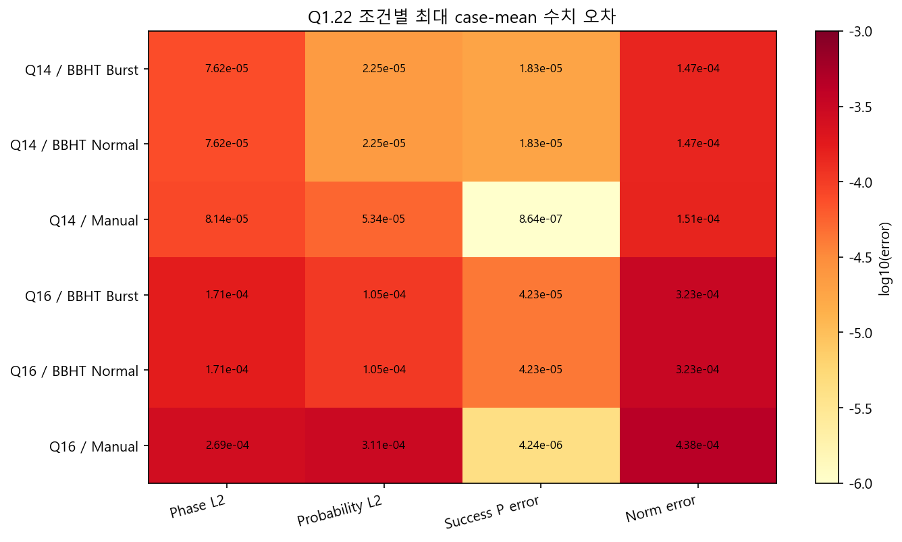
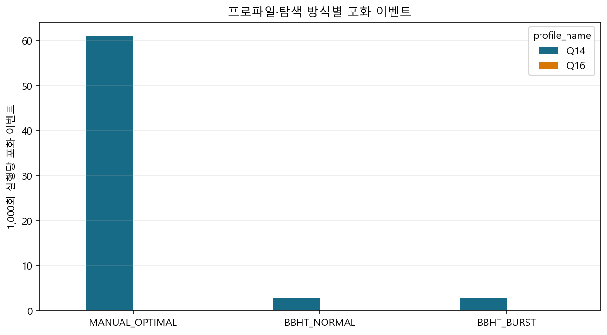
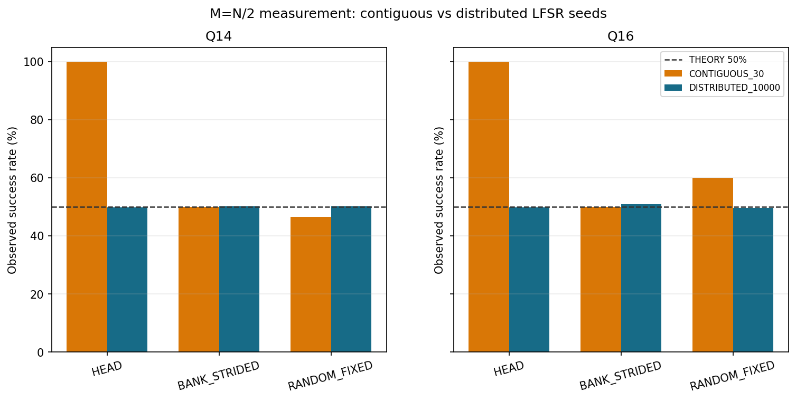
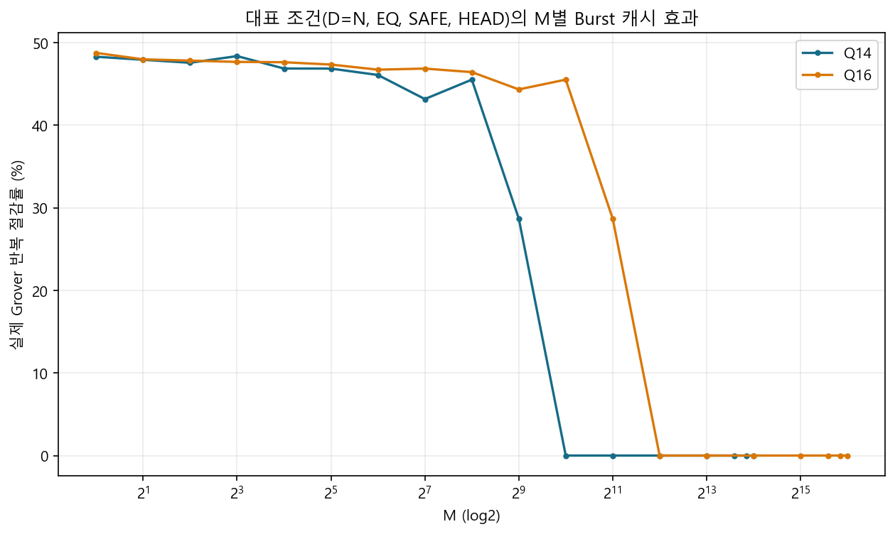

# 23장. 설계 근거 실험

> [← 22장 DRAM 갈래](22_DRAM_갈래.md) · [문서 지도](00_문서_지도.md) · [24장 부록: 용어집과 폐기된 규격 →](24_부록_용어집과_폐기된_규격.md)

---

확정 설계의 결정마다 그것을 낳은 실험이 있습니다. 이 장은 그 실험만 추려 결정 단위로 묶은
기록입니다. 출처는 2026-08 골든 모델 캠페인 보고서, Main IP 담당(PJK)의 최종 집약 설계 문서
v1.0.4(2026-09-09), 2026-09-06 우리 쪽 다중 엔진 · PASS2 실측이고, 원본은 저장소에 두지 않았습니다.

읽을 때 두 가지를 지킵니다.

- 실험마다 축이 다릅니다. Python 골든 모델 실행 · RTL 시뮬 사이클 · 보드 실측을 표마다 밝혀
  두었고, 축이 다른 수치를 섞어 배수를 만들지 않습니다.
- 여기 수치는 결정의 근거이지 현재 성능이 아닙니다. 많은 실험이 K4/H8 · K4/H4 같은 중간 단계나
  슬롯 하나짜리 옛 구조(Burst) 위에서 돌았습니다. 현재 성능은
  [1장 1.5절](01_프로젝트_개요.md#15-성능-지표와-인용-기준)에서 인용합니다.

| 절 | 결정 | 근거 실험의 축 |
|---|---|---|
| 23.1 | 패딩 게이트, 술어 비교기 하나, 짝맞춤 불변식으로 검증 | Python 골든 모델 671,600회 |
| 23.2 | Q14 · 소수부 22비트 · 대칭 포화 | 골든 모델 정밀도 분석 |
| 23.3 | 회귀용 시드와 통계용 시드를 분리 | 골든 모델 |
| 23.4 | 열거는 found-mask 방식, Main IP 안 | 골든 모델 두 방식 대조 |
| 23.5 | 체크포인트 도입, Rolling H-step 정확 DP 정책, 동점 규칙 | 골든 모델 · SW 1,098 시드 |
| 23.6 | 슬롯당 RAMB36 11개 패킹, future-only memo | 합성 · OOC |
| 23.7 | 지평을 H8 → H4 → H3 로 줄임, K3 | 보드 250쌍 · RTL 시뮬 |
| 23.8 | 반복 안의 4행 병렬(E4) | RTL 사이클 분해 |
| 23.9 | 측정 경로 M1 · M2 | RTL 사이클 분해 |
| 23.10 | 요청 열 분할 다중 엔진과 PASS2 융합을 채택하지 않음 | RTL 시뮬 250쌍 · OOC 합성 |
| 23.11 | Q15 · Q16 · P64 확장과 그 밖의 갈래를 채택하지 않음 | 추정 · 감사 |

---

## 23.1 골든 모델 캠페인: 기능 정합성

2026-08 에 당시 RTL(v0.7g, Q14/P32/DATA16/Q1.22) 규칙을 옮긴 Python 골든 모델로 돌린
캠페인입니다. FPGA 실측이 아니고, 전체 RTL 을 671,600회 돌렸다는 뜻도 아닙니다. 체크포인트는
슬롯 하나짜리 옛 구조(`BBHT_BURST`)였습니다.

| 축 | 값 |
|---|---|
| 프로파일 | Q14 (당시 확장 후보 Q16 도 함께. Q16 은 뒤에 폐기) |
| `DATA_COUNT` | N 의 25 · 50 · 75 · 100% |
| M | 0, 1, 2의 거듭제곱, D/N 의 25 · 50 · 75 · 90 · 100% |
| 술어 | EQ · GT · LT · RANGE |
| 패딩 | SAFE, POISON (패딩 자리에 조건을 만족하는 값을 일부러 넣음) |
| 타겟 배치 | HEAD, BANK_STRIDED, RANDOM |
| 탐색 | Manual(최적 j 한 번), BBHT Normal, BBHT Burst |
| 시드 반복 | Manual 30, BBHT 100 |
| 규모 | 8,760 조건 · 671,600 실행 · BBHT attempt 6,397,040 |

| 항목 | 결과 |
|---|---:|
| 타겟 마스크 오류 (요청 M 대 popcount) | 0 / 671,600 |
| 패딩 오판정 | 0 / 671,600 |
| SAFE / POISON 불일치 | 0 / 287,040쌍 |
| 네 술어 불일치 (같은 마스크를 네 경로로 만든 비교) | 0 / 503,700 |
| Normal / Burst 결과 · 종료 · 진폭 해시 불일치 | 0 / 292,000쌍 |
| M = 0 정상 비성공 | 12,880 / 12,880 |
| M > 0 BBHT 최종 성공 | 572,800 / 572,800 |
| M > 0 Manual 1회 성공 | 84,884 / 85,920 (98.79%) |

이 캠페인에서 굳은 것은 셋입니다.

- 패딩 보호는 특정 sentinel 값에 기대지 않고 `index < DATA_COUNT` 게이트로 합니다. POISON 이
  SAFE 와 모두 같았습니다.
- 네 술어는 같은 비교기 하나로 오라클과 재검증에 씁니다. 같은 마스크면 결과 · 진폭 · 반복이 모두
  같았습니다([9장 9.2절](09_연산_경로와_E4.md#92-산술-조각)).
- 체크포인트의 정합성은 짝맞춤 불변식으로 봅니다. 같은 시드에서 Normal 과 체크포인트는 `j` 순서,
  논리 반복, 결과가 같고 물리 반복만 줄어야 합니다. 최종 인덱스만으로 PASS 를 선언하지 않습니다.
  BBHT 가 후보를 술어로 자가 검증하므로 진폭이 깨져도 답은 맞을 수 있고, 실제로 23.10절의 공유
  슬롯 실험이 그랬습니다.

Manual 의 비성공 1,036회는 모두 확률적 1회 측정입니다. BBHT 100% 는 한 번의 `j` 가 늘 성공했다는
뜻이 아니라 재시도 뒤의 최종 성공률입니다. M = 0 에서 BBHT 가 예산까지 도는 것(Q14 평균 attempt
32.32, 논리 반복 614.53)은 오류가 아니라 M 을 모르는 탐색의 비용입니다.

같은 무렵 전달 RTL 8케이스(Normal / Burst × `j` = 1 · 4 · 8 · 6)를 골든 모델이 인덱스 · Born 전체
가중치(`2^44`) · `L_BBHT` · 물리 반복까지 그대로 재현했습니다. 이 8케이스는 지금도 유효한
bit-exact 회귀 기준입니다.

---

## 23.2 진폭 정밀도: Q14 와 소수부 22비트

float64 기준과 같은 마스크 · 같은 `j` 로 소수부 폭만 바꿔 돌린 정밀도 분석입니다(M = 1 · 4 · 64 ·
N/2). 확률분포 L2 오차가 기준을 넘지 않는 가장 작은 소수부 폭입니다.

| Q | 확률 L2 ≤ 10⁻³ | 확률 L2 ≤ 10⁻⁵ |
|---:|---:|---:|
| 14 | F20 | F22 |
| 15 | F20 | F24 까지 미충족 |
| 16 | F20 | F24 까지 미충족 |

Q14 는 소수부 22비트에서 두 기준을 모두 만족했고, 큰 Q 는 24비트까지 늘려도 10⁻⁵ 에 닿지
못했습니다. Q14 · F22 로 굳힌 근거 중 하나가 이것입니다.

23.1절 캠페인의 Q1.22 실행 전체에서 잰 오차의 최댓값도 모두 10⁻³ 아래였습니다.



| 지표 | 전체 최댓값 | 최악 조건 |
|---|---:|---|
| 위상 정렬 진폭 L2 | 2.951e-4 | Q16, D=49,152, M=2, BBHT Normal |
| 확률분포 L2 | 3.515e-4 | Q16, D=32,768, M=2, BBHT Normal |
| 성공확률 오차 | 1.688e-4 | Q16, D=16,384, M=8, BBHT Normal |
| 정규화 오차 | 5.351e-4 | Q16, D=16,384, M=1, BBHT Normal |

위상 정렬 L2 는 `min(‖A_f − A_q‖, ‖A_f + A_q‖)` 로 전역 부호를 뺀 진폭 벡터 오차입니다. 측정
인덱스는 난수에 따라 달라지므로 정확도는 측정 결과 하나가 아니라 측정 전 전체 진폭과
확률분포로 봅니다.

포화는 이렇게 걸렸습니다.



| 프로파일 | 탐색 | 실행 | 포화 이벤트 | 1,000회당 |
|---|---|---:|---:|---:|
| Q14 | Manual | 41,280 | 2,520 | 61.05 |
| Q14 | Normal | 137,600 | 368 | 2.67 |
| Q14 | Burst | 137,600 | 368 | 2.67 |
| Q16 | 모든 탐색 | 355,120 | 0 | 0 |

전체 3,256회였고 기능 불일치는 0이었습니다. Q1.22 에서 `+1.0` 을 정확히 표현할 수 없는 경계가
있으므로 포화 자체를 실패로 보지 않고, `amp_overflow` 는 진단용 sticky 비트로 두었습니다
([6장 6.3절](06_데이터_표현과_메모리_맵.md#63-진폭-형식)). Normal 과 Burst 의 포화 수가 같다는
것도 두 모드의 최종 논리 상태가 같다는 추가 증거입니다. 이 결론은 지금의 연산 순서와 반올림 ·
포화 규칙에 대한 것이고, 다른 Q 포맷이나 연산 순서에 자동으로 옮겨지지 않습니다.

---

## 23.3 난수 시드 커버리지

M = N/2 에서는 측정분포가 균일하므로 배치와 무관하게 성공확률이 50% 여야 합니다.



| 프로파일 | 시드 집합 | HEAD | BANK_STRIDED | RANDOM |
|---|---|---:|---:|---:|
| Q14 | 연속 30개 | 100.00% | 50.00% | 46.67% |
| Q14 | 분산 10,000개 | 49.96% | 50.26% | 50.31% |

연속 시드는 LFSR 출력공간을 고르게 덮지 못합니다. 그래서 시드 집합을 목적별로 나눕니다.

- 회귀: 같은 시드가 골든 모델과 RTL 에서 같은 `j` 와 인덱스를 내는지가 중요합니다. 고정된 공식
  시드 로스터를 씁니다(500 워크로드의 100쌍).
- 통계: 성공확률 같은 통계는 분산 시드로 잽니다. 연속 시드의 결과를 Born 성공확률의 불편향
  추정으로 인용하지 않습니다.

같은 이유로 타겟 배치에 따라 attempt 수가 달라진 것은 Grover 이론의 위치 의존성이 아니라
유한 시드 표본의 효과입니다.

---

## 23.4 열거 두 방식 비교

열거에서 이미 찾은 타겟을 빼는 방식을 둘 두고 골든 모델로 나란히 돌렸습니다
([3장 3.5절](03_Grover와_BBHT_알고리즘.md#35-열거-정답을-전부-찾기)).

| 지표 | 결과 |
|---|---:|
| 조건 | 1,280 |
| 실행 | 5,888 |
| 요청 결과 개수 충족 | 5,888 / 5,888 |
| 중복 · 유효 범위 밖 결과 | 0 · 0 |
| backend 비교 쌍 | 2,944 |
| 발견 결과 · 샷 · 논리 반복 · 실제 반복 불일치 | 0 |

두 방식이 모든 쌍에서 같은 결과를 냈으므로 차이는 제어 비용과 데이터 이동 비용뿐입니다.
데이터셋을 다시 보내지 않는 `PROJECTED_MASK_MEM` 을 골랐고, v0.9.8 에서 `found_mask` · 열거 FSM ·
결과 FIFO 256칸이 Main IP 안으로 들어갔습니다. 열거 정답 벡터(두 방식 × 5케이스)는
[4장 4.5절](04_소프트웨어_기준모델과_정답_벡터.md#45-rtl-정답-벡터)에 있습니다.

---

## 23.5 체크포인트 정책 알고리즘 선정

### 재활용할 가치가 있는가

실패한 샷의 진폭을 버리지 않고 이어 쓰면 물리 반복이 얼마나 주는지를 먼저 쟀습니다. M = 1,
시드 30개 기준의 소프트웨어 추정입니다.

| Q | 저장 상태 수 | 평균 실제 반복 | 절감률 |
|---:|---:|---:|---:|
| 14 | 0 | 212.77 | 0.00% |
| 14 | 1 | 112.13 | 47.70% |
| 14 | 2 | 97.43 | 55.22% |
| 14 | 4 | 77.77 | 63.69% |

23.1절 캠페인에서도 슬롯 하나짜리 Burst 가 논리 반복은 그대로 둔 채 물리 반복을 전체 평균 38.55%
(중앙값 44.44%) 줄였습니다. 희소한 M 일수록 큰 `j` 로 점진적으로 다가가므로 이득이 컸습니다.



### 후보 계열

| 후보 | 핵심 | 판단 |
|---|---|---|
| K1 Burst | 진폭 메모리 자체를 1칸 체크포인트로 | 정책 자유도가 거의 없음. 성능 기준선 |
| FIFO / LRU | 최근성 기반 | BBHT 의 `j` 열에는 일반적인 재참조 지역성이 약해 탈락 |
| GE / GE2 | 선행 거리와 간격 비용을 직접 평가 | 강한 온라인 기준선이지만 look-ahead 대비 격차가 큼 |
| Exact Online MDP | 온라인 최적 | 상한 기준(reference) 용도 |
| Look-ahead A | 미래 `j` 를 유한 지평으로 | 경로 중간 상태를 안 써서 손실 |
| Look-ahead restricted-B | 출발점 → `j` 로 전진하며 지나가는 중간 상태를 저장 후보로 | 같은 K 에서 큰 추가 이득 |
| Rolling H-step Exact DP | 유한 지평의 총 물리 비용을 정확한 DP 로 풀고 현재 행동 하나만 실행 | 최종 계열로 채택 |
| 문헌 대안 (Bern · Hazard-weighted rollout · p-median · DTR · SSP · Checkmate 등) | 같은 문제에 대입 | Rolling 계열을 넘지 못함 |

미래 `j` 는 결정론적인 J-LFSR 을 실패 가정으로 이어 돌려 얻습니다. 요청 순서나 Born 성공 여부를
미리 아는 것이 아닙니다. 하드웨어에서는 이것이 Shadow-J 입니다([11장 11.4절](11_체크포인트와_정책_엔진.md#114-정책-엔진-h3)).

### 동점 규칙

초기 Rolling 구현은 동점에서 사실상 마지막으로 열거된 행동을 골라, 중간 상태를 많이 저장하는
쪽으로 치우쳤습니다. 이것을 사전식 비교로 고쳤습니다.

```
key = (총 DP 물리 비용, 구간 수, 정렬된 S')
```

DP 물리 비용이 정확히 같을 때만 구간 수와 정렬된 슬롯 집합을 봅니다. 헤드라인 물리 반복은 거의
변하지 않았지만 샷당 중간 저장과 구간 수가 줄었습니다. RTL 정책의 최소값 선택도 같은 규칙을
써야 궤적이 기준모델과 맞습니다([11장](11_체크포인트와_정책_엔진.md)).

### K 와 H 의 첫 선택

예산 소진형 워크로드(샷 평균 31.51, 1,098 시드 전부 예산 도달)에서 고친 동점 규칙으로 잰
공식 결과입니다. 소프트웨어 모델의 물리 반복이고 사이클이 아닙니다.

| 설계 | 평균 물리 반복 / 실행 | 정책 연산 / 샷 |
|---|---:|---:|
| Normal | 617.86 | — |
| K1 Burst | 396.08 | — |
| K3/H8 | 132.65 | 468.0 |
| K3/H10 | 131.99 | 929.4 |
| K4/H8 | 119.08 | 1,539.6 |
| K4/H10 | 117.80 | 3,691.4 |
| 오프라인 최적 참고 (K4) | 117.04 | — |

K4 가 K3 보다 물리 반복을 약 10% 줄였고, K4 안에서 지평을 H10 으로 넓혀도 1.08% 밖에 안
줄었습니다. 반면 정책이 Grover 연산 뒤에 숨으려면 필요한 처리율(연산 / 사이클)이 K4/H8 0.395,
K4/H10 0.958 로 뛰었습니다. 그래서 첫 RTL 은 K4/H8 로 갔습니다. 이 판단은 "물리 반복을 줄이면
빨라진다" 는 전제 위에 있었고, 23.7절의 보드 실측이 그것을 뒤집습니다.

---

## 23.6 체크포인트 메모리 패킹

상태 한 벌은 16,384 × 23 = 376,832비트이고 RAMB36E1 하나가 36,864비트라 이론 하한은 10.22개,
즉 11개입니다. 구현은 그 하한을 달성했습니다.

```
행 736비트 = 10 × 69비트 + 1 × 46비트     (레인 0~29 를 세 개씩 묶어 69비트 열 개, 레인 30~31 을 46비트)
상태 한 벌 = RAMB36E1 11개
K3 = 33개, K4 = 44개
```

512행 전체와 부호 · 경계 · 무작위 패턴, 독립 읽기/쓰기, 덮어쓰기를 32 × 23 기준 구현과 비교한
bit-exact TB 가 통과했습니다. 이 결과로 "상태 한 벌에 BRAM 16개" 라던 이전 추정을 버렸습니다.
슬롯 읽기 먹스(3:1 · 4:1)는 OOC 에서 둘 다 RAMB36 → LUT6 1단 → 출력 레지스터 경로로 100 MHz 를
+6.579 ns 여유로 닫았습니다.

정책 memo 는 루트 행동을 매번 직접 평가하고 미래 단계만 저장하는 future-only 방식으로 굳혔습니다.
엔트리는 10비트 비용 + 8비트 epoch = 18비트이고, epoch 가 다른 엔트리는 적중으로 보지 않습니다.
K4/H8 에서 8 × 1,093 = 8,744 엔트리가 RAMB36 5개로 구현됐고, 지평을 줄이며 뱅크 수도 줄었습니다.
지금의 K3/H3 은 `STATE_RANKS = 1,093` 보폭을 그대로 두고 3 × 1,093 = 3,279 엔트리를 씁니다. 리셋
뒤 이 memo 를 한 칸씩 지우는 길이가 3,279 사이클이고, 보드와 RTL 캠페인의 사이클 차이가 여기서
나옵니다([11장 11.5절](11_체크포인트와_정책_엔진.md#115-memo와-3279-사이클)).

E4 에서는 네 뱅크가 상태 네 벌의 복제가 아니라, 한 상태를 행 번호 mod 4 로 나눈 대역폭 구조입니다.
물리 슬롯이 K 와 무관하게 4벌이라 K4 → K3 에서 BRAM 이 줄지 않습니다([6장 6.7절](06_데이터_표현과_메모리_맵.md#67-메모리-구조)).

---

## 23.7 지평 H 를 줄인 이유: H8 → H6 → H4 → H3

### 보드에서 본 것: 물리 반복 최소가 사이클 최소가 아니다

같은 250쌍 워크로드(시드 50)를 보드에서 돌린 결과입니다. 연산기는 한 벌(E1)입니다.

| 설계 | 물리 반복 | 사이클 | Normal 대비 |
|---|---:|---:|---:|
| Normal | 14,883 | 20,229,755 | 1.000x |
| K4/H8 | 4,134 | 13,824,806 | 1.463x |
| K4/H6 | 4,154 | 9,154,981 | 2.210x |
| K4/H4 | 4,247 | 7,796,908 | 2.595x |

H6 → H4 에서 물리 반복은 2.24% 늘었지만 사이클은 14.83% 줄었습니다. 지평이 넓으면 DP 창이 커져
풀이가 오래 걸리고, 그동안 데이터패스가 기다립니다(`policy_stall`). H8 은 반복을 조금 덜 쓰는 대신
정책 정지를 크게 물어 총 사이클에서 손해를 봤습니다. 이것으로 K4/H4 를 당시의 실용적 무릎점으로
정했습니다. 탐색한 모든 K/H 를 보드에서 잰 전역 최적이라고 주장하지는 않습니다.

소프트웨어 설계 공간 탐색(24점)에서 고른 점들입니다. 물리 반복과 정책 일감만 보고 무릎점을
설명하는 데 쓰고, 미실측 점의 추정 사이클은 쓰지 않습니다.

| 점 | 물리 반복 / 실행 | 정책 연산 / 샷 |
|---|---:|---:|
| K4/H3 | 147.665 | 75.0 |
| K4/H4 | 134.821 | 157.9 |
| K4/H5 | 127.883 | 303.1 |
| K4/H6 | 123.149 | 547.3 |
| K3/H3 | 152.652 | 38.4 |
| K3/H4 | 142.738 | 71.6 |
| K3/H5 | 138.048 | 123.9 |

### E4 뒤의 재조정: K3/H3

반복 한 번이 E4 로 빨라지면 물리 반복 한 번의 값이 떨어지고, 상대적으로 정책 비용이 커집니다.
K3/H3 은 K4/H4 보다 물리 일감은 늘지만 정책 일감이 약 76% 줄어서 실제 RTL 로 비교했습니다.

| 항목 (RTL, 6케이스) | K4/H4-E4 | K3/H3-E4 | 변화 |
|---|---:|---:|---:|
| 합계 사이클 | 301,404 | 288,164 | −4.4% |
| 열거 물리 반복 | 317 | 332 | +4.7% |
| 정책 행동 | 16,266 | 4,898 | −69.9% |
| 정책 사이클 | 76,774 | 34,184 | −55.5% |
| 정책 정지 | 15,160 | 4,114 | −72.9% |

측정 경로를 M2 까지 줄인 뒤에는 정책을 숨길 창이 더 짧아지므로 K3/H4 와 다시 겨뤘습니다.

| 항목 (RTL, 열거 전체) | K3/H3-M2 | K3/H4-M2 |
|---|---:|---:|
| 총 사이클 | 192,874 | 201,460 (+4.45%) |
| 물리 반복 | 544 | 540 |
| 정책 일감 | 31,481 | 53,178 |
| 정책만 드러난 사이클 | 5,817 | 15,745 |

H4 가 아낀 반복 4번은 E4 에서 약 1,056 사이클인데 드러난 정책 시간은 약 9,928 사이클 늘었습니다.
그래서 K3/H3 로 굳혔습니다. 목표는 정책 일감 최소가 아니라, 데이터패스와 측정이 숨겨 줄 수 있는
범위 안에서 반복을 줄이는 총 사이클 최소입니다.

### K 와 H 를 따로 떼어 본 실험

같은 공통소스 RTL 에서 연산기 한 벌(E1) · 측정 최적화 없이 K 와 H 만 바꿔 250 워크로드씩 돌린
RTL 사이클입니다([kh_isolated_e1](../../hardware_bram/results/2026-09-09_kh_isolated_e1/evidence.md)).
새로 돌린 500 시뮬레이션은 모두 통과했고 의미 불일치는 0이었습니다.

| M | K4/H4-E1 | K3/H4-E1 | K3/H3-E1 | K3/H3 대 K4/H4 |
|---|---:|---:|---:|---:|
| 1 | 3,671,037 | 3,677,142 | 3,637,074 | 1.0093x |
| 4 | 2,122,688 | 2,105,863 | 2,080,916 | 1.0201x |
| 16 | 1,434,286 | 1,429,509 | 1,381,988 | 1.0378x |
| 64 | 912,322 | 910,075 | 856,569 | 1.0651x |
| 256 | 695,965 | 695,512 | 640,062 | 1.0873x |
| 합 | 8,836,298 | 8,818,101 | 8,596,609 | 1.0279x |

K 만 줄이면 사이클이 0.21% 줄고, 이어서 H 를 줄이면 2.51% 가 더 줄었습니다(속도로는 1.0258배,
다른 장에서 "H 몫 2.58%" 로 적는 값). 비싼 쪽은 저장 공간이 아니라 결정 비용입니다. 타겟이 많을수록 H3 의 이득이 커지는 경향이 보이지만 원인 카운터를 따로 재지 않아
메커니즘은 단정하지 않습니다. 이 표는 RTL 사이클이라 위의 보드 250쌍 사이클과 맞대지 않습니다.

---

## 23.8 E1 프로파일링과 E4

체크포인트 경로의 물리 반복 한 번을 RTL 시뮬에서 사이클 단위로 나눴습니다(E1).

| 단계 | 사이클 / 물리 반복 | 무엇 |
|---|---:|---|
| PASS1 | 516 | 오라클 + 전역 합 스트리밍 |
| P1DRN | 1 | PASS1 파이프라인 드레인 |
| MEAN | 1 | 전역 평균 확정 |
| PASS2 | 515 | 확산 + 되쓰기 |
| 합 | 1,033 | |
| INIT (별도) | 514 | 균일 상태 초기화 |

1,033 사이클 중 1,031 이 512행 스트리밍에 몰려 있습니다. 같은 반복의 서로 다른 행을 여러
연산기가 동시에 처리하면 크게 줄일 수 있다는 뜻이고, 이것이 E4 의 근거입니다. E4 는 독립된 탐색
네 개가 아니라, 한 번의 물리 반복을 P32 연산기 네 벌이 행 4개씩 나눠 처리하는 구조입니다. BBHT 의
요청 열, 열거 순서, 결과 의미, 정책의 논리는 그대로입니다([9장 9.4절](09_연산_경로와_E4.md#94-e4의-4행-병렬-처리)).

E4 가 정책 정지를 새로 만든다는 가설도 확인했습니다. 같은 워크로드에서 E1 과 E4 의 정책 사이클은
112,855 로 같았고 정책 정지도 38,540 대 38,569 로 거의 같았습니다. E4 가 Grover 본체를 줄이자 고정된
정책 · 체크포인트 비용의 상대 비중이 커진 것이지, E4 가 정지를 만든 것이 아닙니다. 이것이 23.7절의
K3/H3 재조정으로 이어졌습니다.

---

## 23.9 측정 병목과 M1 · M2

첫 결과를 FIFO 에 넣을 때까지를 배타적으로 나눈 RTL 사이클입니다(Q14, 타겟 하나, 23샷, `L_BBHT`
179, 물리 반복 55).

| 구간 | K4/H4-E1 | K3/H3-E4 |
|---|---:|---:|
| 물리 INIT + Grover | 57,329 (68.2%) | 14,649 (38.9%) |
| 측정 | 18,955 (22.6%) | 18,955 (50.3%) |
| 정책만 드러난 시간 | 6,808 (8.1%) | 3,353 (8.9%) |
| 제어 · 기타 | 918 | 700 |
| 합 | 84,010 | 37,657 |

E4 가 물리 연산을 3.91배 줄이자 측정이 절반을 넘는 병목이 됐습니다. 측정 안에서는 BUILD 가 샷당
518 사이클(512행 재스캔), 행 선택(ROW_SCAN)이 약 269, 레인 선택이 약 17.5 였습니다. 그래서 K/H
미세조정보다 측정을 먼저 줄였습니다.

| 단계 | 무엇 | 측정 / 샷 | 첫 결과 합계 |
|---|---|---:|---:|
| 이전 | BUILD 한 사이클 한 행, 512행 선형 선택 | 824.1 | 37,657 |
| M1 | E4 의 4행 동시 읽기를 측정에도 쓰고 제곱기 한 벌을 더해 BUILD 두 행/사이클 | 568.1 | 31,769 |
| M2 | BUILD 중 32행 그룹 누계를 적어 두고 16그룹 → 32행 두 단으로 선택 | 327.9 | 26,392 |

M1 의 비용은 두 번째 제곱기의 DSP(64 → 128)였고, M2 는 행 선택을 약 269 → 28.9 사이클/샷으로
줄이면서 제곱도 BUILD 사이클도 늘리지 않았습니다. 열거 전체로는 253,622 → 192,874 사이클(−23.95%)
이었고 병목은 다시 물리 연산(약 75%)으로 돌아갔습니다. 8 × 8 × 8 같은 더 깊은 선택은 이득이
줄어들어 보류했습니다. 구조는 [10장](10_측정_경로와_M1_M2.md)에 있습니다.

---

## 23.10 다중 엔진과 PASS2 융합: 채택하지 않은 두 시도

2026-09-06 에 우리 쪽에서 K4/H4-E1 보드 정본을 기준으로 "BRAM 을 안 늘리면서 더 빠른 구성" 을
찾은 실측입니다. 수치는 모두 `xc7a100tcsg324-1` · OOC · 100 MHz 이고, 250쌍 하네스는 보드 실측과 여섯
지표가 0.00% 로 일치하는 것을 먼저 확인했습니다.

### 요청 열을 두 트랙으로 가르는 다중 엔진 (F1 · F2)

BRAM 예산은 풀 SoC 135 tile 에서 RVX 본체 32 tile 을 뺀 103 tile 이었습니다. 슬롯 하나가 RAMB36
11개라 K 를 낮춰 사는 것은 BRAM 뿐이었습니다.

| 구성 | Tile | +RVX | 물리 반복 | WNS | 논리 정합 |
|---|---:|---:|---:|---:|:-:|
| K4/H4 단일 (기준) | 66 | 98 | 4,214 | +0.060 | 기준 |
| F2 K4×2 | 132 | 164 (초과) | 6,302 | −0.143 | 정합 |
| F2 K2×2 | 88 | 120 | 6,583 | −0.412 | 정책 미유도 |
| F1 공유 슬롯 C4 | 88 | 120 | 4,214 | −0.20 | 궤적 붕괴 |

- 요청 열을 짝/홀로 가르면 물리 반복이 K 와 무관하게 약 +50% 늘었습니다(분할 자체의 비용). 완벽히
  겹쳐 돌려도 이득의 천장이 −25% 였고, 구현은 직렬 배분이라 대가만 치렀습니다.
- 공유 슬롯(F1)은 두 트랙의 정책이 서로의 슬롯을 덮어써 `trial_count` · `L_BBHT` 가 기준과
  어긋났습니다. 결과 인덱스는 맞게 나와서 TB 는 오류 0건이었고, 그래서 이 구성이 낸 "8.6% 빠른"
  사이클은 진폭이 깨져 탐색이 우연히 짧게 끝난 값입니다.
- 이중 구성의 타이밍 실패는 데이터패스가 아니라 두 트랙 카운터를 합치는 CSR 읽기 경로의 덧셈기
  탓이었고, 한 단 등록하자 회복했습니다.

남긴 교훈은 둘입니다. 공유 상태의 소유권을 따지지 않으면 결과는 맞는 채로 성능 수치만 거짓이
되고, 그래서 검증은 짝맞춤 불변식으로 해야 합니다. 트랙을 가른다면 BBHT 시퀀서와 측정 난수는
하나여야 하고, 정책의 미래 창은 그 트랙이 실제로 받을 요청만 담아야 합니다.

### PASS2 융합

Born 측정의 BUILD 가 512행을 다시 읽는 대신, PASS2 가 새 진폭 행을 쓰는 그 사이클에 제곱 · 합산을
해 두어 재스캔을 없애는 시도였습니다.

| 항목 (250쌍) | 융합 없음 | 융합 | 차이 |
|---|---:|---:|---:|
| Normal · K4 물리 반복 | 14,883 · 4,247 | 14,883 · 4,247 | 0 |
| K4 사이클 | 7,796,908 | 7,018,034 | −9.99% |
| BRAM tile | 66 | 66 | 0 |
| DSP | 64 | 128 | +64 |
| WNS | +0.060 | +0.140 | |

반복은 그대로 두고 측정 경로만 아꼈고 BRAM 도 늘지 않았습니다. 다만 체크포인트 복원이 진폭
메모리에 쓰지 않고 읽기 슬롯만 바꾸는 경우와, 폴백한 BUILD 가 가중치를 덮어쓰는 경우 두 가지
소유권 결함을 250쌍에서야 잡았습니다(27샷 TB 에서는 오류 0건). 드레인 대기 상태가 없으면
결과는 맞은 채 적중률만 조용히 0이 되는 문제도 있었습니다.

### 정본이 같은 병목을 푼 방식

같은 두 병목을 정본은 다른 방식으로 풀었고, 최종 구성에는 정본 쪽이 들어갔습니다.

| 병목 | 우리 시도 | 정본 |
|---|---|---|
| 연산기 병렬화 | 요청 열을 트랙으로 가름. 반복 +50%, 소유권 문제 | 반복 안에서 행을 4개씩 가름(E4). 반복 그대로, 소유권 문제 없음 (23.8절) |
| 측정 경로 | 재스캔을 없앰 (−9.99%, K4/H4-E1 기준) | 재스캔을 남기고 싸게 만듦 (M1 · M2, K3/H3-E4 대비 −33.7%) (23.9절) |
| K3 정책 | 조합 순위 함수를 K3 용으로 다시 유도해야 한다며 막힘 | `STATE_RANKS = 1,093` 보폭을 그대로 두어 K4/H4 를 비트 동일하게 유지하고 K3 은 좁은 구간만 방문 |

두 측정 개선은 기준선이 달라 직접 맞대지 않습니다. 재스캔을 없애는 것과 싸게 만드는 것은
원리상 배타적이지 않지만 겹쳐 본 적은 없습니다. 측정 경로를 빠르게 한 값은 어느 방법이든 DSP
였습니다.

---

## 23.11 채택하지 않은 확장과 갈래

### 규모 확장

| 후보 | 진폭 상태 | 행 / pass | Grover 2-pass 하한 |
|---|---:|---:|---:|
| Q14/P32/F22 | 46 KiB | 512 | 1,024 사이클 |
| Q15/P32/F22 | 92 KiB | 1,024 | 2,048 사이클 |
| Q16/P32/F22 | 184 KiB | 2,048 | 4,096 사이클 |
| Q14/P64/F22 | 46 KiB | 256 | 512 사이클 |

FSM · BRAM 지연 · 파이프라인 비용을 뺀 이상적 하한입니다. Q15 · Q16 은 정밀도(23.2절)와 BRAM
예산에서, P64 는 자원에서 폐기하고 Q14/P32 로 굳혔습니다. 실제로 사이클을 줄인 것은 규모 확장이
아니라 반복 안의 병렬화(E4)와 측정 경로(M1 · M2)였습니다.

### 독립 FPGA 갈래

RVX 없이 UART-APB 브리지와 온칩 데이터셋 생성기로 도는 standalone 구성이 있었습니다. E4 · M1 · M2 를
처음 실험한 틀이지만, 임의 데이터를 올릴 수 없고 UART 왕복 때문에 시스템 속도도 RVX 판보다 느려
최종판에 쓰지 않았습니다. 이 저장소는 RVX 통합판만 유지하고, 6단계 ablation 과 K/H 단독 실험의
재현은 태그 `board-k3h3-e4-m2` 에서 합니다([2장 2.2절](02_개발_환경과_툴체인.md#22-저장소-회귀-verilator)).

### 2026-08 인터페이스 감사에서 남은 규칙

CSR · base address · 열거 경계가 정해지기 전(2026-08-22), 당시 GitHub 판(Q15 · Q2.16 · 런타임
큐비트)과 전달 RTL(v0.7g) · 골든 모델을 맞대 미결을 목록으로 만들었습니다. 미결은 v0.9.8 에서
전부 닫혔고, 그 감사가 짚은 것 가운데 지금도 지키는 규칙은 이렇습니다.

| 발견 | 지금의 규칙 |
|---|---|
| loader 가 서로 다른 주소가 아니라 쓰기 개수만 셈 | wrapper 가 `0..DATA_COUNT-1` 을 정확히 한 번씩 생성 ([12장 12.7절](12_Main_IP_포트_계약.md#127-loader-트랜잭션)) |
| 홀수 `DATA_COUNT` 의 마지막 halfword | loader 가 쓰지 않음. 써도 Main IP 가 무시 |
| `done` 은 1클록 펄스, 결과와 상태는 sticky | mmio 의 `done_sticky`. 지우는 것은 `COMMAND` 쓰기뿐 |
| "실패 후 붕괴 상태" 라는 표현 | 체크포인트는 측정 직전 상태 ψ_j. 측정은 진폭을 읽기만 함 |
| GitHub 판과 전달 RTL 의 진폭 상수 혼용 위험 | SoC 구조만 참고하고 산술 · 폭은 Q14/F22 기준 |
