# Enumeration 두 방식 골든 모델 — 무엇을 고르고 무엇을 버렸나

> **결론부터.** 두 방식을 골든 모델로 나란히 재 본 결과 `PROJECTED_MASK_MEM` 이 채택됐고, v0.9.8 Main IP 는 `found_mask` 를 하드웨어 안에 두고 오라클을 `predicate(i) && !found_mask[i]` 로 계산한다. 결과는 256칸 FIFO 로 나온다. 이 문서는 그 선택의 근거이자, 두 방식이 **같은 결과를 내야 한다**는 검증 계약이다.
>
> `SOFTWARE_RELOAD` 는 하드웨어 지원이 없던 시절의 대안이었다. 지금은 회귀에서 mask 경로의 대조군으로만 쓴다.

> `AUTO_SHOT=0`에서는 펌웨어가 shot마다 독립적인 `SEED_MEAS`를 생성해 Main IP에 전달한다. Main IP 내부 rejection draw 수는 외부에 노출되지 않으므로, 내부 자동 BBHT의 measurement LFSR 상태를 shot 사이에 그대로 재현한다고 가정하지 않는다. `j` 선택용 LFSR과 measurement seed용 LFSR은 서로 독립이며, 같은 초기 seed를 사용하면 전체 실행을 재현할 수 있다.

## 1. 적용 범위

단일 결과 검색 위에 중복 없는 다중 타겟 열거를 얹는 두 방식을 정의하고, 둘이 같은 결과를 내는지 대조한다.

| 항목 | 상태 |
|---|---|
| 소프트웨어 기준모델 `checkpoint_bbht_model.py` | 현행. mask 방식 열거를 재현한다 (`run_enumeration`) |
| `SOFTWARE_RELOAD` | 하드웨어 지원 없이 펌웨어로만 하는 방식. 지금은 대조군 |
| `PROJECTED_MASK_MEM` | mask 방식. **v0.9.8 에 채택돼 하드웨어로 들어갔다** |
| Main IP 내부 Enumeration FSM·결과 FIFO | **구현됨.** `grover_iteration.v` 의 `found_mask_row_in`, FIFO 256칸 |

## 2. 실행 구조



결과 하나를 찾을 때마다 Oracle의 정답 집합이 바뀐다. 따라서 다음 round는 새로운 검색 문제이며, 이전 round의 진폭 checkpoint를 이어 쓰면 안 된다. Burst 재사용은 정답 집합이 변하지 않은 같은 round 안에서 실패한 shot 사이에만 허용된다.

## 3. 발견 결과 제외 방식

| 방식 | 제외 방법 | Dataset 전송 | RTL 상태 |
|---|---|---|---|
| `SOFTWARE_RELOAD` | 발견 원소를 해당 predicate에 걸리지 않는 안전한 값으로 변경 | 전체 재전송 또는 합의된 부분 갱신 경로 필요 | 현재 단일 결과 IP 계약으로 구현 가능 |
| `PROJECTED_MASK_MEM` | Oracle을 `predicate(i) && !found_mask[i]`로 계산 | Dataset 변경 없음 | **v0.9.8 실물이 이 방식** |

같은 dataset과 결정적 난수 스트림을 사용하면 두 방식의 발견 인덱스가 같아야 한다. 두 방식의 차이는 탐색 결과가 아니라 제어 비용과 데이터 이동 비용이다.

## 4. Enumeration Round별 BBHT 규칙

| 규칙 | 값 |
|---|---|
| 제어 주체 | RVX 펌웨어, `AUTO_SHOT=0` |
| 초기 범위 | `m=1` |
| 증가 표 | v0.7g `ceil((6/5)^k)` ROM 수열 |
| `j` 선택 | `[0,m)` 균등 정수 rejection sampling |
| Q14 최대 `m` | 128 |
| Q14 논리 반복 예산 | 576 |
| 기본 shot 상한 | 100 |
| 측정 | 독립 LFSR 스트림을 사용하는 정수 Born CDF |
| 새 타겟 발견 후 | 타겟 제외, cache 무효화, `m=1`에서 재시작 |

골든 모델은 결과 검증을 위해 실제 target mask를 계산하지만, 실제 타겟 수 `M`을 BBHT scheduler에 전달하지 않는다.

## 5. 남은 타겟이 없는 경우의 종료 정책

| 정책 | 동작 | 용도 |
|---|---|---|
| `GROUND_TRUTH` | 비어 있는 마지막 round를 실행하기 전에 종료 | 빠른 회귀 검증과 expected 결과 생성 |
| `BBHT_LIMIT` | 타겟이 없는 마지막 round를 shot 또는 budget 상한까지 실행 | 실제 펌웨어 종료 비용 분석 |

`GROUND_TRUTH`는 검증용 정답 정보이다. 미지의 `M`을 사용하는 BBHT가 스스로 `M=0`을 증명한다는 뜻이 아니다. 실제 HW/SW에서는 사전 scan, 알려진 target count 또는 명시적 상한 정책 중 하나가 필요하다.

## 6. 기록 결과

| 단계 | 기록값 |
|---|---|
| 전체 Enumeration | 초기·잔여 타겟 수, 발견 인덱스 목록, 종료 사유, 전체 시간 |
| Round | 전후 found mask, 잔여 타겟 수, 선택 인덱스, 검색 종료 사유 |
| Shot | `m_bound`, 요청 `j`, 결과 인덱스, 성공 여부, LFSR draw 수, saturation |
| 비용 | 전체 shot, 논리 반복, 물리 반복, phase Oracle 호출, 후보 검증 횟수 |
| Cache | round 경계 무효화, 논리·물리 반복 수 차이 |

전체 mask는 향후 `mask_mem` 테스트벡터에 사용할 수 있도록 little-endian packed-bit hexadecimal 문자열로 내보낼 수 있다.

## 7. 시간 지표의 해석

| 지표 | 현재 골든 모델 제공 여부 | 최종 측정 위치 |
|---|---|---|
| 논리 Grover 작업량 | `sum(j)`로 정확히 계산 | 골든 모델 |
| Burst 재사용 후 물리 작업량 | cache 계약에 따른 실제 iteration 수 | 골든 모델·RTL counter |
| Dataset 변경·재전송 byte | loader 갱신 정책 확정 후 계산 | 골든 모델·펌웨어 |
| Python 실행시간 | 제공, 참조 모델 profiling 전용 | PC |
| Main IP cycle | RTL `cycle_count` 필요 | RTL simulation·실보드 |
| RVX 펌웨어 overhead | 컴파일된 C 실행 필요 | RVX simulation·실보드 |
| MMIO·DMA 전송시간 | E2E mapping 필요 | 통합 시스템 |
| 자원·timing·power | 소프트웨어 모델에서 측정 불가 | Vivado implementation |

Python 실행시간을 FPGA 실행시간으로 인용하면 안 된다.

## 8. 권장 비교 조건

| 축 | 값 |
|---|---|
| Q | 14 (당시에는 16도 함께 돌렸으나 Q16 은 폐기됐다) |
| Predicate | LT, GT, EQ, RANGE |
| `DATA_COUNT/N` | 25%, 50%, 75%, 100% |
| 잔여 타겟 수 | 0, 1, 2의 거듭제곱, 25%, 50%, 75%, 100% |
| 제외 방식 | `SOFTWARE_RELOAD`, `PROJECTED_MASK_MEM` |
| Cache | Normal, Burst |
| 빈 집합 종료 | `GROUND_TRUTH`, `BBHT_LIMIT` |
| 난수 반복 | 통계에는 분산 seed, 회귀에는 고정 seed |

핵심 검증 항목은 중복 없는 열거, 타겟 완전성, padding 제외, round별 `m=1` 재시작, cache 무효화, 두 제외 방식의 결과 동등성이다.

## 9. Python 실행 예시

현행 소프트웨어 기준모델(`software/models/rtl_reference_model/checkpoint_bbht_model.py`)이 mask 방식을 그대로 재현한다. `enum_enable=True` 면 `run_configured()` 가 열거로 가고, `burst_enable=True` 면 K3/H3 체크포인트 정책을 쓴다. 경로는 Common500 실행 스크립트처럼 잡는다.

```python
import sys
for sub in ("common", "rtl_reference_model"):
    sys.path.insert(0, f"software/models/{sub}")

from benchmark_dataset import build_controlled_v098_dataset
from checkpoint_bbht_model import V098AutomaticCore

dataset = build_controlled_v098_dataset(
    predicate_mode="EQ",
    data_count=16384,
    target_count=4,
    enum_enable=True,
    burst_enable=True,      # K3/H3 체크포인트. False 면 Normal
    fail_repeat_limit=3,
)
result = V098AutomaticCore(dataset, dataset.config).run_configured(max_results=256)
```

열거 정답 벡터는 `software/rtl_vectors/enumeration/` 에 있고, attempt · FIFO 의미 검사는 `software/models/common/bbht_control_semantics.py` 가 맡는다.

## 10. 통합에서 어떻게 정해졌나

| 당시 미결 | 결정 |
|---|---|
| 펌웨어가 dataset 한 word만 갱신할 수 있는가 | 무의미해졌다. mask 방식은 dataset 을 건드리지 않는다 |
| Main IP 호출 사이 PRNG·seed 전달 규칙 | `SEED_J` · `SEED_MEAS` 두 CSR. accepted start 에서 reload |
| `mask_mem` 만 넣을지 FSM·FIFO 까지 넣을지 | **셋 다 Main IP 안에.** 결과 FIFO 256칸 |
| 최대 결과 수와 `TOO_MANY` 의 의미 | FIFO 256칸이 상한. 넘으면 full stall 이므로 실행 중에도 계속 뽑는다 |
| mask clear/set 과 결과 read 용 CSR | mask 는 Main IP 가 스스로 관리. 바깥은 `FIFO_DATA` 읽기(= pop)와 `ENUM_CFG` 뿐 |

세부는 [CSR_레지스터_규격.md](CSR_레지스터_규격.md) 와 [Main_IP_포트_규격.md](Main_IP_포트_규격.md) 5.2절에 있다.
