# Q14/Q16 단일 검색 671,600회 골든 모델 상세 분석

> 기준 사양: RTL v0.7g Q14/P32/DATA16/Q1.22 및 동일 연산 규칙의 Q16 확장 모델  
> 캠페인 규모: 8,760조건, 671,600 trial, 6,397,040 BBHT attempt  
> 실행 2026-08 · 이 문서는 그때의 기록이다

**읽기 전에 알아야 할 두 가지.**

첫째, 이 캠페인은 **v0.7g 세대의 골든 모델**을 돌린 것이다. 지금 정본은 보드에서 검증된 v0.9.8(`hardware_bram/src_v2/`)이고, 그 세대의 checkpoint 는 슬롯 4개 + policy 로 바뀌었다. 여기 나오는 `BBHT_BURST` 는 슬롯 하나짜리 옛 구조다. 따라서 이 문서의 **절감률을 현재 하드웨어의 성능으로 인용하면 안 된다.** 현행 성능의 정본은 K4/H4 보드 실측(`hardware_bram/vivado/vivado_bbht_grover_fpga/2026-09-04_k4h4_single_operator_final/`)이다.

둘째, **Q16 은 폐기된 확장안이다.** 캠페인 당시에는 확장 후보였고 이 문서의 절반이 Q14/Q16 대조지만, 설계는 Q14 로 freeze 했다. Q16 열은 "같은 산술 규칙을 4배 큰 상태공간에 걸면 무엇이 어떻게 변하는가" 를 보여 주는 기록으로만 읽는다.

그래도 이 기록을 남겨 두는 이유는 **기능·수치 정합성 부분이 지금도 유효**하기 때문이다 — Oracle 4종 동치, padding 독립성, Normal/Burst 결과 동등성, Q1.22 오차 한계, LFSR seed 커버리지의 함정. 아래 3~5장과 9장이 그것이다.

## 1. 검증 목적 및 범위

### 1.1 검증 목적

| 구분 | 검증 대상 | 산출물 활용 |
| --- | --- | --- |
| 알고리즘 | Oracle, Grover core, Born 측정, BBHT 재시도·종료 | 알고리즘 오류 탐지 |
| 고정소수점 | Float64 대비 Q1.22 진폭·확률·정규화 오차 | RTL 수치 사양 판단 |
| 캐시 | BBHT Normal/Burst 결과 동등성과 실제 반복 절감 | Burst 구조 판단 |
| 확장성 | Q14/Q16, M, DATA_COUNT 변화 | 설계 범위·비용 비교 |
| RTL 인수인계 | seed별 j, attempt, 결과 index, 진폭 hash | Testbench 기준값 |

이 캠페인은 RTL 규칙에 맞춘 **소프트웨어 골든 모델 검증**이다. Python 실행시간은 FPGA 시간이나 RTL cycle이 아니며, 전체 RTL을 671,600회 실행했다는 의미도 아니다. 실제 RTL 성능과 bit-exact 정합성은 동일 벡터를 RTL testbench에 넣어 별도로 비교해야 한다.

### 1.2 핵심 용어 및 기호

| 용어 | 의미 | 본 실험의 예 |
| --- | --- | --- |
| `Q` | index를 표현하는 큐비트 수 | Q14, Q16 |
| `N=2^Q` | 전체 상태와 진폭의 개수 | Q14는 16,384, Q16은 65,536 |
| `D`, `DATA_COUNT` | N개 슬롯 중 실제 입력이 들어 있는 개수 | N의 25%, 50%, 75%, 100% |
| Padding | `D` 이후의 사용하지 않는 슬롯 | 값과 관계없이 항상 비타겟 |
| `M` | Oracle 조건을 만족하는 실제 target 개수 | 0, 1, 2, 4, ..., D |
| Target | 검색하려는 정답 index | 입력값이 조건을 만족하는 index |
| Target mask | index별 target 여부를 저장한 Boolean 배열 | `[0,1,0,1,...]` |
| Oracle | target 진폭의 부호를 뒤집는 연산 | EQ·GT·LT·RANGE predicate 사용 |
| Diffusion | Oracle 이후 평균을 기준으로 진폭을 반사하는 연산 | `A_next=2μ-A_oracle` |
| Grover iteration | Oracle 1회와 Diffusion 1회의 묶음 | j번 반복 |
| `j` | 한 attempt에서 실행할 Grover iteration 수 | Manual은 최적값, BBHT는 난수 선택 |
| Attempt | BBHT가 j를 선택해 초기화·반복·측정·검증하는 한 번의 시도 | 실패하면 새 attempt 시작 |
| Trial | 하나의 seed로 탐색 전체를 끝까지 실행한 기록 | BBHT는 여러 attempt를 포함할 수 있음 |
| Case·조건 | Q, D, M, Oracle, 배치, 탐색 방식 등이 모두 같은 설정 | 한 case를 여러 seed로 반복 |
| Born 측정 | 진폭 제곱에 비례해 index 하나를 확률적으로 선택 | `P(i)=|A_i|²` |
| Seed | 난수 순서를 재현하기 위한 시작값 | 같은 seed는 같은 j·측정 결과 재현 |
| LFSR | RTL에서 난수를 만드는 shift-register 회로 | BBHT j 선택과 Born 측정에 사용 |
| Float64 | 수치 오차가 매우 작은 소프트웨어 참조 연산 | 고정소수점 비교 기준 |
| Q1.22 | 부호를 포함한 총 23비트 진폭 형식 | 소수부 22비트, `AMP_W=23` |
| P32 | 한 번에 32개 상태를 처리하도록 설계한 RTL 병렬도 | 소프트웨어 실행 코어 수가 아님 |
| 논리 반복 | 알고리즘이 요구한 j의 누적합 | Normal과 Burst가 동일해야 함 |
| 실제 반복 | 캐시 재사용 후 실제로 다시 계산한 iteration 수 | Burst에서 감소 가능 |

`Q14`는 양자 하드웨어의 실제 14큐비트를 구현했다는 뜻이 아니라, 고전 FPGA 메모리에서 `2^14`개 진폭을 저장·갱신하는 상태벡터 에뮬레이터 프로파일을 뜻한다.

### 1.3 모델 처리 구조

```text
실험 설정
  -> signed 16-bit 입력 및 정확한 target M 생성
  -> Oracle predicate와 valid-index 조건으로 target mask 생성
  -> Float64 기준 core와 Q1.22 fixed core 실행
  -> Manual 또는 BBHT 방식으로 Grover iteration 수행
  -> Born 측정으로 index 하나 선택
  -> 측정 index를 predicate로 재검증
  -> 결과·반복·오차·포화·구간별 시간 기록
```

입력 생성 단계에서는 원하는 M을 정확히 만들기 위해 조건 만족값과 비만족값을 나누어 생성한다. 이는 알고리즘에 정답을 알려주기 위한 것이 아니라, 출력이 맞는지 판정할 ground truth를 확보하기 위한 검증 방식이다. BBHT 스케줄러는 이 M을 받지 않는다.

Float64와 Q1.22 core는 같은 target mask와 같은 j를 사용한다. 두 결과의 차이를 측정하면 검색 알고리즘의 확률성과 고정소수점 산술 오차를 분리할 수 있다.

초기 진폭과 Grover 1회 연산은 다음과 같다.

$$
A_i^{(0)}=\frac{1}{\sqrt{N}},\qquad
A_i^{\mathrm{oracle}}=
\begin{cases}
-A_i & i\text{가 target}\\
A_i & \text{그 외}
\end{cases}
$$

$$
\mu=\frac{1}{N}\sum_{i=0}^{N-1}A_i^{\mathrm{oracle}},\qquad
A_i^{\mathrm{next}}=2\mu-A_i^{\mathrm{oracle}}
$$

### 1.4 탐색 방식

| 방식 | M 사용 | 실행 방식 | 결과 해석 |
| --- | --- | --- | --- |
| `MANUAL_OPTIMAL` | 스케줄러가 실제 M 사용 | 최적 j를 한 번 실행하고 한 번 측정 | 1회 Born 성공률 |
| `BBHT_NORMAL` | 스케줄러에 M 미전달 | j를 선택해 균일상태부터 재실행, 실패 시 재시도 | budget 내 최종 성공률 |
| `BBHT_BURST` | 스케줄러에 M 미전달 | Normal과 같은 j 순서를 유지하고 캐시 이후 차이만 계산 | Normal 동등성 + 실제 반복 절감 |

골든 모델 전체는 검증을 위해 target mask와 M을 알고 있지만, BBHT 스케줄러에는 M을 전달하지 않는다. 각 BBHT attempt는 이전 측정 상태를 이어 쓰지 않고 균일상태에서 시작한다. Burst 캐시는 동일한 균일상태에서 계산된 iteration 결과를 재사용하는 구조이며 실패 j를 금지하지 않는다.

### 1.5 단일 Case 실행 예시

다음은 실제 Q14보다 작은 예제로 한 case의 의미를 설명한 것이다.

| 설정 | 예시 값 |
| --- | --- |
| Q | 4 |
| N | 16개 상태 |
| DATA_COUNT | 12개 실제 입력 |
| Padding | index 12~15의 4개 슬롯 |
| Oracle | `GT`, 입력값 > 6 |
| Target index | 1, 3, 7 |
| M | 3 |

```text
입력 12개 생성
  -> index 1, 3, 7의 값만 6보다 크게 구성
  -> Oracle mask = {1, 3, 7}
  -> padding index 12~15는 값과 무관하게 mask에서 제외
  -> 모든 진폭을 1/sqrt(16)=1/4로 초기화
  -> target 진폭 부호 반전
  -> 전체 평균으로 diffusion
  -> j회 반복 후 Born 측정
  -> 측정 index가 1, 3, 7 중 하나인지 검증
```

Manual은 M=3으로 최적 j를 계산해 한 번 측정한다. 비타겟이 측정될 수도 있으며 이는 확률적 결과다. BBHT는 M=3을 받지 않고 j를 바꿔가며 재시도한다. 따라서 **Manual 성공률은 1회 측정 성공률**, **BBHT 성공률은 여러 attempt 이후의 최종 성공률**이다.

## 2. 캠페인 설계

### 2.1 조합 축

| 축 | 값 | 목적 |
| --- | --- | --- |
| 프로파일 | Q14, Q16 | 당시 RTL 기준과 확장 모델 비교 (Q16 은 이후 폐기) |
| 데이터패스 | P32, signed DATA16 | 전달 RTL 사양 고정 |
| 진폭 | Q1.22, AMP_W=23 | 고정소수점 정확도 검증 |
| DATA_COUNT | N의 25%, 50%, 75%, 100% | padding 및 유효 입력 크기 검증 |
| M | 0, 1, 2의 거듭제곱, D/N의 25·50·75·90·100% | 희소·중간·고밀도·경계 조건 검증 |
| Oracle | EQ, GT, LT, RANGE | predicate 4종 검증 |
| Padding | SAFE, POISON | padding 값 독립성 검증 |
| 타겟 배치 | HEAD, BANK_STRIDED, RANDOM | 주소·bank 배치와 LFSR 상호작용 확인 |
| 탐색 | Manual, BBHT Normal, BBHT Burst | 기준·표준·캐시 구조 비교 |
| seed 반복 | Manual 30, BBHT 100 | 동일 조건의 확률적 변동 기록 |

`M`은 모든 정수를 전부 사용하지 않고 작은 M은 `1, 2, 4, ...`로 촘촘히, 큰 M은 밀도 anchor로 선택한 hybrid 집합이다. 중복되는 값은 한 번만 사용했다.

타겟 배치는 target 개수 M은 유지하면서 정답 index의 위치만 바꾸는 조건이다.

| 배치 | M=4 예시 | 검증 의도 |
| --- | --- | --- |
| HEAD | `{0,1,2,3}` | 앞쪽 연속 주소 기준 |
| BANK_STRIDED | `{0,32,64,96}` 등의 bank 분산 | P32 bank/address mapping 영향 확인 |
| RANDOM | seed로 정한 불규칙 index | 특정 주소 패턴 의존성 확인 |

이상적인 Grover 성공확률은 target 위치가 아니라 N과 M에만 의존한다. 하지만 적은 수의 연속 LFSR seed는 특정 index 구간을 더 자주 선택할 수 있으므로, 배치 조건은 하드웨어 주소 검증과 난수 커버리지 검증을 함께 수행한다.

Manual 30회와 BBHT 100회는 서로 다른 조건을 평균하기 위한 반복이 아니다. **Q·D·M·Oracle·padding·배치·탐색 방식을 모두 고정하고 seed만 바꾼 반복**이다. 같은 case 안에서는 성공률과 평균 반복을 계산할 수 있지만, 서로 다른 M의 실행시간을 합쳐 대표시간으로 사용하지 않는다.

### 2.2 조건 및 실행 수

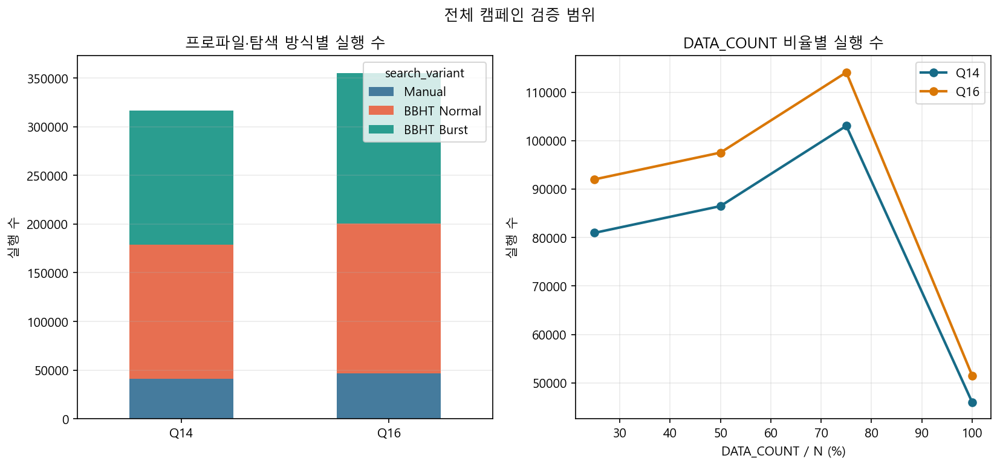

| 프로파일 | DATA_COUNT | M 종류 | 조건 수 | 실행 수 |
| --- | ---: | ---: | ---: | ---: |
| Q14 | 4,096 | 16 | 1,056 | 80,960 |
| Q14 | 8,192 | 17 | 1,128 | 86,480 |
| Q14 | 12,288 | 20 | 1,344 | 103,040 |
| Q14 | 16,384 | 18 | 600 | 46,000 |
| Q16 | 16,384 | 18 | 1,200 | 92,000 |
| Q16 | 32,768 | 19 | 1,272 | 97,520 |
| Q16 | 49,152 | 22 | 1,488 | 114,080 |
| Q16 | 65,536 | 20 | 672 | 51,520 |

| 탐색 방식 | 조건 수 | seed 반복 | 실행 수 |
| --- | ---: | ---: | ---: |
| MANUAL_OPTIMAL | 2,920 | 30 | 87,600 |
| BBHT_NORMAL | 2,920 | 100 | 292,000 |
| BBHT_BURST | 2,920 | 100 | 292,000 |

$$
87{,}600+292{,}000+292{,}000=671{,}600
$$

예를 들어 `Q14, D=N, M=1, EQ, SAFE, HEAD, BBHT_NORMAL`은 하나의 case이며 100개 seed를 실행한다. 이 trial 중 하나가 17번의 attempt를 사용했다면, case 수는 1개, trial 수는 100개, 해당 trial 내부 attempt 수는 17개로 구분한다.

### 2.3 분석 집계 원칙

| 비교 유형 | 적용 통계 | 적용하지 않는 방식 |
| --- | --- | --- |
| 동일 조건·여러 seed | 성공률, 평균 반복, 시간 중앙값·p95 | 단일 seed 시간 일반화 |
| 서로 다른 M | M별 개별값 또는 고정 anchor | 여러 M의 시간 평균을 대표값으로 사용 |
| Q14/Q16 | 동일 M 또는 동일 밀도의 matched case | 서로 다른 문제 집합의 전체 평균비 |
| Oracle·Padding | 나머지 조건이 같은 paired ratio | 비대응 전체 평균 |
| 수치 정확도 | trial 최댓값, case-mean 최댓값, worst-case envelope | 오차 평균만으로 PASS 판단 |
| 캠페인 전체 평균 | 실행 완전성·전체 현황 | 특정 조건의 성능 수치로 사용 |

검색공간 고정 비교는 `D=N, EQ, SAFE, HEAD`에서 `M=1`, `M=sqrt(N)`, `M/N=25·50·75·90·100%`를 사용한다. Padding 비교는 `D/N=25·50·75·100%`마다 `M=1`, `M/D=25·50·75·90·100%`를 분리한다.

## 3. 핵심 결과

| 항목 | 결과 | 판정 범위 |
| --- | ---: | --- |
| 전체 실행 | 671,600회 | 누락 0 |
| Target mask 오류 | 0회 | 골든 모델 내부 정합 PASS |
| Padding 오판정 | 0회 | 골든 모델 내부 정합 PASS |
| SAFE/POISON 불일치 | 0/287,040쌍 | PASS |
| Oracle 4종 불일치 | 0/503,700비교 | PASS |
| Normal/Burst 결과 불일치 | 0/292,000쌍 | PASS |
| M=0 정상 비성공 | 12,880/12,880 | PASS |
| M>0 BBHT 최종 성공 | 572,800/572,800 | 실행 seed·budget 범위에서 100% |
| M>0 Manual 1회 성공 | 84,884/85,920 | 98.7942% |
| Q1.22 L2·확률·norm 기준 | 모두 1e-3 미만 | 실행 범위에서 PASS |
| 전체 wall time | 5시간 37분 33초 | 단일 Python 프로세스 |

M>0 비성공 1,036회는 모두 Manual의 확률적 1회 측정이다. 고정소수점 기능 오류나 BBHT budget 실패가 아니다. BBHT 100% 역시 한 번의 j가 항상 성공했다는 뜻이 아니라, 실패 후 재시도한 최종 성공률이다.

이 표의 `PASS`는 종류별 의미가 다르다. Mask·padding·Oracle·Normal/Burst는 두 결과가 정확히 같은지를 확인하는 결정론적 PASS다. 반면 성공률은 Born 측정 표본의 비율이므로 100%가 아니어도 오류가 아닐 수 있다. Q1.22 PASS는 설정한 수치 오차 한계 `1e-3`을 넘지 않았다는 뜻이다.

## 4. 기능 정합성

### 4.1 Mask·Padding·Oracle

Oracle 조건은 입력값 `x`에 대해 `EQ: x=a`, `GT: x>a`, `LT: x<a`, `RANGE: a<x<b`로 정의한다. 실험에서는 네 Oracle이 동일한 target index 집합을 만들도록 입력과 기준값을 각각 구성한 후 결과를 비교했다. 따라서 이 비교는 서로 다른 문제의 성공률을 비교한 것이 아니라, **동일한 mask를 네 predicate 경로로 만들었을 때 결과가 같은지** 확인한 것이다.

| 검증 | 비교 수 | 불일치 | 분석 |
| --- | ---: | ---: | --- |
| 요청 M 대 mask popcount | 671,600 | 0 | controlled input의 M 정확성 확인 |
| Padding index target 판정 | 671,600 | 0 | `index < DATA_COUNT` 보호 확인 |
| SAFE 대 POISON | 287,040쌍 | 0 | padding 데이터값과 무관 |
| EQ 기준 GT·LT·RANGE | 503,700비교 | 0 | 동일 mask에서 결과·진폭·반복 일치 |

POISON은 padding에 Oracle 조건을 만족할 수 있는 값을 의도적으로 넣는다. 결과가 SAFE와 모두 같았으므로 padding 보호가 특정 sentinel 값에 의존하지 않는다.

`mask popcount`는 mask에서 `True`인 index 수를 세는 연산이다. 요청 M과 popcount가 같다는 것은 controlled input 생성기와 Oracle 판정기가 같은 정답 수를 만들었다는 뜻이다.

### 4.2 Normal·Burst 동등성

| 항목 | 결과 |
| --- | ---: |
| Paired Normal/Burst | 292,000쌍 |
| 결과 index·종료·진폭 hash 불일치 | 0 |
| 논리 반복 불일치 | 0 |
| Burst 실제 반복 증가 | 0 |

같은 seed에서 Normal과 Burst는 동일한 j 순서와 논리 반복을 사용한다. 최종 결과가 모두 같고 Burst의 실제 반복만 감소했으므로, 현재 골든 모델의 Burst는 BBHT 제어 의미를 바꾸지 않는 재계산 최적화로 구현됐다.

예를 들어 이전에 `j=3` 상태를 계산했고 다음 attempt가 `j=7`을 요청하면, Normal은 균일상태부터 7회를 다시 계산한다. Burst는 균일상태에서 3회 계산한 캐시가 정확히 `G^3|s>`임을 이용해 4회만 추가하여 `G^7|s>`를 만든다. 다음 j가 2처럼 캐시보다 작으면 캐시를 이어 쓰지 않고 균일상태에서 다시 계산한다.

### 4.3 조건별 host 시간비

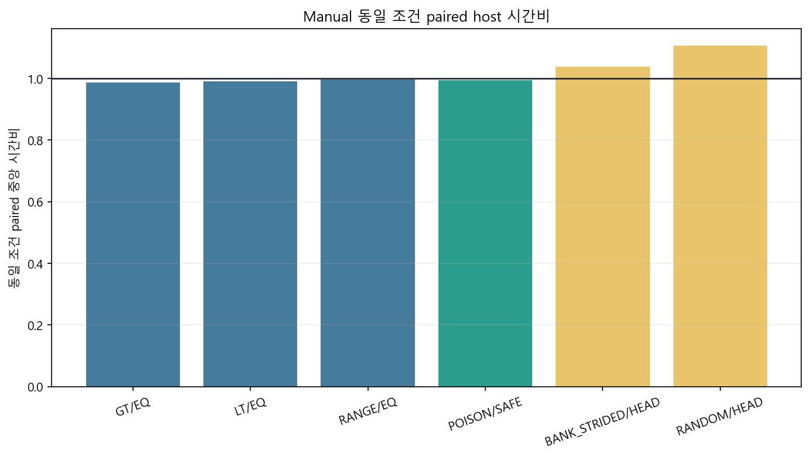

| 비교 | paired 조건 | 중앙 시간비 | 해석 |
| --- | ---: | ---: | --- |
| GT/EQ | 730 | 0.987 | Oracle 간 유의한 구조 차이 없음 |
| LT/EQ | 730 | 0.991 | Oracle 간 유의한 구조 차이 없음 |
| RANGE/EQ | 730 | 0.996 | Oracle 간 유의한 구조 차이 없음 |
| POISON/SAFE | 1,248 | 0.995 | padding 값 자체의 시간 영향 없음 |
| BANK_STRIDED/HEAD | 936 | 1.039 | 배치·측정 seed 상호작용 포함 |
| RANDOM/HEAD | 936 | 1.107 | 배치·측정 seed 상호작용 포함 |

이 비율은 동일 나머지 조건의 Manual case를 맞춘 Python host 시간비다. Oracle과 padding은 사실상 1.0이다. Layout은 target index가 달라 측정 난수 매핑도 달라지므로 순수 memory-bank 비용으로 해석하면 안 된다.

## 5. 탐색 결과 및 통계 유효성

### 5.1 탐색 방식별 결과

`최종 성공률`은 한 trial이 끝났을 때 결과 index가 target인지 나타낸다. Manual은 trial당 attempt가 한 번뿐이고, BBHT는 성공 또는 종료 조건까지 여러 attempt를 사용할 수 있으므로 두 성공률을 같은 의미로 직접 비교하면 안 된다.

| 프로파일 | 탐색 | M>0 실행 | 최종 성공률 | 평균 attempt | 평균 논리 반복 | 평균 실제 반복 |
| --- | --- | ---: | ---: | ---: | ---: | ---: |
| Q14 | Manual | 40,440 | 98.2196% | 1.000 | 20.941 | 20.941 |
| Q14 | BBHT Normal | 134,800 | 100% | 9.326 | 35.645 | 35.645 |
| Q14 | BBHT Burst | 134,800 | 100% | 9.326 | 35.645 | 18.792 |
| Q16 | Manual | 45,480 | 99.3052% | 1.000 | 37.625 | 37.625 |
| Q16 | BBHT Normal | 151,600 | 100% | 11.257 | 67.107 | 67.107 |
| Q16 | BBHT Burst | 151,600 | 100% | 11.257 | 67.107 | 35.029 |

위 평균 반복은 전체 캠페인의 실행 현황 요약이며 특정 M의 대표값으로 사용하지 않는다. M별 비용 판단은 6장의 고정 anchor 결과를 사용한다.

### 5.2 M=0

| 프로파일 | 탐색 | 실행 | 정상 비성공 | 평균 attempt | 평균 논리 반복 |
| --- | --- | ---: | ---: | ---: | ---: |
| Q14 | Manual | 840 | 100% | 1.00 | 0.00 |
| Q14 | BBHT Normal/Burst | 각 2,800 | 100% | 32.32 | 614.53 |
| Q16 | Manual | 840 | 100% | 1.00 | 0.00 |
| Q16 | BBHT Normal/Burst | 각 2,800 | 100% | 35.87 | 1230.87 |

Known-M는 M=0을 즉시 알 수 있지만 BBHT는 M을 모르므로 budget까지 실패를 반복한 뒤 비성공으로 종료한다. 따라서 M=0에서의 큰 반복 수는 오류가 아니라 unknown-M 탐색 비용이다.

### 5.3 LFSR seed 커버리지

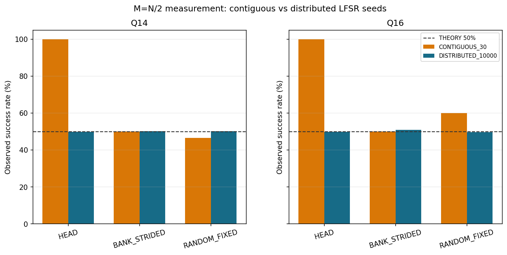

M=N/2에서는 균일 측정분포이므로 배치와 무관하게 target 성공확률이 50%여야 한다.

| 프로파일 | seed 집합 | HEAD | BANK_STRIDED | RANDOM_FIXED |
| --- | --- | ---: | ---: | ---: |
| Q14 | 연속 30개 | 100.00% | 50.00% | 46.67% |
| Q14 | 분산 10,000개 | 49.96% | 50.26% | 50.31% |
| Q16 | 연속 30개 | 100.00% | 50.00% | 60.00% |
| Q16 | 분산 10,000개 | 49.96% | 50.94% | 49.65% |

연속 seed는 LFSR 출력공간을 균일하게 덮지 못한다. 따라서 캠페인의 seed별 결과는 **재현 가능한 RTL 회귀 기준**으로는 유효하지만, Born 성공확률의 불편향 통계값으로 사용하면 안 된다. 확률 통계는 분산 seed를 사용해야 한다.

회귀 검증에서는 같은 seed가 골든 모델과 RTL에서 같은 j와 index를 생성하는지가 중요하다. 통계 검증에서는 많은 seed가 전체 난수공간을 고르게 덮는지가 중요하다. 두 목적은 다르므로 seed 집합도 분리해야 한다.

### 5.4 타겟 배치와 BBHT attempt

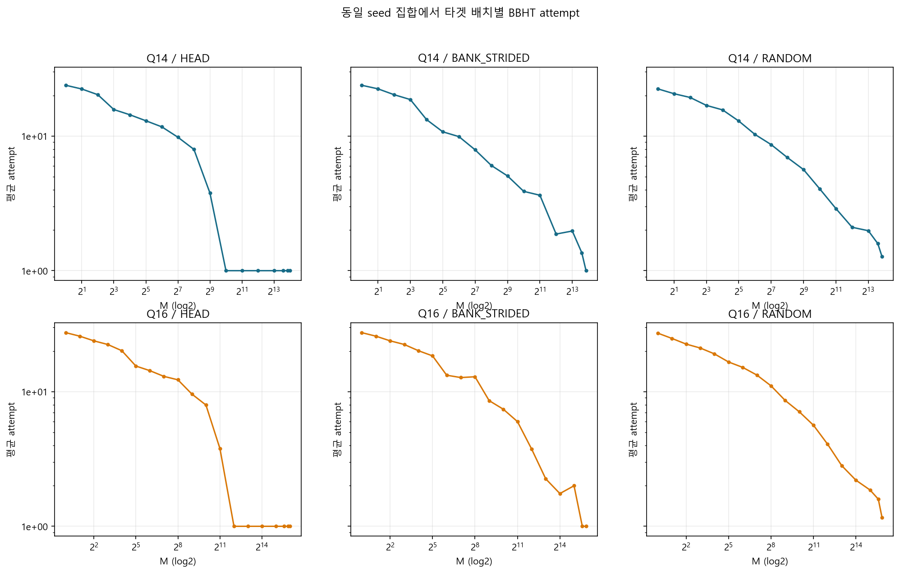

동일 M에서도 HEAD, BANK_STRIDED, RANDOM은 연속 LFSR seed가 선택하는 index와 겹치는 방식이 다르다. 이 때문에 유한 seed 집합에서는 attempt 수가 달라질 수 있다. 이것은 Grover 이론의 위치 의존성이 아니라 측정 난수 커버리지의 유한 표본 효과다.

## 6. M별 탐색 비용 및 Burst 캐시

### 6.1 BBHT attempt

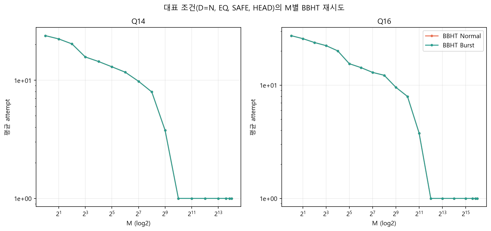

그래프는 `D=N, EQ, SAFE, HEAD` 조건에서 seed 반복 결과를 M별로 분리한 것이다. Normal과 Burst는 같은 BBHT 스케줄을 사용하므로 attempt 곡선이 완전히 겹쳐야 하며 실제로 일치했다.

가로축 M은 로그 축이다. 왼쪽은 target이 매우 적어 찾기 어려운 조건이고, 오른쪽은 많은 index가 target인 조건이다. 세로축 attempt가 낮아질수록 한 trial이 적은 재시도로 종료됐다는 뜻이다.

| 프로파일 | M anchor | 실제 M | Normal 평균 attempt | Normal 논리 반복 | Burst 실제 반복 | 절감률 |
| --- | --- | ---: | ---: | ---: | ---: | ---: |
| Q14 | M=1 | 1 | 23.79 | 196.13 | 101.45 | 48.27% |
| Q14 | M=sqrt(N) | 128 | 9.79 | 11.17 | 6.35 | 43.15% |
| Q16 | M=1 | 1 | 27.39 | 393.88 | 201.92 | 48.74% |
| Q16 | M=sqrt(N) | 256 | 12.23 | 21.33 | 11.43 | 46.41% |

고밀도 HEAD 조건은 연속 seed 편향으로 첫 j=0 측정에서 성공한 비율이 높아 평균 attempt가 1에 가까웠다. 이 값은 RTL 회귀 재현에는 사용할 수 있지만 BBHT의 일반적인 기대비용으로 인용하지 않는다.

### 6.2 Burst 절감률

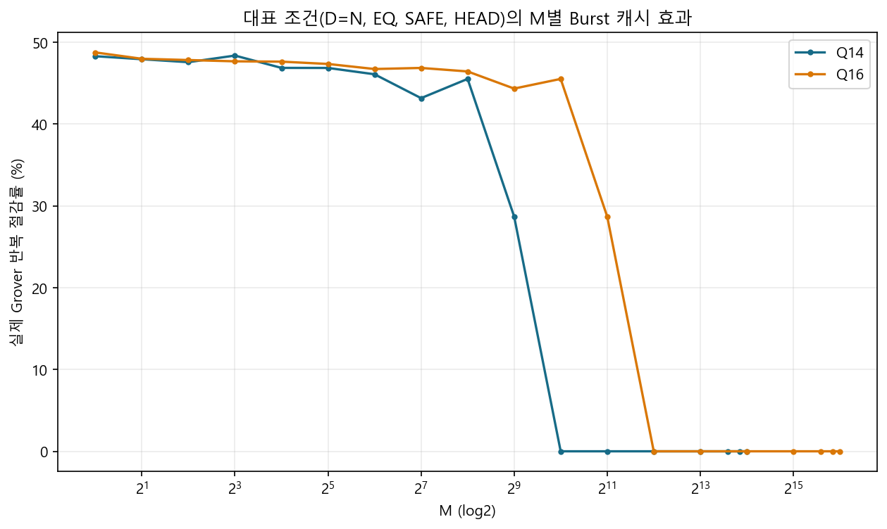

| 지표 | 전체 paired 결과 |
| --- | ---: |
| 평균 실제 반복 절감률 | 38.55% |
| 절감률 중앙값 | 44.44% |
| 평균 절감 iteration | 31.707 |
| 중앙 절감 iteration | 3 |
| Burst/Normal host 시간 중앙 비율 | 84.50% |

희소 M에서는 큰 j로 점진적으로 접근하므로 캐시된 iteration 이후의 차이만 계산하는 효과가 크다. 고밀도에서는 j 자체가 작아 절감할 반복이 거의 없다. 실제 RTL 이득은 cache 저장·복원 cycle과 BRAM 제어 비용을 포함해 다시 평가해야 한다.

`38.55% 절감`은 알고리즘이 요구한 논리 반복을 줄였다는 뜻이 아니다. 동일한 논리 상태를 만들기 위해 하드웨어가 다시 수행해야 하는 physical iteration만 줄였다는 뜻이다.

## 7. Q14/Q16 및 조건별 실행시간

### 7.1 시간 지표

실행시간은 동일 case의 seed 반복 중앙값을 대표값으로 사용한다. 평균은 단계별 누적 비용을 분석할 때만 사용하고, 서로 다른 M·Oracle·layout의 시간은 합쳐 대표값으로 만들지 않는다.

| 시간 통계 | 사용 이유 |
| --- | --- |
| 중앙값 | 운영체제 scheduling이나 다른 프로그램 때문에 드물게 길어진 trial의 영향을 줄임 |
| 평균 | 동일 case 안에서 전체 누적 비용과 단계별 비중 계산에 사용 |
| p95 | 실행의 95%가 이 시간 안에 끝나는지 확인 |

따라서 표의 중앙시간은 골든 모델을 실행할 때의 대표 host 부담이고, FPGA latency는 아니다.

### 7.2 D=N 고정 anchor

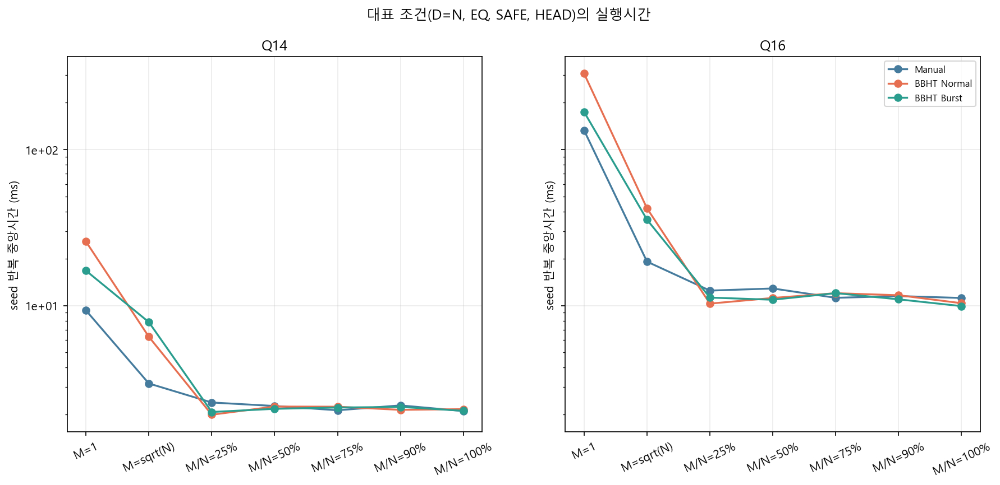

**Q14 seed 반복 중앙시간(ms)**

| M anchor | Manual | BBHT Normal | BBHT Burst |
| --- | ---: | ---: | ---: |
| M=1 | 9.303 | 25.684 | 16.725 |
| M=sqrt(N) | 3.167 | 6.305 | 7.824 |
| M/N=25% | 2.391 | 1.997 | 2.079 |
| M/N=50% | 2.272 | 2.252 | 2.178 |
| M/N=75% | 2.133 | 2.248 | 2.220 |
| M/N=90% | 2.292 | 2.146 | 2.241 |
| M/N=100% | 2.108 | 2.168 | 2.116 |

**Q16 seed 반복 중앙시간(ms)**

| M anchor | Manual | BBHT Normal | BBHT Burst |
| --- | ---: | ---: | ---: |
| M=1 | 132.299 | 305.708 | 173.638 |
| M=sqrt(N) | 19.100 | 41.920 | 35.478 |
| M/N=25% | 12.459 | 10.285 | 11.238 |
| M/N=50% | 12.858 | 11.179 | 10.890 |
| M/N=75% | 11.203 | 11.991 | 12.001 |
| M/N=90% | 11.494 | 11.635 | 10.953 |
| M/N=100% | 11.177 | 10.345 | 9.911 |

M=1에서는 Q16이 상태 수 4배와 더 많은 iteration을 동시에 부담하므로 Q14보다 시간이 크게 증가한다. M이 25% 이상이면 iteration이 0~1 수준으로 줄어 상태 초기화·mask·측정 같은 고정 비용이 상대적으로 커지고 세 탐색 방식의 차이도 작아진다.

`M=sqrt(N)`은 M=1과 고밀도 사이의 중간 난도 anchor다. Q14에서는 M=128, Q16에서는 M=256이며, 희소 target이 여러 개로 늘어날 때 반복 수와 시간이 얼마나 빠르게 감소하는지 보여준다.

### 7.3 DATA_COUNT·M/D 교차 비교

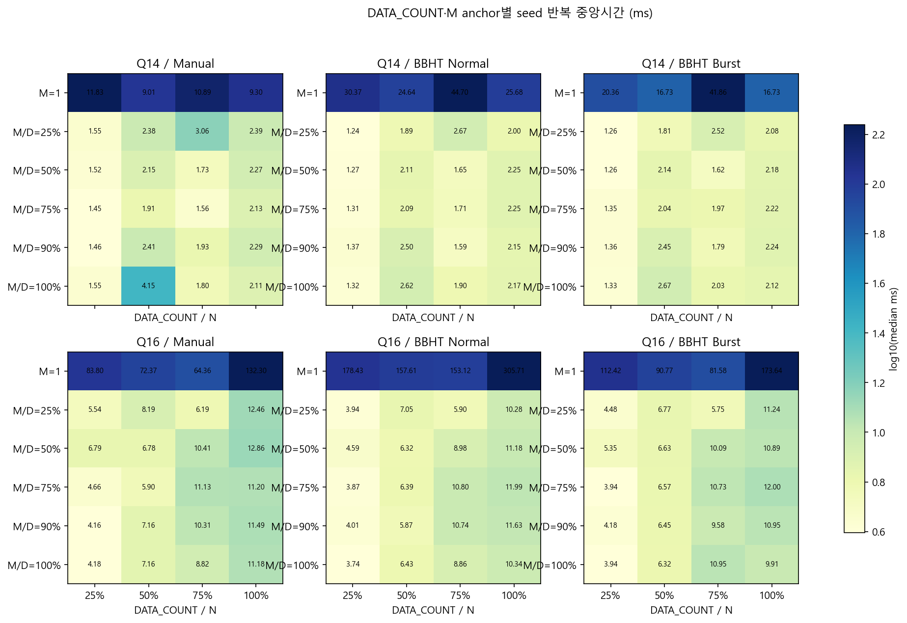

각 칸은 Q14/Q16, 탐색 방식, DATA_COUNT 비율과 M/D anchor를 고정한 뒤 seed 반복 중앙값을 표시한다. 서로 다른 M을 평균하지 않았다.

Heatmap의 행은 실제 입력 중 target이 차지하는 비율이고, 열은 전체 N 중 실제 입력이 차지하는 비율이다. 예를 들어 `D/N=50%, M/D=25%`는 전체 상태의 절반만 유효 입력이고 그 입력 중 4분의 1이 target인 조건이다. 남은 N-D 상태는 padding이다.

- M=1에서는 active N이 고정되어 core가 항상 전체 상태를 처리하므로 DATA_COUNT 감소가 core 시간을 비례해 줄이지 않는다.
- M/D가 고정된 dense 조건에서는 Q14가 대체로 1~4ms, Q16이 약 4~13ms 범위였다.
- 일부 비단조 변화는 캠페인 실행 순서, 운영체제 scheduling, 다른 프로그램 부하가 포함된 Python wall-clock 변동이다.
- 따라서 이 heatmap은 골든 모델 실행 부담을 보여주지만 FPGA memory throughput이나 P32 cycle 예측에는 사용하지 않는다.

## 8. 단일 실행의 구간별 시간

### 8.1 측정 구간

| 구간 | 기록 내용 |
| --- | --- |
| Input generation | controlled signed16 입력 생성 |
| Data load | 입력 배열 준비·전달 |
| Oracle precheck | predicate 조건 및 M 사전 확인 |
| Oracle mask | target mask 생성 |
| Scheduler | Manual j 또는 BBHT 제어 계산 |
| Grover core | Oracle phase flip과 diffusion 반복 |
| Measurement | 확률 계산·LFSR Born 선택 |
| Controller | attempt 누적·검증·종료 처리 |

한 trial에는 입력 생성과 mask 생성이 한 번 발생하지만 BBHT의 core·measurement·controller는 attempt마다 반복될 수 있다. 따라서 같은 N이라도 M이 작아 attempt가 많아지면 뒤 세 구간의 시간이 크게 증가한다.

### 8.2 단계별 비중

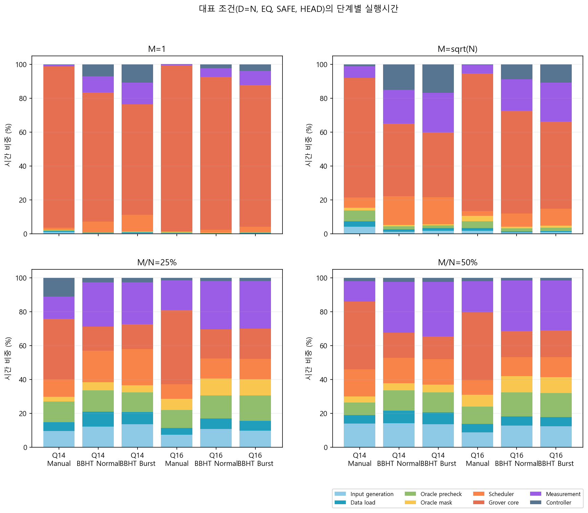

M=1에서는 반복이 많아 Grover core가 대부분을 차지한다. M=sqrt(N)부터 core 비중이 감소하고, M/N=25~50%에서는 입력 생성·mask·measurement·scheduler 같은 고정 비용이 상대적으로 커진다.

비중 그래프는 각 막대의 합이 100%다. 막대 자체의 절대 높이는 모두 같으므로 실제 ms 차이는 8.3의 절대시간 그래프와 함께 봐야 한다.

### 8.3 단계별 절대시간

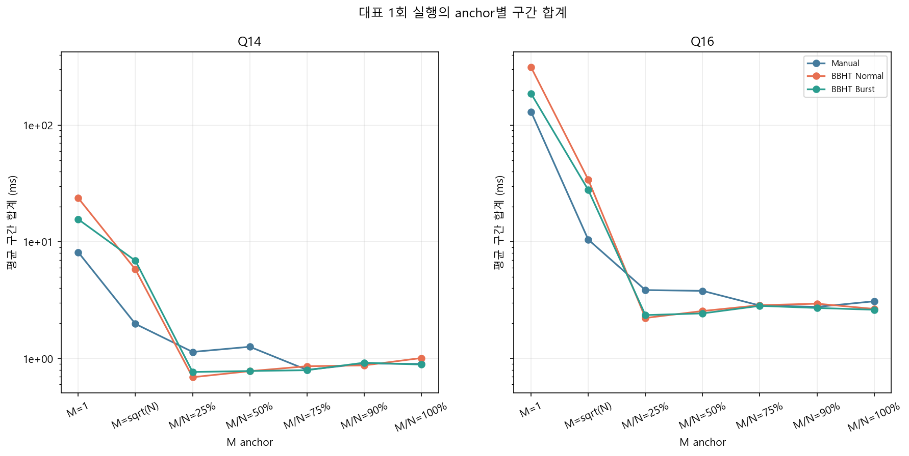

**M=1 구간 평균(ms)**

| 프로파일 | 탐색 | 구간 합계 | Grover core | Measurement | Scheduler | Controller | Core 비중 |
| --- | --- | ---: | ---: | ---: | ---: | ---: | ---: |
| Q14 | Manual | 8.136 | 7.745 | 0.089 | 0.091 | 0.020 | 95.20% |
| Q14 | Normal | 23.686 | 18.050 | 2.264 | 1.513 | 1.669 | 76.21% |
| Q14 | Burst | 15.576 | 10.134 | 2.017 | 1.536 | 1.683 | 65.06% |
| Q16 | Manual | 130.004 | 127.383 | 0.776 | 0.431 | 0.044 | 97.98% |
| Q16 | Normal | 312.753 | 282.235 | 16.075 | 5.960 | 7.154 | 90.24% |
| Q16 | Burst | 186.149 | 155.543 | 15.862 | 6.235 | 7.107 | 83.56% |

Burst는 core 반복을 줄이지만 measurement·scheduler·controller는 같은 BBHT attempt 구조를 유지하므로 그대로 남는다. 따라서 반복 절감률 약 48%가 host 전체 시간 절감률과 동일하지 않다.

M/N=25~50%에서는 core 비중이 대략 13~44%까지 낮아졌다. 이 구간에서는 core만 더 병렬화해도 전체 지연 개선이 제한되므로 Oracle mask, 측정, 제어 비용을 함께 고려해야 한다.

구간 합계는 계측된 8개 블록의 평균 합이며 `trial_total_ms`에는 블록 밖 Python 호출·기록 overhead도 포함된다. 두 값을 bit-exact cycle처럼 동일시하지 않는다.

## 9. Q1.22 수치 정확도

### 9.1 정확도 지표

$$
E_{\mathrm{phase\ L2}}=
\min\left(\lVert A_f-A_q\rVert_2,\lVert A_f+A_q\rVert_2\right)
$$

$$
E_{P}=|P_{\mathrm{fixed}}-P_{\mathrm{float}}|,\qquad
E_{\mathrm{norm}}=\left|\sum_i |A_i|^2-1\right|
$$

| 지표 | 검증 대상 |
| --- | --- |
| Phase-aligned amplitude L2 | 전역 부호를 제외한 전체 진폭 벡터 오차 |
| Probability-distribution L2 | index별 확률분포 오차 |
| 성공확률 오차 | target 전체 확률의 차이 |
| 정규화 오차 | 전체 확률 합의 drift |

Float64 결과를 참조값으로 두고 같은 mask와 같은 j를 Q1.22로 실행한 결과를 비교한다. 측정 index는 난수에 따라 달라질 수 있으므로 수치 정확도는 측정 결과 하나가 아니라 측정 전 전체 진폭과 확률분포로 평가한다.

- L2가 0이면 두 전체 벡터가 같다.
- 성공확률 오차가 작으면 target 전체에 모인 확률이 Float64와 가깝다.
- 정규화 오차가 작으면 반복 후에도 전체 확률 합이 1에 가깝다.
- 본 캠페인의 판정 기준 `1e-3`은 이전 정밀도 실험과 참고 설계에서 사용한 보통 정확도 기준이며, 모든 지표에 동일하게 적용해 비교했다.

### 9.2 프로파일·탐색 방식별 오차

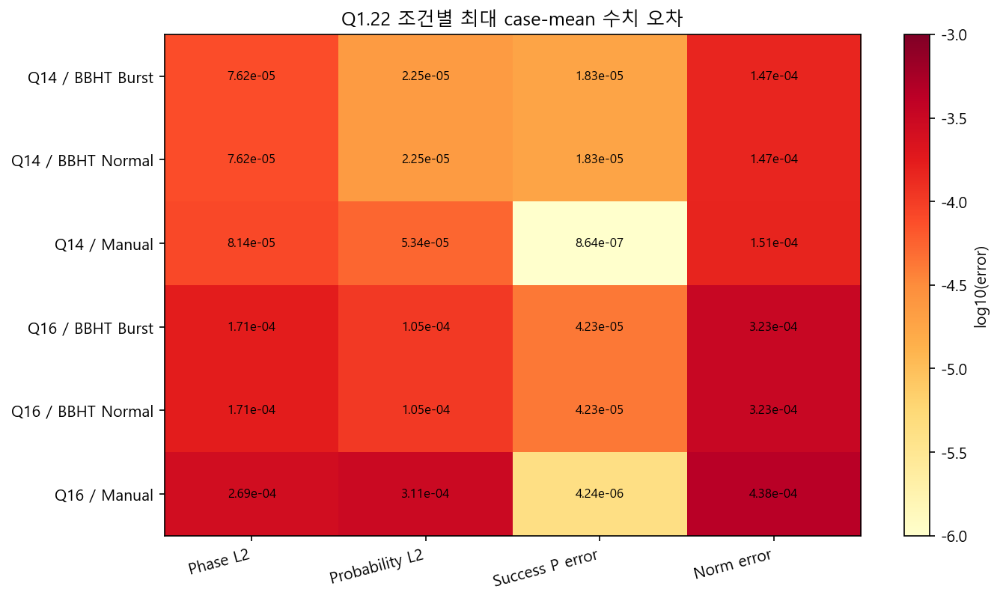

그래프는 각 그룹의 단순 평균이 아니라 **조건별 평균 오차 중 최댓값**을 표시한다. Q16이 Q14보다 오차가 크지만 모든 값은 1e-3 기준 아래다. Normal과 Burst가 동일한 수치 오차를 가지는 것은 최종 논리 상태가 같다는 추가 증거다.

Heatmap에서 붉은색에 가까울수록 오차가 크다. 그러나 색만 비교하지 말고 칸에 표시된 실제 수치와 `1e-3` 기준을 함께 봐야 한다.

### 9.3 M별 오차

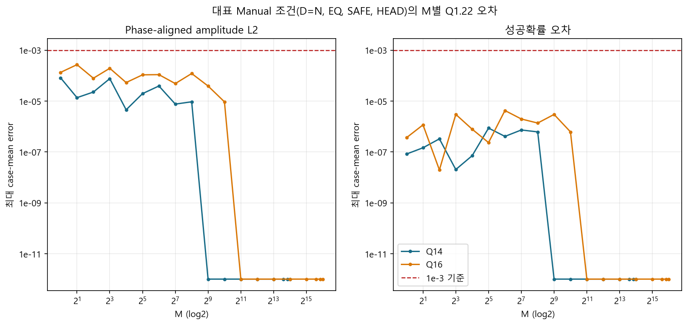

`D=N, EQ, SAFE, HEAD, Manual`을 고정하고 M만 바꾼 결과다. 서로 다른 탐색 방식이나 layout을 평균하지 않았다. 희소 M에서 반복 누적 오차가 크고, 반복이 0에 가까워지는 고밀도에서는 오차가 거의 0으로 감소한다.

### 9.4 전체 trial 최댓값

| 지표 | 전체 최댓값 | 최악 조건 |
| --- | ---: | --- |
| Phase-aligned amplitude L2 | 2.951e-4 | Q16, D=49,152, M=2, BBHT Normal |
| Probability-distribution L2 | 3.515e-4 | Q16, D=32,768, M=2, BBHT Normal |
| 성공확률 오차 | 1.688e-4 | Q16, D=16,384, M=8, BBHT Normal |
| 정규화 오차 | 5.351e-4 | Q16, D=16,384, M=1, BBHT Normal |

모든 trial-level 최댓값도 1e-3보다 작다. 따라서 현재 연산 순서와 반올림·포화 규칙에서 Q1.22는 실행 범위의 정확도 기준을 만족한다. 이 결론을 다른 Q 포맷이나 다른 RTL 연산 순서에 자동 적용할 수는 없다.

### 9.5 포화

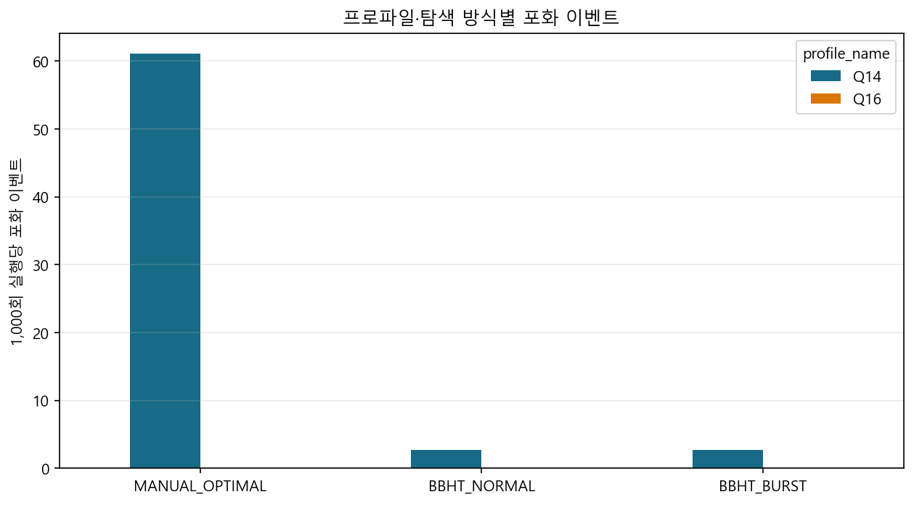

| 프로파일 | 탐색 | 실행 | 포화 이벤트 | 1,000회당 이벤트 |
| --- | --- | ---: | ---: | ---: |
| Q14 | Manual | 41,280 | 2,520 | 61.05 |
| Q14 | Normal | 137,600 | 368 | 2.67 |
| Q14 | Burst | 137,600 | 368 | 2.67 |
| Q16 | 모든 탐색 | 355,120 | 0 | 0 |

전체 포화 이벤트는 3,256회이며 기능 불일치는 0이었다. Q1.22에서 `+1.0`을 정확히 표현할 수 없는 경계가 포함되므로 포화 발생 자체를 실패로 판정하지 않는다. Normal과 Burst 포화 수가 동일한 점도 최종 논리 연산의 동등성을 뒷받침한다.

포화는 계산 결과가 표현 가능한 최댓값보다 클 때 최댓값으로 고정하는 처리다. 오버플로를 반대 부호로 되감는 wrap보다 안전하지만 오차를 만들 수 있으므로 발생 횟수와 기능 결과를 함께 기록했다.

## 10. M=1 RTL 기준

M=1은 가장 많은 iteration이 필요한 대표 worst-case이므로 고정소수점 누적 오차와 Burst 절감 검증에 민감하다.

RTL 비교는 같은 입력·seed·설정에서 다음 순서로 수행한다.

```text
골든 모델의 j·attempt 확인
  -> RTL scheduler 출력과 비교
  -> 논리·실제 iteration 비교
  -> 결과 index와 종료 사유 비교
  -> 최종 진폭 또는 amplitude hash 비교
  -> 불일치 시 대표 FULL trace의 iteration별 값 비교
```

`hash`는 큰 진폭 배열 전체를 짧은 식별값으로 바꾼 것이다. hash가 같으면 배열이 같다고 빠르게 판정할 수 있고, 다르면 FULL trace를 열어 처음 달라진 iteration을 찾는다.

### 10.1 DATA_COUNT=N 집계

| 프로파일 | 탐색 | 실행 | 평균 attempt | 논리 반복 | 실제 반복 | 캐시 절감 |
| --- | --- | ---: | ---: | ---: | ---: | ---: |
| Q14 | Manual | 360 | 1.000 | 100.000 | 100.000 | 0% |
| Q14 | Normal | 1,200 | 23.320 | 182.633 | 182.633 | 0% |
| Q14 | Burst | 1,200 | 23.320 | 182.633 | 94.747 | 48.12% |
| Q16 | Manual | 360 | 1.000 | 201.000 | 201.000 | 0% |
| Q16 | Normal | 1,200 | 27.313 | 384.530 | 384.530 | 0% |
| Q16 | Burst | 1,200 | 27.313 | 384.530 | 198.053 | 48.49% |

### 10.2 Seed 1 exact 기준

| 프로파일 | 탐색 | 결과 index | attempt | 논리 반복 | 실제 반복 | 최종 j | Phase L2 | 성공확률 오차 | 포화 |
| --- | --- | ---: | ---: | ---: | ---: | ---: | ---: | ---: | ---: |
| Q14 | Manual | 0 | 1 | 100 | 100 | 100 | 8.145e-5 | 8.284e-8 | 1 |
| Q14 | Normal | 0 | 17 | 65 | 65 | 15 | 1.975e-5 | 8.022e-7 | 0 |
| Q14 | Burst | 0 | 17 | 65 | 34 | 15 | 1.975e-5 | 8.022e-7 | 0 |
| Q16 | Manual | 0 | 1 | 201 | 201 | 201 | 1.339e-4 | 3.659e-7 | 0 |
| Q16 | Normal | 0 | 28 | 567 | 567 | 124 | 1.517e-4 | 4.424e-5 | 0 |
| Q16 | Burst | 0 | 28 | 567 | 316 | 124 | 1.517e-4 | 4.424e-5 | 0 |

Q14은 전달 RTL과 직접 비교할 우선 기준이며 Q16은 동일 규칙 확장 기준이다. 최종 RTL testbench에서는 결과 index만 보지 말고 j 순서, attempt, 논리·실제 반복, 종료 사유, 최종 진폭 hash를 함께 비교해야 한다.

## 11. 결과 사용 범위

| 골든 기준으로 사용 가능 | 별도 RTL·FPGA 검증 필요 |
| --- | --- |
| 입력·target mask·실제 M | RTL cycle count |
| seed별 j·attempt·종료 사유 | P32 pipeline stall·memory latency |
| Normal/Burst 논리·실제 반복 | cache 저장·복원 cycle |
| 결과 index·성공 여부 | 합성 Fmax·보드 wall time |
| Float64·Q1.22 진폭 및 오차 | Q16 실제 합성·보드 자원 |
| 대표 FULL trace | 전체 조건 RTL bit-exact 자동 비교 |

현재 결과가 증명하는 것은 **골든 모델 내부의 기능·수치 정합성과 RTL 기준 벡터 생성 가능성**이다. 전체 RTL 구현의 PASS나 FPGA 가속 배수는 아직 증명하지 않는다.

`bit-exact`는 허용 오차 안에서 비슷하다는 뜻이 아니라, RTL의 고정소수점 비트열이 골든 모델의 encoded 값과 정확히 같다는 뜻이다. Float64 비교는 수치 품질 검증에, encoded Q1.22 비교는 RTL 구현 검증에 사용한다.

## 12. 산출물

원시 기록(`trials.jsonl` 671,600건, `attempts.jsonl` 6,397,040건)과 집계 CSV 15종은 용량이 커서 저장소에 넣지 않았다. 분석 아카이브에만 있고, **저장소에 남은 것은 이 문서와 아래 그림들**이다.

집계를 다시 만들어야 하면 생성기가 `software/golden/tools/rtl_campaign_finalize.py` 이고, 캠페인 자체는 `software/golden/rtl_v07g.py` 와 `software/golden/tools/rtl_v07g_vectors.py` 로 돌린다.

| 그룹 | 그림 |
| --- | --- |
| 캠페인 범위 | [09 검증 범위](diagrams/campaign_09_campaign_coverage.png) |
| 성공률 | [02 양성 성공률](diagrams/campaign_02_positive_success_rate.png) · [05 M별 성공](diagrams/campaign_05_success_by_m.png) · [20 대표 조건 M별 성공](diagrams/campaign_20_representative_success_by_m.png) |
| 반복과 캐시 | [03 M=1 반복](diagrams/campaign_03_m1_iterations.png) · [06 M별 물리 반복](diagrams/campaign_06_physical_iterations_by_m.png) · [04 Burst 절감](diagrams/campaign_04_burst_cache_saving.png) · [10 M별 attempt](diagrams/campaign_10_attempts_by_m.png) · [11 M별 절감](diagrams/campaign_11_cache_saving_by_m.png) |
| 시간 | [01 프로파일·탐색별](diagrams/campaign_01_timing_by_profile_search.png) · [07 DATA_COUNT별](diagrams/campaign_07_timing_by_data_count.png) · [16 조건 축 시간비](diagrams/campaign_16_condition_axis_timing.png) · [18 anchor별](diagrams/campaign_18_representative_timing.png) · [19 D/N × M/D](diagrams/campaign_19_data_count_anchor_timing.png) · [12 단계 비중](diagrams/campaign_12_stage_time_share.png) · [17 단계 절대시간](diagrams/campaign_17_stage_time_absolute.png) |
| 정확도·포화 | [13 프로파일·탐색별 오차](diagrams/campaign_13_accuracy_by_profile_search.png) · [14 M별 오차](diagrams/campaign_14_accuracy_by_m.png) · [15 포화](diagrams/campaign_15_saturation_by_profile_search.png) |
| 난수 | [08 LFSR seed 커버리지](diagrams/campaign_08_lfsr_seed_coverage.png) · [21 배치별 attempt](diagrams/campaign_21_attempts_by_layout.png) |

## 부록 A. 분석 항목 추적표

| 분석 그룹 | 포함 항목 | 보고서 위치 |
| --- | --- | --- |
| 캠페인 완전성 | 조건 수, 실행 수, 누락, M 구성 | 2장 |
| 기능 정합성 | mask, padding, Oracle, M=0, Normal/Burst | 3~4장 |
| 탐색 결과 | Manual/BBHT 성공, attempt, LFSR, layout | 5장 |
| 계산 비용 | M별 논리·실제 반복, Burst 절감 | 6장 |
| 확장성 | Q14/Q16, DATA_COUNT, M anchor 시간 | 7장 |
| 구간 시간 | 8개 실행 구간의 절대시간·비중 | 8장 |
| 수치 정확도 | Phase L2, 확률 L2, 성공확률, norm, 포화 | 9장 |
| RTL 기준 | M=1 exact, 산출 파일, 사용 범위 | 10~12장 |

중복된 전체 평균 시간표, 전체 M 혼합 시간 그래프와 반복 설명은 본문에서 제거했다. 전체 평균은 캠페인 현황에만 사용하고 성능 비교는 고정 anchor 또는 paired case로 제한했다.
