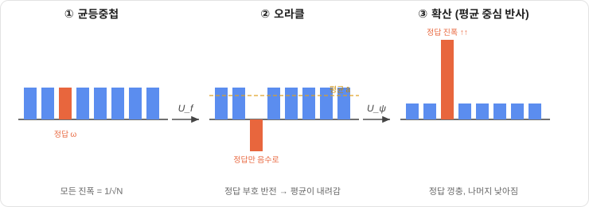
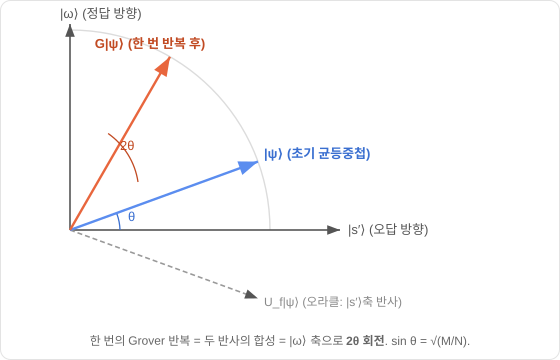

# 양자컴퓨팅 입문 — 큐비트에서 그로버까지 (1시간 세미나)

> **대상**: 양자컴퓨팅을 처음 보는 학부생 · **시간**: 약 60분 (본문 50분 + Q&A 10분)
> **도착지**: "정렬 안 된 $N$ 개에서 정답을 $\sqrt N$ 번 만에 찾는" **그로버 알고리즘**을 이해하기
> **필요 수학**: 복소수·벡터 조금 (막히면 [부록 A](../study_references/A_수학_빠른복습.md)). 자세한 해설은 [0~10장 해설서](../study_references/README.md) 참고.
> **판본**: 2026-07-10 실시 · 2026-08-15 Part 7 개정(확정 설계 반영).
>
> 이 파일은 발표 슬라이드 겸 대본입니다. `---` 가 슬라이드 경계예요. 각 슬라이드 끝의 **🗣️** 는 발표할 때 강조할 한마디입니다.

---

## 0. 오늘의 지도 (2분)

```
왜 양자? → 큐비트·중첩 → 측정 → 게이트 → 여러 큐비트·얽힘
   → 오라클·간섭 → [그로버 ★] → FPGA 에뮬레이터
```

- 전반부(30분): **양자컴퓨팅의 언어** — 큐비트가 뭔지, 왜 특별한지.
- 후반부(20분): **그로버 알고리즘** — 오늘의 주인공.
- 마지막(5분): 우리 프로젝트 = 이 알고리즘을 **FPGA로 흉내 내기**.

🗣️ "수식이 나와도 겁먹지 마세요. 오늘은 **그림과 비유**로 갑니다. 핵심 아이디어는 딱 세 개예요 — 중첩, 간섭, 그리고 반복."

---

# Part 1. 왜 양자컴퓨터인가 (7분)

---

## 1.1 컴퓨터의 뿌리, 그리고 도이치의 질문

- 1936년 **튜링**: "알고리즘 = 튜링 머신이 하는 것" → 현대 컴퓨터의 토대.
- 1985년 **도이치**: *"모든 물리 시스템을 효율적으로 흉내 낼 수 있는 단 하나의 컴퓨터가 있을까?"*
- 문제 발견: **고전 컴퓨터는 양자역학을 흉내 내는 데 끔찍하게 느리다.**
- 그래서 새 기계가 필요했다 → **양자컴퓨터**.

🗣️ "양자컴퓨터는 '더 빠른 노트북'이 아니라, **양자 세계를 흉내 내려다 태어난** 완전히 다른 기계예요."

---

## 1.2 왜 고전은 양자를 못 흉내 내나 — $2^n$의 폭발

입자(큐비트) $n$ 개를 기술하려면 **$2^n$ 개의 숫자(진폭)** 가 필요합니다.

- 입자 하나 = 0, 1 두 가지. 둘 = 00·01·10·11 **네 가지**. 셋 = 여덟 가지…
- **조합 하나마다 숫자 하나** 필요 → 입자 늘 때마다 **두 배**.

| 입자 수 | 필요한 숫자 |
|:---:|:---|
| 10개 | 약 1,000개 |
| 50개 | 약 1,000조 개 |
| 300개 | 우주의 원자 수보다 많음 💥 |

🗣️ "큐비트 300개면 고전 컴퓨터가 저장조차 못 하는 숫자를, 양자컴퓨터는 **큐비트 300개로 자연스럽게** 담아요. 이 '$2^n$을 다루는 힘'이 오늘 이야기의 전부입니다."

---

## 1.3 양자컴퓨터가 잘하는 것 (만능은 아님)

| 알고리즘 | 문제 | 고전 → 양자 |
|---|---|:---:|
| **Shor** | 소인수분해 (RSA 암호) | 지수 → 다항 |
| **Grover** ★ | 정렬 안 된 검색 | $O(N) \to O(\sqrt N)$ |
| Deutsch-Jozsa | 상수/균형 판별 | $O(2^n) \to O(1)$ |
| 양자 시뮬레이션 | 분자·물질 | 지수적으로 빠름 |

🗣️ "오늘의 주인공은 **Grover**. 단순한데 깊고, 응용이 넓고, 하드웨어로 만들기 딱 좋아서 우리 프로젝트가 골랐어요."

---

# Part 2. 큐비트와 중첩 (8분)

---

## 2.1 비트 vs 큐비트 — 숫자 vs 화살표

- 고전 **비트**: 상태가 **0 또는 1** (둘 중 하나의 숫자).
- 양자 **큐비트**: 상태가 **2차원 벡터(화살표)**.

$$|0\rangle = \begin{bmatrix}1\\0\end{bmatrix}, \qquad |1\rangle = \begin{bmatrix}0\\1\end{bmatrix}$$

- `|⟩` 기호(켓)는 그냥 "이건 양자상태(벡터)다"라는 표시. $|0\rangle$ 은 **영벡터가 아니라** 성분 $(1,0)$ 인 화살표.

🗣️ "핵심 전환: 비트는 **숫자**, 큐비트는 **화살표**. 이 한 줄이 모든 걸 바꿔요."

---

## 2.2 중첩 — 큐비트의 진짜 힘

큐비트는 $|0\rangle, |1\rangle$ 의 **섞임(중첩)** 도 될 수 있습니다:

$$|\psi\rangle = \alpha|0\rangle + \beta|1\rangle$$

- $\alpha, \beta$ = **진폭** (복소수). 대표 예: $|+\rangle = \frac{|0\rangle+|1\rangle}{\sqrt2}$.
- ⚠️ 중첩은 "몰래 0이거나 1인데 우리가 모르는 것"이 **아님**. **진짜로 둘 다 동시에** 존재.
- 규칙(정규화): $|\alpha|^2 + |\beta|^2 = 1$ (화살표 길이 = 1).

🗣️ "'동시에 0이면서 1' — SF 같지만 진짜예요. 이게 병렬성의 씨앗입니다."

---

## 2.3 측정 — 화살표를 숫자로 되돌리기

큐비트 속 진폭은 **직접 볼 수 없어요**. 값을 꺼내려면 **측정**해야 합니다.

- **Born 규칙**: $\alpha|0\rangle+\beta|1\rangle$ 을 재면 확률 $|\alpha|^2$ 로 **0**, $|\beta|^2$ 로 **1**.
- **붕괴**: 재는 순간 중첩이 깨지고 $|0\rangle$ 또는 $|1\rangle$ 로 확정. 진폭 정보는 **사라짐** (비가역).

💡 **비유**: 중첩은 빠르게 도는 동전. 측정은 손으로 탁 눌러 앞/뒤를 확정하는 것. 누른 뒤엔 "얼마나 빨리 돌았는지"는 알 수 없어요.

🗣️ "측정은 딱 **한 번, 계산 다 끝나고** 합니다. 그래서 알고리즘의 목표는 '측정 직전에 정답 진폭을 크게 만들기'예요."

---

# Part 3. 게이트 — 상태를 바꾸기 (7분)

---

## 3.1 게이트 = 행렬, 적용 = 행렬곱

고전이 AND·OR·NOT으로 비트를 다루듯, 양자는 **게이트**로 큐비트를 다룹니다. 게이트 = **행렬**, 적용 = 곱하기:

$$|\psi_{\text{out}}\rangle = U|\psi\rangle$$

- **X 게이트** (NOT): $|0\rangle \leftrightarrow |1\rangle$ 뒤집기.
- **Z 게이트**: $|1\rangle$ 의 **부호만** 뒤집기 → "위상 반전". (나중에 오라클의 핵심!)

🗣️ "게이트는 화살표를 회전·반사시키는 것. 컴퓨터가 하는 일 = 화살표 이리저리 돌리기."

---

## 3.2 하다마드(H) — 중첩을 만드는 열쇠

$$H|0\rangle = \frac{|0\rangle+|1\rangle}{\sqrt2} = |+\rangle$$

확실한 $|0\rangle$ 을 **반반 중첩**으로 펼칩니다. 거의 모든 양자 알고리즘의 **첫 단계**.

그런데 $H$ 를 **두 번** 걸면? 원래 $|0\rangle$ 로 돌아와요 ($HH=I$):

$$H\!\left(\tfrac{|0\rangle+|1\rangle}{\sqrt2}\right) = |0\rangle$$

- $|1\rangle$ 항이 **상쇄**되고 $|0\rangle$ 항이 **보강** → 이게 **간섭(interference)**!

🗣️ "**간섭이 오늘의 두 번째 핵심 단어**입니다. 진폭이 서로 지워지고 겹쳐지는 것 — 고전 확률로는 절대 못 하는 일."

---

## 3.3 왜 게이트는 '유니터리'여야 하나

- 게이트는 화살표 **길이(=1)를 보존**해야 함 → 측정 확률의 합이 늘 1이 되도록.
- 길이를 보존하는 행렬 = **유니터리**. 그리고 유니터리는 **항상 되돌릴 수 있음(가역)**.

🗣️ "양자 계산은 (측정 전까지) 언제나 되감기 가능. 정보가 안 사라져요. 이게 나중에 오라클 설계에도 영향을 줍니다."

---

# Part 4. 여러 큐비트와 얽힘 (8분)

---

## 4.1 $n$ 큐비트 = $2^n$ 차원, $H^{\otimes n}$ 로 전부 펼치기

- 큐비트 $n$ 개 → $2^n$ 개 기저 상태 ($|00\cdots0\rangle \sim |11\cdots1\rangle$).
- **각 큐비트에 $H$ 하나씩** 걸면 → $2^n$ 개가 **전부 똑같은 크기로** 담긴 균등중첩:

$$H^{\otimes 3}|000\rangle = \tfrac{1}{\sqrt8}\big(|000\rangle + |001\rangle + \cdots + |111\rangle\big)$$

- 게이트 **$n$ 개**로 항 **$2^n$ 개**를 한 번에! (곱을 전개하면 항이 두 배씩 불어남)

🗣️ "$H$ 를 $n$ 개 거는 순간, $2^n$ 개 후보가 **한 상태 안에 동시에** 들어와요. 그로버의 출발선입니다."

---

## 4.2 CNOT — 큐비트를 '상호작용'시키기

혼자 노는 게이트만으론 부족. 큐비트끼리 엮는 **CNOT**:

> **제어 큐비트가 1이면, 표적 큐비트를 뒤집는다.**

💡 **비유**: 스위치 두 개. "A가 켜져 있을 때만 B가 뒤집힌다" — 두 스위치가 배선으로 엮인 것. **표적의 운명이 제어 값에 달려 있음 = 상호작용.**

🗣️ "단일 큐비트 게이트 + CNOT, 이 둘이면 어떤 양자 계산도 만들 수 있어요(범용). CNOT이 '엮는' 역할."

---

## 4.3 얽힘 — 마법 동전

$|00\rangle$ 에 $H$ + CNOT 을 걸면:

$$\frac{|00\rangle + |11\rangle}{\sqrt2} \quad(\text{벨 상태})$$

💡 **마법 동전 두 개**: 각각 던지면 앞/뒤 반반인데, **항상 같은 면**이 나옴. 던지기 전엔 정해져 있지도 않은데, 한쪽을 재는 순간 나머지가 즉시 확정.

- 각 큐비트만 따로 보면 평범(50:50). 특별함은 **"둘이 같다"는 관계**에만 있음 → 따로 못 나눠 적음 = **얽힘**.

🗣️ "아인슈타인이 '유령 같은 원격 작용'이라 부른 게 이겁니다. 양자만의 자원이에요."

---

# Part 5. 알고리즘의 재료 — 오라클과 간섭 (7분)

---

## 5.1 오라클 = 정답 판별기 (블랙박스)

- **오라클** $f$: 입력을 넣으면 **정답이면 1, 아니면 0**. 속은 안 봄 → "블랙박스".
- 실제론 진리표 하나이고, 속은 CNOT·X로 조립돼 있음. 하지만 알고리즘은 **속을 안 보고** 그냥 씁니다.

**위상 오라클** (그로버가 쓰는 형태): **정답 상태의 진폭 부호만 뒤집기**.

$$U_f|x\rangle = (-1)^{f(x)}|x\rangle \quad(\text{정답이면 } -)$$

🗣️ "오라클은 정답에 '보이지 않는 표식(마이너스)'을 답니다. 근데 이 표식만으론 측정에 안 잡혀요 — 크기는 그대로니까."

---

## 5.2 간섭이 알고리즘의 심장

- 양자 병렬성: $2^n$ 개를 동시에 계산 — 하지만 **측정하면 하나만** 튀어나옴. 그냥은 이득 없음.
- 진짜 비결 = **간섭**: 정답 진폭은 **보강**, 오답 진폭은 **상쇄**시켜서, 측정 때 정답이 높은 확률로 나오게 만들기.

💡 **비유**: 복권을 다 사도 긁는 건 한 장뿐. 간섭은 "당첨 복권만 두껍게, 꽝은 얇게" 조작하는 기술.

🗣️ "정리: **펼치고($H$) → 정답에 표시(오라클) → 간섭으로 정답만 남기기.** 모든 양자 알고리즘이 이 3박자예요. 그로버가 그 완성형입니다."

*(참고: Deutsch-Jozsa 알고리즘은 이 3박자로 '상수 vs 균형'을 **오라클 한 번**에 판별 — 간섭의 첫 사례. 자세한 건 [8장](../study_references/08_도이치_조자_알고리즘.md).)*

---

# Part 6. 그로버 알고리즘 ★ (15분)

---

## 6.1 검색 문제

- 상자 100개 중 하나에 민트 초콜릿. 하나씩 열어봄 → 최악 100번, 평균도 $N$ 에 비례 = **$O(N)$**.
- 정렬돼 있으면 이진 탐색 $O(\log N)$ — 하지만 정렬은 강한 전제.
- **그로버**: 정렬 안 된 데이터에서 **$O(\sqrt N)$**. (100만 개 → 고전 100만 번, 그로버 약 1,000번!)

🗣️ "정렬 없이 얻는 확실한 이득. 그리고 이 $\sqrt N$ 이 **최적**임이 증명돼 있어요."

---

## 6.2 핵심 장면 — 막대 두 번 흔들기

막대 하나 = 상태 하나의 진폭. 시작은 다 똑같은 높이(균등중첩).



- **① 오라클**: 정답 막대만 **아래로**(음수) 뒤집기.
- **② 확산 (평균 중심 반사)**: 모든 막대를 **평균선 기준으로** 뒤집기 → 평균 아래 깊이 있던 정답이 **위로 껑충**, 나머지는 살짝 내려감.

💡 **시소**: 오라클이 정답을 바닥까지 누르고, 확산이 시소를 뒤집어 정답을 꼭대기로 올림.

🗣️ "이 두 동작(눌렀다 → 뒤집기)을 반복할 때마다 정답 막대가 조금씩 커져요. 그게 '확률 증폭'입니다."

---

## 6.3 진짜로 한 번 돌려보기 — $N=4$

네 상태의 진폭을 추적 (정답은 세 번째):

| 단계 | 진폭 |
|---|---|
| 시작 (균등) | $(\tfrac12,\ \tfrac12,\ \tfrac12,\ \tfrac12)$ |
| ① 오라클 | $(\tfrac12,\ \tfrac12,\ -\tfrac12,\ \tfrac12)$ |
| ② 확산 ($a\to 2\bar a - a$, 평균 $\bar a=\tfrac14$) | $(0,\ 0,\ 1,\ 0)$ |

**단 한 번**에 정답 진폭이 1 → 측정하면 **100% 정답**! 🎯

🗣️ "막대 두 번 흔들었더니 정답이 튀어나왔죠. $N=4$ 는 한 번에 딱 맞는 특별한 경우예요."

---

## 6.4 왜 $\sqrt N$ 번? 왜 하필 $\pi$?

$N$ 이 크면 정답 막대가 작아서($\frac{1}{\sqrt N}$) 한 번으론 부족. 그로버를 **회전**으로 보면 딱 풀립니다.



- 상태 = **화살표**. **정답 방향**(정답 하나)과 **오답 방향**(오답 전부 묶음) 사이에서 회전.
- 한 번 흔들 때마다 화살표가 정답 쪽으로 **$2\theta$ 씩** 회전 ($\sin\theta = \frac{1}{\sqrt N}$).
- 정답 방향은 **직각(90°) = $\frac{\pi}{2}$**. 거기까지 도는 데 필요한 횟수:

$$R \approx \frac{\pi/2}{2\theta} = \frac{\pi}{4\theta} \approx \frac{\pi}{4}\sqrt N$$

🗣️ "**$\pi$ 는 신비로운 상수가 아니에요.** 정답이 직각(90°) 방향이고, 90°를 각도로 쓰면 $\pi/2$ 라서 나온 겁니다. 운전대를 90° 옆 목표까지 조금씩 꺾는 거예요."

---

## 6.5 확률이 자라는 모습 (그리고 지나치면 떨어진다)

정답 확률이 반복마다 어떻게 오르는지 ($N=64$):

| 반복 | 0 | 1 | 2 | 3 | 4 | 5 | **6** | 7 |
|:---:|:---:|:---:|:---:|:---:|:---:|:---:|:---:|:---:|
| 정답확률 | 1.6% | 13.5% | 34% | 59% | 82% | 96% | **99.7%** | 91%↓ |

- 최적 $R \approx \frac{\pi}{4}\sqrt{64} = 2\pi \approx 6$ 회에서 최대.
- ⚠️ **더 돌리면 정답 방향을 지나쳐 확률이 다시 떨어짐!** (7회째 91%로 하락)

🗣️ "고전은 오래 돌릴수록 확실해지지만, 그로버는 **딱 맞는 횟수**가 중요해요. 지나치면 손해."

---

## 6.6 그로버 전체 흐름



| 요소 | 역할 |
|---|---|
| $H^{\otimes n}$ | 균등중첩 (모든 후보 동시에) |
| 오라클 $U_f$ | 정답 막대 아래로 (표시) |
| 확산 $U_\psi$ | 평균 중심 반사 (증폭) |
| $\frac{\pi}{4}\sqrt N$ 번 반복 | 정답 방향으로 회전 |
| 측정 | 높은 확률로 정답 |

🗣️ "결국 그로버는 **두 동작(표시 + 증폭)을 $\sqrt N$ 번 반복**하는 것. 그게 전부예요."

---

# Part 7. 우리 프로젝트 — FPGA 에뮬레이터 (5분)

---

## 7.1 무엇을 만드는가 — 문제와 확정 스펙

데이터 배열 `value[0..N-1]` 을 FPGA 메모리에 올려 두고, **술어를 만족하는 인덱스**를 그로버로 찾는 가속기입니다.

- 술어 4종: `value < a` · `value > a` · `value == a` · `a < value < b`.
- 출력 ①: 조건을 만족하는 원소 **하나**. 출력 ②: 반복 호출로 **전부 열거** — 찾은 인덱스를 마스크 메모리(`mask_mem`)에 적어 두고 다음 라운드 오라클에서 빼므로 중복이 없습니다.
- 오라클은 **정답 인덱스를 미리 아는 회로가 아닙니다.** `value[i] − a` 의 **부호 비트 하나**가 `<` 의 답이고, `=` 는 XOR-NOR, `>` 는 피연산자 교환. 술어 넷이 감산기 하나를 나눠 씁니다.

| 항목 | 확정값 |
|---|---|
| 보드 | **Arty-S7-50** (`xc7s50`) |
| 큐비트 | **$n = 15$** → 진폭 $N = 32{,}768$ 개 |
| 진폭 표현 | 18비트 고정소수점 **Q2.16** |
| 병렬도 | **$P = 32$ 레인** (인덱스 하위 5비트로 뱅크 선택) |
| 그로버 반복 1회 | **2패스 = 2,048 사이클** |
| 메모리 | IP **BRAM36 33개**, SoC까지 합쳐 **~48 / 75** |
| 곱셈기 | 확산·오라클 경로 **0개** / 측정 제곱기 **DSP 32 / 120** |

🗣️ "확산 $a \mapsto 2\bar a - a$ 에는 **곱셈기가 하나도 없어요** — 2배는 왼쪽 시프트, $N$ 이 2의 거듭제곱이라 평균은 오른쪽 시프트, 나머지는 뺄셈. DSP는 **측정 경로에서만** 잡힙니다."

---

## 7.2 반전 ① — "측정 = 제일 큰 막대 고르기"가 무너지는 순간

앞의 6.3 손계산은 **정답이 하나**였습니다. 그래서 확산 한 번에 정답 진폭이 1, 나머지가 0이 되어 "제일 큰 막대를 고르면 끝"처럼 보였죠. 정답이 $M$ 개면 그림이 달라집니다.

- 오라클은 조건을 만족하는 **모든** 칸을 똑같이 뒤집고, 확산 $2\bar a - a$ 는 인덱스를 구별하지 않습니다.
- → $M$ 개 정답의 진폭은 매 반복 후 **정확히 같습니다.** 지나온 연산열이 문자 그대로 같으니 고정소수점 반올림까지 같아 비트 단위로 동일합니다.
- $N=8$, 술어를 만족하는 칸이 $\{1,3,5\}$ 인 경우 — 한 번 돌리면 세 진폭이 전부 $+0.53033$:

| 반복 | 정답 진폭 | 오답 진폭 | 정답 하나의 확률 |
|:-:|--:|--:|--:|
| 0 | $+0.35355$ | $+0.35355$ | 12.5% (= 4/32) |
| 1 | $+0.53033$ | $-0.17678$ | **28.1% (= 9/32)** |

**최댓값 회로는 이 동률에서 늘 같은 하나만 내놓습니다** — 비교 트리의 우선순위가 정한 인덱스 1. 3번과 5번은 시드를 바꾸든 클럭을 아무리 오래 돌리든 **원리적으로** 나오지 않습니다. 열거가 통째로 막히죠.

그래서 측정은 2.3에서 본 **Born 규칙 그대로** 갑니다 — 확률 $P(i) = a_i^2$ 으로 뽑습니다. 진폭 제곱을 누적하다가 난수를 넘어서는 첫 인덱스가 답입니다.

🗣️ "측정은 **제일 큰 걸 고르는 게 아니라 확률대로 뽑는 것**입니다. 정답이 하나뿐일 때만 그 둘이 우연히 같아 보였던 거예요."

---

## 7.3 반전 ② — 몇 번 돌릴지 모른다: BBHT와 재개 캐시

6.4의 반복 횟수는 정답이 $M$ 개일 때 $R \approx \frac{\pi}{4}\sqrt{N/M}$ 으로 확장됩니다. 그런데 이 식은 $M$ 을 알아야 쓸 수 있고, 우리 $M$ 은 데이터와 임계값에 달려 있어 **미리 알 수 없습니다.** 세어 놓고 시작하면 진폭 배열을 훔쳐보는 반칙이고요.

- **BBHT**: $m \leftarrow 1$ 에서 출발해, 샷마다 $j$ 를 $[0, m)$ 에서 **무작위로** 뽑아 $j$ 회 돌리고 측정 → 고전 검증. 실패하면 $m \leftarrow \min(1.2\,m,\ \sqrt N)$ 으로 넓혀 다시.
- $n=15$ · $M=1$ 에서 평균 **24.5샷** (몬테카를로 20,000회). "네댓 번"이 아닙니다 — 초반 샷은 $j$ 가 0~2 근처에서만 뽑혀 거의 다 실패하거든요.

실패한 샷이 무엇을 남기는지가 이 프로젝트의 핵심 기여입니다. **Born 측정은 진폭을 읽기만 하고 한 글자도 쓰지 않습니다.** 그러므로 샷이 실패한 뒤에도 메모리에는 $j_{\text{cur}}$ 회 반복한 상태가 고스란히 남아 있고, 다음 샷의 $j$ 가 더 크면 **차이만큼만 이어 돌리면** 됩니다.


- 추가 메모리 **BRAM 0개** — 레지스터 $j_{\text{cur}}$ 와 `cache_valid` 가 전부입니다. 사본을 뜨는 게 아니라 **지우지 않는** 것이니까요.
- 벽시계 **35% 절감**: 554패스 → 362패스. $n=15$ · $M=1$ 기준 **3.7 ms @ 100 MHz**.
- 결과는 안 바뀝니다. $(DO)^{j} = (DO)^{\,j - j_{\text{cur}}}(DO)^{\,j_{\text{cur}}}$ 이고 행렬 곱은 결합적이라 어디서 끊어 읽든 순효과가 같거든요. 대신 **줄어든 것은 에뮬레이션 시간이지 그로버 반복 횟수가 아니라고** 정직하게 적습니다.

🗣️ "**실기 양자컴퓨터는 이걸 못 합니다** — 측정이 상태를 붕괴시키니까요. 진폭을 메모리에 펼쳐 놓은 에뮬레이터만 할 수 있는 일이고, 오늘 배운 '측정 = 붕괴'가 하드웨어 설계에 그대로 걸리는 자리입니다."

---

## 7.4 왜 이론을 알아야 하나

- 정밀도(고정소수점 비트폭), 자원, 오류를 올바르게 설계하려면 **알고리즘을 정확히 이해**해야 함.
- 관련 논문: `2. Grover 논문 (LPSoC)` (fixed-point 정밀도), `3. QCE-FPGA 논문` (확장성).
- ⚠️ 반전: 에뮬레이터는 진짜 양자컴퓨터가 **아님**. $2^n$ 개 진폭을 다 계산하므로 지수 비용을 뒤집어씀. 대신 **검증**에 유용.

🗣️ "우리는 양자컴퓨터를 만드는 게 아니라, 양자컴퓨터의 **수학을 고전 회로로 정확히 흉내** 내는 거예요."

*(근거와 상세: 스펙·자원 [15장](../study_references/15_논문지도와_설계결정표.md) · Born 측정과 열거 [14장](../study_references/14_다중정답과_최솟값탐색.md) · 샷 루프와 재개 캐시 [16장](../study_references/16_반복제어와_재개캐시.md).)*

---

## 8. 한 장 요약 (2분)

- **큐비트** = 화살표(2차원 벡터), **중첩** = 동시에 존재, **측정** = $|\text{진폭}|^2$ 확률로 붕괴.
- **게이트** = 화살표 회전(유니터리). **$H$** 가 중첩을 만들고, **간섭**(상쇄·보강)이 알고리즘의 심장.
- **$n$ 큐비트 = $2^n$ 후보 동시**. **얽힘** = 마법 동전(못 나눔).
- **오라클** = 정답에 표식. **그로버** = 막대 두 번 흔들기(표시+증폭)를 **$\frac{\pi}{4}\sqrt N$ 번** → $O(\sqrt N)$.
- **$\pi$** 는 "정답이 직각(90°=π/2) 방향"이라 나온 회전 각도.
- **우리 프로젝트** = 이 과정을 FPGA로 에뮬레이션 (진폭 배열 + 부호반전 + 평균반사). 측정은 **Born 확률 샘플링**.

🗣️ "핵심 세 단어만 기억하세요 — **중첩**(동시에), **간섭**(상쇄·보강), **반복**($\sqrt N$번). 감사합니다! 질문 받겠습니다."

---

## 부록 — 예상 질문 (Q&A 대비)

- **Q. 양자컴퓨터가 다 빠른가요?** → 아니요. 특정 문제(검색·소인수분해·시뮬레이션)만. 대부분은 고전과 비슷.
- **Q. 왜 측정하면 정답이 나오게 '설계'되나요?** → 설계가 아니라, **간섭으로 정답 진폭을 키워서** 물리 법칙(Born 규칙)이 자연히 정답을 뱉는 것.
- **Q. $\sqrt N$ 이 왜 최적?** → 그보다 빠르게는 불가능함이 증명됨(하한).
- **Q. 정답이 여러 개면?** → $M$ 개면 $R \approx \frac{\pi}{4}\sqrt{N/M}$.
- **Q. 큐비트에 정보 무한히 저장?** → 아니요. 측정으로 꺼낼 수 있는 고전 정보는 큐비트당 1비트.
- 더 깊은 내용은 [해설서 0~10장](../study_references/README.md) 참고.

---

> 만든 자료: [study_references 해설서](../study_references/README.md) 기반 · 다이어그램: `../study_references/diagrams/*.svg`
