# 9장. 그로버 알고리즘 ★

> [← 8장 도이치-조자 알고리즘](08_도이치_조자_알고리즘.md) · [목차](README.md) · [10장 용어정리와 치트시트 →](10_용어정리와_치트시트.md)
> **이 장을 읽기 위한 준비**: [1장](01_큐비트와_양자상태.md) 진폭·중첩, [4장](04_양자측정.md) 측정, [6.2절 $H^{\otimes n}$](06_양자회로_모델과_범용성.md#62-균등중첩-만들기--hotimes-n), [7장 오라클](07_오라클과_위상킥백.md). 뒷부분 수식은 [2.6절 외적](02_디랙표기법과_선형대수.md#26-외적--켓-곱하기-브라)도 씁니다.

---

이 프로젝트의 목적지입니다. **그로버 알고리즘**은 정렬되지 않은 $N$ 개 중에서 조건에 맞는 항목을 **약 $\sqrt N$ 번** 만에 찾습니다.

이 장은 **그림 한 장**(진폭 막대그래프)에서 출발합니다. 먼저 그로버가 하는 일을 말로 이해하고, 실제로 손으로 한 번 돌려서 정답이 튀어나오는 걸 확인한 뒤, "왜 $\sqrt N$ 번인지 · 왜 $\pi$ 가 나오는지"를 회전 그림으로 풀고, 마지막에 수식으로 정리합니다. 수식이 어렵게 느껴지면 **9.7절**은 건너뛰고 직관만 챙겨도 됩니다 — 다만 9.7절의 결론 하나, **정답이 여럿이면 그 진폭이 항상 정확히 같다**는 사실만은 반드시 챙기셔야 합니다. 그 결론은 손계산으로도 볼 수 있게 **9.4절**에 함께 넣어 두었으니, 9.7절을 건너뛰더라도 9.4절의 뒷부분은 건너뛰지 마세요. 이것 하나가 나중에 측정 회로 전체를 바꿉니다.

---

## 9.1 무슨 문제를 푸는가

100개의 상자 중 하나에 민트 초콜릿이 들어 있습니다. 상자를 하나씩 열어봅니다.

- **운이 좋으면**: 첫 상자에 있음 → 1번.
- **운이 나쁘면**: 99개를 열어도 없어 100번째에서 발견 → 100번.

평균으로도 최악으로도 상자 수에 비례합니다. 검색은 **$O(N)$**. 상자를 열어 "이게 내가 찾는 거냐"를 확인하는 게 곧 오라클 호출이에요([7장](07_오라클과_위상킥백.md)).

데이터가 **정렬**돼 있으면 이진 탐색으로 $O(\log N)$ 에 찾지만, 정렬은 강한 전제이고 정렬이 불가능한 경우도 많습니다. 그로버는 **정렬 안 된** 데이터에서 **$O(\sqrt N)$** 을 달성합니다 — 이진 탐색만큼 극적이진 않아도(이차 향상), 정렬 없이 얻는 확실한 이득이고, 이 $O(\sqrt N)$ 이 **최적**임이 증명돼 있습니다.

> 🔑 숫자로 느껴봅시다: $N = 100$ 만이면 고전은 최악 100만 번, 그로버는 약 $\sqrt{10^6} = 1{,}000$ 번. $N$ 이 클수록 격차가 벌어집니다.

여기서 하나 못 박아 둘 것이 있습니다. 방금의 $O(N)$ 대 $O(\sqrt N)$ 비교는 **진짜 양자 하드웨어**에서 성립하는 이야기입니다. 이 프로젝트가 만드는 것은 양자컴퓨터가 아니라 그로버를 고전 회로로 흉내 내는 **에뮬레이터**이고, 에뮬레이터는 반복 한 번마다 $N$ 개 진폭을 전부 훑어야 하므로 총비용이 $O\!\left(N\sqrt{N/M}\right)$ 입니다. 즉 우리 회로는 **고전 선형 스캔보다 오히려 느립니다.** 그래서 이 해설서는 우리 IP를 고전 탐색과 비교하지 않습니다. 비교 대상은 같은 일을 하는 소프트웨어 상태벡터 시뮬레이터 — Qiskit AerSimulator나 NumPy로 짠 것 — 이고, 이 IP의 값어치는 속도 우위가 아니라 **양자 알고리즘의 동작을 결정적이고 재현 가능하게 재현·검증하는 전용 하드웨어**라는 데 있습니다. 알고리즘의 $\sqrt N$ 은 우리가 흉내 내는 **대상의 성질**이지 우리 회로의 성능 지표가 아닙니다.

---

## 9.2 문제를 기호로

- 큐비트 $n$ 개, 검색 공간 크기 $N = 2^n$.
- 오라클: 조건을 만족하면 $f(x)=1$, 아니면 $0$ ([7장](07_오라클과_위상킥백.md)).
- 조건을 만족하는 인덱스 전체를 **정답 집합** $A = \{\,x : f(x)=1\,\}$ 이라 하고, 그 크기를 $M = |A|$ 라 씁니다.

이 장은 처음부터 **$M \ge 1$** 을 정식 설정으로 둡니다. $M=1$ 은 그중 **가장 단순한 특수한 경우**이고, 그때만 유일한 정답을 $\omega$ 라 부르겠습니다. 교과서가 흔히 $M=1$ 부터 시작하는 것은 기호가 짧아지기 때문이지 그게 표준 문제라서가 아닙니다. 실제 검색에서 오라클은 "이 인덱스가 정답이냐"가 아니라 **술어(조건)를 만족하느냐**만 판정하고, 그 조건에 몇 칸이 걸리는지는 데이터가 정합니다([14.2절](14_다중정답과_최솟값탐색.md#142-오라클은-정답을-아는-회로가-아니다)). $M$ 을 1로 못 박는 것은 "정답이 하나뿐임을 이미 안다"는 꽤 강한 가정이에요.

그로버는 오라클을 약 $\frac{\pi}{4}\sqrt{N/M}$ 번 호출한 뒤 높은 확률로 정답 하나를 내놓습니다. 이 이상한 횟수가 어디서 오는지는 **9.5절**에서 풀립니다. ($M=0$, 즉 조건을 만족하는 칸이 하나도 없는 경우는 회전각 자체가 정의되지 않아 알고리즘 바깥에서 따로 판정해야 합니다 — 하드웨어에서 이를 어떻게 끝낼지는 아직 확정하지 않았습니다([16.9절](16_반복제어와_재개캐시.md#169-아직-정하지-않은-것)).)

---

## 9.3 핵심 장면 — 막대 두 번 흔들기

그로버가 실제로 무엇을 하는지, **진폭 막대그래프** 한 장이면 다 담깁니다. 막대 하나가 상태 하나의 진폭(측정 확률의 뿌리)이라고 보세요.

**시작.** 모든 큐비트에 $H$ 를 걸어 **균등중첩**을 만듭니다([6.2절](06_양자회로_모델과_범용성.md#62-균등중첩-만들기--hotimes-n)). $N$ 개 막대가 전부 똑같은 높이 $\frac{1}{\sqrt N}$ 예요. 지금 측정하면 정답이 나올 확률은 $\frac MN$ — 그냥 찍는 거랑 같습니다.

이제 그로버 **한 번**은 딱 두 동작입니다.

**동작 1 — 오라클: 조건에 걸리는 막대를 아래로 뒤집기.** 오라클 $U_f$ 는 **조건을 만족하는 모든 칸**의 진폭 부호를 뒤집어 **음수**로 만듭니다([7.2절](07_오라클과_위상킥백.md#72-오라클을-양자로--두-가지-형태)). 걸린 칸은 $-\frac{1}{\sqrt N}$, 나머지는 그대로 $+\frac{1}{\sqrt N}$. 회로는 어느 칸이 걸릴지 미리 알지 못하고, 알 필요도 없습니다 — 판정만 할 뿐입니다.

그런데 이 상태로 측정하면 소용없어요. $\left|-\frac{1}{\sqrt N}\right|^2 = \left|\frac{1}{\sqrt N}\right|^2$ 라 확률은 여전히 다 똑같거든요. 부호는 **아직 안 보이는 표식**일 뿐입니다. 그래서 두 번째 동작이 필요합니다.

**동작 2 — 확산: 평균을 기준으로 모두 뒤집기.** 이게 그로버의 심장인 **"평균 중심 반사(inversion about the mean)"** 예요. 말은 거창하지만 규칙은 한 줄입니다:

> 모든 막대를 **평균선을 기준으로** 위아래로 뒤집는다. (평균보다 위에 있던 건 그만큼 아래로, 아래 있던 건 그만큼 위로.)

여기서 마법이 일어납니다. 동작 1에서 정답 막대는 평균선 **한참 아래**(음수)로 내려가 있었죠. 그러니 평균 기준으로 뒤집으면 정답은 평균 **한참 위**로 솟구칩니다. 반면 나머지 막대들은 원래 평균 근처였으니 살짝만 내려가요. 결과적으로 **정답 막대만 껑충 커지고 나머지는 낮아집니다.**

💡 **시소 비유**: 오라클은 정답을 시소 바닥까지 꾹 눌러 놓습니다. 확산(평균 반사)은 시소를 통째로 뒤집어, 바닥에 있던 정답을 꼭대기로 올려요. 나머지는 원래 가운데쯤이라 크게 안 움직입니다.

이 두 동작(눌렀다 → 뒤집기)을 반복할 때마다 정답 막대가 조금씩 더 커집니다. 충분히 커지면 측정했을 때 정답이 높은 확률로 나오죠. 그로버 전체 흐름을 그림으로 보면:

---

## 9.4 진짜로 한 번 돌려보기 — $N=4$

말로만 하면 안 믿기니, 가장 작고 깔끔한 경우 $N=4$(큐비트 2개)를 손으로 끝까지 돌려봅시다. 먼저 정답이 하나인 경우, 즉 $M=1$ 이고 그 정답을 $\omega$ 라 하겠습니다. 네 상태의 진폭을 순서대로 추적할게요.

**시작 — 균등중첩.** 네 상태 모두 진폭 $\frac12$:

$$
\text{진폭} = \left(\tfrac12,\ \tfrac12,\ \tfrac12,\ \tfrac12\right)
$$

정답을 뽑을 확률은 $\left|\frac12\right|^2 = \frac14$. (넷 중 하나 찍기와 같음.)

**동작 1 — 오라클.** 정답(세 번째라 하죠)의 진폭만 음수로:

$$
\left(\tfrac12,\ \tfrac12,\ -\tfrac12,\ \tfrac12\right)
$$

**동작 2 — 확산(평균 중심 반사).** 먼저 평균을 구합니다:

$$
\bar a = \frac{1}{4}\left(\tfrac12 + \tfrac12 - \tfrac12 + \tfrac12\right) = \frac14
$$

각 막대를 평균 기준으로 뒤집는 것은 $a \mapsto 2\bar a - a = \frac12 - a$ 로 계산됩니다(왜 이 식인지는 **9.7절**에서):

- 오답 세 개 ($a = \tfrac12$): $\ \tfrac12 - \tfrac12 = 0$
- 정답 ($a = -\tfrac12$): $\ \tfrac12 - (-\tfrac12) = 1$

결과 진폭은 $(0,\ 0,\ 1,\ 0)$ — 상태가 **정확히 정답 $\omega$** 이 되었습니다! 측정하면 정답이 나올 확률이 $|1|^2 = 1$, 즉 **단 한 번의 반복으로 100% 확실하게** 찾았습니다. 막대 두 번 흔들었더니 정답이 튀어나온 거예요.

($N=4$ 는 한 번에 딱 맞아떨어지는 특별히 운 좋은 크기입니다. $N$ 이 크면 한 번으론 부족하고 여러 번 흔들어야 하는데, 그 얘기가 바로 다음 절입니다.)

### 정답이 둘이면 — 같은 계산, 두 막대

이제 방금 계산에서 **정답만 하나 더 늘려** 봅시다. 회로는 손끝 하나 바꾸지 않습니다. 셋째와 넷째 칸이 둘 다 조건을 만족한다고 하죠($M=2$). 오라클은 조건에 걸리는 칸을 **전부** 뒤집으므로:

$$
\left(\tfrac12,\ \tfrac12,\ -\tfrac12,\ -\tfrac12\right)
$$

평균은 $\bar a = \frac14\left(\tfrac12+\tfrac12-\tfrac12-\tfrac12\right) = 0$ 이고, 확산 $a \mapsto 2\bar a - a = -a$ 를 먹이면:

$$
\left(-\tfrac12,\ -\tfrac12,\ \tfrac12,\ \tfrac12\right)
$$

두 정답 막대의 값이 **정확히 같습니다.** 우연이 아니에요. 시작이 같았고(균등중첩이니 모든 칸이 같은 값), 오라클이 둘을 똑같이 뒤집었고, 확산 $a \mapsto 2\bar a - a$ 는 애초에 인덱스를 구별하지 않는 전역 연산이라 **같은 값에 같은 함수를 먹인 것**뿐입니다. 이 세 줄이 그대로 귀납법이고, 반복을 몇 번 하든 결론은 바뀌지 않습니다 — **정답들의 진폭은 매 반복 후 정확히 같습니다.**

(다만 $N=4$ 에 정답이 둘이면 처음부터 절반이 정답이라 더 짜낼 것이 없습니다. 실제로 정답 쪽 확률은 $\frac12$ 에서 $\frac12$ 로 제자리예요. 이건 **9.6절** "지나치면 안 된다"의 최소 사례이기도 합니다 — 한 번의 회전이 목표를 그대로 지나쳐 버린 것이죠.)

**막대가 나란히 자라는 것까지 보려면 $N=8$.** 여덟 칸 중 두 칸이 조건을 만족한다고 하고 같은 계산을 반복합니다. 시작 진폭은 여덟 칸 모두 $\frac{1}{\sqrt 8} \approx 0.35355$.

- 오라클 뒤: 정답 둘이 $-0.35355$, 오답 여섯이 $+0.35355$.
- 평균: $\bar a = \dfrac{6(0.35355) - 2(0.35355)}{8} = 0.17678$.
- 확산: 정답 $2(0.17678) - (-0.35355) = 0.70711 = \tfrac{1}{\sqrt2}$, 오답 $2(0.17678) - 0.35355 = 0$.

두 정답 막대가 **나란히 $\frac{1}{\sqrt2}$ 까지 자랐고**, 오답 여섯은 정확히 0으로 눌렸습니다. 각 정답의 확률은 $\frac12$ 이고 합치면 1 — 여기서도 한 번에 100%입니다. 두 막대의 높이는 소수점 끝까지 한 치도 어긋나지 않습니다.

이 "정답들의 진폭이 항상 같다"는 사실은 이론에서는 사소해 보이지만 하드웨어에서는 결정적입니다. 진폭이 가장 큰 칸을 고르는 비교기 회로는 동률이 나오면 구조가 정한 **하나**만 내놓기 때문에, 정답이 둘 이상이면 나머지는 영원히 출력되지 않습니다([14.3절](14_다중정답과_최솟값탐색.md#143-진폭-동률--argmax가-무너지는-지점)). 임의의 $N$·$M$ 에 대한 증명은 **9.7절** 끝에 있습니다.

---

## 9.5 왜 여러 번? · 왜 $\sqrt N$ 번? · 왜 $\pi$?

$N$ 이 크면 정답이 $N$ 개 중에 딱 하나 묻혀 있어, 처음 막대가 $\frac{1}{\sqrt N}$ 로 아주 작습니다. 한 번 흔들어선 충분히 안 커져요. 그래서 여러 번 반복하는데, **몇 번**이 적당한지를 알려면 그로버를 **회전**으로 보는 게 제일 깔끔합니다.

**상태를 화살표로.** 전체 공간은 $N$ 차원이지만, 그로버가 실제로 사는 곳은 딱 **2차원 평면**이에요. 두 방향만 잡으면 됩니다:

- **정답 방향** $|\omega\rangle$ — 우리가 가고 싶은 곳.
- **오답 방향** $|s'\rangle$ — 정답을 뺀 나머지 전부.

초기 균등중첩은 이 평면 안의 화살표인데, 거의 **오답 방향**을 가리키고 정답 방향에서 살짝 기울어 있어요(정답 성분이 $\frac{1}{\sqrt N}$ 로 작으니까). 그 기울어진 각을 $\theta$ 라 하면 $\sin\theta = \frac{1}{\sqrt N}$, $N$ 이 크면 $\theta$ 는 아주 작습니다.

**한 번 흔들 때마다 $2\theta$ 회전.** 놀랍게도 "오라클 + 확산" 한 번은, 이 화살표를 정답 방향으로 **정확히 $2\theta$ 만큼 회전**시킵니다(왜 딱 회전인지는 **9.7절**에서). 그러니 반복할수록 화살표가 오답 방향에서 정답 방향으로 조금씩 돌아가요. 정답 방향에 화살표가 정렬되면, 측정 시 정답이 나올 확률이 (거의) 1이 됩니다.

**그래서 몇 번? — 여기서 $\pi$ 가 나옵니다.** 정답 방향은 오답 방향과 **직각(90°)** 입니다. 화살표를 거기까지 돌리는 건 원의 **4분의 1 바퀴**, 각도로는 **$\frac{\pi}{2}$** 예요 (π 는 "반 바퀴 = π, 4분의 1 바퀴 = π/2"인 그 원의 숫자입니다). 한 번에 $2\theta$ 씩 도니까, 필요한 횟수는:

$$
R \approx \frac{\text{돌아야 할 각}}{\text{한 번에 도는 각}} = \frac{\pi/2}{2\theta} = \frac{\pi}{4\theta}
$$

정답이 하나면 $\theta \approx \frac{1}{\sqrt N}$ 이므로:

$$
\boxed{R \approx \frac{\pi}{4}\sqrt N}
$$

$\frac{\pi}{4}$ 의 4는 "직각이라 $\pi$ 의 **절반**(=π/2)" × "한 번에 $2\theta$ 라 **2배**" 가 겹쳐 나온 것뿐이에요. 정답이 $M$ 개면 $\sin\theta = \sqrt{M/N}$ 이 되어 $R \approx \frac{\pi}{4}\sqrt{N/M}$. 이것이 **$O(\sqrt N)$** 의 정확한 근원입니다. (정답이 여러 개일 때 이 $\sqrt{N/M}$ 이 하드웨어에서 무엇을 뜻하는지는 [14.1절](14_다중정답과_최솟값탐색.md#141-정답이-여럿이면--오라클에서는-공짜)에서 다룹니다 — 다중 정답은 오라클과 확산에서는 공짜이고, 값을 치르는 곳은 반복 제어와 측정입니다.)

**운전대 비유**: 목표가 옆으로 90° 방향에 있고, 운전대를 한 번 꺾으면 일정 각도씩 돈다고 해봐요. 몇 번 꺾어야 하냐? "90°(=π/2) ÷ 한 번에 도는 각도"죠. $\pi$ 는 그저 "90°를 각도(라디안)로 쓰면 π/2"라서 등장한 겁니다 — 신비로운 상수가 아니라 **회전의 기하학**이에요.

✏️ **연습 9-1**: $N=64$ 개 중 정답이 $M=4$ 개일 때, 최적 반복 수 $R$ 은 대략 몇 번일까요? *(정답: $R \approx \frac{\pi}{4}\sqrt{N/M} = \frac{\pi}{4}\sqrt{16} = \pi \approx 3$ 회. [10장](10_용어정리와_치트시트.md#106-연습문제-정답)에 풀이.)*

---

## 9.6 지나치면 안 된다

회전 관점이 주는 중요한 경고입니다. 반복은 화살표를 $2\theta$ 씩 **계속** 돌립니다. 최적 횟수를 넘겨 돌리면 정답 방향을 **지나쳐** 버리고, 그러면 정답 확률이 다시 **떨어집니다**(그리고 진동합니다).

> ⚠️ **함정 — 그로버는 "많이 돌릴수록 좋은" 게 아니다**: 고전 알고리즘은 오래 돌릴수록 확실해지지만, 그로버는 $\frac{\pi}{4}\sqrt N$ 근처에서 확률이 최대이고 그 뒤엔 오히려 감소합니다. **정확한 횟수**를 지키는 게 중요합니다. 정답 개수 $M$ 을 모르면 횟수를 정하기 어려운데, 이를 다루는 기법들이 따로 연구돼 있습니다.

$M=1$ 일 때 최적 횟수 근처의 오류(정답이 안 나올) 확률은 약 $\frac{1}{N}$ 정도로 아주 작습니다. 그리고 [8장 도이치-조자](08_도이치_조자_알고리즘.md)는 간섭 **한 번**으로 답이 떨어졌지만, 그로버가 **여러 번** 반복하는 이유는 이제 분명하죠 — 정답 하나가 $N$ 개 중에 묻혀 초기 진폭이 $\frac{1}{\sqrt N}$ 로 작으니, 회전을 여러 번 쌓아야 정답 방향에 닿기 때문입니다.

방금 ⚠️ 상자가 "기법들이 따로 연구돼 있다"고만 하고 넘어간 그 기법에 이름을 붙여 둡시다. 표준 해법은 **BBHT**(Boyer–Brassard–Høyer–Tapp, 1998)입니다. $M$ 을 모르니 $R$ 을 한 번에 정하지 않고, 대신 여러 번의 **샷(shot)** 으로 나눠 매 샷마다 반복 횟수 $j$ 를 무작위로 뽑습니다. 구간 폭 $m$ 을 $1$ 에서 시작해 $j \sim U[0,\,m)$ 으로 뽑고, 그 샷이 실패하면 $m \leftarrow \min(1.2\,m,\ \sqrt N)$ 으로 넓혀 다시 뽑습니다($\lambda = 6/5 = 1.2$). 회전각을 모르니 **여러 각도를 무작위로 찔러 보는** 전략이고, 성공 여부는 측정으로 나온 후보 하나를 고전적으로 검산해서(정말 조건을 만족하나?) 판정합니다 — 값 한 칸을 읽는 것이라 사실상 공짜입니다.

초반 샷이 거의 다 실패하는 것은 고장이 아니라 이 절차의 정상 동작입니다. $m$ 이 1부터 1.2배씩만 커지므로 처음 몇 샷은 $j$ 가 0~2 근처에서만 뽑히는데, $N$ 이 크면 그런 $j$ 는 회전을 겨우 두어 번 한 상태라 정답 확률이 사실상 0이거든요. 우리 목표 규모인 $n=15$($N=32{,}768$)에서 $M=1$ 이라면 최적 반복 수가 $R = \frac{\pi}{4}\sqrt N - \frac12 = 141.7 \to 142$ 회인데, $m$ 이 거기까지 자라기 전의 샷들은 전부 헛수고입니다. 그래서 샷이 꽤 쌓입니다 — 성공까지 **평균 24.5샷**입니다($n=15$·$M=1$, 몬테카를로 20,000회). "네댓 번이면 끝난다"가 아니에요. 이 샷 루프를 FSM으로 어떻게 돌리는지, 실패한 샷이 남긴 진폭 배열을 버리지 않고 재사용하는 방법은 [16장](16_반복제어와_재개캐시.md)에서 다룹니다. 원논문은 [10.8절](10_용어정리와_치트시트.md#108-원문-자료-대조표) 대조표 끝에 적어 둔 Boyer et al. (1998) *Tight bounds on quantum searching* 입니다.

"지나치면 안 된다"는 성질은 하드웨어에서 한층 더 날카로워집니다 — 반복 횟수를 정수로 반올림해야 하고, $N$ 이 작으면 그 반올림 오차가 성공률에 크게 반영됩니다([14.8절](14_다중정답과_최솟값탐색.md#148-두-개의-함정)).

---

## 9.7 이제 수식으로 — 두 개의 반사

여기부터는 앞의 두 그림(막대·회전)을 **연산자(행렬) 언어**로 정확히 옮깁니다. 직관이 이미 잡혔다면 이 절은 "왜 그게 맞는지"의 증명이라고 보면 됩니다.

**오라클 = 정답 방향의 반사.** [7.4절](07_오라클과_위상킥백.md#74-조건부-부호-반전--연산자로-쓰기)에서 위상 오라클을 이렇게 썼습니다($M=1$ 인 경우):

$$
U_f = I - 2|\omega\rangle\langle\omega|
$$

이건 "정답 $\omega$ 성분만 부호를 뒤집는" 연산이에요. 확인: $\omega$ 에 작용하면 $-|\omega\rangle$(뒤집힘), $\omega$ 와 직교하는 상태엔 그대로. 기하로는 **오답 축 $|s'\rangle$ 에 대한 반사**입니다.

**확산 = 평균 중심 반사.** 확산연산자는 이렇게 씁니다. $|\psi\rangle$ 은 균등중첩입니다:

$$
U_\psi = 2|\psi\rangle\langle\psi| - I
$$

이게 왜 "평균 중심 반사"($a \mapsto 2\bar a - a$)인지 봅시다. 임의 상태 $\sum_x a_x|x\rangle$ 에 작용하면, $\langle\psi|\big(\sum a_x|x\rangle\big) = \frac{1}{\sqrt N}\sum a_x = \sqrt N\,\bar a$ (평균의 $\sqrt N$ 배)이므로:

$$
U_\psi\sum_x a_x|x\rangle = 2|\psi\rangle(\sqrt N\,\bar a) - \sum_x a_x|x\rangle = \sum_x (2\bar a - a_x)|x\rangle
$$

정확히 $a_x \mapsto 2\bar a - a_x$ — **9.4절**에서 손으로 쓴 그 규칙입니다. ✓

기하로 보면, $U_\psi$ 는 $|\psi\rangle$ 방향은 그대로 두고($U_\psi|\psi\rangle = |\psi\rangle$) 거기에 수직인 성분만 부호를 뒤집습니다. 즉 **$|\psi\rangle$ 방향을 거울로 삼는 반사**예요. 오라클이 $|s'\rangle$ 축을 거울로 삼았던 것과 짝을 이룹니다 — 이제 그로버 한 번은 "거울 두 개에 연달아 비추기"가 됩니다.

**게이트로 만들기.** $|\psi\rangle = H^{\otimes n}|0\rangle^{\otimes n}$ 이므로 확산을 실제 게이트로 풀 수 있어요:

$$
U_\psi = H^{\otimes n}\big(2|0\cdots0\rangle\langle0\cdots0| - I\big)H^{\otimes n}
$$

가운데 $2|0\cdots0\rangle\langle0\cdots0| - I$ 는 "$|0\cdots0\rangle$ 만 빼고 부호 반전"인데, 실제로는 [7.5절 $Z$ 트릭](07_오라클과_위상킥백.md#75-오라클을-실제로-만들기--z-게이트-트릭)처럼 모든 큐비트에 $X$ 를 걸어 $|0\cdots0\rangle$ 을 $|1\cdots1\rangle$ 로 옮긴 뒤 다중 제어 $Z$ 로 부호를 뒤집고 다시 $X$ 로 되돌리면 됩니다. 즉 확산은 **아다마르 → ($|0\cdots0\rangle$만 부호 반전) → 아다마르**. 이 **아다마르–대각–아다마르 샌드위치** 구조가 [13.5절](13_오라클_확산_측정_데이터패스.md#135-diffusion--2mean--amp가-회로가-되는-순간)에서 "누산 → 시프트 → 뺄셈"이라는 곱셈 없는 데이터패스로 내려갑니다.

**두 반사를 이으면 회전 — 왜 하필 $2\theta$인가.** 한 번의 그로버 반복은

$$
G = U_\psi\,U_f = (2|\psi\rangle\langle\psi| - I)(I - 2|\omega\rangle\langle\omega|)
$$

즉 "오라클 반사 → 확산 반사", **거울 두 개에 연달아 비추는 것**입니다. 두 거울은:

- 오라클 $U_f$: **오답 축 $|s'\rangle$** 을 거울로 삼는 반사.
- 확산 $U_\psi$: **초기 상태 $|\psi\rangle$ 방향**을 거울로 삼는 반사.

그리고 이 두 거울은 정확히 **$\theta$ 만큼 벌어져** 있어요 — $|\psi\rangle$ 이 $|s'\rangle$ 축에서 $\theta$ 기울어 있으니까(**9.5절**, $\sin\theta = \frac{1}{\sqrt N}$). 여기서 기하학의 깔끔한 사실 하나를 씁니다:

> **거울 두 개에 연달아 비추면, 그 결과는 "두 거울 사이 각의 2배"만큼 회전한 것과 같다.**

왜 하필 2배인지, 각도를 직접 따라가 보면 바로 보입니다. 각도를 오답 축 $|s'\rangle$(=0°) 기준으로 재고, 화살표가 지금 각도 $\phi$ 에 있다고 하죠. **거울 하나(각도 $a$)에 비추면** 그 거울에 대해 대칭 이동하니 새 각도는 $2a - \phi$ 가 됩니다. 이걸 두 번 적용합니다:

- 시작: 화살표는 $|\psi\rangle$ 위치, 즉 $\phi = \theta$.
- **① 오라클** (거울 = $|s'\rangle$ 축, $a=0$): $\ \theta \;\to\; 2\cdot 0 - \theta = -\theta$. → 정답 성분 부호가 뒤집혀 축 **아래로** 접힘.
- **② 확산** (거울 = $|\psi\rangle$, $a=\theta$): $\ -\theta \;\to\; 2\theta - (-\theta) = 3\theta$.

시작 $\theta$ 에서 끝 $3\theta$ — 정답 축 쪽으로 **정확히 $2\theta$ 회전**했습니다. 게다가 시작 각 $\phi$ 가 무엇이든 두 번 접으면 $\phi \to 2\theta - (2\cdot0 - \phi) = \phi + 2\theta$ 라, **언제나 $+2\theta$** 만큼 돕니다. 이게 "두 거울 사이 각($\theta$)의 2배만큼 회전"의 정체예요.

**9.5절**의 회전 그림이 바로 이 세 걸음입니다: 파란 화살표 $|\psi\rangle$ 이 $\theta$, 회색 점선이 오라클로 축 아래 $-\theta$ 로 접힌 것, 주황 $G|\psi\rangle$ 이 $3\theta$. 그러니 반복할 때마다 화살표는 $\theta \to 3\theta \to 5\theta \to \cdots \to (2R+1)\theta$ 로 정답 축(90°=$\frac{\pi}{2}$)을 향해 $2\theta$ 씩 다가갑니다. 정답 축에 닿을 조건 $(2R+1)\theta \approx \frac{\pi}{2}$ 에서 $R \approx \frac{\pi}{4\theta} - \frac12 \approx \frac{\pi}{4}\sqrt N$ 가 나오고요.

**정답이 여럿이어도 평면은 2차원.** 지금까지 $|\omega\rangle$ 하나를 정답 축으로 삼았는데, 정답 집합 $A$ 의 크기가 $M$ 이면 오라클은 항이 $M$ 개로 늘어난 꼴이 됩니다:

$$
U_f = I - 2\sum_{x \in A}|x\rangle\langle x|
$$

항이 늘었으니 회전 평면도 $M$ 차원으로 퍼질 것 같지만 그렇지 않습니다. 정답 성분을 하나로 묶은 **정답 부분공간의 단위벡터**

$$
|\omega_M\rangle = \frac{1}{\sqrt M}\sum_{x \in A}|x\rangle
$$

를 새 정답 축으로 잡아 보세요. $U_f|\omega_M\rangle = -|\omega_M\rangle$ 이고 $|\omega_M\rangle$ 에 직교하는 성분은 그대로이니, $U_f$ 는 여전히 **한 축에 대한 반사**입니다. 균등중첩은 $|\psi\rangle = \sin\theta\,|\omega_M\rangle + \cos\theta\,|s'\rangle$ 로 분해되고 이번엔 $\sin\theta = \sqrt{M/N}$ 이고요. 확산은 원래부터 $|\psi\rangle$ 하나만 보는 연산이라 손댈 것이 없습니다. 두 거울이 여전히 같은 평면 안에 있으니 **회전 평면은 $M$ 이 몇이든 2차원**이고, 앞의 유도가 $\sqrt N \to \sqrt{N/M}$ 만 바꿔 그대로 성립합니다.

여기서 중요한 부산물이 나옵니다. 평면이 2차원이라는 것은 상태가 언제나 $\alpha|\omega_M\rangle + \beta|s'\rangle$ 꼴이라는 뜻인데, $|\omega_M\rangle$ 은 $A$ 의 모든 칸에 **똑같은 계수** $\frac{1}{\sqrt M}$ 을 주는 벡터입니다. 따라서 정답 $M$ 개의 진폭은 어느 시점에서나 $\frac{\alpha}{\sqrt M}$ 로 **전부 같습니다.** 9.4절에서 $M=2$ 로 손계산해 본 그 동률이, 임의의 $N$·$M$ 에 대해 여기서 증명된 셈입니다. 이 정리가 [14.3절](14_다중정답과_최솟값탐색.md#143-진폭-동률--argmax가-무너지는-지점)에서 측정 회로의 설계를 통째로 바꿉니다.

> 🔑 그로버의 전부는 결국 **두 반사** $U_f$ 와 $U_\psi$ 를 번갈아 거는 것입니다. $U_f$ 는 정답에 표식을 달고, $U_\psi$ 는 그 표식을 큰 진폭으로 키웁니다.

---

## 9.8 전체 그림 정리 — 진폭은 왜 실수뿐인가

| 요소      | 수식                                                                                        | 역할                          |
| --------- | ------------------------------------------------------------------------------------------- | ----------------------------- |
| 초기 상태 | $\|\psi\rangle = H^{\otimes n}\|0\rangle^{\otimes n} = \frac{1}{\sqrt N}\sum_x\|x\rangle$ | 균등중첩 (모든 후보 동시에)   |
| 오라클    | $U_f = I - 2\sum_{x\in A}\|x\rangle\langle x\|$                                           | 조건에 걸리는 막대를 전부 아래로 |
| 확산      | $U_\psi = 2\|\psi\rangle\langle\psi\| - I$                                                | 평균 중심 반사 (증폭)         |
| 한 반복   | $G = U_\psi U_f$                                                                          | 정답 방향으로$2\theta$ 회전 |
| 반복 수   | $R \approx \frac{\pi}{4}\sqrt{N/M}$                                                       | 정답 방향에 정렬될 때까지     |
| 복잡도    | $O(\sqrt N)$                                                                              | 오라클 호출 횟수 기준(실기 양자) |

표를 세로로 훑으면 성질 하나가 눈에 들어옵니다. **여기 어디에도 허수가 없습니다.** 세 가지가 겹쳐서 그렇습니다. 첫째, 시작 상태 $|\psi\rangle = H^{\otimes n}|0\rangle^{\otimes n}$ 의 진폭은 전부 $\frac{1}{\sqrt N}$ 로 실수입니다. 둘째, 오라클은 각 진폭에 $+1$ 또는 $-1$ 을 곱할 뿐이라 실수를 실수로 보냅니다. 셋째, 확산 $a_x \mapsto 2\bar a - a_x$ 는 실수 계수만 쓰는 선형 연산이라 역시 실수를 벗어나지 않습니다. 실수 집합이 이 세 연산에 대해 닫혀 있으므로, 귀납적으로 **진폭은 알고리즘 처음부터 끝까지 실수**입니다. 일반적인 양자 상태의 진폭은 복소수이고 그 상대 위상이 곧 정보인데([1장](01_큐비트와_양자상태.md)), 표준 그로버는 그 자유도를 한 번도 쓰지 않습니다 — 등장하는 위상이 $0$ 과 $\pi$ 둘뿐이고, 그건 부호 비트 하나로 적히니까요.

이 관찰이 하드웨어에서는 비용을 통째로 절반으로 자릅니다. 진폭 하나당 실수부·허수부 두 칸을 잡을 이유가 없으니 **허수부 메모리가 아예 없고**, 복소수 곱셈(실수 곱 4번 + 덧셈 2번)도 데이터패스에 등장하지 않습니다. 대신 조건이 하나 붙습니다 — 이 논증은 "초기 상태가 실수 + 위상이 $\pm1$ + 확산이 실수 선형"이라는 **세 전제에 통째로 기대고** 있으므로, 그중 하나라도 깨는 기능을 얹는 순간 데이터패스를 복소수로 다시 지어야 합니다. 실제로 정답 개수 $M$ 을 세는 표준 기법인 **양자 카운팅(quantum counting)** 은 위상 추정(QPE)을 쓰고, QPE는 $e^{2\pi i k / 2^t}$ 꼴의 복소 위상을 진폭에 직접 곱합니다. 그래서 우리 설계는 카운팅 계열을 아예 채택하지 않고, $M$ 을 모르는 채로 도는 9.6절의 BBHT를 택했습니다. 실수 전용 데이터패스를 지키는 것이 그 선택의 근거 가운데 하나입니다.

---

## 9.9 여기서부터 하드웨어로 — 어느 개념이 어느 장으로 가는가

이 장에서 쌓은 개념은 하나도 버려지지 않고 그대로 회로의 어느 부분이 됩니다. 숫자와 회로도는 해당 장에 맡기고, 여기서는 **어느 개념이 어디서 회로가 되는지**의 지도만 그립니다.

| 9장의 개념 | 하드웨어에서 무엇이 되나 | 어디서 |
| --- | --- | --- |
| 균등중첩 $\frac{1}{\sqrt N}\sum_x\|x\rangle$ | 진폭 배열을 상수 하나로 채우는 INIT | [11장](11_상태벡터_에뮬레이터.md) 메모리 지도 · [13.2절](13_오라클_확산_측정_데이터패스.md#132-init--1n을-제곱근기-없이) |
| 오라클 $U_f$ — 조건 판정 | 술어 회로와 부호 반전 | [13.3절](13_오라클_확산_측정_데이터패스.md#133-oracle--술어-4종이-감산기-하나를-공유한다) |
| 확산 $U_\psi$ — $a \mapsto 2\bar a - a$ | 누산 → 산술 시프트 → 뺄셈 | [13.5절](13_오라클_확산_측정_데이터패스.md#135-diffusion--2mean--amp가-회로가-되는-순간) |
| 정답이 $M$ 개라는 것 · 측정 | 진폭 동률과 Born 확률 샘플링 | [14장](14_다중정답과_최솟값탐색.md) |
| 반복 횟수 $R$ | $M$ 을 모를 때의 BBHT 샷 루프 | [16장](16_반복제어와_재개캐시.md) |
| 진폭을 숫자로 적는 일 | 고정소수점 형식과 반올림·포화 규칙 | [12장](12_고정소수점과_정밀도.md) |

이 지도에서 가장 자주 오해받는 칸은 **측정**입니다. 9.3절의 막대그래프를 보면 "제일 높은 막대를 고르면 되지 않나" 하는 생각이 자연스럽게 들고, 실제로 이 프로젝트도 한동안 최댓값 비교기를 측정 유닛으로 상정했습니다. 그런데 9.4절의 손계산과 9.7절의 증명이 말하는 대로 정답 $M$ 개의 진폭은 **정확히 같습니다.** 최댓값 비교기는 동률에서 구조가 정한 인덱스 하나만 결정적으로 내놓으므로, 정답이 둘 이상이면 나머지는 확률이 낮아서가 아니라 **원리적으로** 출력될 수 없습니다. 그래서 측정 유닛은 진폭의 제곱을 확률로 삼아 난수로 뽑는 **Born 샘플링**으로 설계합니다([14.4절](14_다중정답과_최솟값탐색.md#144-born-샘플링--확률을-회로로)). 이 절의 요약만 읽고 비교기를 만들면 나중에 전면 재작업이 되는 지점이라 여기에 못 박아 둡니다.

> 🔑 FPGA 설계자는 결국 "진폭 배열에 **부호 반전(오라클)**과 **평균 반사(확산)**를 $\sqrt N$ 번 적용"하는 회로를 만듭니다. 이 한 문장의 모든 단어 — 진폭·부호 반전·평균 반사·$\sqrt N$ — 가 1~9장에서 쌓아 온 개념이에요. 알고리즘을 정확히 이해해야 정밀도(고정소수점 비트폭)·자원·오류를 올바르게 설계할 수 있습니다.

그 "정밀도·자원·오류를 올바르게 설계"하는 이야기가 **Part 5 이후(11~18장)** 입니다. 위 표의 여섯 줄을 다 지나면 여섯 논문의 지도와 설계 결정표([15장](15_논문지도와_설계결정표.md)), SoC 통합([17장](17_RVX_SoC_통합.md)), 검증([18장](18_골든모델_검증.md))이 남습니다. 설계값의 정본은 [15.4절](15_논문지도와_설계결정표.md#154-우리-프로젝트의-좌표--확정-설계-결정표)의 결정표입니다.

---

## 9.10 이 장의 요약

- **문제**: 정렬 안 된 $N=2^n$ 개에서 조건을 만족하는 항목 찾기. 정답 집합 $A$ 의 크기 $M \ge 1$ 이 정식 설정이고, $M=1$ 은 가장 단순한 특수 경우.
- **핵심 장면**: 균등 막대에서 시작 → ① 오라클로 조건에 걸리는 막대를 전부 음수로 → ② 확산(평균 중심 반사 $a\mapsto2\bar a-a$)으로 그 막대들을 껑충. 이 둘을 반복.
- **$N=4$ 예제**: 진폭 $(\tfrac12,\tfrac12,\tfrac12,\tfrac12)$ → 오라클 → 확산 → $(0,0,1,0)$. 한 번에 확률 1. 정답을 둘로 늘리면 두 진폭이 **정확히 같은 값**으로 움직이고, $N=8$·$M=2$ 에서는 나란히 $\frac{1}{\sqrt2}$ 까지 자란다.
- **왜 $\sqrt N$·왜 $\pi$**: 그로버는 정답 방향(직각)으로 매번 $2\theta$ 씩 도는 **회전**. 직각까지 = $\frac{\pi}{2}$, 나눗셈하면 $R \approx \frac{\pi}{4\theta} \approx \frac{\pi}{4}\sqrt{N/M}$. $\pi$ 는 회전 각도라서 나온 것.
- **함정**: 최적 횟수를 넘기면 정답을 지나쳐 확률이 다시 떨어짐. $M$ 을 모르면 $R$ 을 계산할 수 없어 **BBHT** 샷 루프로 $j$ 를 무작위로 뽑는다.
- **수식**: 두 반사 $U_f = I - 2\sum_{x\in A}|x\rangle\langle x|$, $U_\psi = 2|\psi\rangle\langle\psi| - I$. 두 반사의 합성 = 회전. 정답이 $M$ 개여도 회전 평면은 2차원이고, 그래서 $M$ 개 진폭이 **항상 동일**하다.
- **실수 전용**: 초기 균등중첩이 실수 + 오라클이 $\pm1$ 곱하기 + 확산이 실수 선형 → 진폭은 실수를 벗어나지 않는다. 허수부 메모리가 없고, 복소수를 강제하는 양자 카운팅(QPE) 계열은 설계에서 제외.
- **에뮬레이터와의 관계**: $\sqrt N$ 은 실기 양자의 오라클 호출 횟수 이야기다. 고전 회로로 흉내 내면 $O(N\sqrt{N/M})$ 이라 고전 선형 스캔보다 느리므로, 비교 대상은 Qiskit Aer·NumPy 상태벡터 시뮬레이터이고 값어치는 속도가 아니라 **재현성과 검증**에 있다.

축하합니다 — 양자컴퓨팅 기초부터 그로버까지 완주했습니다! 다음 장은 배운 내용을 한눈에 보는 **치트시트와 용어집**입니다.

---

> [← 8장 도이치-조자 알고리즘](08_도이치_조자_알고리즘.md) · [목차](README.md) · [10장 용어정리와 치트시트 →](10_용어정리와_치트시트.md)
