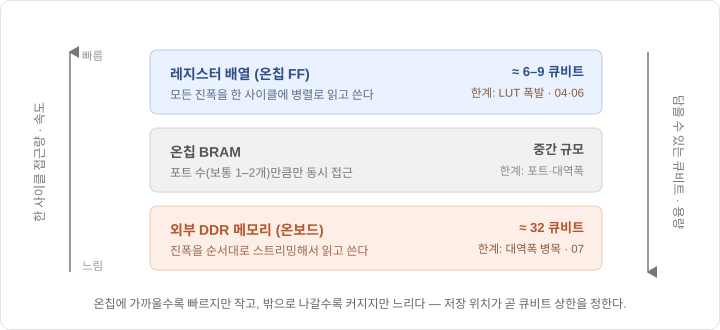
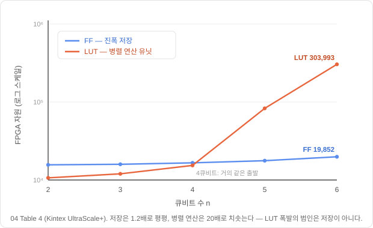

# 11장. 상태벡터 에뮬레이터 — 메모리 지도와 자원 예산

> [← 10장 용어정리와 치트시트](10_용어정리와_치트시트.md) · [목차](README.md) · [12장 진폭을 숫자로 →](12_고정소수점과_정밀도.md)
> **이 장을 읽기 위한 준비**: [1장 진폭·중첩](01_큐비트와_양자상태.md), [5장 텐서곱·$2^n$차원](05_다중큐비트와_얽힘.md), [9장 그로버](09_그로버_알고리즘.md). FPGA 기초 용어(LUT·FF·BRAM·DSP)는 [15.7절 하드웨어 용어집](15_논문지도와_설계결정표.md#157-하드웨어-용어집)에 모아 두었습니다.

---

10장까지 우리는 **양자 알고리즘이 수학적으로 무엇을 하는지**를 쌓아 올렸습니다. 이제 방향을 바꿉니다. 여기서부터(Part 5)는 그 알고리즘을 **고전 하드웨어(FPGA)로 흉내 내는 기계** — 이 프로젝트의 실제 목표물 — 를 짓는 이야기입니다. 새로 배우는 논문은 여섯 편이고, 이 장은 그 여섯 편이 공유하는 **가장 밑바닥 질문 하나**에서 출발합니다: *양자컴퓨터가 없는데 어떻게 양자 알고리즘을 "돌린다"는 걸까요?*

답은 의외로 단순합니다. 양자 상태는 결국 **숫자 배열**(진폭 벡터)이고, 게이트는 그 배열에 가하는 **산술 연산**입니다. 진짜 양자컴퓨터가 물리적으로 하는 일을, 고전 컴퓨터는 그 숫자 배열을 메모리에 펼쳐 놓고 계산으로 재현합니다. 이것이 **상태벡터 에뮬레이션**이고, 이 장은 그 원리와 — 더 중요하게 — 그 **대가**를 다룹니다. 대가를 알아야 왜 이 분야가 "몇 큐비트"에서 벽에 부딪히는지가 보이고, 우리 보드에서 그 대가가 정확히 몇 개의 블록램과 몇 사이클인지도 이 장에서 숫자로 확정합니다.

---

## 11.1 에뮬레이션·시뮬레이션·진짜 양자컴퓨터

세 단어가 자주 뒤섞여 쓰이니 먼저 정리하겠습니다. 07번 논문(El-Araby 외, IEEE TC 2023)의 용법을 따릅니다.

- **진짜 양자컴퓨터(quantum computer)**: 물리적 큐비트(초전도 회로·이온 등)가 실제로 중첩·얽힘·간섭을 겪습니다. 진폭은 어디에도 "저장"되지 않고 물리 상태 그 자체입니다.
- **시뮬레이션(simulation)**: 소프트웨어로 상태벡터를 계산합니다. 보통 CPU/GPU에서 Qiskit 같은 라이브러리로 돌립니다. 유연하지만 느립니다.
- **에뮬레이션(emulation)**: **전용 하드웨어(FPGA)** 로 상태벡터 계산을 회로 수준에서 가속합니다. 시뮬레이션과 하는 일(숫자 배열 계산)은 같지만, 소프트웨어가 아니라 **맞춤 데이터패스**로 처리한다는 점이 다릅니다.

셋 중 뒤의 둘은 **똑같이 고전 컴퓨터가 숫자 배열을 계산**합니다. 차이는 "얼마나 빠른 하드웨어로 하느냐"뿐입니다. 우리 프로젝트가 만드는 것은 세 번째 — **FPGA 에뮬레이터**입니다.

우리 것이 정확히 어떤 모양인지 먼저 못 박아 두겠습니다. 이 IP는 혼자 서는 칩이 아니라 **RVX SoC 안에 얹히는 가속기**입니다. 제어 레지스터(CSR)는 **APB 슬레이브**로 노출되어 RISC-V 코어가 명령·임계값·상태를 읽고 쓰고, 탐색 대상 데이터는 IP가 **AHB 마스터**가 되어 직접 실어 옵니다. 호스트 PC는 **UART** 너머에서 RISC-V 앱에게 명령을 보낼 뿐, 진폭 배열을 한 칸도 만지지 않습니다. 즉 연산은 전부 IP 안에서 끝나고 호스트는 시작·정지·결과 회수만 합니다(자세한 것은 [17장](17_RVX_SoC_통합.md)).

여기서 반드시 새겨야 할 사실 하나. 에뮬레이터는 양자컴퓨터가 아닙니다. **양자 이득($O(\sqrt N)$ 같은)을 물리적으로 누리지 못합니다.** 그로버 반복 한 번이 이미 진폭 $N$ 개를 두 번 훑으므로 총비용은 $O(N\sqrt{N/M})$ 이고, 이것은 같은 문제를 고전 프로그램이 배열 한 번 훑어 푸는 $O(N)$ 보다 **느립니다.** 이 사실을 흐리지 마십시오 — 우리 IP를 고전 선형 스캔과 나란히 놓고 속도를 자랑하는 문장은 이 해설서 어디에도 없습니다.

그럼 무엇과 비교해야 할까요. 같은 일을 하는 것, 즉 **상태벡터 시뮬레이터**입니다. 구체적으로는 Qiskit의 `AerSimulator` 나 NumPy로 짠 상태벡터 코드가 우리의 상대입니다. 그쪽도 진폭 $N$ 개를 메모리에 펼쳐 놓고 매 반복 전부 훑으니, 우리와 같은 $O(N\sqrt{N/M})$ 을 지불합니다. 다만 그 일을 범용 CPU의 명령어로 하느냐 전용 데이터패스로 하느냐가 다를 뿐이죠. 그리고 이 IP의 값어치는 애초에 속도 우위가 아니라, **양자 알고리즘의 동작을 결정적이고 재현 가능하게 재현·검증하는 전용 하드웨어**라는 데 있습니다. 같은 시드를 주면 같은 샷 수열과 같은 후보가 나오고, 진폭 배열은 언제든 덤프해 골든 모델과 비트 단위로 대조할 수 있습니다([18장](18_골든모델_검증.md)). 실기 양자에서는 둘 다 불가능한 일입니다.

한 가지 더 짚어 둘 것이 있습니다. 문헌에서 "FPGA로 양자를 다룬다"는 말은 사실 두 갈래로 갈립니다 — FPGA 자체가 양자컴퓨터 역할을 맡고 호스트 PC가 거기에 접속해 쓰는 방식과, 무거운 상태벡터 연산만 FPGA로 떼어내 가속하는 보조 가속기 방식입니다(Cicero 외 2025 서베이). 우리 IP는 뒤쪽입니다. 용어에는 주의가 필요합니다. 이 서베이는 앞의 것을 "emulation", 뒤의 것을 "acceleration"이라 불러, 07번을 따라 "emulation = FPGA 가속 시뮬레이션"으로 써 온 이 해설서와 이름이 정반대입니다. 문헌마다 같은 단어가 다른 것을 가리킬 수 있다는 것 자체가 새겨 둘 교훈입니다.

---

## 11.2 세 개의 배열 — amp·data·mask

9장에서 그로버의 시작 상태를 이렇게 썼습니다:

$$|\psi\rangle = H^{\otimes n}|0\rangle^{\otimes n} = \frac{1}{\sqrt N}\sum_{x=0}^{N-1}|x\rangle$$

수식으로는 우아하지만, 하드웨어는 이 켓을 이해하지 못합니다. 하드웨어가 아는 것은 **메모리에 담긴 숫자**뿐입니다. 그래서 에뮬레이터는 이 상태를 **진폭 배열**로 펼칩니다:

$$|\psi\rangle = \sum_{i=0}^{N-1}\alpha_i|i\rangle \;\longrightarrow\; \texttt{amp\_mem}[0..N-1] = [\alpha_0,\ \alpha_1,\ \dots,\ \alpha_{N-1}]$$

`amp_mem[i]` 는 기저 상태 $|i\rangle$ 의 진폭 $\alpha_i$ 를 담는 메모리 한 칸입니다. 균등중첩은 이 배열의 **모든 칸을 $\frac{1}{\sqrt N}$ 로 채우는 것**과 정확히 같습니다.

그런데 우리 IP에는 배열이 하나가 아니라 **셋**입니다. 우리가 푸는 문제가 추상적인 "표시된 상태 찾기"가 아니라 **메모리에 담긴 데이터 중 조건을 만족하는 인덱스 찾기**이기 때문입니다.

| 배열 | 워드 폭 | 깊이 | 담는 것 | 누가 건드리나 |
|---|---|:-:|---|---|
| `amp_mem` | **18b** (Q2.16) | $N$ | 진폭 $\alpha_i$ | INIT·오라클·확산이 **씁니다**. 측정은 읽기만 |
| `data_mem` | **16b signed** | $N$ | 탐색 대상 값 `value[i]` | 호스트가 적재. IP는 **읽기만** |
| `mask_mem` | **1b** | $N$ | 이미 찾은 답 표시 `found[i]` | 열거 모드에서 라운드마다 한 비트씩 |

진폭 폭을 왜 18비트로 잡았는지는 [12장](12_고정소수점과_정밀도.md)이 통째로 답합니다. 여기서는 배열이 셋이라는 사실과, 그중 진폭만 쓰기 대상이라는 사실만 기억해 두면 됩니다 — 뒤의 사실은 [16.5절](16_반복제어와_재개캐시.md#165-재개-캐시--측정이-읽기-전용이라는-사실에서) 재개 캐시의 근거가 됩니다.

이제 게이트가 배열 연산이 되는 모습을 봅니다. 9장에서 본 그로버 한 바퀴 $G = U_\psi U_f$ 는 이렇게 착지합니다.

**오라클 $U_f$.** 9장에서는 "정답 인덱스의 진폭을 뒤집는다"고 썼습니다. 그것은 답을 이미 아는 사람의 서술입니다. 우리 회로는 정답 인덱스를 **모릅니다.** 회로가 가진 것은 임계값과 술어뿐이고, 하는 일은 이것입니다:

$$\texttt{amp\_mem}[i] \;\leftarrow\; -\,\texttt{amp\_mem}[i] \quad \text{if } \mathrm{pred}\big(\texttt{data\_mem}[i],\ \texttt{thr}\big)$$

술어 $\mathrm{pred}$ 는 네 종류입니다 — `value < thr_a`, `value > thr_a`, `value == thr_a`, 그리고 범위 `thr_a < value < thr_b`. 조건을 만족하는 칸이 하나일 수도 수백 개일 수도 있고, 회로는 **몇 개인지조차 모른 채** 배열 전체를 훑으며 칸마다 판정합니다. 이 명제 — **오라클은 정답을 아는 회로가 아니라 조건을 판정하는 회로** — 는 해설서 전체를 관통하는 규율이고, [14.2절](14_다중정답과_최솟값탐색.md#142-오라클은-정답을-아는-회로가-아니다)에서 다시 정면으로 다룹니다. 술어가 실제로 어떤 게이트가 되는지는 [13.3절](13_오라클_확산_측정_데이터패스.md#133-oracle--술어-4종이-감산기-하나를-공유한다)입니다.

**확산 $U_\psi$.** 이쪽은 술어와 무관하게 전 칸에 똑같이 걸립니다 — 평균 중심 반사 `amp_mem[i] ← 2*mean - amp_mem[i]` 입니다. 인덱스를 가리지 않으므로 데이터를 볼 필요조차 없습니다.

즉 켓과 유니터리 행렬로 쓰던 모든 것이, 에뮬레이터에서는 **배열에 대한 산술**로 착지합니다. 이 "번역"이 Part 5 이후 전체의 뼈대입니다.

---

## 11.3 큐비트 하나 = 메모리 두 배

이 구조의 가장 중요한 성질은 **비용이 큐비트 수에 지수적**이라는 것입니다. 5장에서 $n$ 큐비트 상태가 $2^n$ 차원임을 배웠습니다. 진폭을 명시적으로 펼치면, 배열 크기가 곧 $N = 2^n$ 입니다:

| 큐비트 $n$ | 진폭 개수 $N=2^n$ |
|:---:|:---:|
| 4 | 16 |
| 10 | 1,024 |
| **15** | **32,768** ← 우리 목표 |
| 20 | 약 100만 |
| 30 | 약 10억 |

큐비트를 **하나** 늘릴 때마다 저장해야 할 진폭이 **두 배**가 됩니다. 진짜 양자컴퓨터라면 큐비트 하나를 추가하는 것이 상태공간을 두 배로 키우는 "공짜 지수 이득"이지만, 에뮬레이터에서는 정반대로 **메모리·연산이 두 배로 드는 지수 비용**입니다. 큐비트를 늘리는 것이 아니라 메모리를 지수적으로 늘리는 구조인 셈이고, 이것이 에뮬레이터가 넘을 수 없는 근본 한계입니다.

엄밀히 말하면 이 지수 벽은 물리 법칙이 아니라 **우리가 택한 방식의 대가**입니다. 복잡도 이론에는 진폭을 저장하는 대신 필요할 때마다 다시 계산해 메모리를 큐비트 수에 선형($O(s+t)$)으로 줄이는 공간–시간 맞바꿈이 알려져 있습니다(Frank 외 2009, SEQCSim). 다만 그 대가로 이번엔 **시간**이 지수로 폭발하고, 특히 그로버에는 자멸적입니다 — 확산이 매 반복 진폭 **전체**의 평균을 요구하므로 결국 모든 진폭이 동시에 필요하고, "한 번에 하나씩 재계산"하는 그 방식과 정면으로 충돌하기 때문입니다. 그래서 우리는 메모리를 지불하는 상태벡터 전개를 택합니다 — 벽을 다른 자원으로 옮길 수는 있어도, 그로버 가속기에서는 그 맞바꿈이 손해입니다.

그래서 이 분야의 모든 논문은 사실상 **"이 지수 벽을 몇 큐비트까지 미룰 수 있는가"** 의 경쟁입니다. 그리고 그 경쟁의 첫 갈림길이 바로 다음 절 — 진폭을 **어디에** 저장할 것인가입니다.

---

## 11.4 진폭을 어디에 둘 것인가

FPGA에는 숫자를 담을 그릇이 여러 종류이고, 어느 그릇을 고르느냐가 큐비트 상한을 결정합니다. 여섯 논문과 우리 설계는 사실상 세 진영으로 갈립니다.

| 저장 위치 | 누가 | 접근 방식 | 도달 큐비트 |
|---|---|---|:---:|
| **레지스터 배열**(FF/LUT) | 04, 06 | 모든 진폭을 온칩 레지스터에 — 한 사이클에 전부 병렬 접근 | **6** (04, Kintex) · **8~9** (06) |
| **온칩 BRAM** | **우리 IP** | 32개 뱅크로 쪼개 매 사이클 32칸씩 순차 스트리밍 | **15** |
| **외부 DDR 메모리** | 07 | 보드에 붙은 대용량 DRAM에 — 순차 스트리밍 | **32** |

세 진영의 차이는 **속도와 용량의 맞바꿈**입니다. 레지스터는 가장 빨라서(모든 칸을 같은 사이클에 읽고 씀) 연산을 극단적으로 병렬화할 수 있지만, FPGA에 레지스터는 적으므로 금방 바닥납니다. 외부 DDR은 수 GB로 방대하지만 한 번에 몇 워드씩만 읽어 와야 해서 순차 처리를 강요합니다. 07번 논문이 32큐비트라는 압도적 규모를 달성한 것은 순전히 **외부 DDR4를 썼기 때문**입니다(16GB DIMM × 4). 04·06이 한 자릿수 큐비트에 머문 것은 반대로 **전부 온칩 레지스터에 욱여넣었기 때문**이고요.

우리는 가운데를 골랐습니다. 그 이유가 이 장의 나머지를 지배하니 여기서 확실히 해 둡니다. **외부 DDR은 우리 설계에 아예 등장하지 않습니다.** 첫째, $n=15$ 라면 세 배열이 온칩에 전부 들어갑니다 — 넘치지 않는데 나갈 이유가 없고, DRAM 컨트롤러와 그 지연을 감출 버퍼 구조는 통째로 순수한 추가 비용입니다. 둘째, 그리고 이쪽이 더 결정적인데, 우리는 진폭만이 아니라 **데이터 배열까지** 온칩에 둬야 합니다. 오라클이 한 사이클에 32칸을 판정하려면 `value[i]` 32개가 `amp_mem` 32칸과 **같은 사이클에** 나와야 하기 때문입니다. 외부 DRAM 한 채널로는 그런 접근을 줄 수 없습니다.

그 대가로 우리는 용량 예산을 아주 빡빡하게 씁니다. $n=15$ 기준 실제 장부는 이렇습니다(값의 정본은 [15.4절](15_논문지도와_설계결정표.md#154-우리-프로젝트의-좌표--확정-설계-결정표)):

| 블록 | 구성 | RAMB18 | BRAM36 |
|---|---|--:|--:|
| `amp_mem` | 32뱅크 × 1024 × 18b | 32 | 16 |
| `data_mem` | 32뱅크 × 1024 × 16b | 32 | 16 |
| `mask_mem` | 1024 × 32b | 2 | 1 |
| **IP 계** | | | **33** |
| RVX SoC | Phase 0에서 실측 예정 | | ~15 |
| **합계** | | | **~48 / 75** |

보드는 Arty-S7-50(`xc7s50csga324-1`)이고 BRAM36이 **75개** 있습니다. 33개는 IP가, 15개 남짓은 SoC가 쓰고 나머지가 여유입니다. $n$ 을 하나만 더 올리면 배열이 두 배가 되어 IP만 66개를 먹으므로 SoC를 얹을 자리가 사라집니다 — **$n=15$ 가 이 보드의 천장**인 이유입니다.

> ⚠️ 여기서 흔히 하는 오해를 하나 짚고 갑니다. "레지스터에 두니까 자원(LUT)이 터진다"는 설명은 **틀렸습니다.** 다음 절이 이 오해를 데이터로 반박합니다.

---

## 11.5 레지스터의 진짜 대가

04번 논문은 큐비트를 늘리며 FPGA 자원 사용량을 실측했습니다. Kintex UltraScale+ 보드 기준으로, 4큐비트에서 6큐비트로 갈 때 두 자원이 이렇게 움직입니다:

| 자원 | 4큐비트 | 6큐비트 | 배율 |
|---|---:|---:|:---:|
| **FF**(플립플롭 = 저장) | 16,606 | 19,852 | **1.20배** |
| **LUT**(룩업테이블 = 연산 로직) | 15,386 | 303,993 | **19.8배** |

여기에 결정적인 교훈이 있습니다. 만약 자원 폭발의 원인이 "진폭을 레지스터에 저장하는 것"이라면, **저장을 담당하는 FF가 폭증해야 합니다.** 그런데 FF는 겨우 1.2배 늘었습니다. 폭증한 것은 **LUT** — 즉 **연산 로직**입니다.

진범은 저장이 아니라 **병렬 연산 유닛**입니다. 04번 논문은 $O(N)$ 짜리 연산(진폭 전체를 더하는 누산, 전체를 비교하는 측정 등)을 **한두 사이클에 끝내려고** 가산기·비교기·시프터를 $N$ 에 비례해 통째로 펼쳐 놓습니다. 큐비트가 하나 늘면 $N$ 이 두 배가 되고, 그만큼 연산 유닛도 두 배가 되어 LUT가 지수적으로 터지는 것입니다. 논문 스스로 "늘어난 연산 부담을 실행 시간이 아니라 하드웨어 자원으로 떠넘겼다"고 밝힙니다(이 맞바꿈은 11.7절에서 우리 선택과 나란히 놓고 다시 봅니다).

06번 논문(같은 연구실의 QAOA 에뮬레이터)이 이 현상을 더 선명하게 보여줍니다. 8~9큐비트에서 한계에 부딪히는데, 그 시점에 **DSP(곱셈기)는 전체의 3.8%밖에 안 쓰고** LUT가 먼저 100%를 넘겨 버립니다. 곱셈 자원은 텅텅 비었는데 연산 로직 배선이 바닥난 것이죠.

이 구분이 왜 중요할까요? 우리가 만약 "레지스터 대신 BRAM에 두면 자원이 해결된다"고 착각하면 헛다리를 짚게 되기 때문입니다. BRAM에 두는 진짜 효과는 **저장 압박 해소**가 아니라, 진폭을 한꺼번에 병렬 접근할 수 없게 만들어 **연산을 순차화하도록 강제**하는 것입니다 — 그래서 병렬 유닛이 줄고 LUT가 회수됩니다. 대가는 속도(사이클 수 증가)이고요. 즉 저장 위치 선택은 **저장 용량 문제가 아니라 병렬성 예산 문제**입니다.

---

## 11.6 memory-bound의 두 얼굴 — 용량과 포트

07번 논문의 핵심 주장이자 이 분야를 관통하는 진단입니다. **memory-bound(메모리 바운드)** 란, 계산의 속도가 산술 능력이 아니라 **메모리에서 데이터를 꺼내 오는 능력**에 발목 잡힌 상태를 뜻합니다.

비유하자면 이렇습니다. 요리사(연산 유닛)를 아무리 늘려도, 재료(진폭)를 냉장고(메모리)에서 꺼내 오는 문 하나가 좁으면 요리 속도는 그 문이 결정합니다. 에뮬레이터에서 확산 한 번은 진폭 $N$ 개를 전부 읽어야 하는데, $N$ 이 지수적으로 크니 결국 "진폭을 얼마나 빨리 실어 나르느냐"가 전체 속도를 지배합니다. 곱셈기(DSP)를 더 넣는 것은 요리사만 늘리는 헛수고인 경우가 많습니다 — 06번에서 DSP가 3.8%만 쓰인 것도 같은 이야기입니다.

이 진단에 대한 최근의 응답은 "대역폭 자체를 높이자"입니다. 07번이 외부 DDR4에서 "memory-bound다"로 멈춘 지점을, 2026년 C-DAC의 Alveo U55C 구현(Tiwari 외)은 한 걸음 더 밀어붙입니다 — DDR4보다 약 10배 빠른 **HBM**(고대역폭 메모리, 460 GB/s)을 16개 뱅크로 나누고, 진폭 $i$ 를 `i mod 16` 번째 뱅크에 흩뿌려(연속된 진폭을 서로 다른 뱅크로) 병렬로 읽습니다. 이렇게 30큐비트(진폭 약 10.7억 개, 8 GB)를 단일 FPGA에서 돌렸습니다. 특히 눈길을 끄는 것은 이들이 관측한 **성능 절벽**입니다 — 12큐비트에서 13큐비트로 넘어가는 순간 상태벡터가 온칩 BRAM을 넘쳐 HBM으로 밀려나며 실행 시간이 81% 튑니다. 11.4에서 개념으로만 이야기한 "저장 계층의 경계"가 실측 그래프에 그대로 찍힌 셈입니다. (다만 이 논문은 그로버 전용이 아닌 범용·복소수 시뮬레이터이고 아직 비심사 preprint이며, 큐비트 수 자체는 07번의 32를 넘지 않습니다 — 새로운 것은 규모가 아니라 HBM이라는 저장 계층과 뱅크 병렬 구조입니다.)

그렇다면 우리는 어떨까요. 우리는 외부 메모리를 아예 쓰지 않으므로 **대역폭은 병목이 아닙니다.** 온칩 BRAM은 요청한 사이클에 답을 줍니다. 그 대신 memory-bound가 두 개의 다른 얼굴로 나타납니다.

**첫째는 용량 천장입니다.** 세 배열이 BRAM36 33개를 먹고 보드에는 75개뿐이며 SoC도 제 몫을 씁니다(11.4). 큐비트 하나가 메모리 두 배이므로 $n=16$ 은 곧바로 66개, 예산 밖입니다. 07번이 "온칩 자원에만 의존해서 2~7큐비트에 갇혔다"고 지적한 그 벽 앞에 우리도 서 있습니다. 다만 데이터패스를 얇게(18비트) 잡고 뱅크를 알뜰히 채워 15까지 밀어 올린 것뿐이고, **$n$ 의 상한을 정하는 것은 연산 회로가 아니라 메모리 용량**이라는 구조는 똑같습니다.

**둘째는 포트 천장입니다.** 블록램 하나에는 포트가 둘뿐입니다. 한 사이클에 32칸을 읽고 싶으면 방법이 하나뿐입니다 — 배열을 32개의 독립된 블록으로 쪼개는 것. 즉 우리 병렬도 $P$ 의 상한을 정하는 것도 가산기 개수나 DSP가 아니라 **메모리 포트 수**입니다. "곱셈기를 늘려도 소용없다"는 07번의 진단이 우리 조건에서는 **"레인을 늘리려면 뱅크를 늘려야 하고, 뱅크는 BRAM 개수로 값을 치른다"** 로 번역됩니다. 다음 절이 그 계산입니다.

---

## 11.7 병렬도 P와 뱅킹

우리 IP는 한 사이클에 진폭 **$P = 32$ 개**를 처리합니다. 그러려면 `amp_mem` 과 `data_mem` 이 각각 32개 뱅크로 쪼개져 있어야 하고, 인덱스를 뱅크와 주소로 나누는 규칙이 필요합니다. 규칙은 가장 단순한 것을 씁니다 — **인덱스의 하위 5비트가 뱅크 번호, 상위 10비트가 뱅크 내 주소**입니다($n=15$):

$$i = \underbrace{\texttt{addr}[9{:}0]}_{\text{뱅크 내 주소}} \ \Vert\ \underbrace{\texttt{bank}[4{:}0]}_{\text{뱅크 선택}}$$

이렇게 잘라 두면 사이클 $c$ 에 32개 뱅크가 **모두 같은 주소 $c$** 를 읽습니다. 주소 생성기는 카운터 하나면 되고, 두 레인이 같은 뱅크를 동시에 원하는 일이 원리적으로 일어나지 않으니 **뱅크 충돌이 0**입니다.

이 "충돌 0"이 공짜가 아니라는 것은 다른 시뮬레이터를 보면 압니다. 범용 게이트 시뮬레이터는 임의의 큐비트에 임의의 게이트를 걸어야 하므로 진폭을 뱅크 사이로 **재배치**해야 하고, 그러려면 크로스바나 순열망이 필요합니다. Belfore(2024)의 확장형 FPGA 아키텍처는 그 **Beneš 순열망 하나에 전체 로직의 36%** 를 씁니다. 우리는 그 36%를 통째로 쓰지 않습니다. 그로버의 두 연산이 둘 다 인덱스 순서를 건드리지 않는 **순차 스트리밍**이기 때문입니다 — 오라클은 인덱스 $i$ 의 진폭을 인덱스 $i$ 의 데이터로 판정하고, 확산은 모든 칸에 같은 값을 적용합니다. 알고리즘의 규칙성이 곧바로 로직 예산으로 환산되는, 이 프로젝트에서 가장 값싸게 얻은 이득입니다.

뱅킹은 자원 계산도 바꿉니다. [12.8절](12_고정소수점과_정밀도.md#128-데이터-워드와-bram-환산)의 표는 **용량**만 센 것이었는데, 실제로 잡히는 블록램 개수는 배열을 몇 갈래로 쪼갰느냐가 함께 정합니다. `amp_mem` 뱅크 하나는 $1024 \times 18\text{b}$ 이고 이것이 RAMB18 한 개에 정확히 들어맞아 32개, `data_mem` 도 뱅크당 $1024 \times 16\text{b}$ 로 32개입니다. 여기서 재미있는 일이 생깁니다 — **$n$ 을 12~14로 낮춰도 BRAM36은 32개로 같습니다.** 뱅크당 깊이가 512칸·256칸·128칸으로 줄 뿐 뱅크 **개수**는 여전히 32개라, 블록램을 절반만 채운 채 그대로 32개를 물고 있기 때문입니다. 자원 계산을 지배하는 것이 $N$ 이 아니라 $P$ 인 구간인 셈이고, 자원까지 아끼며 축소하려면 $n$ 이 아니라 **$P$ 를 함께 낮춰야** 합니다.

마지막으로 04번 논문과의 거리를 재 두겠습니다. 11.5에서 본 04번의 전략은 연산 유닛을 **$N$ 에 비례해 펼치는 것**이었습니다. $N \le 64$($n \le 6$)에서만 성립하는 아키텍처입니다. $n=15$ 에 그대로 적용하면 가산기·비교기를 32,768벌 펼치라는 뜻이고, LUT 19.8배 곡선을 그대로 연장하면 어떤 FPGA로도 불가능합니다. 우리는 정반대를 택했습니다 — 유닛을 $N$ 이 아니라 **상수 $P = 32$ 개**만 두고 배열을 $N/P$ 사이클에 걸쳐 흘려 보냅니다. 그러면 로직 자원은 $n$ 에 **무관하게 일정**하고, 늘어나는 것은 시간뿐입니다. 04번이 시간을 자원으로 바꿨다면 우리는 자원을 시간으로 되바꾼 것이고, 그 시간이 얼마인지가 다음 절입니다.

---

## 11.8 사이클 비용 모델

$P = 32$ 를 정하고 나면 이 IP의 시간은 전부 **패스** 단위로 셀 수 있습니다. 패스 하나는 배열을 처음부터 끝까지 한 번 훑는 것이고, 길이는 $N/P$ 입니다.

| 단위 | 사이클 ($n=15$ · $P=32$) | 근거 |
|---|--:|---|
| 패스 1회 (배열 한 번 훑기) | $N/P$ = **1,024** | 뱅크당 1,024칸 |
| INIT 1회 | 1,024 | [13.2](13_오라클_확산_측정_데이터패스.md#132-init--1n을-제곱근기-없이) |
| **그로버 반복 1회 = 2패스** | **2,048** | [13.6](13_오라클_확산_측정_데이터패스.md#136-왜-2패스인가) |
| 측정 1회 (2단 병렬) | 2,080 | [14.5](14_다중정답과_최솟값탐색.md#145-2단-병렬-측정) |

반복 하나가 왜 하필 두 패스인지는 [13.6절](13_오라클_확산_측정_데이터패스.md#136-왜-2패스인가)의 주제입니다. 짧게만 적으면, 확산이 요구하는 평균은 **모든 진폭을 다 더해야** 나오므로 "전부 읽어 더하는 패스"와 "그 값으로 되쓰는 패스"가 순서상 겹칠 수 없습니다. 오라클은 이 모델에서 **별도의 항이 아닙니다** — 1패스가 진폭을 읽어 되쓰는 김에 술어 판정 결과대로 부호를 뒤집으므로 사이클을 더 쓰지 않습니다.

여기까지가 **한 샷** 안쪽의 비용입니다. 그런데 그로버는 몇 번 돌릴지를 미리 알 수 없고(정답 개수 $M$ 을 모르기 때문입니다), 그래서 실제 실행 시간에는 **샷 수가 곱해집니다.** 이 곱셈이 [16장](16_반복제어와_재개캐시.md)의 주제입니다. 결과만 미리 적어 두면, $n=15$ · $M=1$ 에서 평균 **24.5샷**(몬테카를로 20,000회)이 들고, 재개 캐시를 켠 총비용이 **362패스 ≈ 370,812 사이클**, 100 MHz에서 **약 3.7 ms** 입니다. 진폭 32,768칸을 수백 번 훑고도 밀리초 단위에 끝난다는 뜻이고, 동시에 이 숫자가 "고전 스캔 1,024사이클"보다 훨씬 크다는 사실도 함께 봐야 합니다(11.1). 우리가 파는 것은 속도가 아닙니다.

---

## 11.9 에뮬레이터가 실기보다 쉬운 것들

에뮬레이터는 진짜 양자컴퓨터의 흉내이지만, 어떤 면에서는 **진짜보다 훨씬 편합니다.** 실기 양자에서 값비싼 여러 연산이, 고전 배열 계산에서는 공짜에 가깝기 때문입니다. 이 역설은 응용 논문(08·09)을 읽을 때 특히 중요하니 미리 정리해 둡니다.

- **위상 반전.** 실기에서 특정 기저 상태의 위상만 뒤집으려면 다중 큐비트 제어 $Z$ 게이트가 필요하고, 이는 큐비트 수가 늘수록 비싸집니다(08번 논문이 다루는 일반화된 위상 반전은 별도의 보조 회로 블록까지 요구합니다). 에뮬레이터에서는 부호를 뒤집는 2의 보수 negate 한 줄이 전부입니다([13.4절](13_오라클_확산_측정_데이터패스.md#134-부호-반전--2의-보수-negate-한-번)). 다만 "그래서 1사이클에 끝난다"고 쓰면 틀립니다 — 우리 오라클은 정답 인덱스를 모르므로 **$N$ 칸을 전부 훑으며 술어를 판정**해야 하고, 32레인으로도 $N/P$ = 1,024 사이클입니다. 정확한 서술은 "게이트 비용이 사라지고 스캔 비용만 남는다"이고, 그 스캔이 확산의 누산 패스와 같은 패스라 **오라클이 따로 더 쓰는 사이클은 없습니다**(11.8).
- **되돌리기(uncomputation).** 실기에서는 보조 큐비트를 쓴 뒤 얽힘을 풀려고 회로를 **역순으로 다시 실행**해야 합니다(09번 논문의 오라클은 $A_f\to N_f\to U_\delta$ 를 걸고 다시 역순으로 풀어 회로 깊이가 두 배가 됩니다). 에뮬레이터에서는 그냥 배열을 **덮어쓰면** 끝이라 되돌리기 자체가 불필요합니다.
- **보조 큐비트(ancilla)와 위상 킥백.** 7장에서 본 위상 킥백은 $|-\rangle$ 상태의 보조 큐비트가 있어야 성립합니다. 실기에서는 이 보조 큐비트를 실제로 마련하고 관리해야 하지만, 에뮬레이터에서는 "부호를 뒤집는다"는 **결과만 배열에 직접 쓰면** 되므로 보조 큐비트가 필요 없습니다.
- **상태 초기화.** 07번 논문은 논문의 **절반가량을 "고전 데이터를 양자 상태로 싣는(Classical-to-Quantum, C2Q)" 문제**에 씁니다. 임의의 데이터를 진폭으로 인코딩하는 회로가 알고리즘 본체보다 깊어질 만큼 어려운 문제이기 때문입니다. 그런데 그로버의 초기 상태는 **균등중첩** — 모든 칸을 같은 값으로 채우는 `memset` 한 번입니다. 그로버는 이 최대 난제를 **구조적으로 우회**합니다.
- **중간 상태 관찰.** 실기에서 계산 도중 상태를 들여다보면 측정이 되어 중첩이 붕괴합니다(4장). 에뮬레이터에서는 배열을 언제든 덤프해 볼 수 있어 디버깅이 자유롭고, 이것이 11.1에서 말한 "검증 가능성"의 실체입니다.

---

## 11.10 에뮬레이터가 숨기는 것

편한 만큼 위험도 있습니다. 에뮬레이터는 실기의 **게이트 비용을 왜곡**합니다. 방금 본 것처럼 다중 큐비트 $Z$ 게이트가 에뮬레이터에서는 XOR 한 줄로 보이니, 실기라면 엄청나게 비쌀 회로가 값싸 보입니다. 그래서 **에뮬레이터로 "알고리즘의 논리가 맞다"는 것은 검증할 수 있어도, "이 회로가 실기에서 실현 가능하다"는 것은 검증하지 못합니다.** 에뮬레이터가 재현하는 것은 알고리즘의 수학이지 물리적 게이트 예산이 아닙니다.

그리고 이 역설에는 **반대 방향**도 있습니다. 실기에서 값싼 트릭이 에뮬레이터에서는 오히려 손해가 되는 경우입니다. 08번 논문(Byrnes 외, PRL 2018)은 확산 연산을 여러 정답 상태로 **일반화**한 $G = I - 2P_S$ 를 제안합니다. 실기 양자에서는 이 일반화가 게이트를 아껴 주는 좋은 아이디어입니다. 하지만 에뮬레이터에서 이 일반화된 사영 $P_S$ 를 계산하려면 $N$ 개 상태 각각에 대해 $D$ 차원 내적을 해야 해서 $O(N\cdot D)$ 짜리 곱셈-누산과 $N\cdot D$ 워드의 추가 저장이 듭니다 — **순수한 손해**입니다.

그래서 08번 논문의 일반화 확산은 우리에게 **구현 대상이 아니라, "왜 우리는 표준 확산 하나($a\mapsto 2\bar a - a$)를 고수하는가"의 근거**입니다. 표준 확산은 곱셈 없이 누산·시프트·뺄셈만으로 끝나거든요([13.5절](13_오라클_확산_측정_데이터패스.md#135-diffusion--2mean--amp가-회로가-되는-순간)·[13.8절](13_오라클_확산_측정_데이터패스.md#138-곱셈기는-어디에-있고-어디에-없는가)).

**한 문장으로: 실기 양자에서 싼 것이 에뮬레이터에서 비싸고, 그 반대도 참입니다.** 이 감각을 갖고 논문을 읽어야, 어떤 아이디어를 우리 설계에 가져오고 어떤 것을 버릴지 판단할 수 있습니다.

---

## 11.11 이 장의 요약

- **에뮬레이터**는 상태벡터를 숫자 배열로 펼쳐 고전 하드웨어로 계산하는 기계입니다. 양자 이득을 누리지 못하며, 총비용 $O(N\sqrt{N/M})$ 은 고전 선형 스캔보다 **느립니다.** 비교 대상은 Qiskit `AerSimulator`·NumPy 상태벡터 시뮬레이터이고, 값어치는 속도가 아니라 **결정적·재현 가능한 검증**에 있습니다.
- 우리 IP는 **RVX SoC의 APB 슬레이브(CSR) + AHB 마스터(DMA)** 이고, 호스트 PC는 UART 너머에서 명령만 내립니다([17장](17_RVX_SoC_통합.md)).
- 배열은 셋입니다 — `amp_mem`(18b, 쓰기 대상) · `data_mem`(16b signed, 읽기 전용) · `mask_mem`(1b, 열거용). 오라클은 `amp[i] ← −amp[i] if pred(value[i], thr)` 이고 **정답 인덱스를 모릅니다.**
- 큐비트 하나 = 메모리 두 배. 세 배열이 BRAM36 **33개**, RVX까지 **약 48/75** — 그래서 **$n=15$ 가 Arty-S7-50의 천장**입니다.
- "레지스터라서 자원이 터진다"는 **틀렸습니다.** FF는 1.20배, LUT는 19.8배 — 진범은 저장이 아니라 **병렬 연산 유닛**입니다. 저장 위치 선택은 용량 문제가 아니라 **병렬성 예산** 문제입니다.
- 우리의 **memory-bound는 대역폭이 아닙니다.** (a) BRAM 용량 천장 = $n=15$, (b) 블록램 포트 수 = $P$ 의 상한 — 두 얼굴로 나타납니다.
- **$P = 32$**, 인덱스 하위 5비트로 뱅크 선택. 순차 스트리밍이라 **충돌 0**이고, 범용 시뮬레이터가 로직 36%를 쓰는 **Beneš 순열망을 통째로 회피**합니다. $n$ 을 12~14로 낮춰도 BRAM36은 32개로 같습니다($P$ 가 지배).
- **비용 모델**: 패스 = $N/P$ = 1,024, 반복 = 2패스 = **2,048 사이클**, 측정 = 2,080. 여기에 샷 수가 곱해집니다 — $n=15$·$M=1$ 이면 평균 24.5샷, 캐시 적용 시 약 **3.7 ms @100 MHz**([16장](16_반복제어와_재개캐시.md)).
- 에뮬레이터는 실기의 여러 난제(다중 $Z$, uncompute, ancilla, C2Q 초기화)를 **공짜로** 우회하지만, 실기의 게이트 비용도 **숨깁니다.** 그리고 반대로, 08의 일반화 확산처럼 실기에서 좋은 트릭이 에뮬레이터에서는 손해가 되기도 합니다.

다음 장에서는 배열의 각 칸 — 진폭 하나 — 를 **실제로 몇 비트의 어떤 숫자로 담을 것인가**를 파고듭니다. 고정소수점과 Q2.16, 즉 이 데이터패스의 가장 실무적인 첫 결정입니다.

---

> [← 10장 용어정리와 치트시트](10_용어정리와_치트시트.md) · [목차](README.md) · [12장 진폭을 숫자로 →](12_고정소수점과_정밀도.md)
