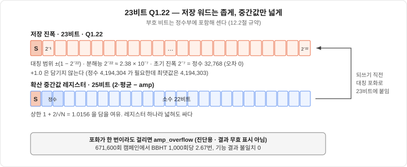
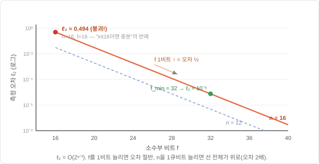

# 12장. 진폭을 숫자로 — 고정소수점과 Q1.22

> [← 11장 상태벡터 에뮬레이터](11_상태벡터_에뮬레이터.md) · [목차](README.md) · [13장 곱셈기 없는 산술 →](13_오라클_확산_측정_데이터패스.md)
> **이 장을 읽기 위한 준비**: [1장 진폭·정규화](01_큐비트와_양자상태.md), [4장 Born 규칙](04_양자측정.md), [11장 상태벡터 에뮬레이터](11_상태벡터_에뮬레이터.md).

---

11장에서 상태벡터를 배열 `amp[0..N-1]` 로 펼쳤습니다. 그런데 배열의 한 칸에 진폭 $\alpha_i$ 를 담으려면 **결국 몇 비트짜리 어떤 숫자 형식으로 담을지**를 정해야 합니다. 이것이 FPGA 에뮬레이터 설계자가 마주하는 가장 실무적인 첫 결정입니다. 비트를 너무 적게 잡으면 오차가 쌓여 정답이 흐려지고, 너무 많이 잡으면 메모리와 로직을 낭비합니다(11장에서 봤듯 진폭 비트 폭은 곧 메모리 폭이니까요).

결론부터 적어 둡니다. 우리 진폭 한 칸은 **23비트 고정소수점, Q1.22**입니다. 반올림은 round-half-to-even, 넘치면 대칭 포화, 노름 재정규화는 하지 않습니다. 계산 도중의 중간값만 더 넓은 레지스터에서 다루고, 메모리에 되쓸 때 23비트로 붙입니다. 이 장은 그 결정 하나하나가 **무엇을 재서** 나왔는지를 따라갑니다(값의 정본은 [15.4절 설계 결정표](15_논문지도와_설계결정표.md#154-우리-프로젝트의-좌표--확정-설계-결정표)).

길잡이가 되는 것은 두 편의 중앙대 연구실 논문입니다. 04번(Choi & Lee, 2024)은 "고정소수점으로 하자, Q1.30으로"라는 **선택**을 내렸고, 05번(Choi 외, QIP 2026)은 "그럼 소수부는 정확히 몇 비트여야 하는가"라는 **이론**을 세웠습니다. 우리는 둘 중 어느 쪽 숫자도 그대로 쓰지 않는데, 왜 그런지가 이 장의 절반입니다.

---

## 12.1 왜 부동소수점을 안 쓰는가

프로그래밍에서 소수를 다룰 때 우리는 보통 `float`·`double` 같은 **부동소수점(floating-point)** 을 씁니다. 소수점 위치가 "떠다니며" 아주 큰 수와 아주 작은 수를 모두 표현하죠. 편리하지만, 하드웨어로 만들면 **비쌉니다.** 부동소수점은 숫자를 $\text{가수}\times 2^{\text{지수}}$ 로 쪼개 저장하기 때문에, 덧셈 한 번에도 지수를 맞추고(정렬) 결과를 다시 정규화하고 반올림하는 부수 작업이 딸려 옵니다.

04번 논문은 이 비용을 정확히 셉니다. 부동소수점 **덧셈 한 번**은 내부적으로 실수덧셈 4회 + 비교 4회 + 시프트 3회를 요구하고, **곱셈 한 번**은 실수덧셈 4 + 실수곱 1 + 비교 4 + 시프트 2 + XOR 1이 필요합니다. 반면 **고정소수점**은 같은 덧셈이 그냥 정수 덧셈 1회, 2의 거듭제곱 곱은 시프트 1회로 끝납니다. 에뮬레이터는 확산 한 번에 진폭 $N$ 개를 전부 더하고 빼므로(13.5절), 이 상수 배의 차이가 $N$ 에 곱해져 자원·전력·지연으로 고스란히 나타납니다.

우리에게는 이유가 하나 더 있습니다. 13.8절에서 보겠지만 이 IP의 확산·오라클·초기화 경로에는 **곱셈기가 하나도 없습니다** — 전부 덧셈·뺄셈·시프트뿐입니다. 부동소수점을 택하는 순간 그 결론은 성립하지 않습니다. 정렬과 정규화가 곧 가변 시프트와 우선순위 인코더를 뜻하고, 그것이 128개 레인마다 하나씩 붙기 때문입니다.

---

## 12.2 고정소수점과 Q포맷 명명 규약

**고정소수점(fixed-point)** 은 이름 그대로 소수점 위치를 **한 자리에 못 박아** 두는 방식입니다. 소수점이 떠다니지 않으므로 정렬·정규화가 필요 없고, 숫자를 그냥 **정수처럼** 다루되 "이 정수의 아래 $f$ 비트는 소수부"라고 약속만 해 두면 됩니다.

일상의 비유를 들면, 돈을 다룰 때 우리는 12,345원을 굳이 $1.2345\times 10^4$ 로 쓰지 않습니다. 그냥 "원" 단위 정수로 적고 소수점은 생각하지 않죠. 고정소수점도 똑같습니다. 예를 들어 아래 22비트를 소수부로 약속하면, 메모리에 저장된 정수 $2{,}097{,}152$ 는 실제로는 $2^{21}/2^{22} = 0.5$ 를 뜻합니다. 소수점은 "약속" 속에만 있고 하드웨어는 정수 연산만 합니다.

이 약속을 **Q포맷**으로 표기합니다. `Q<정수부비트>.<소수부비트>` 꼴입니다. 그런데 여기에 문헌마다 갈리는 함정이 있습니다 — **부호 비트를 정수부에 넣어 세는 곳과 따로 빼는 곳이 있어서**, 똑같은 32비트 워드가 어디서는 Q1.30으로, 어디서는 Q2.30으로 적힙니다.

이 해설서는 이 혼란을 하나로 못 박습니다. **부호 비트는 정수부에 포함합니다.** 따라서 Q$i$.$f$ 의 워드 폭은 언제나 $i + f$ 이고, 표현 범위는 $[-2^{\,i-1},\ 2^{\,i-1} - 2^{-f}]$, 분해능은 $2^{-f}$ 입니다.

이 규약으로 우리 설계를 적으면 이렇게 됩니다. 진폭 워드 폭은 $DW = 23$ 비트, 소수부는 $f = 22$ 비트, 그래서 **Q1.22** — 부호 1 + 소수 22이고, 정수부에 부호 말고는 아무것도 없습니다. 2의 보수 23비트의 표현 범위는 $[-1,\ 1 - 2^{-22}]$ 이고 분해능은 $2^{-22} \approx 2.38\times 10^{-7}$ 입니다. 여기서 한 가지를 눈여겨보십시오 — **$+1.0$ 은 담기지 않습니다.** 정수로 $2^{22} = 4{,}194{,}304$ 가 필요한데 23비트 2의 보수의 최댓값은 $4{,}194{,}303$ 입니다. 우리는 여기에 한 칸을 더 버려, 음수 쪽 끝 $-4{,}194{,}304$ 도 쓰지 않고 **$[-4{,}194{,}303,\ +4{,}194{,}303]$ 의 대칭 범위**만 합법 값으로 둡니다. 왜 그런지는 12.5절과 13.4절에서 드러납니다.

04번 논문의 표기도 이 규약으로 옮겨 읽어야 합니다. 논문은 32비트 워드를 "Q1.30"이라 부르는데, 이는 부호를 밖으로 뺀 표기입니다. 우리 규약으로는 **Q2.30**(부호 1 + 정수 1 + 소수 30 = 32비트)입니다. 앞으로 Q표기를 만나면 **"정수부 숫자 + 소수부 숫자 = 워드 폭"이 성립하는지** 확인하십시오. 성립하지 않으면 부호를 따로 센 표기입니다. 이 사소해 보이는 구분이 메모리 예산 계산에서 비트를 한 칸씩 어긋나게 만듭니다.

마지막으로 이 규약이 곧바로 쓰이는 상수 하나. 초기 균등중첩의 진폭은 $1/\sqrt N$ 인데, $n = 14$ 이면 $1/\sqrt{16384} = 1/128 = 2^{-7}$ 로 **2의 거듭제곱**입니다. Q1.22 정수로는 $2^{22}/2^{7} = \mathbf{32{,}768}$ 이고, 반올림이 전혀 없는 **정확한** 값입니다. 초기화란 배열 16,384칸을 전부 32,768로 채우는 일입니다(13.2절).

---

## 12.3 정수부는 몇 비트인가 — 재는 대상이 셋이다

정수부를 몇 비트로 잡을지는 **표현할 수 있어야 하는 최댓값**이 정합니다. 그런데 여기서 초보자가 거의 반드시 미끄러지는 지점이 있습니다. 데이터패스가 만들어 내는 값이 **한 종류가 아니라 셋**이고, 셋의 최댓값이 서로 다르다는 것입니다.

**(a) 배열에 저장되는 진폭.** 4장 Born 규칙에서 측정 확률은 $|\alpha_i|^2$ 이고 전체 확률의 합이 1이므로, 어떤 진폭도 $|\alpha_i|\le 1$ 입니다. 여기까지만 보면 정수부는 $\pm 1$ 근방만 담으면 되니 **부호 비트 하나로 충분**해 보입니다. 04번이 정수부를 1비트로 잡고 남는 30비트를 전부 소수부로 몰아준 것이 이 논리입니다.

**(b) 확산 도중에 만들어지는 중간값 $2\bar a - \alpha_i$.** 그런데 진폭은 메모리에 가만히 있는 것이 아니라 매 반복 평균 중심 반사를 거칩니다. 그 결과값의 상한을 재 보면 이렇습니다. 코시–슈바르츠 부등식으로 평균의 크기는

$$|\bar a| = \frac{1}{N}\left|\sum_i \alpha_i\right| \le \frac{1}{N}\sqrt{N}\sqrt{\sum_i \alpha_i^2} = \frac{1}{\sqrt N}$$

이고 $|\alpha_i| \le 1$ 이므로

$$\left|2\bar a - \alpha_i\right| \le 1 + \frac{2}{\sqrt N}$$

**이 값은 1을 넘을 수 있습니다.** 넘는 폭이 크지는 않습니다 — $n=14$ 면 $2/\sqrt{16384} = 2/128 = 0.0156$ 이니 상한이 1.0156입니다. 하지만 Q1.22의 천장은 $1 - 2^{-22}$ 이라, 이 값을 23비트 워드에 그대로 담을 수는 없습니다.

**(c) 전체 합을 담는 누산기 $\sum_i \alpha_i$.** 평균을 구하려면 먼저 $N$ 개를 다 더해야 합니다. 최악의 경우 자릿수가 $\log_2 N = n$ 비트만큼 늘어납니다.

정수부 폭을 하나만 정해서 셋에 다 쓰겠다는 발상이 틀린 것입니다. **재는 대상이 다르면 필요한 폭도 다릅니다.** 그래서 우리 데이터패스는 셋을 따로 잡습니다.

| 값 | 폭 | 이유 |
|---|--:|---|
| 저장 진폭 (a) | **23비트** (Q1.22) | 수학적으로 $\lvert\alpha\rvert \le 1$. 메모리에 들어가는 유일한 값 |
| $2\bar a$ 와 확산 중간값 (b) | **25비트** | 상한 1.0156 을 넉넉히 담는 레지스터. 되쓸 때 23비트로 대칭 포화 |
| 합 누산기 (c) | **39비트** | $ACCW = DW + n + 2 = 23 + 14 + 2$ |

(b)를 어떻게 처리하느냐가 이 절의 핵심 결정입니다. 길은 둘입니다. 저장 워드 자체에 정수 비트를 하나 더 두는 길(Q2.22, 24비트)과, 저장 워드는 Q1.22 로 두고 **중간값만 넓은 레지스터에서 계산한 뒤 되쓸 때 포화시키는** 길입니다. 우리 RTL은 뒤를 택했습니다. 근거는 셋입니다.

첫째, **되쓰는 값은 수학적으로 1을 넘지 않습니다.** $2\bar a - \alpha_i$ 의 상한 $1 + 2/\sqrt N$ 은 코시–슈바르츠가 주는 느슨한 한계일 뿐이고, 확산을 마친 값은 정확한 산술에서 여전히 단위벡터의 성분입니다 — 그로버 반복은 유니터리이기 때문입니다(9장). 1을 넘는 양은 반올림이 만든 몇 LSB 뿐이고, 그것도 정답 진폭이 1에 거의 닿는 반복 수에서만 생깁니다. 둘째, 중간값은 **레지스터 하나**라 두 비트 넓히는 비용이 미미하지만, 저장 워드를 넓히면 그 비용이 진폭 배열 전체와 체크포인트 슬롯 전부에 곱해집니다. 셋째, 그리고 결정적으로 **실측이 뒷받침합니다.** 같은 산술(Q14 · Q1.22 · 같은 반올림과 포화 규칙)로 돌린 2026-08 골든 모델 캠페인 671,600회에서 포화가 걸린 경우는 이렇습니다([단일검색 상세분석 9.5절](../design_references/단일검색_Q14_Q16_671600회_상세분석.md)).

| 탐색 | 실행 | 포화 이벤트 | 1,000회당 |
|---|--:|--:|--:|
| 수동 $j$ (최적 반복 근처를 일부러 포함) | 41,280 | 2,520 | 61.05 |
| BBHT Normal | 137,600 | 368 | 2.67 |
| BBHT 체크포인트 | 137,600 | 368 | 2.67 |

포화가 일어나도 **기능 결과가 달라진 경우는 0**이었고, Normal과 체크포인트의 포화 수가 똑같다는 것은 두 경로가 같은 상태를 지난다는 추가 증거입니다. 포화는 조용히 넘어가지 않고 `amp_overflow` 라는 끈적이 상태 비트로 남습니다(12.5절). 진단용이지 결과 무효 표시가 아닙니다.

정직하게 덧붙이면, 이 선택이 BRAM을 아낀 것은 아닙니다. 24비트 레인 셋은 72비트로 RAMB36 한 포트 폭에 정확히 들어가서, Q2.22로 잡았어도 상태 한 벌이 RAMB36 11개로 같았을 것입니다(12.8절). 그러니 23비트의 근거는 메모리가 아니라 위의 셋 — 수학적 상한, 레지스터와 메모리의 비용 차이, 그리고 실측입니다. (이 해설서의 옛 판은 정수부 2비트를 결론으로 적었지만, 최종 RTL은 이 절의 길을 갔습니다.)

(c)의 누산기는 진폭과 같은 워드에 담을 수 없으니 따로 잡습니다. 코시–슈바르츠 상한만 보면 $n/2$ 비트면 되지만 최악값인 $n$ 비트로 잡았는데, 누산기는 메모리가 아니라 레지스터라서 몇 비트 더 잡는 비용이 미미하기 때문입니다. 나머지 2비트는 부호 확장과 뒷단 연산을 위한 여유입니다. 측정 경로에는 또 다른 누산기(진폭 제곱의 합)가 있는데, 그 폭은 측정 회로의 구조와 함께 14장에서 정합니다.

---

## 12.4 반올림 — 왜 half-to-even인가

정수부가 넘침을 막는 역할이라면, **소수부 $f$ 는 정밀도**를 정합니다. $f$ 가 유한하므로 어딘가에서는 아래 비트를 버려야 합니다. 어디서 버려질까요? 05번 논문이 이를 정확히 셋으로 짚습니다.

1. **초기화** — 균등중첩 $1/\sqrt N$ 을 유한 비트로 표현할 때. 루프 시작 전 **한 번**. 다만 우리 $n = 14$ 에서는 $1/\sqrt N = 2^{-7}$ 이라 **버리는 비트가 없습니다**(12.2절).
2. **확산의 우측 시프트** — 확산이 실제로 필요로 하는 값은 평균이 아니라 **2×평균**이라, 누산기를 `합 >>> (n−1)`(산술 우측 시프트 $n-1$ 비트, $n=14$ 면 13칸)로 한 번에 밀어 구합니다(13.5절). 이 시프트에서 아래 $n-1$ 비트가 떨어져 나갑니다. **매 반복**.
3. **측정의 제곱** — 확률을 만들 때 진폭을 제곱합니다. 05번은 여기서도 곱의 아래 비트를 버리지만 우리는 자르지 않습니다. 23비트끼리의 곱은 46비트이고 그 폭 그대로 누적하므로, 이 자리에서 정밀도를 좌우하는 것은 절단이 아니라 **누산기 폭**입니다. 폭 결정은 [14.5절](14_다중정답과_최솟값탐색.md#145-2단-병렬-측정)에 있습니다. 루프가 끝난 뒤 **한 번**.

덧셈과 뺄셈은 소수부를 깎지 않고(자릿수만 늘 뿐 아래 비트를 버리지 않습니다), 2배는 시프트 칸수를 $n$ 대신 $n-1$ 로 잡는 것으로 흡수되어 별도의 연산 자체가 없습니다. 그래서 확산 전체(누산 → 시프트 → 뺄셈)에서 오차를 만드는 곳은 **가운데 시프트 한 곳**뿐입니다. 되쓸 때의 포화는 그보다 훨씬 드문 두 번째 자리입니다(12.3·12.5절).

그런데 그 한 곳이 결정적입니다. 평균은 그 반복의 **모든 진폭에 2배로 실려** 들어갑니다 — 평균의 반올림 오차 $\epsilon$ 은 곧바로 $N$ 칸 전부에 $2\epsilon$ 으로 퍼집니다. 그리고 이 일이 매 반복 되풀이됩니다. $n=14$ · $M=1$ 이면 최적 반복 수가 100회입니다.

여기서 "반올림을 어떻게 할 것인가"가 취향이 아니라 설계 결정이 됩니다. 후보는 셋입니다.

- **버림(truncate)** — 산술 우측 시프트 결과를 그대로 쓰는 것. 2의 보수에서 버림은 언제나 $-\infty$ 방향이므로 평균적으로 $-0.5$ LSB의 **한 방향 편향**이 남습니다.
- **half-up** — 정확히 절반인 지점을 늘 위로 올림. 대부분의 값에서는 편향이 사라지지만, 절반인 경우에만 $+$ 방향으로 치우친 것이 남습니다.
- **round-half-to-even** — 절반일 때는 결과의 최하위 비트가 0이 되는 쪽으로 붙임. 절반이 위·아래로 반반 갈리므로 편향이 정확히 0입니다.

편향이 있느냐 없느냐가 오차의 **성장 속도**를 바꿉니다. 방향이 같은 오차는 서로 상쇄되지 않고 반복 수에 **비례**해 쌓입니다. 반면 방향이 무작위인 오차는 서로 상쇄되며 $\sqrt{\text{반복 수}}$ 규모로만 자랍니다. 100회를 도는 루프에서 이 차이는 열 배입니다. 그래서 **버림은 쓰지 않습니다.**

남은 둘 중 half-to-even을 고른 이유는 오차 크기가 아닙니다. 확산의 시프트는 13비트라 버려지는 비트가 정확히 절반이 되는 경우 자체가 $2^{-13}$ 확률로만 나오고, half-up과 갈리는 자리도 딱 거기뿐이기 때문입니다. 고른 이유는 규칙이 대칭이라 편향의 상한이 원리적으로 0이라는 것, 그리고 수식으로 적었을 때 모호함이 없어 소프트웨어 기준모델과 RTL이 tie에서 갈릴 여지가 없다는 것입니다(18.3절).

하드웨어 비용은 사실상 0입니다. 버릴 하위 $k$ 비트 중 최상위 하나를 $g$(guard), 그 아래 전부의 OR를 $r$(sticky), 남는 값의 최하위 비트를 $\ell$ 이라 하면 올림 조건은

$$g \wedge (r \vee \ell)$$

입니다. 게이트 몇 개짜리 조합논리이고, 확산 한 번에 한 번만 씁니다.

두 가지를 미리 밝혀 둡니다. 첫째, 다음 두 절에서 인용할 05번 논문의 오차 이론은 **버림을 전제로** 세워졌습니다. 규칙을 바꾸는 순간 그 이론의 지수와 상수를 그대로 가져다 쓸 수 없게 되는데, 이것이 12.7절의 주제입니다. 둘째, 규칙을 못 박는 것 자체가 검증의 전제조건입니다. 기준모델과 RTL이 서로 다른 반올림을 쓰면 두 결과는 영원히 비트 단위로 일치하지 않습니다(18.3절).

---

## 12.5 오버플로 정책 — 포화·랩 금지·재정규화 없음

12.3절에서 중간값만 넓게 잡고 되쓸 때 23비트로 붙이기로 했습니다. 그러면 "붙인다"가 정확히 무엇인지 정해야 합니다.

**랩어라운드는 금지입니다.** 2의 보수 산술에서 넘침을 방치하면 최댓값 바로 위가 최솟값이 됩니다 — $+0.99\ldots$ 에 조금 더하면 $-1$ 이 나옵니다. 진폭이 **부호까지 뒤집혀 정반대 값**이 되는 것입니다. 그로버에서 부호는 장식이 아닙니다. 오라클이 하는 일 전부가 부호 반전이고, 확산은 부호가 뒤집힌 칸을 평균 위로 끌어올립니다(9장). 한 칸의 부호가 잘못 뒤집히면 그 칸은 다음 반복부터 정답 행세를 하고, 오염된 값이 평균에 섞여 **모든 칸으로 번집니다.** 조용히 틀린 답을 내는 회로가 되는 것이고, 이런 고장은 시뮬레이션에서 가장 찾기 어렵습니다.

**그래서 대칭 포화(saturate)를 씁니다.** 25비트 중간값이 $+4{,}194{,}303$ 을 넘으면 $+4{,}194{,}303$ 에, $-4{,}194{,}303$ 을 밑돌면 $-4{,}194{,}303$ 에 붙입니다. 오차는 남지만 부호와 크기 순서는 보존되고, 무엇보다 오차가 그 칸에 **국소적으로** 머뭅니다. 비용은 비교기 하나와 먹스 하나입니다. 하한을 $-4{,}194{,}304$ 가 아니라 $-4{,}194{,}303$ 으로 잡는 이유는 13.4절에서 보듯 **모든 합법 값의 부호 반전이 다시 합법 값**이 되게 하려는 것입니다.

포화가 한 번이라도 일어나면 `amp_overflow` 비트가 서고, 다음 탐색이 시작될 때까지 내려가지 않습니다. 포화는 값을 상한에 붙일 뿐 아무 신호도 내지 않으므로, 이 비트가 없으면 정책이 실제로 발동했는지 관측할 방법이 없습니다. 이 비트는 **진단용이고 결과 무효 표시가 아닙니다** — 12.3절의 실측대로 포화가 기능 결과를 바꾼 경우는 없었고, 뽑힌 후보는 어차피 고전 검증을 통과해야 채택됩니다(16.4절).

**노름 재정규화는 하지 않습니다.** 매 반복 끝에 $\sum_i \alpha_i^2$ 를 다시 1로 맞추는 것은 수치해석에서 흔한 처방이지만, 우리는 세 가지 이유로 하지 않습니다. 첫째, 그로버 반복은 이론상 유니터리라 노름이 보존되고 실제로 어긋나는 양은 반올림 오차 규모뿐입니다. 둘째, 노름을 1로 되돌리려면 $1/\|a\|$ 를 곱해야 하는데 역제곱근과 곱셈이 들어옵니다 — 12.1절에서 확보한 "확산·오라클 경로에 곱셈기 0개"가 그 자리에서 무너집니다. 셋째, 애초에 필요가 없습니다. 측정이 Born 확률 샘플링이고, 샘플러는 진폭 제곱을 **전체 합으로 나눈 상대 비율**만 쓰므로(14.4절) 노름이 정확히 1이 아니어도 확률분포는 제대로 정의됩니다.

---

## 12.6 오차는 어떻게 자라나

05번 논문의 가장 값진 결과입니다. 절단오차가 그로버 반복을 거치며 최종 측정 확률분포를 얼마나 왜곡하는지를, 두 상태의 진폭만 추적하는 영리한 방법으로 닫힌 형태로 유도합니다.

그 방법의 출발점은 **2진폭(two-amplitude) 정리**입니다 — 그로버의 어느 반복 시점에서도 상태벡터에는 딱 **두 종류의 값**만 존재한다는 것입니다: 정답(solution) 진폭 $\alpha_S$ 하나와, 나머지 오답(non-solution) 진폭 $\alpha_{NS}$ 하나. 9장에서 $N=4$ 를 손으로 돌릴 때 오답 세 칸이 항상 같은 값이었던 것을 기억하시나요? 그게 우연이 아니라 **모든 $N$ 에서 성립하는 성질**입니다. 덕분에 $2^n$ 차원 문제가 스칼라 2개 문제로 줄어 분석이 가능해집니다.

이 정리는 이 해설서에서 두 번 일합니다. 여기서는 오차 분석을 가능하게 하고, 14.3절에서는 **정답이 여럿일 때 그 진폭들이 매 반복 정확히 같다**는 사실로 되살아나 측정 방식 자체를 결정합니다. 9.4절 손계산에서 숫자로 확인할 수 있습니다.

분석의 결론을 한 줄로 쓰면:

$$\ell_2 \text{ 오차} = O\!\left(2^{\,n-f}\right)$$

측정 확률분포의 $\ell_2$ 거리(참값과 얼마나 벌어졌는가)가 $2^{n-f}$ 규모로 자란다는 뜻입니다. 이 지수의 의미가 직관적으로 아름답습니다:

- **소수부 $f$ 를 1비트 늘리면** → 지수가 1 줄어 **오차가 절반**.
- **큐비트 $n$ 을 1개 늘리면** → 지수가 1 늘어 **오차가 두 배**.

왜 하필 정답 진폭이 이렇게 빠르게 오차를 뒤집어쓸까요? 정답 진폭은 작게 시작해 반복마다 커지는데, 그 커지는 과정이 **평균 중심 반사**($a\mapsto 2\bar a - a$)라서 매 반복 오답들의 절단오차까지 함께 끌어와 증폭하기 때문입니다. 반복 횟수가 $k\approx\frac{\pi}{4}\sqrt N \approx O(2^{n/2})$ 이고 오차가 대략 $k^2$ 으로 누적되므로 $k^2\approx O(2^n)$, 여기에 한 번의 절단 크기 $2^{-f}$ 가 곱해져 $O(2^{n-f})$ 가 됩니다.

이 공식이 실무에 주는 경고가 하나 있습니다. 05번 논문의 실험에서 $n=16$, $f=16$ 을 넣으면 $\ell_2$ 오차가 무려 **0.494** 로 치솟습니다. 측정 확률의 총합이 1인데 오차가 0.494라면, 결과는 사실상 **무의미**합니다. "진폭을 그냥 16비트에 담으면 충분하겠지"라는 순진한 가정이 정확히 어디서 무너지는지 보여주는 반례입니다 — $n$ 이 커지면 $f$ 도 그만큼 따라 키워야 한다는 것이죠.

그리고 여기서 반드시 붙여 두어야 할 단서가 있습니다. 위 유도에서 오차가 $k^2$ 으로 누적되는 것은 **매 반복 같은 방향으로 밀리는 오차**의 그림입니다. 12.4절에서 본 그대로, 그것은 **버림**의 성질입니다. 05번의 이론 전체가 버림을 전제로 서 있습니다.

---

## 12.7 몇 비트면 되나 — $f_{\min}$ 공식과 그 전제

이제 설계자가 진짜 원하는 답입니다. "목표 정확도를 맞추려면 소수부를 최소 몇 비트로 잡아야 하는가?" 05번 논문은 위 오차 공식을 뒤집어 닫힌 형태의 답을 냅니다. 허용 가능한 최대 오차를 $\ell_{2,\max}$ 라 하면:

$$\boxed{\,f_{\min} = \left\lceil\, n - \log_2 \ell_{2,\max} - 1.03 \,\right\rceil\,}$$

$n$ 이 클수록 비트가 더 필요하고, 더 엄격한 정확도를 원할수록 비트가 더 필요합니다. 상수 $1.03$ 은 오차 계수를 실험으로 보정한 값입니다. 예를 들어 6큐비트에서 오차를 $10^{-5}$ 이하로 잡고 싶다면 $\log_2 10^{-5}\approx -16.6$ 이므로 $f_{\min} = \lceil 6 + 16.6 - 1.03 \rceil = 22$ 비트입니다. 04번의 소수부 30비트는 같은 조건에서 **8비트가 과잉**인 셈입니다.

이 공식을 우리 설계에 대입해 봅시다. $n=14$, $f=22$ 이므로

$$\ell_2 \approx 2^{\,n-f-1.03} = 2^{-9.03} \approx 1.9\times 10^{-3}$$

입니다. 흔히 쓰는 기준 $10^{-3}$ 을 조금 넘는 값이라, 공식만 믿으면 아슬아슬해 보입니다. 그러나 이 공식은 **세 가지를 전제로** 서 있고, 우리 설계는 셋 다 다릅니다.

1. **반올림이 버림입니다.** 오차가 매 반복 같은 방향으로 쌓이는 것이 $k^2$ 누적의 근거인데, 우리는 round-half-to-even으로 그 편향을 없앴습니다(12.4절).
2. **워드 구성이 다릅니다.** 05번은 정수부를 $i = n$ 비트까지 넉넉히 잡은 **하나의 넓은 워드**를 전제합니다. 우리는 저장 워드를 23비트로 좁히고 중간값과 누산기만 따로 넓혔습니다(12.3절).
3. **판정 지표가 다릅니다.** 05번의 $\ell_2$ 는 측정 확률분포 **전체**가 참값에서 얼마나 벌어졌는가입니다. 우리 합격 기준은 그것이 아닙니다 — 샷 하나가 후보 인덱스를 하나 내면, 그 인덱스는 **고전 검증**을 거쳐 술어를 실제로 만족할 때만 채택됩니다(16.4절). 분포가 조금 흐려지면 샷이 몇 번 더 필요할 뿐, 틀린 답이 출력되지는 않습니다. 정밀도 오차가 **정확도가 아니라 속도로** 나타나는 구조입니다.

세 전제가 모두 다르니 공식의 수를 우리 설계의 예측으로 읽어서는 안 됩니다. 그래서 우리는 $f$ 를 공식으로 정하지 않고 **직접 쟀습니다.** 두 가지 측정이 있습니다.

첫째, float64 기준과 같은 마스크·같은 $j$ 로 소수부 폭만 바꿔 돌린 정밀도 분석입니다($M$ = 1, 4, 64, $N/2$). 확률분포 $\ell_2$ 가 $10^{-3}$ 이하가 되는 것은 소수부 20비트부터, $10^{-5}$ 이하가 되는 것은 **22비트**부터였습니다. 같은 분석에서 $n=15$ · $n=16$ 은 소수부 24비트까지 늘려도 $10^{-5}$ 에 닿지 못했습니다 — $n=14$ 로 굳힌 근거 중 하나가 이것입니다([전체 내용 보고서 14절](../design_references/전체_내용_보고서.md)). 둘째, 12.3절의 671,600회 캠페인입니다. Q1.22로 돈 모든 실행에서 진폭 $\ell_2$ · 확률 $\ell_2$ · 성공확률 오차 · 노름 오차의 최댓값이 전부 $10^{-3}$ 아래였습니다([단일검색 상세분석 9.4절](../design_references/단일검색_Q14_Q16_671600회_상세분석.md)).

즉 $f = 22$ 는 공식이 준 답이 아니라 **잰 답**입니다. 공식은 방향을 알려 주는 나침반으로 쓰고, 전제가 다른 곳에서는 측정으로 확인하는 것 — 이것이 18장 검증 사다리의 태도입니다.

---

## 12.8 데이터 워드와 BRAM 환산

진폭 말고 폭을 정해야 할 것이 하나 더 있습니다. 탐색 대상이 되는 자료 배열 `value[i]` 입니다. 확정값은 **$W = 16$ 비트 signed** 입니다.

여기에는 정밀도 이론이 필요 없습니다. `value` 는 계산되는 값이 아니라 호스트가 실어 주는 **입력 자료**이고, 오라클이 하는 일은 `value - thr` 의 최상위 비트 하나를 보는 것뿐이라(13.3절) 절단오차가 누적될 자리가 아예 없습니다. 16비트는 $-32{,}768 \sim 32{,}767$ 을 담아 센서값·픽셀·인덱스 같은 흔한 자료를 그대로 받기에 자연스럽고, 32비트 버스 워드 하나에 두 칸이 딱 들어가 적재도 간단합니다(17.5절).

**왜 폭이 개수를 정하는가.** 7 시리즈 FPGA의 블록램은 RAMB18(18Kb)·RAMB36(36Kb) 단위로 잡히고, RAMB36은 한 포트를 최대 **72비트 폭 × 512 깊이**로 쓸 수 있습니다. 23비트 진폭 셋이 69비트라 그 폭에 들어가고, 우리 행 하나(32레인 × 23비트 = 736비트)는 3레인짜리 10개 + 2레인짜리 1개, 곧 **RAMB36 11개**에 담깁니다. 깊이 512도 우리 행 수와 딱 맞습니다. 그래서 상태 한 벌이 11개입니다.

$n = 14$($N = 16{,}384$)에서 배열들의 예산입니다.

| 배열 | 워드 폭 | 용량 | 실제 BRAM (구현 리포트) |
|---|--:|--:|--:|
| 진폭 상태 한 벌 | 23b × 32레인 = 736b × 512행 | 368 Kb | RAMB36 11 |
| 진폭 · 체크포인트 메모리 (물리 슬롯 4벌) | | 1,472 Kb | RAMB36 44 |
| `data_mem` (자료) | 16b | 256 Kb | RAMB18 64 |
| `found_mask` (열거 마스크) | 1b | 16 Kb | RAMB36 2 |
| **Main IP 계** (측정·정책 메모리 포함) | | | **84 tile** |

보드는 Arty A7-100T(`xc7a100tcsg324-1`)이고 블록램 타일이 **135개** 있습니다. RVX SoC가 32 tile을 써서 보드 전체가 116 / 135입니다. `data_mem` 이 용량(256 Kb)에 비해 블록램을 많이 먹는 것은, 오라클이 한 사이클에 4행 128칸을 읽어야 해서 폭이 개수를 정하기 때문입니다.

만약 04번을 따라 진폭을 **32비트**로 잡았다면 어땠을까요. 32비트 레인은 72비트 폭에 둘밖에 안 들어가서 상태 한 벌이 RAMB36 16개, 슬롯 4벌이 64개가 됩니다. 지금보다 20개가 더 들어 보드 전체가 136 / 135 — **넘칩니다.** 12.7절에서 본 대로 30비트 소수부는 이론적으로도 과잉이었으니, 우리가 04번의 워드 폭을 그대로 베끼지 않은 데에는 이론과 예산 양쪽의 이유가 있는 셈입니다.

표를 읽을 때 한 가지 주의할 점이 있습니다. 용량 열은 비트 수만 센 것이고, 실제 블록램 개수는 워드를 몇 개로 쪼개 동시에 읽느냐가 함께 정합니다. 그래서 $n$ 을 낮춰도 개수가 그대로일 수 있습니다. 그 계산은 11.7절에 있습니다.

---

## 12.9 반론 — "고정소수점은 부정확하다"

여기서 정반대 진영의 목소리를 들어야 공정합니다. 07번 논문(El-Araby 외)은 고정소수점을 **명시적으로 "low accuracy(낮은 정확도)"라고 비판**하며, 기존 FPGA 양자 에뮬레이터들이 쓴 16비트·24비트 고정소수점을 정확도 부족의 사례로 지목합니다. 그리고 자신은 **32비트 부동소수점 복소수**를 씁니다. 04·05번과 정면으로 부딪히는 입장이죠. 이 충돌을 회피하지 않고 다뤄야, 우리가 왜 고정소수점을 택하는지가 단단해집니다. 해소 논리는 셋입니다.

**첫째, 그로버 진폭은 동적 범위가 좁습니다.** 부동소수점의 진짜 강점은 아주 큰 수와 아주 작은 수를 동시에 다루는 **넓은 지수 범위**입니다. 그런데 우리 데이터패스에 등장하는 값은 저장 진폭이 $[-1, 1]$, 중간값이 $[-1.016, 1.016]$ 안입니다(12.3절). float32의 지수 8비트는 $10^{\pm 38}$ 을 담는데, 우리가 실제로 쓰는 범위는 한 자릿수도 되지 않습니다. 필요 없는 범위에 지수 처리 회로를 얹는 것은 낭비입니다.

**둘째, 요구 정밀도는 오히려 올라갔지만 그것이 부동소수점의 근거가 되지는 않습니다.** 측정이 **Born 확률 샘플링**이기 때문에(14.4절) 샘플러는 진폭 제곱의 **상대적인 확률 질량**을 그대로 출력 분포로 삼습니다. 순위뿐 아니라 크기의 **비율**까지 맞아야 하고, 정답보다 훨씬 작은 오답 진폭도 수천 개가 모이면 확률 질량의 상당 부분을 차지하므로 작은 값도 제대로 담겨야 합니다. 요구가 올라간 것은 분명합니다. 다만 올라간 것은 **분해능**(소수부 비트 수)이지 **지수 범위**가 아닙니다. 고정소수점은 소수부를 늘려 분해능을 직접 사면 되지만, float32는 24비트 가수를 얻으려고 8비트를 지수에 떼어 줍니다 — 같은 워드 폭에서 우리에게는 버려지는 8비트입니다. 07번이 절대 정확도에 민감했던 이유도 짚어 둘 만합니다. 그들의 대상은 **양자 하르 변환(QHT)을 통한 이미지 재구성**이었고, 재구성된 픽셀 값 자체가 결과물이라 절대 정확도가 필수였습니다. 우리 출력은 인덱스 하나이고, 그 인덱스는 고전 검증을 통과해야 채택됩니다(16.4절).

**셋째, 근거의 무게가 반대입니다.** 07번은 고정소수점을 "부정확하다"고 비판하면서도, 정작 **비트 폭에 따른 오차 곡선을 하나도 측정하지 않았습니다.** 반면 05번은 $f_{\min}$ 공식과 그것을 뒷받침하는 검증표를 냅니다. 한쪽은 정성적 비판, 다른 쪽은 정량적 이론입니다. 07번의 비판은 "**아무렇게나** 고정소수점을 쓰면 부정확하다"로 읽는 것이 옳고, 05번은 그 "아무렇게나"를 숫자로 바꾸는 처방입니다. 우리는 여기서 한 걸음 더 갔습니다 — 우리 조건이 05번의 전제마저 벗어나므로(12.7절), 공식조차 그대로 믿지 않고 직접 쟀고, 그 결과가 모든 실행에서 $10^{-3}$ 아래였습니다.

---

## 12.10 우리 프로젝트의 결정

지금까지의 논증을 설계 언어로 정리하면 이렇습니다. 값의 정본은 [15.4절 설계 결정표](15_논문지도와_설계결정표.md#154-우리-프로젝트의-좌표--확정-설계-결정표)입니다.

| 항목 | 값 | 근거 |
|---|---|---|
| 수 체계 | 실수 전용 고정소수점 | 12.1 · 9.8 |
| 진폭 워드 | $DW = 23$ 비트, **Q1.22** (부호1 + 소수22) | 12.2 · 12.3 |
| 범위 / 분해능 | 대칭 $[-(1-2^{-22}),\ 1-2^{-22}]$ / $2^{-22} \approx 2.38\times10^{-7}$ | 12.2 · 12.5 |
| `INIT_AMP` ($n=14$) | **32768** $= 2^{22}/128$, 오차 0 | 12.2 |
| 2×평균 · 확산 중간값 | 25비트 레지스터 | 12.3 |
| 합 누산기 | $ACCW = DW + n + 2 = 39$ 비트 | 12.3 |
| 반올림 | **round-half-to-even**, 13비트 우시프트 한 곳 | 12.4 |
| 오버플로 | **대칭 포화** + `amp_overflow` 진단 비트. 랩어라운드 금지. 노름 재정규화 없음 | 12.5 |
| 소수부 충분성 | 공식이 아니라 실측 — 모든 실행에서 오차 $< 10^{-3}$ | 12.7 |
| 자료 워드 | $W = 16$ 비트 signed | 12.8 |
| 진폭 메모리 | 상태 한 벌 RAMB36 11개, 슬롯 4벌 44개 (Main IP 84 / 보드 116 tile) | 12.8 |

이 장에 미결로 남긴 항목은 없습니다. 초기 판에서 "아직 하지 않은 측정"으로 남겨 두었던 소수부 충분성은 이제 정밀도 분석과 671,600회 캠페인이 답했습니다.

---

## 12.11 이 장의 요약

- **부동소수점은 비쌉니다.** 덧셈 하나에 정렬·정규화·반올림이 딸려 옵니다(04번: 덧셈 4 + 비교 4 + 시프트 3). 고정소수점은 정수 덧셈 1회이고, 이것이 "곱셈기 0개 확산"의 전제입니다.
- **명명 규약: 부호는 정수부에 포함.** Q$i$.$f$ 의 워드 폭 = $i+f$. 우리는 **Q1.22**(23비트), 04번의 "Q1.30"은 우리 규약으로 **Q2.30**(32비트). Q1.22는 $+1.0$ 을 담지 못하고, 우리는 $-1.0$ 도 버려 **대칭 범위**만 씁니다.
- $n = 14$ 에서 $1/\sqrt N = 2^{-7}$ 이라 **초기 진폭 32,768이 정확**합니다. 초기화에서는 오차가 생기지 않습니다.
- **폭은 재는 대상이 셋**입니다: 저장 진폭(23비트) · 확산 중간값(상한 $1 + 2/\sqrt N = 1.0156$, 25비트 레지스터) · 합 누산기(39비트). 저장 워드를 넓히는 대신 중간값만 넓히고 되쓸 때 **대칭 포화**합니다. 되쓰는 값은 수학적으로 1을 넘지 않고, 671,600회 캠페인에서 포화는 드물었고(BBHT 1,000회당 2.67) 기능 결과를 바꾸지 않았습니다.
- **반올림은 round-half-to-even.** 루프 안에서 매 반복 새로 생기는 절단은 확산의 13비트 우측 시프트 하나뿐인데, 그 오차가 평균을 통해 전 칸에 퍼지고 $M=1$ 이면 100회 되풀이됩니다. 한 방향 편향은 반복 수에 비례해 쌓이고, 무편향은 $\sqrt{\text{반복 수}}$ 로만 쌓이므로 버림은 쓰지 않습니다.
- **오버플로는 대칭 포화**와 `amp_overflow` 진단 비트. 랩어라운드는 부호를 뒤집어 오답을 정답으로 만들고 평균을 통해 전체로 번집니다. **재정규화는 하지 않습니다** — Born 샘플러가 상대 비율만 쓰므로 필요가 없고, 하려면 곱셈기가 들어옵니다.
- **오차 성장**: 05번의 $\ell_2 = O(2^{n-f})$, $f$ 1비트 = 오차 절반, $n$ 1큐비트 = 오차 두 배. 단 이 이론은 **버림 전제**입니다.
- **$f_{\min}$ 공식의 전제 셋**(버림 · 넓은 단일 워드 · 분포 전체의 $\ell_2$)이 모두 우리와 다릅니다. 그래서 $f$ 를 공식으로 정하지 않고 **직접 쟀습니다** — $n=14$ 에서 소수부 22비트면 확률 $\ell_2 \le 10^{-5}$, 캠페인 전 실행에서 오차 $< 10^{-3}$.
- **자료 워드 $W = 16$ signed**, 진폭 23비트. 23비트 셋이 RAMB36 한 포트(72비트)에 들어가 상태 한 벌이 11개, 슬롯 4벌이 44개. 진폭을 32비트로 잡았다면 64개로 보드를 넘겼을 것입니다.
- **07번의 float32 비판**에 대한 답 셋: (1) 동적 범위가 좁아 지수 필드가 낭비, (2) Born 샘플링으로 정밀도 요구가 **올라갔지만** 필요한 것은 분해능이지 지수 범위가 아님, (3) 07번은 오차 실험이 없고 우리는 쟀음.

다음 장에서는 이 숫자 형식 위에서 오라클·확산이 **실제 회로**가 되는 과정을 봅니다. 12장에서 "오차의 주범"이라 부른 그 우측 시프트가 13.5절에서 게이트로 모습을 드러내고, 12.3절의 25비트 중간값과 대칭 포화가 왜 그 자리에 필요했는지도 그때 눈으로 확인하게 됩니다.

---

> [← 11장 상태벡터 에뮬레이터](11_상태벡터_에뮬레이터.md) · [목차](README.md) · [13장 곱셈기 없는 산술 →](13_오라클_확산_측정_데이터패스.md)
