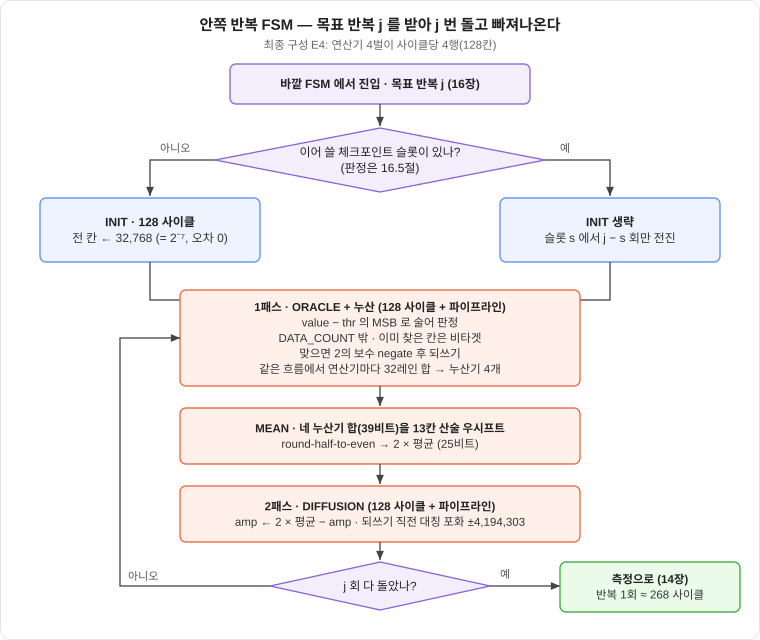
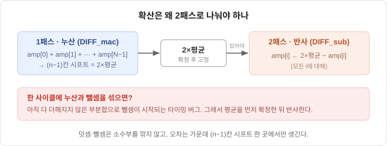

# 13장. 오라클과 확산 — 곱셈기 없는 산술

> [← 12장 진폭을 숫자로](12_고정소수점과_정밀도.md) · [목차](README.md) · [14장 다중 정답 →](14_다중정답과_최솟값탐색.md)
> **이 장을 읽기 위한 준비**: [9.4절 $N=4$ 손계산](09_그로버_알고리즘.md#94-진짜로-한-번-돌려보기--n4), [9.7절 두 개의 반사](09_그로버_알고리즘.md#97-이제-수식으로--두-개의-반사), [11.7절 병렬도 P와 뱅킹](11_상태벡터_에뮬레이터.md#117-병렬도-p와-뱅킹), [11.8절 사이클 비용 모델](11_상태벡터_에뮬레이터.md#118-사이클-비용-모델), [12장 고정소수점과 Q1.22](12_고정소수점과_정밀도.md).

---

11장에서 상태벡터를 세 개의 배열로 펼쳤고, 12장에서 그 배열의 한 칸을 Q1.22 고정소수점으로 못 박았습니다. 이 장은 그 배열 위에서 **그로버 반복 한 바퀴**가 실제로 어떤 회로가 되는지를 봅니다.

범위를 먼저 좁혀 두겠습니다. 이 장이 다루는 것은 **한 반복 안쪽**뿐입니다. 몇 번 돌릴지 정하는 샷 루프, 뽑힌 후보를 고전으로 검증하는 단계, 진폭 배열을 재활용할지 정하는 체크포인트는 전부 [16장](16_반복제어와_재개캐시.md)의 소관입니다. 진폭 배열에서 답 하나를 뽑는 측정은 [14장](14_다중정답과_최솟값탐색.md)이고요. 여기서는 "목표 반복 수 $j$ 를 받아 $j$ 번 돌고 빠져나오는" 안쪽 FSM만 봅니다.

이 장이 심으려는 감각은 하나입니다 — **초기화·오라클·확산 경로에는 곱셈기가 한 개도 없습니다.** 9장에서 평균 중심 반사가 우아하다고 느꼈다면, 그 우아함의 정체가 여기서 드러납니다. 동시에 곱셈기가 정말로 필요한 곳이 어디인지도 13.8절에서 정확히 짚습니다. "곱셈기 0개"는 경로를 붙이지 않으면 거짓말이 되는 문장이기 때문입니다.

---

## 13.1 한 반복 안의 FSM

안쪽 FSM은 네 종류의 상태뿐입니다. 초기화 한 번, 그다음 **1패스와 2패스를 $j$ 번 왕복**하고 끝입니다.

| 상태 | 사이클 (E4) | 하는 일 |
|---|---:|---|
| `S_INIT` | 128 | 진폭 배열의 모든 칸을 `INIT_AMP` 로 (13.2) |
| `S_PASS1` | 128 + 파이프라인 | 술어 판정 → 부호 반전 → 되쓰기. **같은 흐름에서** 전체 누산 (13.3·13.4) |
| `S_MEAN` | 1 | 누산기를 $n-1$ 칸 우시프트하고 반올림해 $2\bar a$ 확정 (13.5) |
| `S_PASS2` | 128 + 파이프라인 | 각 칸을 $2\bar a - a_i$ 로 갱신하고 포화 (13.5) |

최종 구성은 32레인 연산기 네 벌이 한 사이클에 4행(128칸)을 처리하므로 배열 한 바퀴가 $N/128 = 128$ 사이클입니다([11.7절](11_상태벡터_에뮬레이터.md#117-병렬도-p와-뱅킹)). 여기에 파이프라인을 채우고 비우는 몇 사이클이 붙어, 500 워크로드 캠페인에서 잰 **그로버 반복 1회는 약 268 사이클**, 100 MHz에서 약 2.7 µs입니다([11.8절](11_상태벡터_에뮬레이터.md#118-사이클-비용-모델)). 1패스에는 100 MHz 타이밍을 맞추려고 가산 트리 중간에 레지스터를 넣은 탓에, 마지막 행을 되쓴 뒤 부분합이 누산기에 도착하기를 기다리는 **배수(drain) 사이클**이 하나 있습니다. 결과 산술은 바뀌지 않고 지연만 늘어납니다.

오라클이 독립된 패스를 갖지 않는다는 점이 중요합니다 — 부호 반전은 진폭을 읽어 되쓰는 김에 끼워 넣을 수 있으므로, 오라클은 **사이클을 한 개도 쓰지 않습니다.**



그림 맨 위의 "INIT을 할지 말지"만 이 장 바깥의 결정입니다. 체크포인트 슬롯 중 하나에 이어 쓸 수 있는 진폭 배열이 있으면 `S_INIT` 을 건너뛰고 곧바로 1패스로 들어가는데, 그 판정 규칙과 정당화는 [16.5절](16_반복제어와_재개캐시.md#165-체크포인트--측정이-읽기-전용이라는-사실에서)에 있습니다. 반복이 끝난 뒤 진폭 배열을 **지우지 않고 그대로 두는 것**도 같은 이유입니다.

---

## 13.2 INIT — 1/√N을 제곱근기 없이

초기화는 $H^{\otimes n}|0\rangle$ 을 만드는 일, 즉 배열의 모든 칸을 $1/\sqrt N$ 으로 채우는 일입니다. 문제는 $\sqrt{\ }$ 가 하드웨어로 비싸다는 것입니다. 그런데 $N = 2^n$ 이라는 사실을 쓰면 제곱근기가 통째로 사라집니다:

$$\frac{1}{\sqrt N} = \frac{1}{\sqrt{2^n}} = \begin{cases} 1 \times \dfrac{1}{2^{n/2}}, & n \text{ 짝수} \\[2ex] \dfrac{1}{\sqrt 2}\times\dfrac{1}{2^{(n-1)/2}}, & n \text{ 홀수}\end{cases}$$

$n$ 이 짝수면 $1/\sqrt N$ 이 딱 2의 거듭제곱이라 상수 $1.0$ 을 그만큼 우측 시프트하면 되고, 홀수면 $1/\sqrt 2$ 라는 **상수 하나**만 있으면 나머지는 역시 시프트입니다. 04번 논문(Choi & Lee, 2024)이 Q1.30에서 쓰는 코드가 이 꼴입니다:

```c
init_coefficient = (NUM_QUBIT % 2 == 0)
                 ? (0x4000_0000 >> (NUM_QUBIT / 2))         // 0x4000_0000 = 1.0
                 : (0x2D41_3CCE >> ((NUM_QUBIT - 1) / 2));  // 0x2D41_3CCE = 1/√2
```

우리는 $n = 14$, 즉 **짝수 분기**입니다. Q1.22에서 $1.0$ 에 해당하는 정수는 $2^{22}$ 이고, 이것을 $n/2 = 7$ 칸 우시프트하면 $2^{15} = 32{,}768$ 이 나옵니다. 그래서 **`INIT_AMP` = 32768** 이고, $32768/2^{22} = 1/128 = 1/\sqrt{16384}$ 가 **정확히** 성립합니다. 반올림이 한 번도 일어나지 않으므로 초기 상태의 노름도 정확히 1입니다. 측정 쪽 숫자로 확인하면, 진폭 제곱의 총합이 $16384 \times 32768^2 = 2^{44}$ 이고 이것이 Q1.22 제곱의 $1.0$ 에 해당하는 값 그대로입니다(14.5절). 상수가 필요 없으니 RTL은 이 값을 `grover_param.vh` 의 정수 하나로 굽습니다.

홀수 $n$ 이었다면 사정이 다릅니다. $1/\sqrt 2$ 를 22비트 소수로 반올림하는 순간 오차가 생기고, 그 오차가 $N$ 칸에 똑같이 실려 초기 노름이 1을 살짝 벗어납니다. 짝수 $n$ 은 이 비용을 치르지 않습니다 — 작지만 기분 좋은 이득입니다.

여기서 원문을 그대로 베끼면 안 되는 지점이 하나 있습니다. 논문에 인쇄된 상수 `0x2D41_3CCE` 는 실제 $\frac{1}{\sqrt2}\times2^{30}$ = `0x2D41_3CCD` 와 **1 LSB 어긋나** 있습니다. 같은 수법으로 만든 반복 횟수 상수 `0x1_1C58_31AC`($\frac{\pi\sqrt2}{4}\times2^{32}$) 도 실제 값 `0x1_1C58_31AE` 와 **2 LSB 어긋나** 있고요(`0x4000_0000` 과 `0xC90F_DAA2` = $\frac{\pi}{4}\times2^{32}$ 는 정확합니다). 오차가 $\sim10^{-9}$ 라 실용적으로는 무해하지만, 교훈은 상수 자체가 아니라 **1차 자료도 틀린다**는 것입니다. 매직 넘버는 인용하지 말고 직접 계산해 넣으십시오. 위에서 32768을 손으로 유도한 것이 그 실천입니다. (논문 상수·수식의 오류 목록 전체는 [15.6절](15_논문지도와_설계결정표.md#156-인용-시-주의--논문의-오류와-모호점)에 모여 있습니다. 반복 횟수 상수를 우리가 어떻게 다루는지는 [16.2절](16_반복제어와_재개캐시.md#162-bbht--무작위-j와-12배-확대)입니다 — 우리는 $R$ 을 고정 상수로 굽지 않기 때문에 이 상수를 쓸 일 자체가 별로 없습니다.)

---

## 13.3 ORACLE — 술어 4종이 감산기 하나를 공유한다

이 절이 이 프로젝트의 주제 그 자체입니다. 오라클은 **정답이 어디 있는지 아는 회로가 아니라, 한 칸을 보고 조건을 만족하는지 판정하는 회로**입니다([14.2절](14_다중정답과_최솟값탐색.md#142-오라클은-정답을-아는-회로가-아니다)). 우리 IP가 판정하는 술어는 네 가지입니다:

$$\texttt{LT}:\ v_i < t_a \qquad \texttt{GT}:\ v_i > t_a \qquad \texttt{EQ}:\ v_i = t_a \qquad \texttt{RANGE}:\ t_a < v_i < t_b$$

여기서 $v_i$ 는 `data_mem` 의 $i$ 번 칸이고 $t_a, t_b$ 는 CSR로 받은 임계값입니다. 데이터 워드는 16비트 signed입니다([12.8절](12_고정소수점과_정밀도.md#128-데이터-워드와-bram-환산)).

순진하게 접근하면 비교기 IP 네 개를 부르고 싶어집니다. 그럴 필요가 없습니다. **비교는 뺄셈의 부호비트 하나**이기 때문입니다. 16비트 피연산자를 부호확장해 17비트로 빼면

$$d = \underbrace{\{v_{15}, v\}}_{17\text{b}} - \underbrace{\{t_{15}, t\}}_{17\text{b}}$$

이고, $d$ 의 최상위 비트 `d[16]` 이 곧 $v < t$ 의 답입니다. 부호확장을 빠뜨리면 $v = -32768$, $t = 1$ 같은 입력에서 뺄셈이 오버플로해 부호비트가 뒤집히므로, 17비트로 넓히는 이 한 줄이 없으면 회로가 조용히 틀립니다. 나머지 술어는 이 감산기를 재활용합니다.

| 술어 | 감산기 입력 $A - B$ | `hit_i` 조합 논리 | 추가 하드웨어 |
|---|---|---|---|
| `LT` $v_i < t_a$ | $A = v_i$, $B = t_a$ | `d1[16]` | 없음 |
| `GT` $v_i > t_a$ | $A = t_a$, $B = v_i$ (**피연산자 교환**) | `d1[16]` | 입력 먹스 |
| `EQ` $v_i = t_a$ | (감산기를 쓰지 않음) | `~\|(v_i ^ t_a)` (XOR-NOR) | XOR 16개 + NOR 1단 |
| `RANGE` $t_a < v_i < t_b$ | $A = t_a, B = v_i$ / $A = v_i, B = t_b$ | `d1[16] & d2[16]` | 감산기 하나 더 |

`GT` 가 공짜라는 점을 눈여겨보십시오. $v > t$ 는 $t < v$ 와 같은 말이므로, 감산기에 들어가는 두 입력을 **바꿔 넣기만** 하면 됩니다. 비교기를 새로 만들 이유가 없습니다. `EQ` 는 감산기조차 필요 없습니다 — 두 값이 같다는 것은 XOR 결과가 전부 0이라는 뜻이니 XOR 한 층과 NOR 한 층이면 끝이고, 이게 감산 결과가 0인지 보는 것보다 지연이 짧습니다. `RANGE` 만 비교가 둘이라 감산기를 하나 더 둡니다. 17비트 감산기는 LUT 수십 개 수준이라 128레인에 깔아도 부담이 크지 않습니다 — 구현 리포트에서 레인 하나의 술어 회로가 LUT 한 자릿수로 잡힙니다. 경계가 열린 구간($<$)인지 닫힌 구간($\le$)인지는 회로가 아니라 **약속**의 문제이고, 우리는 위 표대로 네 술어 모두 강부등호로 고정합니다. 경계값 테스트는 [18.5절](18_골든모델_검증.md#185-술어-4종과-경계값)에서 따로 다룹니다.

판정 앞에는 문이 하나 더 있습니다. 호스트가 배열을 다 채우지 않고 `DATA_COUNT` 개만 올렸다면, 인덱스가 `DATA_COUNT` 이상인 칸은 메모리에 무엇이 남아 있든 **항상 비타겟**입니다(padding gate). 이 문이 없으면 지난 실험의 쓰레기 값이 정답 행세를 합니다.

마지막으로 **열거 모드**가 이 판정에 한 겹을 더합니다. 이미 찾아낸 인덱스를 다시 뽑지 않으려면 `found_mask` 의 비트를 AND로 걸면 됩니다:

$$\texttt{hit}_i = \texttt{predicate}(v_i) \ \wedge\ \overline{\texttt{found}[i]}$$

AND 게이트 하나가 전부이고, 이것이 왜 정당한 오라클인지는 [14.7절](14_다중정답과_최솟값탐색.md#147-열거-모드--마스크로-중복-없이)에서 설명합니다.

정답 인덱스를 파라미터로 못 박고 그 칸만 뒤집는 회로 — 술어 판정이 아예 없는 형태 — 도 값어치가 있긴 합니다. 9장의 수식을 **최소 회로로 확인하는 한 단계**이기 때문입니다. 판정 로직이 없으니 확산과 반복만 남고, 그러면 [9.4절](09_그로버_알고리즘.md#94-진짜로-한-번-돌려보기--n4)의 $N=4$ 손계산과 파형을 한 칸씩 대조할 수 있습니다([18.4절](18_골든모델_검증.md#184-첫-테스트-벡터는-94절의-손계산)). 다만 그것은 검증용 발판이지 설계가 아닙니다. 우리 오라클은 처음부터 위 표의 술어 회로입니다.

---

## 13.4 부호 반전 — 2의 보수 negate 한 번

판정이 끝나면 뒷단은 허무할 만큼 간단합니다. 오라클 $U_f$ 가 하는 일은 조건을 만족하는 칸의 **부호를 뒤집는 것**뿐이고, 고정소수점은 2의 보수이므로 부호 반전은 비트 반전 + 1입니다.

$$a_i \leftarrow (-1)^{\texttt{hit}_i}\, a_i$$

조건부 반전이라는 점을 이용하면 게이트가 더 줄어듭니다. `hit` 를 XOR의 한 입력과 가산기의 캐리인에 동시에 넣으면 됩니다:

```verilog
// hit=0 이면 amp 그대로, hit=1 이면 ~amp + 1 = -amp
wire signed [DW-1:0] amp_o = (amp ^ {DW{hit}}) + hit;
```

곱셈도, 보조 큐비트도, 별도의 상태도 없습니다. 실기에서 다중 제어 $Z$ 게이트로 만들어야 하는 위상 반전이 에뮬레이터에서는 XOR 한 줄이 되는 것 — [11.9절](11_상태벡터_에뮬레이터.md#119-에뮬레이터가-실기보다-쉬운-것들)이 말한 역설의 가장 선명한 사례입니다.

2의 보수에는 원래 **부호 반전이 불가능한 값**이 하나 있습니다. 23비트 컨테이너의 최솟값 $-4{,}194{,}304$($= -1.0$)를 반전하면 $+4{,}194{,}304$ 인데 이 값은 23비트에 담기지 않습니다. 랩어라운드로 두면 $-1.0$ 이 $-1.0$ 으로 되돌아와 **부호 반전이 항등이 되고, 그 칸에 대해 오라클이 조용히 무력화됩니다.** 우리 설계에서는 이 실패 모드가 구조적으로 사라집니다. [12.5절](12_고정소수점과_정밀도.md#125-오버플로-정책--포화랩-금지재정규화-없음)의 대칭 포화가 진폭을 $[-4{,}194{,}303,\ +4{,}194{,}303]$ 안에만 두기 때문에, 배열에 들어 있는 어떤 값을 뒤집어도 다시 합법 범위 안입니다. 하한을 한 칸 버린 이유가 여기 있습니다.

---

## 13.5 DIFFUSION — 2·mean − amp가 회로가 되는 순간

9장에서 확산을 "평균 중심 반사" $a\mapsto 2\bar a - a$ 로 배웠습니다(9.4·9.7절). 이 한 줄이 회로에서 어떻게 펼쳐지는지 봅니다. 9.7절에서 쓴 확산 연산자 $U_\psi$ 를 행렬로 펼치면 이렇게 생겼습니다($|\psi\rangle$ 은 균등중첩):

$$U_\psi = H^{\otimes n}\big(2|0\cdots0\rangle\langle0\cdots0| - I\big)H^{\otimes n} = 2|\psi\rangle\langle\psi| - I = \begin{bmatrix} 2^{-n+1} & \cdots & 2^{-n+1} \\ \vdots & \ddots & \vdots \\ 2^{-n+1} & \cdots & 2^{-n+1}\end{bmatrix} - I$$

"모든 원소가 $2^{-n+1}$ 인 행렬에서 단위행렬을 뺀" 꼴입니다. 언뜻 $N\times N$ 행렬-벡터 곱($O(N^2)$)이 필요해 보이지만, 이 특수 구조 덕분에 **세 단계**로 분해됩니다. 지금 배열에 실려 있는 상태를 $|\phi\rangle = \sum_i \beta_i|i\rangle$ 라고 두면:

$$U_\psi|\phi\rangle = 2^{-n+1}\begin{bmatrix}\sum_i\beta_i \\ \vdots \\ \sum_i\beta_i\end{bmatrix} - \begin{bmatrix}\beta_0 \\ \vdots \\ \beta_{N-1}\end{bmatrix}$$

즉 ① 모든 진폭을 **더하고**(누산 $\sum\beta_i$), ② $2^{-n+1}$ 을 **곱하고**(= $n-1$ 비트 우측 시프트), ③ 각 원소를 그 값에서 **빼면**($\text{sum}\times2^{-n+1} - \beta_i$) 끝입니다. 이것이 정확히 평균 중심 반사입니다 — 왜냐하면 $2^{-n+1}\sum\beta_i = \frac{2}{N}\sum\beta_i = 2\bar\beta$ 이고, 따라서 세 번째 단계가 $2\bar\beta - \beta_i$ 이니까요.

**"왜 $n-1$ 칸 시프트인가"** 가 여기서 풀립니다. 평균은 합을 $2^n$ 으로 나누는 것(= $n$ 칸 우측 시프트)이지만, 우리가 실제로 필요한 것은 평균이 아니라 **2×평균**($2\bar a$)입니다. $\frac{2}{2^n} = \frac{1}{2^{n-1}}$ 이므로, $n$ 칸 시프트 후 다시 2를 곱하는 대신 처음부터 **$n-1$ 칸만** 시프트하면 한 번에 $2\bar a$ 가 나옵니다. $n=14$ 면 13칸입니다.

두 번에 나눠 하지 않는 것이 중요합니다. `mean = sum >>> n` 으로 밀었다가 `two_mean = mean <<< 1` 로 되미는 구현은 결과값은 같아 보여도 **최하위 비트 하나를 버립니다**(오른쪽으로 밀 때 떨어져 나간 비트는 왼쪽으로 되밀어도 0으로 채워집니다). 한 번에 13칸을 미는 쪽이 정밀도가 낫고, 무엇보다 **반올림이 일어나는 지점이 정확히 한 곳으로 고정**됩니다.

그 지점을 못 박아 둡니다. 한 번의 그로버 반복에서 소수부가 깎이는 곳은 **누산기를 $n-1$ 칸 우시프트하는 이 한 순간뿐**입니다. 오라클의 부호 반전은 정확하고, 반사의 뺄셈도 두 피연산자가 모두 22비트 소수라 정확합니다. 그러므로 [12.4절](12_고정소수점과_정밀도.md#124-반올림--왜-half-to-even인가)의 round-half-to-even은 여기, 오직 여기에만 적용됩니다:

```verilog
localparam K = NBITS - 1;                    // n=14 → 13
wire [ACCW-1:0] trunc = $signed(sum) >>> K;  // 버림
wire            half  = sum[K-1];            // 버려지는 비트 중 최상위
wire            rest  = |sum[K-2:0];         // 그 아래에 1이 하나라도 있나
wire [ACCW-1:0] two_mean = trunc + (half & (rest | trunc[0]));
```

마지막 줄이 half-to-even 그 자체입니다. 버려지는 부분이 정확히 절반이면(`half=1, rest=0`) 결과의 최하위 비트가 1일 때만 올림해서 짝수로 맞춥니다. RTL은 이 결과를 25비트 `two_mean` 레지스터에 담습니다([12.3절](12_고정소수점과_정밀도.md#123-정수부는-몇-비트인가--재는-대상이-셋이다)). 매 반복 한 번씩, $M=1$ 이면 100회 안팎 적용되는 이 규칙이 기준모델과 RTL이 비트 단위로 일치하기 위한 첫 번째 조건입니다([18.3절](18_골든모델_검증.md#183-bit-exact가-성립하기-위한-조건)).

뺄셈 결과 $2\bar a - a_i$ 는 25비트 폭에서 계산되고, 되쓰기 직전에 23비트 대칭 범위로 포화됩니다. 포화가 걸리면 그 레인이 신호를 내고, 한 번이라도 걸린 탐색은 `amp_overflow` 가 섭니다(12.5절).

그리고 이 세 단계 어디에도 **곱셈기가 없습니다.** 누산은 덧셈, $2^{-n+1}$ 곱은 시프트, 반사는 뺄셈 — 전부 덧셈 계열입니다.

---

## 13.6 왜 2패스인가

확산이 왜 굳이 두 번의 배열 순회로 쪼개지는지는 한 문장으로 답할 수 있습니다. **$2\bar a - a_i$ 를 계산하려면 $\bar a$ 가 이미 확정돼 있어야 하는데, $\bar a$ 는 모든 $a_i$ 를 다 더해야 나오기 때문입니다.**



누산과 뺄셈을 한 패스에서 섞으면 아직 다 더해지지도 않은 부분합으로 뺄셈이 시작됩니다. 배열 앞쪽 칸은 거의 0에 가까운 부분합으로 반사되고 뒤쪽 칸은 거의 전체 합으로 반사되어, 결과는 확산도 아니고 아무것도 아닌 값이 됩니다. 시뮬레이션에서 잡기 어려운 종류의 버그는 아니지만(진폭이 대놓고 틀립니다), 이 순서 제약이 **알고리즘에서 오는 것이지 구현 편의가 아니라는** 점이 중요합니다. 확산은 전역 연산이고, 전역 연산은 전역 축약(reduction)을 먼저 끝내야 합니다.

그래서 1패스는 오라클을 건 진폭을 메모리에 되쓰면서 합을 모으고, 2패스는 그 되쓴 값을 다시 읽어 $2\bar a$ 에서 뺍니다. 체크포인트가 출발점을 준 경우에는 1패스가 출발 슬롯에서 읽어 목적 슬롯에 쓰고, 2패스가 목적 슬롯을 읽고 덮어쓰는 식으로 두 패스가 슬롯을 나눠 쓰기도 합니다(16.5절). 어느 쪽이든 순서 제약은 같습니다.

이 제약이 남기는 흔적은 사이클만이 아닙니다. 12장에서 폭을 따로 잡았던 것이 전부 여기서 나옵니다. 첫째, 1패스가 만드는 합은 $N$ 개 진폭의 총합이라 진폭 하나보다 훨씬 큽니다. 그래서 누산기는 진폭 컨테이너보다 넓어야 하고, 그 폭이 $\text{ACCW} = \text{DW} + n + 2 = 39$ 비트입니다. 둘째 — 그리고 이쪽이 놓치기 쉬운데 — **넓혀야 하는 것이 누산기만이 아닙니다.** 2패스가 만드는 값 $2\bar a - a_i$ 자체가 이론상 $1 + 2/\sqrt N = 1.0156$ 까지 커져 Q1.22의 천장을 넘을 수 있습니다. 그래서 이 값은 25비트 레지스터에서 계산하고, 메모리에 되쓸 때만 23비트 대칭 범위로 붙입니다([12.3절](12_고정소수점과_정밀도.md#123-정수부는-몇-비트인가--재는-대상이-셋이다)). 되쓰는 값은 수학적으로 1을 넘지 않으므로 포화가 걸리는 것은 반올림이 한두 LSB 넘긴 드문 경우뿐입니다.

---

## 13.7 32레인 데이터패스와 누산 순서

지금까지의 회로는 진폭 한 칸을 다루는 이야기였습니다. 실제로는 한 행 $P = 32$ 칸을 한 사이클에 처리하는 연산기가 **네 벌** 있어 128칸이 한꺼번에 흐릅니다([11.7절](11_상태벡터_에뮬레이터.md#117-병렬도-p와-뱅킹)).

주소 생성부터 봅니다. 인덱스의 **하위 5비트가 레인, 상위 9비트가 행**이고, 행 번호의 하위 2비트가 네 행 위상 뱅크 중 하나를 고릅니다($n=14$):

$$i = \underbrace{\texttt{row}[8{:}2]}_{\text{뱅크 안 주소}}\ \Vert\ \underbrace{\texttt{row}[1{:}0]}_{\text{행 위상 뱅크}}\ \Vert\ \underbrace{\texttt{lane}[4{:}0]}_{\text{레인}}$$

이렇게 잘라 두면 주소 생성기가 7비트 카운터 하나로 끝납니다. 사이클 $c$ 에는 네 뱅크가 **모두 같은 주소 $c$** 를 읽어 행 $4c \ldots 4c+3$ 이 한꺼번에 나오므로 충돌이 원리적으로 0이고, 크로스바나 순열망이 필요 없습니다. 진폭을 임의로 재배치해야 하는 범용 게이트 시뮬레이터가 순열망 하나에 로직의 3분의 1을 쓰는 것과 대조됩니다 — 그로버의 두 연산(전역 균일 반사, 인덱스별 술어 판정)이 둘 다 **순차 스트리밍**으로 충분하기 때문에 우리는 그 비용을 통째로 피합니다.

레인 하나는 지금까지 만든 것을 그대로 복제한 것입니다. `data_mem` 에서 $v_i$, 진폭 메모리에서 $a_i$ 를 같은 사이클에 읽고, 감산기가 술어를 판정하고, XOR-캐리인 한 줄이 부호를 뒤집어 되씁니다. 여기에 1패스에서만 쓰이는 것이 하나 더 붙습니다 — **레인 간 누산 트리**입니다. 연산기 하나마다 32개 진폭을 5단 가산 트리로 더하면 단마다 폭이 1비트씩 늘어 $23 + 5 = 28$ 비트 부분합이 되고, 연산기마다 누산기가 하나씩 이 부분합을 128사이클 동안 모읍니다. 평균을 확정할 때는 **네 누산기를 더한 전체 합**에서 13.5절의 시프트를 한 번 합니다. 39비트는 이 모든 경우를 최악값으로 담는 폭입니다.

여기에 함정이 하나 있습니다. **덧셈 순서를 고정하지 않으면 bit-exact가 흔들릴 수 있습니다.** 정수 덧셈은 폭이 충분하면 순서에 무관하게 같은 값을 주므로 언뜻 신경 쓸 일이 없어 보입니다 — 실제로 우리 RTL은 부분합을 자르지 않고 최악 폭으로 담기 때문에, 트리 모양이 달라도 정수 결과는 같습니다. 하지만 두 가지 경우에 순서가 결과를 바꿉니다. 첫째, 폭을 아끼려고 중간 부분합을 좁은 레지스터에 담아 자르거나 포화시키는 순간, 어느 쌍을 먼저 더했는지가 잘리는 비트를 바꿉니다. 둘째 — 이쪽이 실제로 물립니다 — float64 모델과 대조할 때, **부동소수점 덧셈은 결합법칙을 만족하지 않으므로** 순서가 곧 결과입니다. `sum += a[i]` 로 순차 누산한 float 모델과 트리로 더한 RTL은 마지막 비트가 다를 수 있습니다. 그래서 bit-exact 대조의 상대는 float64 모델이 아니라 **정수로만 계산하는 고정소수점 기준모델**이고, 이 항목이 [18.3절](18_골든모델_검증.md#183-bit-exact가-성립하기-위한-조건)의 고정 대상 목록에 들어 있는 이유입니다.

2패스에는 누산 트리가 없고, 대신 확정된 $2\bar a$ 가 128레인에 브로드캐스트되어 각 레인이 뺄셈과 포화 하나씩을 합니다. 브로드캐스트 신호가 128곳으로 퍼지므로 팬아웃이 커지는데, 레지스터를 한 단 두어 나눠 주면 100 MHz에서 문제가 되지 않습니다. 실제로 이 IP는 100 MHz에서 타이밍을 닫았습니다(WNS +0.126 ns, 17장).

---

## 13.8 곱셈기는 어디에 있고 어디에 없는가

이제 이 장 첫머리의 약속을 정확한 문장으로 닫습니다.

**초기화·오라클·확산 경로에는 곱셈기가 0개입니다.** 초기화는 상수 하나, 오라클은 감산기와 XOR, 확산은 가산 트리·산술 우시프트·뺄셈·포화뿐입니다. 임의 실수를 곱하는 자리가 한 군데도 없으니 DSP가 잡힐 이유가 없습니다. 이것은 우연이 아니라 그로버라는 알고리즘의 성질입니다 — 오라클이 거는 위상이 $0$ 아니면 $\pi$(부호 $+$ 아니면 $-$)뿐이고, 확산이 곱하는 계수가 $2^{-n+1}$ 이라는 2의 거듭제곱뿐이기 때문입니다. 같은 연구실의 QAOA 에뮬레이터(06번)와 대조하면 선명해집니다. QAOA는 임의 각도 $e^{i\theta}$ 회전이 필요해서 CORDIC과 복소수 곱셈기를 넣어야 했고 DSP를 31~32개 고정으로 씁니다. 그로버는 그 회전 하드웨어가 통째로 필요 없습니다.

**그러나 측정 경로에는 곱셈기가 있습니다.** Born 샘플링은 진폭의 제곱 $a_i^2$ 를 누적해야 하고, 제곱은 시프트로 바뀌지 않습니다([14.5절](14_다중정답과_최솟값탐색.md#145-2단-병렬-측정)). $23\times23$ 곱은 Artix-7의 DSP48(25×18 곱셈기) 하나에 들어가지 않아 제곱기 하나가 DSP **2개**를 씁니다. 32레인이면 64개이고, 최종 구성은 측정 준비 단계에서 한 사이클에 두 행을 제곱하도록(M1) 제곱 엔진을 두 벌 두므로 **DSP 128개**입니다. 보드가 주는 240개 중 절반을 조금 넘고, SoC가 쓰는 4개를 더해 보드 전체가 132 / 240입니다.

그래서 예전 판본에 있던 "합성했는데 DSP가 잡히면 잘못 짠 것"이라는 점검 기준은 **틀렸습니다.** 우리 IP를 합성하면 DSP가 128개 잡히고, 그것이 정상입니다. 올바른 점검 기준은 경로를 붙인 쪽입니다:

| 경로 | 기대 DSP | 잡히면 의심할 것 |
|---|---:|---|
| INIT | 0 | 상수를 시프트가 아니라 곱셈으로 썼는가 |
| ORACLE (술어·부호 반전) | 0 | 비교기 IP나 곱셈 기반 비교를 불렀는가 |
| DIFFUSION (누산·시프트·뺄셈·포화) | 0 | `two_mean` 을 `sum >>> (n−1)` 대신 곱셈·나눗셈으로 썼는가 |
| MEASURE (제곱합) | **128** | 128보다 많으면 제곱기가 중복 인스턴스화됐는가 |
| 측정 난수 생성기 | 0 | 곱셈이 필요한 난수 생성기를 골랐는가 (xorshift는 시프트와 XOR뿐) |

`two_mean` 을 `2 * (sum / N)` 처럼 풀어 써 두면 합성기가 대개는 시프트로 알아서 바꿔 주지만, 폭이 애매하거나 부호가 섞이면 곱셈기·나눗셈기를 물어옵니다. 시프트로 쓸 수 있는 것은 **시프트로 쓰는 편**이 합성 결과를 예측 가능하게 만듭니다 — 13.5절의 `sum >>> (n−1)` 한 줄이 그 자리입니다. 그리고 합성 리포트를 볼 때는 총 DSP 수가 아니라 **어느 모듈에서 잡혔는지**를 보십시오. 우리 구현 리포트에서 128개는 전부 측정 샘플러의 제곱 엔진 두 벌 아래에 잡혀 있습니다. 이 표는 그 확인용입니다.

---

## 13.9 이 장의 요약

- 안쪽 FSM은 `INIT → (1패스: ORACLE+누산 → MEAN → 2패스: DIFFUSION) × j` 뿐입니다. 샷 루프·고전 검증·체크포인트는 [16장](16_반복제어와_재개캐시.md), 측정은 [14장](14_다중정답과_최솟값탐색.md)입니다.
- **패스 1회 = 128 사이클**(연산기 네 벌이 한 사이클에 4행), **반복 1회 ≈ 268 사이클**(2패스 + 파이프라인, 캠페인 직선 맞춤), 100 MHz에서 약 2.7 µs. **오라클은 사이클을 쓰지 않습니다** — 진폭을 읽어 되쓰는 김에 부호를 뒤집습니다.
- **INIT**: $n=14$ 는 짝수라 $1/\sqrt N = 2^{-7}$. Q1.22에서 $2^{22} \gg 7 =$ **32768**, 오차 0, 초기 노름 정확히 1.
- **ORACLE**: 비교기 IP 없이 **부호확장한 뺄셈의 MSB 하나**가 `<` 의 답. `>` 는 피연산자 교환(공짜), `=` 는 XOR-NOR, 범위는 두 비교의 AND, `DATA_COUNT` 밖은 항상 비타겟, 열거 모드는 `!found[i]` 를 AND. 뒷단은 2의 보수 negate 한 줄이고, 대칭 포화 덕에 negate가 늘 합법입니다.
- **DIFFUSION**: $a\mapsto 2\bar a - a$ = 누산 → **$n-1 = 13$ 칸 시프트**(∵ 필요한 건 평균이 아니라 2×평균) → 뺄셈 → 대칭 포화. 반올림(round-half-to-even)이 적용되는 지점은 **이 시프트 한 곳뿐**입니다.
- **2패스는 필연**입니다. 평균이 전체 합을 요구하기 때문입니다. 그 대가로 누산기가 39비트, 반사 중간값이 25비트로 넓어지고, 되쓸 때 23비트로 붙입니다.
- **128레인**: 인덱스 하위 5비트가 레인, 행 번호 하위 2비트가 행 위상 뱅크 → 충돌 0, 크로스바 불필요. 연산기마다 5단 가산 트리와 누산기가 하나씩이고, 네 누산기의 합에서 평균을 확정합니다. 부분합을 자르지 않아 정수 결과는 순서에 무관하지만, bit-exact 대조의 상대는 float64가 아니라 정수 기준모델입니다([18.3절](18_골든모델_검증.md#183-bit-exact가-성립하기-위한-조건)).
- **곱셈기**: INIT·ORACLE·DIFFUSION 경로 **0개**, MEASURE 경로 **128개**(23×23 제곱기가 DSP 2개씩, 32레인 × 제곱 엔진 두 벌). "DSP가 잡히면 잘못 짠 것"이 아니라, **어느 경로에서** 잡혔는지를 보십시오.

다음 장은 이 데이터패스가 만들어 낸 진폭 배열에서 답을 뽑습니다. 술어를 만족하는 칸이 여럿일 때 그 진폭들이 매 반복 정확히 같아진다는 사실, 그래서 최댓값을 고르는 방식이 원리적으로 무너진다는 사실, 그리고 Born 확률 샘플링을 회로로 만드는 방법을 봅니다.

---

> [← 12장 진폭을 숫자로](12_고정소수점과_정밀도.md) · [목차](README.md) · [14장 다중 정답 →](14_다중정답과_최솟값탐색.md)
