# 14장. 다중 정답 — Born 측정과 열거

> [← 13장 오라클과 확산](13_오라클_확산_측정_데이터패스.md) · [목차](README.md) · [15장 논문 지도와 설계 결정표 →](15_논문지도와_설계결정표.md)
> **이 장을 읽기 위한 준비**: [4장 양자 측정](04_양자측정.md)의 Born 규칙, [9장 그로버 알고리즘](09_그로버_알고리즘.md)의 회전 그림, [13장 오라클과 확산](13_오라클_확산_측정_데이터패스.md)의 데이터패스.

---

13장이 오라클과 확산을 회로로 내렸습니다. 한 반복 안에서 벌어지는 일은 이제 전부 정해졌고, 남은 단계는 하나입니다 — **측정**. 진폭 배열에서 답 하나를 꺼내는 회로를 이 장에서 설계합니다.

그런데 이 단계는 앞의 두 단계와 성격이 다릅니다. 우리가 푸는 문제는 "`value[i] < thr_a` 를 만족하는 인덱스를 찾아라" 같은 **술어 검색**이고, 술어를 만족하는 칸이 몇 개인지는 데이터가 정합니다. 하나일 수도, 300개일 수도, 0개일 수도 있습니다. 즉 우리 문제는 처음부터 **다중 정답 문제**입니다. 그리고 정답이 여럿이라는 사실은 오라클에서는 아무 대가도 요구하지 않지만, 측정에서는 설계를 통째로 뒤엎습니다. 이 장은 그 인과 — 정답이 여럿이다 → 진폭이 똑같아진다 → 순위로는 못 고른다 → 확률로 뽑아야 한다 → 그래야 전부 열거할 수 있다 — 를 따라갑니다.

먼저 함정 하나를 치우고 시작해야 합니다.

---

## 14.0 기호 충돌 주의

이 장이 인용하는 세 자료가 **같은 글자를 다른 뜻으로** 씁니다. 이걸 정리하지 않으면 수식을 따라가다 반드시 헷갈립니다. 그래서 이 해설서는 **아래 표기로 통일**하고, 원문을 인용할 때만 환산하겠습니다.

| 개념 | **본 해설서(통일)** | 08번 논문 | 09번 논문 |
|---|:---:|:---:|:---:|
| 탐색 공간 크기 | $N$ | $D$ | $K = 2^N$ |
| 정답 개수 | $M$ | $M$ | $S$ (또는 $n_s$) |
| (08의 $N$) | — | 확산이 뒤집는 상태 수 | — |
| (09의 $N$) | — | — | 사용자 수 |

특히 조심할 것 두 가지입니다. **08번의 $N$ 은 큐비트 수도 탐색 공간도 아닙니다** — 확산이 위상을 뒤집는 상태의 개수라는, 그 논문만의 변수입니다. 08번에서 탐색 공간은 $D$ 입니다. 그리고 **09번의 $N$ 은 "사용자 수"이고 탐색 공간은 $K=2^N$** 입니다. 그래서 09번의 최적 반복 공식에 $S=1$ 을 넣으면 우리에게 익숙한 $\frac{\pi}{4}\sqrt K = \frac{\pi}{4}\sqrt{2^N}$ 이 나오지, $\frac{\pi}{4}\sqrt N$ 이 아닙니다. 교과서의 "$\frac{\pi}{4}\sqrt N$"은 $N$ 이 탐색 공간일 때의 표기이니, 09번을 읽을 때는 반드시 $N\to K$ 로 환산하세요.

이 표를 손 닿는 곳에 두고, 아래부터는 전부 본 해설서 표기($N$ = 탐색 공간, $M$ = 정답 개수)로 읽으시면 됩니다.

---

## 14.1 정답이 여럿이면 — 오라클에서는 공짜

정답이 $M$ 개일 때 최적 반복 횟수는 [9.5절](09_그로버_알고리즘.md#95-왜-여러-번--왜-sqrt-n-번--왜-pi)의 회전 그림에서 그대로 나옵니다. 초기 각이 $\sin\theta = \sqrt{M/N}$ 이 되어, 정답이 많을수록 시작부터 정답 축 쪽으로 더 기울어 있고 그만큼 덜 돌아도 됩니다:

$$R = \frac{\pi}{4}\sqrt{\frac{N}{M}} - \frac12$$

**오라클에서는 이것이 공짜입니다.** [13.3절](13_오라클_확산_측정_데이터패스.md#133-oracle--술어-4종이-감산기-하나를-공유한다)의 술어 유닛은 `value[i] − thr` 의 MSB 한 비트로 각 칸을 독립적으로 판정합니다. 조건을 만족하는 칸이 하나든 300개든 회로는 같고, 사이클 수도 같습니다 — 어차피 128레인이 배열 전체를 한 번 훑으니까요. **확산에서도 공짜입니다.** 평균 중심 반사 $a_i \mapsto 2\bar a - a_i$ 는 어느 칸이 정답인지 아예 보지 않는 전역 연산이라, $M$ 이 바뀌어도 회로가 손끝 하나 달라지지 않습니다.

**그러나 반복 제어에서는 공짜가 아닙니다.** 위 식에는 $M$ 이 들어 있는데 우리는 $M$ 을 모릅니다. 몇 번 돌릴지를 모르는 채로 시작해야 하고, 이 문제를 푸는 것이 [16장](16_반복제어와_재개캐시.md)의 BBHT 샷 루프입니다.

**그리고 측정에서는 전혀 공짜가 아닙니다.** 여기가 이 장의 본론입니다. 정답이 여럿이면 측정 회로가 지금까지의 방식으로는 **작동하지 않습니다.** 왜 그런지 보려면 오라클이 무엇을 아는 회로인지부터 다시 확인해야 합니다.

---

## 14.2 오라클은 정답을 아는 회로가 아니다

이것이 이 해설서 전체를 관통하는 명제입니다. 그로버를 처음 배울 때 교과서는 흔히 "정답 인덱스 $w$ 의 진폭에 $-1$ 을 곱한다"고 씁니다. 그 표기는 $w$ 를 상수로 못 박은 것처럼 읽히지만, 그렇게 만든 회로는 **검색을 하지 않습니다** — 답을 이미 알고 있으니까요. [7장](07_오라클과_위상킥백.md)에서 오라클을 정의할 때 강조한 대로, 오라클은 정답이 무엇인지 **모르면서** "이게 조건을 만족하느냐"는 물음에만 답하는 판정기입니다.

| | 인덱스를 아는 오라클 | 술어를 판정하는 오라클 |
|---|---|---|
| 정답을 | **안다** — 상수로 못 박음 | **모른다** — 데이터가 정함 |
| 회로 | 인덱스 비교기 | `value − thr` 의 MSB 한 비트 |
| 정답 개수 $M$ | 설계 시점에 1로 고정 | 실행 시점에 결정, 0일 수도 $N$ 일 수도 |
| 쓸모 | 알고리즘 골격 확인 | 실제 검색 |

우리 IP는 오른쪽입니다. 호스트가 CSR에 쓰는 것은 **임계값** `THRESHOLD_A`(그리고 범위 술어면 `THRESHOLD_B`)이지 정답 인덱스가 아닙니다. 임계값을 아는 것과 정답을 아는 것은 다릅니다 — 임계값은 **질문**이고, 어느 칸이 그 질문에 걸리는지는 `data_mem` 안의 값들이 정합니다. 회로는 실행 전에 어느 칸이 뒤집힐지 모르고, 알 필요도 없습니다.

이 명제에서 두 가지가 곧바로 따라 나옵니다. 첫째, **$M$ 을 미리 셀 수 없습니다.** $M$ 은 술어·임계값·데이터 셋 모두에 의존하므로 설계 시점에는 물론이고 실행 시작 시점에도 알 수 없습니다([16.1절](16_반복제어와_재개캐시.md#161-왜-m을-모르는가)). 둘째, **$M$ 개의 정답 사이에는 아무 우열이 없습니다.** 오라클이 보기에 그들은 전부 똑같이 "조건을 만족하는 칸"입니다. 이 둘째 귀결이 측정을 무너뜨립니다.

---

## 14.3 진폭 동률 — argmax가 무너지는 지점

정답 두 칸 $i$, $j$ 를 골라 그 진폭이 매 순간 어떻게 되는지 따라가 봅시다.

- 시작은 균등중첩이므로 $a_i = a_j = 1/\sqrt N$ 입니다. **같습니다.**
- 오라클은 조건을 만족하는 **모든** 칸에 똑같이 $-1$ 을 곱합니다. 둘 다 정답이니 둘 다 부호가 뒤집힙니다. **여전히 같습니다.**
- 확산 $a \mapsto 2\bar a - a$ 는 인덱스를 구별하지 않습니다. 같은 값에 같은 함수를 먹였으니 결과도 같습니다. **여전히 같습니다.**

귀납이 끝났습니다. 오라클과 확산이 정답 집합을 **완전히 대칭으로** 다루므로, $M$ 개 정답의 진폭은 매 반복 후 정확히 같습니다. 게다가 우리는 고정소수점을 쓰고([12장](12_고정소수점과_정밀도.md)) 두 칸이 지나온 연산열이 문자 그대로 동일하므로, 반올림 오차까지 똑같이 생겨 **비트 단위로 같습니다.** 우연히 갈릴 여지가 없습니다.

숫자로 보겠습니다. $N=8$, 술어를 만족하는 칸이 $\{1,3,5\}$ 인 경우($M=3$, $\theta = 37.761°$, 최적 $R = 0.692 \to 1$):

| 반복 | 정답 진폭 | 오답 진폭 | 정답 하나의 확률 | 정답 전체 확률 |
|:-:|--:|--:|--:|--:|
| 0 | $+0.35355$ | $+0.35355$ | 0.1250 (= 4/32) | 0.3750 |
| 1 | $+0.53033$ | $-0.17678$ | **0.2812 (= 9/32)** | 0.8437 |
| 2 | $-0.08839$ | $-0.44194$ | 0.0078 | 0.0234 |
| 3 | $-0.57452$ | $-0.04419$ | 0.3301 | 0.9902 |

한 번 돌리고 나면 1번·3번·5번 칸의 진폭이 **셋 다 정확히 $0.53033$** 이고, 각각 $9/32 = 28.1\%$ 의 확률을 나눠 가집니다. 오답 다섯 칸은 $-0.17678$ 로 눌려 있고요. 그로버는 제 일을 완벽하게 했습니다 — 정답 쪽에 84.4%의 확률이 모였습니다.

문제는 여기서 답을 꺼내는 회로입니다. 이 프로젝트가 한동안 상정했던 측정은 **argmax**, 즉 $|a_i|$ 가 가장 큰 인덱스를 고르는 비교기 트리였습니다([4.2절](04_양자측정.md#42-argmax는-왜-측정이-아닌가)이 이미 기각해 둔 그 회로입니다). 그런데 지금 최댓값을 갖는 칸이 셋이고 그 값이 비트까지 같습니다. 비교기 트리는 동률에서 무엇을 내놓을까요? 구조가 정한 우선순위 — 순차 스캔이면 먼저 만난 칸, 토너먼트 트리면 리프 배치 순서 — 에 따라 **인덱스 1** 하나입니다. 회로가 결정론적이므로 몇 번을 다시 돌려도 1입니다.

즉 argmax를 쓰면 **3번과 5번은 영원히 나오지 않습니다.** 난수 시드를 바꿔도, 반복 횟수를 늘려도, 클럭을 아무리 오래 돌려도 나오지 않습니다. 이것은 확률이 낮아서 못 찾는 것이 아니라 **원리적으로 도달할 수 없는** 것입니다. 우리 IP의 두 번째 출력 요구 — "조건을 만족하는 원소를 전부 열거한다" — 가 여기서 통째로 막힙니다.

동률을 감지해서 난수로 하나 고르면 되지 않느냐고 물을 수 있습니다. 그러면 $\{1,3,5\}$ 는 균등하게 나오겠지만, 그건 이미 argmax가 아니라 확률 샘플링의 어설픈 특수 경우입니다. 게다가 "동률"을 정확 일치로 판정해야 하는데 진폭이 조금이라도 다른 경우가 섞이면 곧바로 무너지고, 무엇보다 **순위만 남기고 확률의 크기 정보를 버린다**는 근본 문제가 그대로입니다. 순위로 뽑는 대신, 처음부터 확률로 뽑아야 합니다.

(정답 두 개짜리 최소 예제는 [9.4절](09_그로버_알고리즘.md#94-진짜로-한-번-돌려보기--n4)의 $N=4$ 손계산에 $M=2$ 변형으로 붙여 두었습니다. 두 막대의 높이가 **정확히 같아지는 것**을 네 줄짜리 계산으로 확인할 수 있습니다. 다만 $N=4$ 에 정답이 둘이면 처음부터 절반이 정답이라 확률이 $\frac12$ 에서 제자리인 퇴화 사례입니다 — 동률인 채로 **자라는** 모습은 이 절 앞의 $N=8$ · $M=3$ 예에서 이미 봤습니다.)

---

## 14.4 Born 샘플링 — 확률을 회로로

[4.1절](04_양자측정.md#41-계산-기저-측정과-born-규칙)의 Born 규칙이 답을 이미 갖고 있습니다. 상태 $|\psi\rangle = \sum_i a_i |i\rangle$ 를 계산 기저로 측정하면 결과 $i$ 가 나올 확률은

$$P(i) = |a_i|^2$$

입니다. 진폭이 실수뿐인 우리 데이터패스에서는 그냥 $a_i^2$ 이고요. 우리가 할 일은 이 분포를 따르는 난수를 회로로 뽑는 것 — 실기 양자에서 자연이 공짜로 해 주는 일을, 에뮬레이터에서는 우리가 만들어야 합니다.

교과서적인 방법은 **역변환 샘플링(inverse transform sampling)** 입니다. 누적분포

$$C(i) = \sum_{k \le i} a_k^2$$

를 만들어 두고, 균등난수 $r$ 을 뽑아 $C(i) > r$ 이 되는 **첫 번째** $i$ 를 답으로 씁니다. 인덱스 $i$ 가 뽑힐 조건은 $r$ 이 $[C(i-1),\, C(i))$ 구간에 떨어지는 것이고, 그 구간의 길이가 정확히 $a_i^2$ 이므로 $P(i) = a_i^2$ 가 그대로 성립합니다. 4장의 규칙과 회로가 한 치도 어긋나지 않습니다.

여기서 세 가지 실용적 결정을 합니다.

**전부 정수로, 자르지 않고 계산합니다.** 진폭이 23비트 정수이므로 제곱은 46비트 정수이고, 우리는 이 곱을 한 비트도 자르지 않습니다. 잘린 하위 비트가 곧 확률의 왜곡이고, 값이 작은 칸일수록 상대 오차가 커져 분포가 체계적으로 기울기 때문입니다. 누적과 총합도 필요한 폭 그대로 담습니다(14.5절). 정수라서 좋은 점이 하나 더 있습니다 — 누적이 배열 끝에서 **정확히** 총합에 닿으므로, 난수가 총합 미만이기만 하면 어디선가 반드시 멈춥니다. 부동소수점 누적이라면 반올림 때문에 끝까지 가도 난수를 못 넘는 경우를 대비한 안전망이 필요했겠지만, 정수 설계에서는 그 경로 자체가 없습니다. 남는 예외는 총합이 0인 경우 하나이고, 이때 회로는 `zero_weight_error` 를 세우고 끝냅니다.

**나눗셈을 하지 않습니다.** 보통은 확률이 되도록 $C(i)$ 를 전체 제곱합으로 나누지만, 우리는 나누는 대신 난수 $r$ 을 $[0,\ W)$ 범위에서 뽑습니다($W = \sum_k a_k^2$). 비교의 양변에 같은 상수를 곱한 것과 같으므로 분포는 동일하고, 나눗셈기가 통째로 사라집니다. 다만 이 동치는 $r$ 이 $[0,\ W)$ 에서 **정확히 균등**할 때만 성립하는데, $W$ 는 2의 거듭제곱이 아니라서 난수를 그대로 잘라 쓰면 균등해지지 않습니다. 그래서 **기각 샘플링**을 씁니다 — $k$ 를 $W - 1$ 의 비트 길이로 잡고, 64비트 난수의 하위 $k$ 비트를 후보로 꺼내, 후보가 $W$ 이상이면 버리고 다시 뽑습니다. 비교기 하나면 되니 나눗셈기가 도로 들어오지는 않고, 후보가 받아들여질 확률이 늘 절반을 넘으므로 평균 두 번 안에 끝납니다. 64비트 난수는 측정 전용 xorshift64 생성기가 한 블록씩 내며, 32비트 시드 하나에서 결정적으로 확장됩니다. 초기 상태에서 $W$ 는 정확히 $2^{44}$ 인데(13.2절), 반복을 거친 뒤에는 반올림 때문에 정확히 그 값이 아니어도 이 방식은 실측값을 그대로 쓰므로 영향을 받지 않습니다.

**제곱기는 필요합니다.** argmax 시절에는 $|a|$ 의 최대와 $a^2$ 의 최대가 같아서 제곱을 건너뛸 수 있었지만, 확률로 뽑으려면 크기 자체가 필요하므로 제곱을 피할 수 없습니다. [13.8절](13_오라클_확산_측정_데이터패스.md#138-곱셈기는-어디에-있고-어디에-없는가)의 "곱셈기 0개"는 **확산·오라클·INIT 경로에 한정된** 이야기이고, 측정 경로는 제곱기를 씁니다. 이것이 우리 설계에서 DSP가 잡히는 유일한 자리입니다.

남은 문제는 속도입니다. 위 절차를 곧이곧대로 짜면 진폭을 한 칸씩 훑는 직렬 스캔이라 16,384 사이클이 듭니다. 그로버 반복 한 번이 약 268 사이클인데([11.8절](11_상태벡터_에뮬레이터.md#118-사이클-비용-모델)) 측정 한 번이 그 60배를 먹는 셈이고, 128레인 데이터패스가 통째로 놀게 됩니다.

---

## 14.5 2단 병렬 측정

11.7절의 행 구조를 측정에도 그대로 씁니다. 샘플링을 **행을 먼저 고르고 그 안에서 레인을 고르는** 두 단으로 쪼개는 것입니다. 행이 512개나 되므로, 최종 구성은 행 고르기를 다시 **그룹 → 행**의 두 층으로 나눕니다.

1. **BUILD — 행 가중치 만들기.** 진폭 메모리를 한 바퀴 읽으며 행마다 32레인의 제곱합(행 가중치)을 만들어 작은 메모리에 적고, 전체 총합 $W$ 도 함께 모읍니다. 512행을 32행씩 16개 **그룹**으로 묶어, 그룹 경계를 지날 때마다 그때까지의 누적을 그룹 누적값으로 적어 둡니다 — 추가 제곱도 추가 사이클도 없이 따라 나오는 값입니다. 제곱 엔진 한 벌이면 한 사이클에 1행이라 512사이클인데, 최종 구성(**M1**)은 체크포인트 메모리가 한 번에 내주는 4행을 받아 **한 사이클에 2행씩** 제곱해 256사이클로 줄입니다. 제곱 엔진이 두 벌인 이유가 이것입니다(DSP 128개).
2. **난수 — 기각 샘플링.** 14.4절의 규칙대로 $0 \le r < W$ 인 난수를 얻을 때까지 64비트 블록을 뽑습니다.
3. **그룹 고르기 (M2).** 16개 그룹 누적값을 앞에서부터 보며 $r$ 을 처음 넘는 그룹을 고릅니다. 최대 16사이클입니다.
4. **행 고르기.** 그 그룹의 32행 안에서 누적 행 가중치가 $r$ 을 처음 넘는 행을 고릅니다. 최대 32사이클입니다. (M2가 없으면 512행 전체를 앞에서부터 훑어야 합니다.)
5. **레인 고르기.** 고른 행을 다시 읽어 32레인을 제곱하고, 그 행 안의 잔여값($r$ 에서 앞 행들까지의 누적을 뺀 값)을 레인 누적이 처음 넘는 레인을 고릅니다. 후보 인덱스는 `{행, 레인}` 입니다.
6. **검증.** `data_mem` 의 두 번째 포트로 후보 칸의 값을 다시 읽어 오라클과 같은 술어(와 padding·`found_mask`)로 판정합니다(16.4절).

비교는 전부 **엄격한 `>`** 이고, 순서는 늘 그룹 → 행 → 레인입니다. 이 규칙이 하나라도 다르면 같은 난수에서 다른 칸이 나오므로, 18.3절이 bit-exact 조건으로 못 박는 항목입니다.

얼마나 줄었는지는 샷 한 번의 나머지 비용(측정·검증·정책 등)으로 봅니다. 500 워크로드 캠페인에 직선을 맞춘 값으로, 측정 최적화가 없는 구성에서 샷당 약 821사이클이던 것이 M1에서 약 567, M2에서 약 **354사이클**이 되었습니다. 6단계 ablation에서 M1과 M2가 각각 총 사이클을 18.15%, 18.94% 줄였고, 둘을 합치면 K3/H3-E4 대비 33.7%입니다 — 눈에 잘 띄지 않는 자리였지만 이득의 큰 몫이 측정 경로에 있었습니다.

**이 쪼개기가 분포를 바꾸지 않는다는 것을 반드시 확인해야 합니다.** 인덱스 $i$ 가 행 $b$ 에 속할 때, 이 절차가 $i$ 를 뽑을 확률은 두 단의 곱입니다($S_b$ 는 행 가중치):

$$P(i) = \underbrace{\frac{S_b}{W}}_{\text{행 } b \text{ 선택}} \times \underbrace{\frac{a_i^2}{S_b}}_{b \text{ 안에서 } i \text{ 선택}} = \frac{a_i^2}{W}$$

$S_b$ 가 약분되어 원래의 Born 확률이 그대로 남습니다. 그룹 층을 하나 더 얹어도 같은 약분이 한 번 더 일어날 뿐입니다. 더 근본적으로는 — **역변환 샘플링은 인덱스를 어떤 순서로 훑든, 몇 층으로 나눠 고르든 결과 분포가 같습니다.** 확률 질량은 인덱스에 붙어 있지 훑는 순서에 붙어 있지 않으니까요([4.3절](04_양자측정.md#43-고전-하드웨어로-born-규칙-흉내내기)). 그룹·행·레인 순의 계층 선택은 그저 순회를 영리하게 한 것이고, 그래서 순차 누적 스캔과 통계적으로 구별되지 않습니다. 이 성질은 검증에서도 쓰입니다([18.6절](18_골든모델_검증.md#186-born-샘플러를-어떻게-검증하나)).

**누산기 폭.** 12장에서 미뤄 둔 논의가 여기서 결론이 납니다. 제곱은 46비트, 32개를 더한 행 가중치는 51비트, 16,384개를 더한 총합 $W$ 는 60비트입니다. 실제 값은 노름이라 초기에 정확히 $2^{44}$ 이고 그 근처에 머무르니 상위 비트는 거의 놀지만, 포화 없이 bit-exact를 보장하려면 최악 경계로 잡는 것이 맞습니다. 확산 경로의 누산기 폭 `ACCW = 39` 와는 **별개의 누산기**라는 점에 주의하세요. 재는 대상이 진폭의 합이 아니라 진폭 제곱의 합이라 자릿수 계산이 처음부터 다릅니다.

마지막으로 눈여겨볼 것 — **BUILD도 레인 고르기도 진폭 메모리를 읽기만 합니다.** 제곱해서 누적할 뿐 진폭을 한 칸도 고쳐 쓰지 않습니다. 이 읽기 전용 성질이 16장 체크포인트의 근거가 됩니다([16.5절](16_반복제어와_재개캐시.md#165-체크포인트--측정이-읽기-전용이라는-사실에서)).

---

## 14.6 기각한 대안들

측정을 하드웨어로 만드는 길은 여럿이고, 우리가 고르지 않은 셋을 왜 안 골랐는지 남겨 둡니다. 셋 다 나름의 논리가 있어서, 이유를 모르면 나중에 다시 끌려갑니다.

**argmax.** 가장 싸고 가장 매력적입니다. 비교기 하나로 배열을 훑으면 끝이고, $|a|$ 의 최대와 $a^2$ 의 최대가 같으니 제곱기조차 필요 없으며, 절댓값도 부호비트로 조건부 negate 한 번입니다. 정답이 하나라고 확신할 수 있다면 지금도 맞는 선택입니다 — 최적 반복 후에는 그 한 칸이 압도적으로 크니까요. 우리가 버린 이유는 정확히 하나, **14.3절의 동률**입니다. 술어 검색은 $M$ 을 모르는 문제이고 $M \ge 2$ 이면 argmax가 인덱스 하나에 영원히 고착됩니다. 성능이 아니라 **기능**이 안 되는 것이라 절충의 여지가 없습니다.

**04번의 직렬 CDF + 선형근사.** 04번 논문은 제곱기와 나눗셈기를 피하려고 근사를 3중으로 쌓습니다 — 정답 확률을 $2|\alpha|-1$ 로 선형근사하고, 나머지 확률을 등비급수 시프트로 배분하고, 누적분포를 병렬 누산한 뒤 가중 난수 발생기로 뽑습니다. 정교하지만 전제가 있습니다: **정답 하나가 확률을 거의 다 차지한다**는 것. 다중 정답에서는 이 전제가 깨집니다. 앞의 $N=8$·$M=3$·$R=1$ 예에서 정답 진폭은 $0.53033$ 인데, $2|\alpha|-1 = 0.0607$ 인 반면 참값은 $0.2812$ 입니다 — 4.6배 어긋납니다. 오답 쪽은 $2(0.17678)-1 = -0.646$ 으로 아예 음수가 나옵니다. 확률로 쓸 수 없는 수치입니다. 우리는 근사를 버리고 정확한 정수 제곱을 택했습니다. Artix-7에 DSP는 남아돌고(128 / 240), 근사 오차와 달리 제곱은 검증할 수 있습니다.

**폰 노이만식 붕괴 후 재정규화.** Pilch–Długopolski(2018)의 범용 에뮬레이터는 진짜 측정을 회로로 합니다 — 큐비트별로 $P(0)$ 을 계산하고, LFSR 난수와 비교해 상태를 붕괴시킨 뒤, 살아남은 진폭을 제곱합의 제곱근으로 나눠 **재정규화**합니다([4.4절](04_양자측정.md#44-측정은-상태를-붕괴시킨다)). 범용 시뮬레이터에는 필수입니다. 측정 뒤에도 회로가 이어지니 붕괴 후 상태가 정확해야 하니까요. 우리는 다릅니다. **측정은 한 샷의 마지막 단계이고 그 뒤에 게이트가 없습니다.** 붕괴한 상태를 쓸 일이 없으므로 제곱근기와 나눗셈기를 통째로 생략할 수 있습니다. 게다가 재정규화는 진폭 배열을 **덮어씁니다** — 그러면 방금 확인한 "측정은 읽기 전용"이 깨지고 체크포인트가 성립하지 않습니다. 재정규화를 안 하는 것이 회로를 줄이는 데서 그치지 않고 체크포인트라는 이득까지 열어 주는 셈입니다.

---

## 14.7 열거 모드 — 마스크로 중복 없이

이제 두 번째 출력 요구를 채웁니다. 조건을 만족하는 원소를 **전부** 찾는 것입니다.

Born 샘플링을 그냥 반복하면 안 됩니다. 매번 같은 분포에서 뽑으니 이미 찾은 답이 계속 다시 나옵니다($M=3$ 이면 세 답이 각각 28%씩이니 같은 답이 연달아 나오는 일이 흔합니다). 그래서 **찾은 답을 정답 집합에서 빼야** 합니다. 이를 위해 `found_mask`($N$ × 1비트, RAMB36 2개)를 두고, 오라클 조건에 한 항을 AND합니다:

$$\texttt{mark}(i) = \texttt{조건}(i) \ \land\ \lnot\,\texttt{found}[i]$$

13.3절의 술어 유닛 출력에 AND 게이트 하나가 붙는 것이 전부이고, 후보를 검증할 때도 같은 마스크를 봅니다. 새 답 `cand` 가 나오면 결과 FIFO에 넣고, `found[cand] ← 1` 을 쓰고, 체크포인트를 무효화한 뒤([16.7절](16_반복제어와_재개캐시.md#167-무효화는-하드웨어가-한다)) BBHT를 처음부터 다시 시작합니다. 이 모든 것이 Main IP 안에서 일어나며, 펌웨어가 할 일은 FIFO에서 결과를 뽑는 것뿐입니다.

**이것이 정당한 오라클인 이유**를 짚어야 합니다. 7장은 오라클을 "고정된 블랙박스"로 정의했는데, 마스크는 라운드마다 바뀌지 않느냐는 의문이 자연스럽습니다. 답은 — 마스크를 걸면 **정답 집합이 하나 줄어든 새 문제를 처음부터 다시 푸는 것**입니다. 한 라운드 안에서 오라클은 고정되어 있고, 라운드가 바뀌면 그것은 같은 문제의 이어달리기가 아니라 **다른 문제**입니다. 그래서 균등중첩부터 다시 시작하는 것이 당연하고, 7장 전제와도 충돌하지 않습니다.

앞의 $N=8$·$\{1,3,5\}$ 예를 끝까지 돌리면 이렇습니다:

| 라운드 | 남은 정답 | $M$ | 최적 $R$ | 성공확률 |
|:-:|---|:-:|:-:|--:|
| 1 | $\{1,3,5\}$ | 3 | 1 | 84.4% |
| 2 | $\{3,5\}$ | 2 | 1 | 100.0% |
| 3 | $\{5\}$ | 1 | 2 | 94.5% |
| 4 | $\{\}$ | 0 | — | 균등상태 유지 → 종료 판정 |

라운드가 진행될수록 $M$ 이 줄어 $R = \frac{\pi}{4}\sqrt{N/M} - \frac12$ 이 커집니다. **뒤로 갈수록 비싸집니다.** 총비용은 $\sum_{k=1}^{M}\sqrt{N/k} \approx 2\sqrt{N \cdot M}$ 로, 마지막 몇 라운드가 전체 시간을 지배합니다.

**결과는 256칸 FIFO로 나옵니다.** 찾은 인덱스가 FIFO에 쌓이고, FIFO가 가득 차면 하드웨어가 멈춰 기다립니다(full stall). 그래서 해가 256개를 넘을 수 있는 열거에서는 펌웨어가 탐색이 끝나기를 기다리지 말고 **돌고 있는 동안에도** FIFO를 비워야 합니다. 멈춘 사이클 수는 `FIFO_STALL` 로 남아, 펌웨어가 늦게 뽑았는지를 나중에 확인할 수 있습니다. 해가 너무 많아 열거를 포기하는 별도의 신호는 두지 않았습니다 — 조건을 만족하는 원소가 수천 개라면 애초에 그로버로 열거할 문제가 아니라 술어를 좁혀야 할 문제이고, 그 판단은 펌웨어 몫입니다.

마지막 라운드는 $M=0$ 입니다. 남은 정답이 없으면 오라클이 아무 칸도 뒤집지 않고, 확산은 균등상태를 그대로 두므로 진폭 분포가 변하지 않습니다 — 몇 번을 돌려도 균등한 난수 추출과 구별되지 않고, 뽑힌 후보는 고전 검증에서 전부 탈락합니다. 그러면 언제 "다 찾았다"고 선언할까요. 하드웨어의 규칙은 이렇습니다 — 한 번의 BBHT 탐색이 샷 상한이나 논리 반복 예산(16.3절)에 닿도록 새 답을 하나도 못 내면 그것을 **실패 한 번**으로 세고, 실패가 `fail_repeat_limit` 번(기본 3번) **연속**되면 열거를 끝냅니다. 새 답이 하나라도 나오면 연속 실패 수는 0으로 돌아갑니다. 즉 열거의 끝은 언제나 "$M=0$ 을 몇 번 연속 확인하는 비용"을 치르는데, 이것이 $M$ 을 모르는 채 전부를 열거하는 대가입니다.

한 가지 좋은 소식이 있습니다. 새 답이 나와 마스크가 바뀔 때는 체크포인트가 무효가 되지만, **실패한 BBHT 탐색 사이에는 마스크가 그대로이므로 체크포인트가 살아 있습니다.** 그래서 열거에서도 체크포인트가 일을 합니다. 소프트웨어 기준모델로 `EQ` · $M=4$ · 실패 한계 3 조건을 돌려 보면, 네 답을 다 찾고 끝나기까지 요청된 반복의 합이 2,422회인데 실제로 계산한 물리 반복은 635회였습니다. 매 샷 처음부터 도는 Normal이라면 2,422회를 전부 돌았을 것입니다.

---

## 14.8 두 개의 함정

**함정 1 — 오버슈트(overshoot).** [9.6절](09_그로버_알고리즘.md#96-지나치면-안-된다)의 "지나치면 안 된다"가 하드웨어에서는 더 날카롭게 나타납니다. $R = \frac{\pi}{4}\sqrt{N/M} - \frac12$ 은 대개 정수로 떨어지지 않아 반올림해야 하는데, $N$ 이 작으면 그 오차가 성공률에 그대로 반영됩니다. 위 $N=8$·$M=3$ 표가 그 자체로 경고입니다 — 최적값 0.692를 1로 올리면 84.4%지만, 한 번 더 돌려 $R=2$ 로 가면 정답 전체 확률이 **2.3%로 추락**합니다. 확률이 단조 증가하다 포화하는 것이 아니라 **진동**하기 때문입니다. FSM의 종료 카운터를 한 칸 잘못 세는 것이 성공률을 36배 깎을 수 있다는 뜻이니, 작은 $n$ 에서는 특히 조심해야 합니다.

**함정 2 — 역주행(reverse amplification).** 정답이 **너무 많으면**($M > N/2$) 초기 각 $\theta$ 가 이미 45°를 넘어, 첫 반복부터 정답 축을 지나쳐 오답 쪽으로 갑니다. 실기에서는 드문 상황이지만 **술어 검색에서는 쉽게 일어납니다.** `value < thr_a` 에서 `thr_a` 를 데이터에 실린 최댓값보다 크게 잡으면 **모든 칸이 조건을 만족**해 $M=N$ 이 되고, 오라클이 사실상 $-I$ 가 되어 확산과 합쳐도 전역 위상만 남습니다 — 반복이 측정 분포를 전혀 바꾸지 못합니다. 범위 술어 `thr_a < value < thr_b` 를 너무 넓게 잡아도 정도만 다를 뿐 같은 일이 벌어집니다. 다행히 이 극단은 [BBHT](16_반복제어와_재개캐시.md#162-bbht--무작위-j와-12배-확대)가 자연스럽게 견딥니다 — 초반 샷은 $j$ 가 0 근처에서 뽑혀 사실상 균등 무작위 추출인데, $M$ 이 크면 그 추출만으로 곧바로 맞으니까요. 대신 이 현상을 이해하지 못한 채 "반복을 늘리면 정확해지겠지"라고 접근하면 영원히 헤맵니다.

**반대 극단도 짝으로 기억해 두세요.** 열거 모드는 라운드가 진행될수록 $M$ 이 1로 줄어들어 함정 2에서 함정 1 쪽으로 건너갑니다. $n=14$·$M=1$ 이면 최적 반복이 100회인데, 이 근처에서 확률 곡선의 골짜기가 깊습니다 — $j=100$ 에서 100%인 성공확률이 두 배쯤 지나친 $j=200$ 에서는 사실상 0입니다. 우리 하드웨어는 $j$ 를 $[0, 128)$ 에서만 뽑으므로 그 골짜기까지 가지는 않지만(16.2절), 이 상한 자체가 오버슈트를 막으려고 BBHT가 둔 장치입니다. 즉 열거의 앞쪽 라운드는 "$M$ 이 너무 커서" 위험하고 뒤쪽 라운드는 "$R$ 이 너무 커서" 위험합니다. 양쪽 다 $M$ 을 모르는 채로 통과해야 하고, 그 통과 방법이 16장입니다.

---

## 14.9 확장 — 임계값을 낮추면 최솟값 탐색

여기까지 오면 최적화 문제로 가는 길이 한 줄로 보입니다. `value < thr_a` 술어로 해를 하나 찾을 때마다 `thr_a ← value[cand]` 로 임계값을 낮추고 다시 검색하면, 기준이 계단처럼 내려가며 최솟값에 수렴합니다 — 이것이 **Dürr–Høyer 알고리즘**이고, 09번 논문(Habibie 외, IEEE IoT J. 2024)이 무선 IoT의 사용자 탐지에 적용한 것이 이 구조입니다. 우리 IP는 이 루프를 하드웨어에 넣지 않습니다. 넣을 필요가 없기 때문입니다 — `THRESHOLD_A` 는 호스트가 CSR에 쓰는 값이고 결과는 어차피 호스트로 돌아가므로, RVX 위의 RISC-V 앱이 while 루프 한 개를 도는 것만으로 같은 알고리즘이 됩니다([17.7절](17_RVX_SoC_통합.md#177-하드웨어와-펌웨어의-경계)). 하드웨어가 제공해야 할 것은 "임계값을 받아 한 해를 돌려주는" 원자적 연산 하나뿐이고, 그것은 이미 있습니다. 09번을 인용할 때 주의할 오류 두 가지는 [15.6절](15_논문지도와_설계결정표.md#156-인용-시-주의--논문의-오류와-모호점)에 정리해 두었습니다.

---

## 14.10 이 장의 요약

- **기호 충돌 주의**: 본 해설서는 $N$ = 탐색 공간, $M$ = 정답 개수. 08번의 $N$(확산이 뒤집는 상태 수)·$D$(탐색 공간), 09번의 $N$(사용자 수)·$K=2^N$(탐색 공간)과 다릅니다.
- **다중 정답은 오라클과 확산에서 공짜**입니다 — 술어 유닛도 평균 중심 반사도 $M$ 을 보지 않습니다. **반복 제어와 측정에서는 공짜가 아닙니다.**
- **오라클은 정답을 아는 회로가 아닙니다.** 임계값은 질문이고 정답은 데이터가 정합니다. 귀결 둘 — $M$ 을 미리 셀 수 없고, $M$ 개 정답 사이에 우열이 없습니다.
- **진폭 동률**: 오라클·확산이 정답 집합을 완전 대칭으로 다루므로 $M$ 개 진폭이 매 반복 **비트까지 같습니다.** $N=8$·$\{1,3,5\}$·$R=1$ 에서 셋 다 $0.53033$, 각 $9/32=28.1\%$, 오답은 $-0.17678$.
- **그래서 argmax는 무너집니다.** 비교 트리 우선순위가 정한 인덱스 하나만 영원히 반환하고, 나머지 정답은 원리적으로 도달 불가 → **열거가 불가능합니다.**
- **Born 샘플링**: 누적분포에 균등난수를 떨어뜨리는 역변환 샘플링. 전부 정수로 자르지 않고 계산하므로 반드시 어딘가에서 멈추고(예외는 $W=0$ 의 `zero_weight_error`), $W$ 로 나누는 대신 난수를 64비트 블록의 하위 $k$ 비트 + **기각 샘플링**으로 $[0, W)$ 에 맞춥니다. 제곱기는 필요합니다.
- **측정 경로**: BUILD(행 가중치 512개 · 그룹 누적 16개 · 총합, **M1**은 사이클당 2행) → 난수 → 그룹(≤16) → 행(≤32, **M2**) → 레인(32) → 검증. 샷당 나머지 비용이 약 821 → 567 → **354 사이클**. 결합확률 $\frac{S_b}{W}\cdot\frac{a_i^2}{S_b} = \frac{a_i^2}{W}$ 로 분포가 정확히 보존됩니다.
- **누산기**: 제곱 46비트, 행 가중치 51비트, 총합 60비트(초기에는 정확히 $2^{44}$). 확산 경로의 `ACCW=39` 와는 별개입니다.
- **측정은 읽기 전용**입니다 → 16장 체크포인트의 근거.
- **기각한 대안**: argmax(동률로 기능 불능) / 04번 선형근사 $2|\alpha|-1$(다중 정답에서 $0.0607$ vs 참값 $0.2812$) / 폰 노이만식 재정규화(측정 뒤에 게이트가 없어 불필요하고, 배열을 덮어써 체크포인트를 깹니다).
- **열거 모드**: `found_mask` 로 `조건(i) ∧ ¬found[i]`. 라운드마다 **정답 집합이 줄어든 새 문제**를 다시 푸는 것이라 7장 전제와 충돌하지 않습니다. 결과는 **256칸 FIFO**(가득 차면 멈춤 — 도는 동안 비울 것), 종료는 **BBHT 실패가 `fail_repeat_limit`(기본 3)번 연속**될 때. 실패 사이에는 체크포인트가 살아 있어 열거에서도 물리 반복이 줄어듭니다.
- **두 함정**: 오버슈트($N=8$·$M=3$ 에서 $R{=}1$ 84.4% → $R{=}2$ 2.3%) / 역주행($M>N/2$, `thr` 을 데이터 범위 밖으로 잡으면 발생). 열거 후반의 $M=1$ 은 반대편 극단입니다.
- **확장**: 해를 찾을 때마다 임계값을 낮추면 그대로 Dürr–Høyer 최솟값 탐색. 하드웨어가 아니라 호스트 소프트웨어의 루프로 충분합니다.

다음 [15장](15_논문지도와_설계결정표.md)은 여섯 논문의 지도를 펼치고, 지금까지의 결정을 한 표로 모으며, 논문을 인용할 때 조심해야 할 오류 목록을 정리합니다.

---

> [← 13장 오라클과 확산](13_오라클_확산_측정_데이터패스.md) · [목차](README.md) · [15장 논문 지도와 설계 결정표 →](15_논문지도와_설계결정표.md)
