# 15장. 논문 지도와 설계 결정표

> [← 14장 다중 정답 — Born 측정과 열거](14_다중정답과_최솟값탐색.md) · [목차](README.md) · [16장 몇 번 돌릴지 모를 때 →](16_반복제어와_재개캐시.md)
> **이 장을 읽기 위한 준비**: [11장 상태벡터 에뮬레이터](11_상태벡터_에뮬레이터.md) · [12장 고정소수점과 Q1.22](12_고정소수점과_정밀도.md) · [13장 오라클과 확산](13_오라클_확산_측정_데이터패스.md) · [14장 다중 정답](14_다중정답과_최솟값탐색.md).
> **성격**: 참조용(Part 7). 여섯 논문의 관계를 지도로 펼치고, **확정된 설계값을 한 표에 모읍니다.** 10장이 1~9장(양자 이론)의 치트시트라면, 이 장은 하드웨어 쪽의 치트시트입니다.

---

이 장은 새 내용을 배우는 곳이 아니라, 앞 장들을 가로지르며 얻은 것을 **지도 한 장과 표 몇 개**로 압축하는 참조 자료입니다. 논문을 다시 읽으러 갈 때, 설계 결정을 되짚을 때, 그리고 무엇보다 — 논문을 **인용하기 전에** 펼쳐 보세요. [15.6절](#156-인용-시-주의--논문의-오류와-모호점)이 "1차 자료도 틀린다"는 것을 실물 목록으로 보여줍니다.

이 장의 숫자는 **보드에서 검증된 최종 구성 K3/H3-E4-M2**(2026-09-07 빌드, 2026-09-08 실측)를 따릅니다. 해설서 초판은 2026-08-15 에 설계를 한 번 확정했지만, 그 뒤 RTL을 실제로 짓고 보드에 올리면서 큐비트 수·진폭 형식·체크포인트 구조가 바뀌었습니다. [15.4절](#154-우리-프로젝트의-좌표--확정-설계-결정표)이 그 최종값의 해설서 안 **단일 출처(정본)** 이고, 해설서 어느 장에 같은 숫자가 적혀 있든 어긋나면 15.4절이 이깁니다. 해설서 바깥까지 포함한 저장소 전체의 기준은 보드 빌드 그 자체이고, 이 표는 그것을 해설서의 언어로 옮긴 것입니다.

---

## 15.1 여섯 논문 한눈에

| # | 논문 | 출처 | 한 줄 | 우리와의 거리 |
|:-:|------|------|-------|---------------|
| 04 | Developing a Grover's Emulator on Standalone FPGAs | **중앙대**, AIMS Math. 2024 | Grover 전용 최적화 4종 + RISC-V SoC 통합 | **직계 설계도** |
| 05 | Precision-aware Fixed-point Emulation | **중앙대**, QIP 2026 | 절단오차 $O(2^{n-f})$ 증명 + $f_{\min}$ 공식 | **비트폭 판단의 나침반** |
| 06 | Standalone FPGA QAOA Emulator | **중앙대**, arXiv 2025 | 같은 골격을 QAOA로 (곱셈기 대비) | 곱셈기 없는 이유 |
| 07 | Towards Complete & Scalable Emulation (HPRC) | Kansas, IEEE TC 2023 | 외부 DDR로 32큐비트, C2Q 초기화 | **대조군** (반대 진영) |
| 08 | Generalized Grover for Multiple Phase Inversion | PRL 2018 | 확산을 다중 정답으로 일반화 | 이론 배경 (구현 X) |
| 09 | Quantum Minimum Searching for AUD in IoT | INSA Lyon, IEEE IoT J. 2024 | 최솟값 탐색(DHA)을 무선 사용자 탐지에 | **확장 참고 사례** |

핵심 사실 하나: **04·05·06은 이 프로젝트 지도교수 연구실(중앙대 이우주 교수님)의 논문**입니다. 특히 04번은 우리가 만들려는 것과 정확히 같은 물건(상태벡터를 고정소수점 메모리에 두고 오라클+확산을 FSM으로 $\sqrt N$ 번 도는 에뮬레이터)이라, 참고문헌이 아니라 사실상 **설계도**에 가깝습니다.

이번 개정에서 09번의 위상이 한 칸 내려갔습니다. 이전 판은 09번을 14장의 원문처럼 다뤘지만, 우리 IP는 임계값을 계단처럼 낮추는 바깥 루프를 하드웨어에 넣지 않고 호스트 펌웨어의 `while` 한 줄로 처리하기로 했고([14.9](14_다중정답과_최솟값탐색.md#149-확장--임계값을-낮추면-최솟값-탐색)·[17.7](17_RVX_SoC_통합.md#177-하드웨어와-펌웨어의-경계)), 반복 스케줄의 근거도 09번이 아니라 아래 15.2절의 BBHT 원전으로 옮겼습니다. 09번이 여전히 남기는 것은 **"오라클은 인덱스가 아니라 조건을 판정한다"** 는 관점 하나와, 그 관점을 실제 응용에 적용한 사례 하나입니다. 그 둘만으로도 인용할 값어치는 충분합니다.

---

## 15.2 계보도 — 누가 누구를 딛고 섰나

여섯 논문은 흩어진 개별 자료가 아니라 서로 인용하는 **하나의 지형**을 이룹니다.

- **04 → 06 → 05** 가 중앙대 연구실의 3부작입니다. 04번(Grover 에뮬레이터)이 뿌리이고, 06번이 그 설계 철학을 QAOA라는 다른 알고리즘으로 옮겼으며, 05번이 04번의 고정소수점 정밀도 문제에 이론적 근거를 댔습니다. 04번이 중심이고 05·06은 그 위성입니다.
- **07** 은 반대 진영(미국 Kansas 대학, HPC 가속기 계보)에서 온 **대조항**입니다. 온칩 자원 대신 외부 DDR를, 고정소수점 대신 부동소수점을 택해 우리와 정반대의 선택을 합니다 — 그래서 12장의 논쟁 상대로 값집니다.
- **08·09** 는 알고리즘 축의 확장입니다. 08번은 그로버 자체의 이론적 일반화(FPGA 무관), 09번은 그로버를 통신 문제에 응용한 사례입니다.

한 가지 정직하게 짚을 점 — 04번의 최적화 4종 중 기법 1(허수부 제거)과 기법 3(행렬곱 분해)의 **착상 자체는 선행연구 인용**입니다(각각 Ionescu 2019, Bag 2022). 04번의 실제 기여는 이들을 통합·정리하고 SoC로 만들고 자동 생성 툴(QEX)까지 붙인 데 있습니다. 그런데 04번은 자기가 인용한 그 선행연구와 정량 비교를 하지 않습니다 — 논문을 읽을 때 감안할 점입니다.

덧붙여, 이 여섯 편의 밑에는 공통의 조상이 하나 더 있습니다 — Pilch–Długopolski(2018)의 범용 FPGA 양자 에뮬레이터입니다. 04·05·06·07번이 **모두** 이 논문을 인용합니다(각각 참고문헌 [18]·[48]·[11]·[41]). 여섯 편의 계보도에는 그리지 않았지만, FPGA 양자 에뮬레이터라는 갈래의 공통 출발점 격이라 알아 둘 값어치가 있습니다(더 읽을거리는 [15.9절](#159-여섯-논문-너머--더-읽을거리)).

계보 바깥에서 우리 설계 결정 하나를 통째로 떠받치는 논문도 한 편 있습니다. **Boyer·Brassard·Høyer·Tapp(1998), _Tight bounds on quantum searching_** — 정답 개수 $M$ 을 모르는 채로 그로버를 돌리는 표준 절차(이른바 BBHT)의 원전입니다. 우리가 쓰는 $m \leftarrow 1$, $\lambda = 6/5$, 실패하면 $m$ 을 1.2배로 늘리는 스케줄이 전부 이 논문에서 나왔습니다. 09번 논문의 Algorithm 1·2도 이 절차를 그대로 옮겨 온 것이고 — 옮기는 과정에서 한 줄이 빠졌습니다([15.6절](#156-인용-시-주의--논문의-오류와-모호점)). 그러니 반복 스케줄을 인용할 때는 09번이 아니라 1998년 원전을 인용하십시오.

---

## 15.3 여덟 개의 대립축

Part 5~8의 각 장은 사실 "설계 질문 하나"였고, 그 질문마다 논문들이 다른 답을 냈습니다. 그 대립을 한 표로 모읍니다. 굵게 표시한 것이 우리 좌표입니다.

| 축 | 질문 | 답들 | 다룬 곳 |
|:-:|------|------|:------:|
| **A** | 상태벡터를 어디에 두는가 | 레지스터 배열(04·06, 6~9큐비트) ↔ **온칩 BRAM, 행 32레인 × 연산기 4벌(우리, $n=14$)** ↔ 외부 DDR(07, 32큐비트) | [11.4](11_상태벡터_에뮬레이터.md#114-진폭을-어디에-둘-것인가) · [15.5](#155-확정-플랫폼과-자원-예산) |
| **B** | 수를 어떻게 담는가 | **고정소수점(04·05·우리)** ↔ float32(07). $f_{\min}$ 공식(05) | [12장](12_고정소수점과_정밀도.md) |
| **C** | 곱셈기를 어떻게 없애는가 | **2의 거듭제곱은 시프트 → 확산 DSP 0개(04·우리)** ↔ 임의 각도 CORDIC(06) | [13.5](13_오라클_확산_측정_데이터패스.md#135-diffusion--2mean--amp가-회로가-되는-순간) · [13.8](13_오라클_확산_측정_데이터패스.md#138-곱셈기는-어디에-있고-어디에-없는가) |
| **D** | 측정을 어떻게 하는가 | **Born 확률 샘플링(04의 WRNG · 우리 — 단 우리는 정수 정확 계산과 그룹→행→레인 계층 선택)** ↔ argmax(우리가 기각) ↔ Q2C 미해결(07) | [14.3](14_다중정답과_최솟값탐색.md#143-진폭-동률--argmax가-무너지는-지점) · [14.4](14_다중정답과_최솟값탐색.md#144-born-샘플링--확률을-회로로) |
| **E** | 오라클은 무엇인가 | 인덱스를 안다(04) ↔ **조건을 판정한다(09·우리)** | [13.3](13_오라클_확산_측정_데이터패스.md#133-oracle--술어-4종이-감산기-하나를-공유한다) · [14.2](14_다중정답과_최솟값탐색.md#142-오라클은-정답을-아는-회로가-아니다) |
| **F** | 실기 vs 에뮬레이터 비용 | 실기에서 싼 것이 에뮬레이터에서 비싸고, 그 반대도 참 | [11.9](11_상태벡터_에뮬레이터.md#119-에뮬레이터가-실기보다-쉬운-것들) · [11.10](11_상태벡터_에뮬레이터.md#1110-에뮬레이터가-숨기는-것) |
| **G** | 반복 수를 어떻게 정하는가 | $M$ 을 안다고 두고 $R=\frac{\pi}{4}\sqrt{N/M}$(04·08·09) ↔ **BBHT로 모르는 채 시작(우리)** ↔ 양자 카운팅(QPE, 우리가 기각) | [16.1](16_반복제어와_재개캐시.md#161-왜-m을-모르는가) · [16.2](16_반복제어와_재개캐시.md#162-bbht--무작위-j와-12배-확대) |
| **H** | 샷 사이에 상태를 버리는가 남기는가 | 샷마다 버리고 INIT부터(여섯 논문 전부) ↔ **상태를 세 벌 남겨 두고 정책이 고른 지점에서 차이만큼만 전진(우리)** | [16.5](16_반복제어와_재개캐시.md#165-체크포인트--측정이-읽기-전용이라는-사실에서) · [16.6](16_반복제어와_재개캐시.md#166-왜-결과가-달라지지-않는가) |

앞의 여섯 축(A~F)은 논문들끼리 갈리는 자리이고, 뒤의 둘은 성격이 다릅니다. G축은 여섯 논문이 대체로 "$M$ 은 주어진 것"으로 놓고 지나가 버린 자리라 우리가 직접 세워야 했고, **H축은 여섯 논문 어디에도 없습니다.** 샷을 여러 번 던지는 구조 자체가 G축을 세운 뒤에야 생기고, 실기 양자에서는 측정이 상태를 붕괴시켜 애초에 물음이 성립하지 않기 때문입니다. 에뮬레이터에서만 물을 수 있는 질문이고, 이 프로젝트가 내놓는 답이 [체크포인트](16_반복제어와_재개캐시.md#165-체크포인트--측정이-읽기-전용이라는-사실에서)입니다. 보드에서 잰 가속의 가장 큰 몫도 이 축에서 나왔습니다.

---

## 15.4 우리 프로젝트의 좌표 — 확정 설계 결정표

**이 표가 해설서 안에서 이 프로젝트 숫자의 정본입니다.** 다른 장이 같은 값을 본문에 다시 적어 두는 것은 읽는 도중에 링크를 따라가지 않아도 되게 하려는 배려일 뿐이고, 값이 어긋나면 여기가 기준입니다.

다만 순서를 오해하지 마십시오. **이 장은 뒤 세 장(16·17·18)의 결론을 미리 모은 색인이며, 왜 그렇게 정했는지의 근거는 그쪽에 있습니다.** 각 행의 "상세" 열이 그 근거를 가리킵니다. 표만 읽고 이유까지 안다고 생각하면, 나중에 설계를 바꿔야 할 때 무엇을 다시 계산해야 하는지 알 수 없게 됩니다.

| 결정 | 우리 선택 | 따른 논문 | 버린 것 | 근거 | 상세 |
|------|-----------|:---------:|---------|------|:----:|
| 진폭 표현 | **실수 전용** | 04 | 허수부 배열 | 초기 균등중첩이 실수 + 오라클이 $\pm1$ + 확산이 실수 선형 → 진폭이 실수를 벗어나지 않음. 메모리가 절반 | [9.8](09_그로버_알고리즘.md#98-전체-그림-정리--진폭은-왜-실수뿐인가) · [11.2](11_상태벡터_에뮬레이터.md#112-세-개의-배열--ampdatamask) |
| 수 포맷 | **고정소수점** | 04·05 | 07의 float32 | 실수 전용이라 동적 범위가 좁고, 확산이 시프트·뺄셈만으로 닫힘. 지수·정규화 회로가 통째로 불필요 | [12.1](12_고정소수점과_정밀도.md#121-왜-부동소수점을-안-쓰는가) · [12.9](12_고정소수점과_정밀도.md#129-반론--고정소수점은-부정확하다) |
| 큐비트 | **$n = 14$** ($N = 16{,}384$) | — | 더 큰 $n$ | $1/\sqrt N = 2^{-7}$ 이 정확. 체크포인트 슬롯까지 온칩에 들어가는 천장이고, 소수부 22비트로 확률 $\ell_2 \le 10^{-5}$ 가 되는 크기 | [11.4](11_상태벡터_에뮬레이터.md#114-진폭을-어디에-둘-것인가) · [12.7](12_고정소수점과_정밀도.md#127-몇-비트면-되나--f_min-공식과-그-전제) |
| 비트폭 | **DW = 23, Q1.22**, round-half-to-even, 대칭 포화(중간값은 25비트), 재정규화 없음 | 05(방향) | 04의 30비트, 저장 워드의 정수부 확장 | 되쓰는 값은 수학적으로 $\le 1$ 이라 중간값만 넓히면 됨. 소수부 충분성은 공식이 아니라 실측(전 실행 오차 $< 10^{-3}$) | [12.3](12_고정소수점과_정밀도.md#123-정수부는-몇-비트인가--재는-대상이-셋이다) · [12.4](12_고정소수점과_정밀도.md#124-반올림--왜-half-to-even인가) · [12.5](12_고정소수점과_정밀도.md#125-오버플로-정책--포화랩-금지재정규화-없음) · [12.7](12_고정소수점과_정밀도.md#127-몇-비트면-되나--f_min-공식과-그-전제) |
| 저장 | **전부 온칩 BRAM**, Main IP 84 tile (진폭·체크포인트 RAMB36 44 · `data_mem` RAMB18 64 · `found_mask` 2 · 측정 2 · 정책 4) | 04 | 07의 외부 DDR, 레지스터 배열 | $n=14$ 면 슬롯까지 온칩에 들어감. DDR 지연·컨트롤러도, 레지스터의 LUT 폭발도 피함 | [11.4](11_상태벡터_에뮬레이터.md#114-진폭을-어디에-둘-것인가) · [15.5](#155-확정-플랫폼과-자원-예산) |
| 병렬도 | **행 $P=32$ 레인 × 연산기 4벌(E4)** = 사이클당 128칸. 인덱스 하위 5비트가 레인, 행 번호 하위 2비트가 행 위상 뱅크 | — | 크로스바·순열망 | 순차 스트리밍이라 충돌 0. 라우팅 비용이 붙지 않음 | [11.7](11_상태벡터_에뮬레이터.md#117-병렬도-p와-뱅킹) · [13.7](13_오라클_확산_측정_데이터패스.md#137-32레인-데이터패스와-누산-순서) |
| 확산 | **$2\cdot\text{mean}-\text{amp}$, 곱셈기 0개** | 04 | 08의 일반화 $P_S$ | $N=2^n$ 이라 2×평균을 누산기의 $n-1 = 13$ 칸 산술 우시프트 **한 번**으로 만들고, 나머지는 뺄셈. 일반화는 $O(N\cdot D)$ 손해 | [13.5](13_오라클_확산_측정_데이터패스.md#135-diffusion--2mean--amp가-회로가-되는-순간) · [13.8](13_오라클_확산_측정_데이터패스.md#138-곱셈기는-어디에-있고-어디에-없는가) |
| 측정 | **Born 확률 샘플링**, 정수 정확 계산, 64비트 난수 기각 샘플링, 그룹(16) → 행(32) → 레인(32). BUILD 는 사이클당 2행(M1), 행 선택은 16×32 계층(M2). DSP 128개 | 04(WRNG) | argmax | $M$ 개 정답의 진폭이 매 반복 **정확히 같아** argmax는 늘 같은 인덱스 하나만 반환 → 열거가 원리적으로 불가능 | [14.3](14_다중정답과_최솟값탐색.md#143-진폭-동률--argmax가-무너지는-지점) · [14.4](14_다중정답과_최솟값탐색.md#144-born-샘플링--확률을-회로로) · [14.5](14_다중정답과_최솟값탐색.md#145-2단-병렬-측정) |
| 오라클 | **술어 4종 조건 판정**($<$, $>$, $=$, 범위) + `DATA_COUNT` 밖은 항상 비타겟 | 09 | 인덱스 하드코딩, 비교기 IP | 정답을 모르는 것이 정상. $\text{value}-\text{thr}$ 의 MSB 하나가 $<$ 의 답이라 감산기 하나를 4종이 공유 | [13.3](13_오라클_확산_측정_데이터패스.md#133-oracle--술어-4종이-감산기-하나를-공유한다) · [14.2](14_다중정답과_최솟값탐색.md#142-오라클은-정답을-아는-회로가-아니다) |
| 반복 수 | **BBHT가 기본**($m\leftarrow1$, $\lambda=6/5$, 28항 ROM, $m$ 상한 128 $=\sqrt N$), 보호 한도는 샷 100 · 논리 반복 예산 576 | BBHT(1998)·09 | 양자 카운팅(QPE) | $M$ 은 술어·임계값·데이터에 의존해 사전에 알 수 없음. QPE는 복소수를 강제해 실수 데이터패스가 무너짐 | [16.1](16_반복제어와_재개캐시.md#161-왜-m을-모르는가) · [16.2](16_반복제어와_재개캐시.md#162-bbht--무작위-j와-12배-확대) · [16.3](16_반복제어와_재개캐시.md#163-샷-통계--평균-스무-번이-넘는-이유) |
| 샷 루프 | **BBHT 자율 모드**(하드웨어 바깥 FSM)가 기본, 펌웨어가 $j$ 를 정하는 **수동 모드** 병존 | — | 한쪽만 두는 안 | 자율 모드는 샷마다의 CSR 왕복을 없애고, 수동 모드는 $M$ 을 아는 비교와 기준모델과의 한 샷 단위 대조에 계속 필요 | [16.4](16_반복제어와_재개캐시.md#164-바깥-fsm--샷-루프와-고전-검증) · [17.7](17_RVX_SoC_통합.md#177-하드웨어와-펌웨어의-경계) |
| 체크포인트 | **슬롯 3벌(K3) + 지평 3(H3) DP 정책**, 가장 가까운 앞선 상태에서 차이만큼 전진. 500 워크로드 물리 반복 −69.5% | — (우리 고유) | 1칸 재개 캐시(초판), K4/H4·K4/H8, 되감기, `hit[]` 캐싱 | Born 측정이 진폭을 읽기만 하므로 실패한 샷의 상태가 그대로 남음. $(D\!\cdot\!O)^j$ 의 결합법칙으로 결과가 비트 단위로 동일. 슬롯·지평을 줄이면 결정 비용이 줄어 오히려 빠름 | [16.5](16_반복제어와_재개캐시.md#165-체크포인트--측정이-읽기-전용이라는-사실에서) · [16.6](16_반복제어와_재개캐시.md#166-왜-결과가-달라지지-않는가) · [16.8](16_반복제어와_재개캐시.md#168-기각한-대안) |
| 열거 모드 | **`found_mask` $N\times1$비트**, 조건 $\wedge\ \lnot\text{found}[i]$, 결과 **FIFO 256칸**(가득 차면 멈춤), BBHT 실패 **3연속**(기본값)으로 종료 | — | 결과를 호스트가 걸러내기, 별도 포기 신호 | 마스크를 걸면 정답 집합이 줄어든 **새 문제**를 다시 푸는 것이라 중복이 원천 차단됨 | [14.7](14_다중정답과_최솟값탐색.md#147-열거-모드--마스크로-중복-없이) · [16.7](16_반복제어와_재개캐시.md#167-무효화는-하드웨어가-한다) |
| SoC 형태 | **RVX `rvc_orca`** + APB 슬레이브(CSR 38개, 4바이트 간격) + AHB 마스터(SINGLE 적재), 호스트는 UART | 04(RISC-V SoC) | MicroBlaze, AXI4-Lite, AXI-Stream, INCR16 버스트 | 제어는 레지스터 몇 개라 APB로 충분하고, 데이터 적재는 마스터가 필요해 AHB. RVX에는 AXI-Stream 심이 없음 | [17.3](17_RVX_SoC_통합.md#173-왜-apb와-ahb를-같이-쓰나) · [17.4](17_RVX_SoC_통합.md#174-csr-맵) · [17.5](17_RVX_SoC_통합.md#175-데이터-적재--ahb-마스터) |
| 검증 | **사다리**(float64·Qiskit → Q1.22 bit-exact 기준모델 → RTL → 보드), 합격 기준 **bit-exact**와 궤적 일치 | 05 | 눈으로 파형 확인 | 층을 나눠야 "알고리즘이 틀렸나 / 수 표현이 틀렸나 / 회로가 틀렸나"를 분리해 물을 수 있음. 기준모델과 보드가 500/500 일치 | [18.2](18_골든모델_검증.md#182-3단-사다리) · [18.3](18_골든모델_검증.md#183-bit-exact가-성립하기-위한-조건) |

초판이 이 표 밖에 미정으로 남겨 두었던 아홉 가지는 이제 전부 정해졌습니다. 무엇이 어떻게 정해졌는지는 [15.8절](#158-되돌아보며)에 모았습니다.

---

## 15.5 확정 플랫폼과 자원 예산

| 항목 | 값 |
|------|-----|
| 보드 | **Arty A7-100T**, part `xc7a100tcsg324-1` (Artix-7) |
| 보드 자원 | BRAM36 **135개** · DSP **240개** · LUT 63,400 |
| 큐비트 | **$n = 14$** ($N = 16{,}384$) |
| 데이터 워드 | $W = 16$비트 signed |
| 클럭 | 가속기 **100 MHz**(전용 클럭 `clk_accel`) / RISC-V 코어와 버스 50 MHz |
| SoC · 버스 | RVX(`rvc_orca` RV32 · `munoc` 인터커넥트), APB 슬레이브 + AHB 마스터 |
| 호스트 | PC ─ UART ─ RISC-V 앱 ─ CSR ─ IP |
| 최종 구성 | **K3/H3-E4-M2** — 체크포인트 3벌 · 정책 지평 3 · 연산기 4벌 · 측정 최적화 2단 |

**이전 판의 XC7S100은 폐기합니다.** RVX에 `xc7s100` imp class 가 없기 때문이고, 이 판단은 그대로입니다.

자원은 이제 추정이 아니라 **2026-09-07 구현 리포트의 실측**입니다.

| 부분 | LUT | FF | BRAM tile | DSP |
|------|----:|----:|----:|----:|
| Main IP (`u_main_ip`) | 32,242 | 28,223 | 84 | 128 |
| 통신 계층 · RVX SoC 나머지 | 13,042 | 17,000 | 32 | 4 |
| **보드 전체** | **45,284 / 63,400** | **45,223 / 126,800** | **116 / 135** | **132 / 240** |

Main IP의 BRAM 84 tile은 진폭·체크포인트 메모리(RAMB36 44개, 상태 한 벌이 11개이고 물리 슬롯 네 벌 분량), `data_mem`(RAMB18 64개 = 32 tile), `found_mask`·측정 행 가중치·정책 메모(RAMB36 2·2·4개)입니다. SoC 몫 32 tile은 대부분 시스템 SRAM 128 KB입니다. $n$ 을 하나 올리면 상태 한 벌이 두 배가 되어 진폭·체크포인트 메모리만 88개가 되고 보드를 넘깁니다([11.4절](11_상태벡터_에뮬레이터.md#114-진폭을-어디에-둘-것인가)).

DSP는 두 갈래로 갈립니다. 확산·오라클·INIT 경로에는 곱셈기가 **하나도** 없고, 측정 경로에만 23×23 제곱기(DSP 2개씩) 32레인 × 제곱 엔진 두 벌, 즉 **DSP 128개**가 잡힙니다. 합성 리포트에 DSP가 잡혔다고 잘못 짠 것이 아닙니다 — Born 샘플링을 쓰기로 한 순간 정상적으로 예상되는 값입니다. 타이밍은 100 MHz에서 닫혔습니다(WNS +0.126 ns).

시간은 축을 나눠 적어야 합니다. **RTL 사이클 축**으로, 그로버 반복 한 번이 약 268 사이클(100 MHz에서 2.7 µs)이고, $n=14$·$M=1$ 탐색 한 번이 평균 25,345 사이클(약 0.25 ms)입니다. 매 샷 처음부터 도는 Normal은 같은 조건에서 평균 209,277 사이클이었습니다. 500 워크로드 전체로는 42,308,335 → 6,890,470 사이클, **6.1401배**입니다. **보드 실경과 시간 축**으로는 같은 500 워크로드가 Normal 425,502 µs → 55,798 µs, **7.626배**입니다. 두 축은 궤적이 500/500 같지만 사이클 값 자체가 달라, 섞어 배수를 만들면 안 됩니다.

이 숫자들을 고전 선형 스캔과 나란히 놓지 마십시오. `value[]` 를 한 번 훑는 데는 128행을 읽는 128 사이클 남짓이면 끝납니다. 에뮬레이션 비용이 $O(N\sqrt{N/M})$ 이라 원리적으로 그렇게 됩니다 — 그로버의 $\sqrt N$ 이득은 **실기 양자**의 이야기이고, 진폭 배열을 전부 훑어야 하는 에뮬레이터에는 해당하지 않습니다. 우리 IP의 비교 대상은 같은 일을 하는 **Qiskit AerSimulator·NumPy 상태벡터 시뮬레이터**, 그리고 같은 보드 위에서 가속기를 끄고 RISC-V 코어 하나로 같은 계산을 돌린 **순수 소프트웨어 기준선**입니다. 마지막 것과의 차이는 실경과 시간으로 116,426배인데, 이는 P = 32 병렬과 두 배 빠른 클럭 덕이지 알고리즘 우위가 아닙니다. 값어치는 속도 우위가 아니라 **양자 알고리즘의 동작을 결정적이고 재현 가능하게 재현·검증하는 전용 하드웨어**라는 데 있습니다.

비교의 공정성에 관한 주의도 하나 — 04번의 자원 수치(LUT/FF)는 RISC-V SoC 인프라를 포함한 값이라, 우리가 가속기만 따로 재면 훨씬 작게 나옵니다. 게다가 04번 논문 스스로 "Vivado의 크로스 최적화 때문에 이론적 역산이 불가능하다"고 경고합니다. 그러니 우리 수치를 04번과 나란히 놓을 때는 **무엇을 포함한 값인지**를 반드시 밝혀야 부당한 비교를 피할 수 있습니다. 위 표가 Main IP와 보드 전체를 따로 적은 이유가 이것입니다.

---

## 15.6 인용 시 주의 — 논문의 오류와 모호점

**이 절이 이 장에서 가장 값집니다.** 여섯 논문을 원문과 한 줄씩 대조한 결과, 전부에 인용 시 사고를 낼 오류·모호점이 있었습니다. "논문은 옳다"고 믿고 베끼면 회로가 동작하지 않거나 틀린 값을 인용하게 됩니다. 특히 ★ 표시는 **그대로 옮기면 결과가 틀어지는** 것들입니다.

| 논문 | 오류·모호점 | 인용 시 대응 |
|:-:|------|------|
| 04 | ★ 의사코드 오타 다수: `>> NUM_STATE`(→`NUM_QUBIT`), `amp_state` 인덱스 누락, `i-1 << k` 괄호(연산자 우선순위) | **그대로 짜면 동작 안 함** — 직접 고쳐서 |
| 04 | ★ 매직넘버 2개 LSB 어긋남: `0x2D41_3CCE`(→`…CCD`), `0x1_1C58_31AC`(→`…AE`) | 직접 계산해 넣을 것([13.2](13_오라클_확산_측정_데이터패스.md#132-init--1n을-제곱근기-없이)·[16.2](16_반복제어와_재개캐시.md#162-bbht--무작위-j와-12배-확대)) |
| 04 | Table 1의 Pauli-$Y$ = $\begin{bmatrix}0&-i\\i&1\end{bmatrix}$ (→ 우하단 0) | [3장](03_단일큐비트_게이트.md)과 충돌 — 3장이 옳음 |
| 04 | "n=2~6에서 오차 $2^{-12}$ 이하"가 Table 3과 모순 (2큐비트는 $2^{-4}$) | 본문 서술 인용 금지, Table 3 값 사용 |
| 04 | "4큐비트 $p=3$ → $\epsilon_r=0.4\%$"가 자기 식과 모순 (실제 0.024%; 0.4%는 $p=2$) | 이 수치 인용 금지 |
| 04 | Table 6 단위 불명("clock cycles"인데 값이 10.21) | 비율(191×)만 유효, 절대값 인용 주의 |
| 04 | Theorem 6 증명이 실제 알고리즘(시프트) 아닌 나눗셈 버전을 증명 — 정리 형식이 장식적 | "정리+증명"을 근거로 신뢰하지 말 것 |
| 05 | n=12·f=28의 $\ell_2$ 가 세 곳에서 다름 (7.49 / 7.492 / 7.493 ×$10^{-6}$) | 기준모델 목표값을 하나로 지정 후 재현 |
| 05 | 해 진폭 $\alpha_S\approx n_s^{-1}$ (→ $n_s^{-1/2}$ 로 보임) | $M>1$ 확장 시 직접 재유도 |
| 05 | $r_{\text{num\_q}}$ 가 2.04→2.24로 드리프트하는데 설명 없음 | 큰 $n$ 외삽 시 안전마진 주의 |
| 06 | ★ 식 (6)에서 $l$ 과 $(i,j)$ 의 역할이 뒤바뀌어 인쇄 | §IV-B 코드가 정답지 |
| 06 | 852× vs 854× (초록/서론 불일치), Fig.1 캡션 $\gamma\leftrightarrow\beta$ | 두 값 병기 |
| 07 | 식 (21) `2n`을 `2^n`으로 오독하기 쉬움; `n_{d-1}`은 아래첨자(곱셈 아님) | 지수 아님에 주의 |
| 07 | Fig. 8의 (b)·(c)가 캡션과 뒤바뀌어 배치 | 그림·캡션 대조 확인 |
| 07 | "32큐비트가 메모리 천장"은 논문에 없는 추정 | 논문 주장으로 인용 금지 |
| 08 | **초록은 $\alpha\approx 1$, 본문은 $\alpha\approx 0.9$** | 반드시 병기 |
| 08 | 식 (6) $\delta_{nn'}$ 이 원문엔 $\delta_{nn}$ 으로 인쇄 (논문 오타로 판단) | 주석 달고 인용 |
| 09 | ★ 식 (9)(12)의 부호 규약이 본문과 어긋남 — 그대로면 **최솟값 아닌 최댓값** | 부호는 우리가 정하고 시뮬로 검증([13.3](13_오라클_확산_측정_데이터패스.md#133-oracle--술어-4종이-감산기-하나를-공유한다)) |
| 09 | ★ Algorithm 2(DHA)에 $m$ 갱신 줄 누락 (BBHT에만 있음) | 본문 기준으로 $m$ 증가 직접 추가([16.2](16_반복제어와_재개캐시.md#162-bbht--무작위-j와-12배-확대)) |
| 09 | $N$(사용자 수)과 $K=2^N$(탐색 공간) 혼동 위험 | [14.0절](14_다중정답과_최솟값탐색.md#140-기호-충돌-주의) 표기 통일 규약 적용 |

이 목록의 교훈은 정오표 그 자체가 아닙니다. **1차 자료도 틀린다** — 그러니 하드웨어로 옮기기 전에 반드시 원문을 의심하고, 수치는 직접 계산해 보고, 부호는 시뮬레이션으로 확인하라는 것입니다. 04번의 의사코드를 그대로 베끼면 회로가 동작하지 않는다는 사실 하나만으로도 이 절은 값을 합니다.

---

## 15.7 하드웨어 용어집

하드웨어 쪽에서 처음 나온 용어들을 모았습니다(양자 이론 용어는 [10.5절](10_용어정리와_치트시트.md#105-용어집)에 있습니다).

| 용어 | 영어 | 뜻 | 장 |
|------|------|-----|:--:|
| 에뮬레이션 | emulation | 전용 하드웨어(FPGA)로 상태벡터 계산을 가속. cf. 소프트웨어 시뮬레이션 | [11장](11_상태벡터_에뮬레이터.md) |
| LUT | look-up table | FPGA의 조합 논리 자원. **연산 로직**이 여기 잡힘 | [11.5](11_상태벡터_에뮬레이터.md#115-레지스터의-진짜-대가) |
| FF | flip-flop | FPGA의 순차(저장) 자원. **레지스터 저장**이 여기 잡힘 | [11.5](11_상태벡터_에뮬레이터.md#115-레지스터의-진짜-대가) |
| BRAM | block RAM | FPGA 내부 블록 메모리. 포트 수만큼만 동시 접근. RAMB36 한 포트는 최대 72비트 폭 | [11.4](11_상태벡터_에뮬레이터.md#114-진폭을-어디에-둘-것인가) |
| DSP | DSP block | 전용 곱셈기 블록. 우리는 측정 경로에만 128개를 씀 | [13.8](13_오라클_확산_측정_데이터패스.md#138-곱셈기는-어디에-있고-어디에-없는가) |
| 행·레인 | row · lane | 연속 인덱스 32개가 한 행, 그 안의 한 칸이 레인. 인덱스 하위 5비트가 레인 | [11.7](11_상태벡터_에뮬레이터.md#117-병렬도-p와-뱅킹) |
| 뱅킹 | banking | 배열을 여러 메모리로 쪼개 한 사이클에 여러 칸을 읽는 것. 우리는 행 번호 하위 2비트로 행 위상 뱅크 4개를 고름 | [11.7](11_상태벡터_에뮬레이터.md#117-병렬도-p와-뱅킹) |
| E4 · M1 · M2 | — | 연산기 네 벌 · 측정 BUILD 사이클당 2행 · 16×32 계층 행 선택. 최종 구성 이름의 뒤 두 자리 | [13.1](13_오라클_확산_측정_데이터패스.md#131-한-반복-안의-fsm) · [14.5](14_다중정답과_최솟값탐색.md#145-2단-병렬-측정) |
| memory-bound | — | 속도가 산술이 아니라 메모리 대역폭·포트에 발목 잡힌 상태 | [11.6](11_상태벡터_에뮬레이터.md#116-memory-bound의-두-얼굴--용량과-포트) |
| 고정소수점 | fixed-point | 소수점 위치를 못 박아 정수처럼 다루는 수 표현 | [12.2](12_고정소수점과_정밀도.md#122-고정소수점과-q포맷-명명-규약) |
| Q포맷 | Q format | `Q<정수부>.<소수부>`. 부호는 정수부에 포함 → 우리는 Q1.22 | [12.2](12_고정소수점과_정밀도.md#122-고정소수점과-q포맷-명명-규약) |
| 짝수 반올림 | round-half-to-even | 정확히 0.5인 값을 짝수 쪽으로 보내 반올림 편향을 없애는 규칙 | [12.4](12_고정소수점과_정밀도.md#124-반올림--왜-half-to-even인가) |
| 포화 | saturation | 표현 범위를 넘으면 랩어라운드 대신 상·하한에 붙이는 처리. 우리는 대칭 범위 | [12.5](12_고정소수점과_정밀도.md#125-오버플로-정책--포화랩-금지재정규화-없음) |
| 절단오차 | truncation error | 소수부가 유한해 아래 비트가 잘려 나가는 오차 | [12.6](12_고정소수점과_정밀도.md#126-오차는-어떻게-자라나) |
| FSM | finite-state machine | 상태를 순서대로 밟으며 제어하는 회로. 에뮬레이터의 골격 | [13.1](13_오라클_확산_측정_데이터패스.md#131-한-반복-안의-fsm) |
| 데이터패스 | datapath | 데이터가 흐르며 연산되는 경로(가산기·시프터·비교기 등) | [13장](13_오라클_확산_측정_데이터패스.md) |
| 파이프라인 | pipeline | 연산을 여러 단으로 나눠 매 사이클 하나씩 흘려 처리량을 높임 | [13.7](13_오라클_확산_측정_데이터패스.md#137-32레인-데이터패스와-누산-순서) |
| CORDIC | — | 시프트·덧셈만으로 임의 각도 회전을 계산하는 알고리즘. 우리는 쓰지 않음 | [13.8](13_오라클_확산_측정_데이터패스.md#138-곱셈기는-어디에-있고-어디에-없는가) |
| Born 샘플링 | Born-rule sampling | 진폭 제곱에 비례하는 확률로 인덱스 하나를 뽑는 측정. 우리 방식 | [14.4](14_다중정답과_최솟값탐색.md#144-born-샘플링--확률을-회로로) |
| 누적합 | prefix sum | 앞에서부터 차례로 더한 부분합. 우리 측정은 행 가중치의 누적을 32행마다 그룹 경계값으로 적어 두고, 그룹 → 행 → 레인 순으로 좁혀 간다 | [14.5](14_다중정답과_최솟값탐색.md#145-2단-병렬-측정) |
| 기각 샘플링 | rejection sampling | 넓은 범위에서 뽑아 원하는 범위 밖이면 버리고 다시 뽑아 정확한 균등분포를 얻는 방법. $j$ 추첨과 측정 난수 둘 다 씀 | [14.4](14_다중정답과_최솟값탐색.md#144-born-샘플링--확률을-회로로) · [16.2](16_반복제어와_재개캐시.md#162-bbht--무작위-j와-12배-확대) |
| argmax | — | 배열에서 최댓값의 **인덱스**를 찾기. 진폭 동률 때문에 **기각한** 측정 방식 | [14.3](14_다중정답과_최솟값탐색.md#143-진폭-동률--argmax가-무너지는-지점) |
| WRNG | weighted RNG | 확률분포를 따라 뽑는 가중 난수 발생기(04의 측정). 우리와 같은 진영 | [14.4](14_다중정답과_최솟값탐색.md#144-born-샘플링--확률을-회로로) |
| LFSR | linear-feedback shift register | 시프트와 XOR만으로 만드는 의사난수 발생기. 우리 $j$ 추첨용 | [16.2](16_반복제어와_재개캐시.md#162-bbht--무작위-j와-12배-확대) |
| BBHT | Boyer–Brassard–Høyer–Tapp | $M$ 을 모를 때 쓰는 반복 스케줄($m$ 을 1.2배씩 키움) | [16.2](16_반복제어와_재개캐시.md#162-bbht--무작위-j와-12배-확대) |
| 체크포인트 | checkpoint | 실패한 샷의 진폭 상태를 몇 벌 남겨 두었다가 가장 가까운 것에서 이어 도는 기법. 우리는 세 벌 | [16.5](16_반복제어와_재개캐시.md#165-체크포인트--측정이-읽기-전용이라는-사실에서) |
| 정책 | policy | 체크포인트에 무엇을 남길지, 앞으로 올 요청 몇 개(지평)를 보고 정하는 회로. 우리는 지평 3 | [16.5](16_반복제어와_재개캐시.md#165-체크포인트--측정이-읽기-전용이라는-사실에서) |
| SoC | system-on-chip | CPU·메모리·주변장치·가속기를 한 칩에 담은 시스템 | [17.2](17_RVX_SoC_통합.md#172-rvx가-무엇인가) |
| CSR | control/status register | 소프트웨어가 읽고 쓰는 제어·상태 레지스터. APB로 접근 | [17.4](17_RVX_SoC_통합.md#174-csr-맵) |
| APB · AHB | — | 저속·단순 버스와 마스터를 둘 수 있는 고속 버스. 제어는 APB, 데이터 적재는 AHB | [17.3](17_RVX_SoC_통합.md#173-왜-apb와-ahb를-같이-쓰나) |
| bit-exact | — | 두 구현의 출력이 비트 하나까지 같음. 기준모델과 RTL의 합격 기준 | [18.3](18_골든모델_검증.md#183-bit-exact가-성립하기-위한-조건) |
| C2Q | classical-to-quantum | 고전 데이터를 양자 진폭으로 싣는 초기화. 07번 논문의 절반 | [11.9](11_상태벡터_에뮬레이터.md#119-에뮬레이터가-실기보다-쉬운-것들) |

---

## 15.8 되돌아보며

여기까지가 이론을 **하드웨어의 언어로 번역**하는 여정이었습니다. 상태벡터가 배열이 되고(11장), 진폭이 Q1.22 고정소수점 숫자가 되고(12장), 오라클과 확산이 곱셈기 없는 데이터패스가 되고(13장), 측정이 확률을 뽑는 회로가 되어 열거까지 열린(14장) 과정을 따라왔습니다. 그 밑에는 늘 여섯 논문의 종축 비교가 깔려 있었고요.

이제 여러분은 04번 논문을 "설계도"로 읽을 수 있고, 07번의 반대 선택이 왜 그럴듯한지 판단할 수 있으며, 논문의 수치를 그대로 믿지 않고 검증할 수 있습니다. 그리고 [15.4절](#154-우리-프로젝트의-좌표--확정-설계-결정표)의 표는 이제 계획이 아니라 **보드에서 돈 물건의 기록**입니다.

초판은 아홉 가지를 **미정**으로 열어 두었습니다. RTL을 짓고 보드에 올리면서 전부 정해졌고, 어떻게 정해졌는지를 그대로 적어 둡니다. 앞의 넷은 [16.9절](16_반복제어와_재개캐시.md#169-초판의-미정-넷은-이렇게-정해졌다)이, 뒤의 다섯은 [17.8절](17_RVX_SoC_통합.md#178-초판의-미정-다섯은-이렇게-정해졌다)이 자세히 다룹니다.

1. **$M = 0$(정답 없음) 종료 조건** — 배열을 고전적으로 훑어 확정하지 않고, 샷 상한 100과 논리 반복 예산 576 중 먼저 닿는 쪽으로 끝냅니다. 열거 모드는 이 "실패로 끝난 BBHT"가 연속 3번(기본값)이면 끝냅니다.
2. **$j \sim U[0, m)$ 의 균등성** — LFSR 후보를 경계 이상이면 버리고 다시 뽑는 기각 샘플링으로 정확한 균등을 얻습니다.
3. **난수 소비 규약** — $j$ 쪽은 32비트 LFSR로 후보마다 한 번(버린 후보 포함) 추첨하고, 측정 쪽은 독립인 64비트 xorshift 생성기로 기각 후보마다 64비트 블록 하나를 씁니다. 그룹 → 행 → 레인 선택은 한 난수의 잔여를 이어 씁니다. 기준모델과 RTL이 이 규약을 똑같이 따르고, 500 워크로드 전부에서 궤적이 같습니다.
4. **$m \leftarrow \min(1.2m, \sqrt N)$ 의 하드웨어 산술** — 28항 ROM입니다. $n = 14$ 에서 $\sqrt N = 128$ 이 정확한 정수라 클램프가 깔끔합니다.
5. **열거 결과 반환 경로** — IP 안의 결과 FIFO 256칸. 가득 차면 하드웨어가 멈추고 펌웨어가 돌고 있는 동안에도 뽑습니다.
6. **`M_max` 값** — 별도의 포기 신호를 두지 않았습니다. 상한은 FIFO 깊이가 사실상 정하고, 그 이상은 펌웨어가 비우는 속도의 문제입니다.
7. **RVX SoC의 실제 자원 점유** — 구현 리포트로 실측했습니다. SoC 몫은 BRAM 32 tile이고, 보드 전체가 116 / 135입니다.
8. **CSR 맵** — 32비트 레지스터 38개, 4바이트 간격으로 확정했습니다.
9. **실제 클럭** — 가속기 전용 100 MHz 클럭을 두고, RISC-V 코어와 버스는 50 MHz로 둡니다. 두 도메인 사이의 클럭 경계 처리는 RVX가 생성하는 비동기 브리지가 맡습니다.

남은 큰 결정은 하나입니다. 이 해설서가 설명한 BRAM + 체크포인트 갈래와, $j$ 별 진폭을 DRAM에 전량 저장해 두는 두 번째 갈래 가운데 무엇을 최종으로 할지입니다. 두 번째 갈래는 RTL 초안과 회귀까지 있고 물리 DRAM 연결과 보드 검증이 남아 있습니다([16.8절](16_반복제어와_재개캐시.md#168-기각한-대안)).

원문을 한 편씩 처음부터 끝까지 읽고 싶다면, 각 논문의 한국어 해설본이 [`../papers/papers_ko/`](../papers/papers_ko/)에 있습니다(원문 대조용). 이 해설서(study_references)가 **주교재**이고, 그쪽은 원문을 옆에 두고 볼 때의 보조 자료입니다.

---

## 15.9 여섯 논문 너머 — 더 읽을거리

이 해설서의 척추는 여섯 편이지만, 같은 문제(양자 알고리즘을 고전 하드웨어로 흉내 내기)를 다른 각도에서 다룬 논문이 많습니다. 함께 참고한, 여섯 편 밖의 자료들을 여기 모읍니다.

먼저 큰 지형 하나 — 지금까지 당연한 듯 쓴 "상태벡터를 배열로 펼쳐 계산"하는 방식은 사실 **유일한 길이 아니라 세 갈래 중 하나**입니다. Cicero 외(2025) 서베이는 알고리즘 수준 시뮬레이션을 **슈뢰딩거식(상태벡터)·파인만식(경로합)·텐서망(tensor network)** 으로 나눕니다. 우리 그로버 에뮬레이터는 전형적인 슈뢰딩거식으로, 셋 중 메모리를 가장 많이 쓰지만($2^n$ 진폭을 전부 저장) 구현이 가장 단순합니다. 텐서망은 큐비트가 많고 회로가 얕을 때 소수의 출력 진폭만 뽑아 훨씬 효율적이지만, 그로버는 반복마다 진폭 전체를 건드리는 깊은 회로라 텐서망의 이점이 약해집니다 — 즉 그로버에 상태벡터 방식은 게으른 선택이 아니라 합리적인 선택입니다.

| 논문 | 무엇을 더하나 | 본문 연결 |
|------|---------------|:--------:|
| **Boyer, Brassard, Høyer, Tapp (1998)** — Tight bounds on quantum searching | **BBHT의 원전.** $M$ 을 모를 때의 반복 스케줄($\lambda=6/5$)과 성공확률 하한이 여기서 나옴 | [15.2](#152-계보도--누가-누구를-딛고-섰나) · [16.2](16_반복제어와_재개캐시.md#162-bbht--무작위-j와-12배-확대) |
| **Pilch & Długopolski (2018)** — FPGA 양자 에뮬레이터 | 04·05·06·07이 공통 인용하는 **베이스라인**. 큐비트=지수 하드웨어의 실측(2큐비트 8k → 3큐비트 25k ALM). 하드웨어 폰 노이만 측정 | [15.2](#152-계보도--누가-누구를-딛고-섰나) · [14.6](14_다중정답과_최솟값탐색.md#146-기각한-대안들) |
| **Frank 외 (2009)** — SEQCSim | 저장 대신 **재계산**으로 메모리를 $O(s+t)$ 로 (공간–시간 맞바꿈). 단 그로버엔 자멸적 | [11.3](11_상태벡터_에뮬레이터.md#113-큐비트-하나--메모리-두-배) |
| **Tiwari 외 (2026)** — 30큐비트 HBM 시뮬레이터 | memory-bound의 다음 수 = **HBM**. 뱅크 인터리빙 + BRAM→HBM 성능 절벽 실측 | [11.6](11_상태벡터_에뮬레이터.md#116-memory-bound의-두-얼굴--용량과-포트) |
| **Belfore (2024)** — Scalable FPGA Architecture | 병렬화의 **제3비용 = 라우팅**(Beneš 순열망이 로직 36%). 순차 스트리밍인 우리는 회피 | [11.7](11_상태벡터_에뮬레이터.md#117-병렬도-p와-뱅킹) |
| **Cicero 외 (2025)** — 시뮬레이션 서베이 | 방식 3분류(슈뢰딩거/파인만/텐서망), FPGA의 두 역할(emulation↔acceleration) | [11장](11_상태벡터_에뮬레이터.md) · 위 문단 |
| **Häner 외 (2016)** — High-Performance Emulation | "emulation vs simulation" 용어의 원전. 단 이들의 "에뮬레이션"은 QFT→FFT 같은 **소프트웨어 지름길** 뜻이라 우리(상태벡터를 하드웨어에 펼침)와 다른 갈래 | — |
| **AMARETTO (2024)** — 저가 FPGA 에뮬레이터 | **알고리즘을 RTL에 박제(04·우리)** vs **게이트를 명령어로 실행**(butterfly 진폭쌍 선택, KV260에서 16큐비트)의 대조 | — |

이 논문들의 원문 PDF는 [`../papers/5. 추가 수집 (OpenAlex)/`](../papers/5.%20추가%20수집%20(OpenAlex)/)에, 더 넓은 목록은 [`../papers/references.md`](../papers/references.md)에 있습니다. 다만 이들은 여섯 편처럼 정독·검증한 자료가 **아니라 곁다리 참고**이니, 인용하기 전에는 원문을 직접 확인하세요.

---

## 15.10 이 장의 요약

- 여섯 논문의 지형은 **04번이 중심**입니다. 05·06은 그 위성이고, 07은 반대 진영의 대조군, 08은 이론 배경, 09는 오라클을 조건 판정으로 넓힌 **확장 참고 사례**입니다. 반복 스케줄의 근거는 09번이 아니라 BBHT 원전(1998)입니다.
- 논문들이 갈라지는 자리를 여덟 개의 축으로 정리했고, 그중 **H축("샷 사이에 상태를 버리는가 남기는가")은 여섯 논문 어디에도 없는 우리 고유의 축**입니다. 우리 답은 체크포인트 세 벌과 지평 3 정책입니다.
- [15.4절](#154-우리-프로젝트의-좌표--확정-설계-결정표)이 해설서 안에서 **이 프로젝트 숫자의 정본**입니다. 보드에서 검증된 최종 구성 K3/H3-E4-M2를 따르고, 근거는 각 행이 가리키는 뒤 장들에 있습니다.
- 플랫폼은 **Arty A7-100T · $n=14$ · 가속기 100 MHz** 입니다. Main IP가 BRAM 84 tile · DSP 128(전부 측정 경로), 보드 전체가 BRAM 116 / 135 · DSP 132 / 240이고 타이밍은 닫혔습니다. 성능은 RTL 사이클 6.1401배와 보드 실경과 시간 7.626배로 **축을 나눠** 적습니다.
- [15.6절](#156-인용-시-주의--논문의-오류와-모호점)은 인용 전에 반드시 펼쳐 볼 정오표입니다. **1차 자료도 틀립니다.**
- 초판의 미정 아홉 가지는 **전부 정해졌습니다**([15.8절](#158-되돌아보며)). 남은 큰 결정은 BRAM 갈래와 DRAM 갈래 중 하나를 고르는 일입니다.

---

> [← 14장 다중 정답 — Born 측정과 열거](14_다중정답과_최솟값탐색.md) · [목차](README.md) · [16장 몇 번 돌릴지 모를 때 →](16_반복제어와_재개캐시.md)
