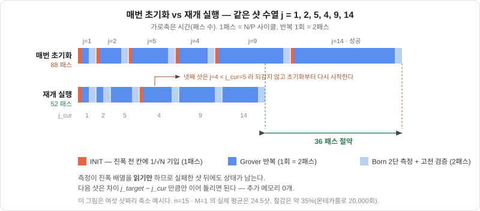

# 16장. 몇 번 돌릴지 모를 때 — BBHT 샷 루프와 재개 캐시

> [← 15장 논문 지도와 설계 결정표](15_논문지도와_설계결정표.md) · [목차](README.md) · [17장 RVX SoC에 붙이기 →](17_RVX_SoC_통합.md)
> **이 장을 읽기 위한 준비**: [4장 양자측정](04_양자측정.md), [6.6절 회로의 순효과는 하나의 유니터리](06_양자회로_모델과_범용성.md#66-회로의-순효과는-하나의-유니터리), [9.6절 지나치면 안 된다](09_그로버_알고리즘.md#96-지나치면-안-된다), [13장 오라클과 확산](13_오라클_확산_측정_데이터패스.md)의 안쪽 FSM(13.1절), [14장 다중 정답](14_다중정답과_최솟값탐색.md).

---

13장은 한 번의 초기화에서 시작해 반복을 몇 바퀴 돌고 측정으로 끝나는 **한 샷** 안을 들여다봤고, 14장은 그 샷의 마지막 단계인 측정을 확률적으로 만들었습니다. 그런데 13장은 내내 "반복 횟수 $R$ 은 정해져 있다"고 가정했습니다. 이 장은 그 가정을 풉니다.

$R$ 을 계산하려면 정답 개수 $M$ 이 필요한데, 우리 IP는 $M$ 을 모릅니다. 모르면 샷 하나로 끝나지 않고 **여러 번 던져야** 하고, 그러면 곧바로 다음 질문이 따라옵니다 — 실패한 샷이 남긴 진폭 배열을 그냥 버릴 것인가? 이 장의 후반부는 그 배열을 버리지 않는 **재개 캐시**를 다룹니다. 이 프로젝트가 기존 그로버 에뮬레이터들과 갈라지는 지점이 바로 여기입니다.

---

## 16.1 왜 M을 모르는가

우리 IP가 푸는 문제는 "`data_mem` 에 담긴 $N$ 개 값 중 술어를 만족하는 인덱스를 찾아라"입니다. 술어는 `value < thr_a` 같은 부등식이고, 임계값 `thr_a` 는 호스트가 CSR로 넘겨줍니다. 그러면 정답 개수 $M$ 은 무엇에 달려 있을까요 — **술어의 종류, 임계값, 그리고 그 순간 메모리에 실려 있는 데이터**입니다. 셋 다 실행 시점에 정해지므로, 합성 시점에는 물론이고 `start` 를 누르는 순간에도 $M$ 을 알 수 없습니다.

$M$ 을 모르면 최적 반복 횟수를 계산할 수 없습니다:

$$R = \frac{\pi}{4}\sqrt{\frac{N}{M}} - \frac12$$

$M$ 이 분모 안에 있으니까요($n=15$ · $M=1$ 이면 $R = 141.7 \to 142$; 값의 정본은 [15.4절](15_논문지도와_설계결정표.md#154-우리-프로젝트의-좌표--확정-설계-결정표)). 그렇다고 "모르니까 넉넉히 많이 돌리자"가 통하지도 않습니다. 9.6절에서 못 박았듯 그로버는 최적점을 지나치면 성공 확률이 **다시 떨어지고 진동**하기 때문입니다. 많이 돌리는 것이 안전한 쪽이 아니라는 점이 이 문제를 어렵게 만듭니다.

양자 알고리즘 쪽에는 정석 처방이 있습니다. **양자 카운팅**(quantum counting) — 그로버 연산자의 고유값에 담긴 각 $\theta$ 를 위상 추정(QPE)으로 읽어 내 $M$ 을 추정하는 방법입니다. 우리는 이것을 설계에서 제외했습니다. 이유는 성능이 아니라 **수 표현**입니다. QPE는 역 양자 푸리에 변환을 쓰고, QFT는 $e^{2\pi i k/2^m}$ 형태의 복소 위상을 곱합니다. 9.8절이 정리한 "표준 그로버는 진폭이 실수를 벗어나지 않는다"는 성질이 여기서 깨지고, 그러면 허수부 배열이 하나 더 생겨 `amp_mem` 이 두 배가 되며, 12장에서 세운 실수 전용 18비트 Q2.16 데이터패스와 13장의 곱셈기 없는 산술이 통째로 무너집니다. 카운팅 하나를 위해 IP 전체를 복소수로 바꾸는 거래는 남는 장사가 아닙니다.

여기서 정직하게 짚고 갈 것이 하나 있습니다. **에뮬레이터에서는 $M$ 을 그냥 세면 됩니다.** `data_mem` 을 32레인으로 한 번 훑으면 $n=15$ 에서 1,024사이클이고, 이는 샷 하나에 드는 시간의 몇 % 수준입니다. 순수 속도만 놓고 보면 세어 놓고 $R$ 을 딱 계산해 도는 쪽이 BBHT보다 빠릅니다. 그럼에도 BBHT를 택하는 이유는 속도가 아니라 **실기 충실도**입니다. 진짜 양자컴퓨터는 진폭 배열을 들여다볼 수 없고, 오라클을 호출해 보는 것 말고는 정답이 몇 개인지 알 방법이 없습니다. $M$ 을 미리 세어 놓고 시작하는 것은 진폭 배열을 훔쳐보는 것과 같은 반칙이고, 그렇게 만든 기계는 "그로버를 돌리는 기계"가 아니라 "그로버처럼 생긴 무언가"가 됩니다. 이 IP의 값어치는 고전 코드보다 빠른 데 있지 않고 **양자 알고리즘의 동작을 결정적이고 재현 가능하게 재현·검증하는 전용 하드웨어**라는 데 있으므로, 충실도가 속도를 이깁니다.

다만 $M$ 을 아는 **비교용 모드**는 남겨 둡니다. $R = \frac{\pi}{4}\sqrt{N/M} - \frac12$ 로 딱 맞게 도는 모드가 있어야 BBHT가 치르는 추가 비용을 숫자로 보일 수 있고, 골든 모델과 대조할 때도 기준선이 됩니다.

---

## 16.2 BBHT — 무작위 j와 1.2배 확대

$M$ 을 모를 때 쓰는 표준 절차가 BBHT(Boyer–Brassard–Høyer–Tapp)입니다. 네 줄이면 끝납니다.

1. $m \leftarrow 1$ 로 시작한다.
2. 샷마다 반복 횟수 $j$ 를 $[0, m)$ 에서 **무작위로** 뽑는다.
3. $j$ 회 반복하고 측정한 뒤, 나온 후보를 고전적으로 검증한다.
4. 실패하면 $m \leftarrow \min(\lambda m, \sqrt N)$ 으로 창을 넓히고 2로 돌아간다. $\lambda = 6/5$.

학부생이 가장 먼저 걸리는 지점은 2번입니다 — **왜 $j$ 를 무작위로 뽑는가?** 그냥 $m-1$ 처럼 가장 큰 값을 쓰거나, 매번 1씩 늘리면 안 되나요?

답은 성공 확률의 모양에 있습니다. $j$ 회 반복한 뒤 정답이 나올 확률은

$$P(j) = \sin^2\!\big((2j+1)\theta\big), \qquad \sin\theta = \sqrt{M/N}$$

로, $j$ 에 대해 **진동**합니다. $n=15$ · $M=1$ 이면 $\theta = 0.3165°$ 이고 최적 $R = 141.7$ 인데, $j$ 를 바꿔 가며 재 보면 이렇습니다:

| $j$ | 0 | 1 | 10 | 50 | 100 | 142 | 143 | 180 | 200 | 250 | 286 | 300 |
|:--|--:|--:|--:|--:|--:|--:|--:|--:|--:|--:|--:|--:|
| $P(j)$ | 0.0% | 0.0% | 1.3% | 28.0% | 80.3% | 100.0% | 100.0% | 83.1% | 63.9% | 13.3% | 0.1% | 3.2% |

$j = 142$ 근처는 100%지만 $j = 286$ 은 **0.1%** 입니다. 최적점을 두 배쯤 지나치면 확률이 거의 0인 골짜기로 떨어진다는 뜻이죠. 만약 $j$ 를 고정한다면, 하필 그 값이 골짜기에 놓였을 때 그 샷은 몇 번을 반복해도 영원히 실패합니다. $[0, m)$ 에서 무작위로 뽑으면 한 샷의 성공 확률이 골짜기 하나에 걸리지 않고 그 구간의 **평균**이 되고, BBHT의 핵심 보조정리는 $m$ 이 충분히 커진 뒤 이 평균이 $1/4$ 아래로 내려가지 않음을 보장합니다. 무작위 $j$ 는 편의가 아니라 알고리즘의 정당성을 떠받치는 요소입니다.

4번의 $\lambda = 6/5$ 도 임의의 숫자가 아닙니다. $\lambda$ 가 1보다 크고 $4/3$ 보다 작으면 총 비용의 상한이 보장된다는 것이 BBHT의 결과이고, $6/5$ 는 그 구간 안의 관습적 선택입니다. 창을 너무 천천히 넓히면 샷 수가 늘고, 너무 빨리 넓히면 최적점을 건너뛴 큰 $j$ 만 뽑히기 때문에 양쪽 다 손해입니다. 상한 $\sqrt N$ 은 $M = 1$ 일 때 최적 $j$ 가 대략 $\frac{\pi}{4}\sqrt N$ 이라는 데서 옵니다 — 그보다 넓은 창은 골짜기만 더 많이 담을 뿐입니다.

---

## 16.3 샷 통계 — 평균 스무 번이 넘는 이유

"한 샷 성공 확률이 $1/4$ 이상이니 평균 네 번쯤 던지면 되겠네"는 이 장에서 가장 흔한 오해입니다. 실제 수치는 이렇습니다(몬테카를로 20,000회, $P=32$ 기준; 값의 정본은 [15.4절](15_논문지도와_설계결정표.md#154-우리-프로젝트의-좌표--확정-설계-결정표)).

| $n$ | $M$ | 평균 샷 | 총 그로버 반복 | naive 패스 | 캐시 패스 | 절감 |
|:-:|:-:|--:|--:|--:|--:|:-:|
| 15 | 1 | **24.5** | 240 | 554 | 362 | **35%** |
| 15 | 4 | 20.9 | 116 | 294 | 195 | 34% |
| 15 | 32 | 15.5 | 36 | 117 | 80 | 32% |
| 15 | 256 | 10.4 | 9 | 50 | 35 | 29% |
| 12 | 1 | 19.1 | 79 | 215 | 143 | 33% |
| 16 | 1 | 26.5 | 348 | 774 | 504 | 35% |

여기서 "패스"는 배열을 한 번 훑는 단위($N/P = 1{,}024$ 사이클)이고, 그로버 반복 한 번은 2패스입니다([13.6절](13_오라클_확산_측정_데이터패스.md#136-왜-2패스인가)).

평균이 24.5샷까지 올라가는 이유는 $m$ 의 성장 곡선에 있습니다. $m$ 은 1에서 출발해 1.2배씩 커지므로 처음 열 샷쯤은 창이 아주 좁습니다 — $n=15$ 의 $m$ 수열은 $1, 1, 1, 1, 2, 2, 2, 3, 4, 5, 6, 7, \dots$ 로 시작하죠. 그 동안 $j$ 는 0에서 6 사이에서만 뽑히는데, 위 표에서 $j = 10$ 일 때조차 성공 확률이 1.3%였습니다. 즉 **초반 샷은 거의 전부 실패하도록 설계되어 있습니다.** 승부가 나기 시작하는 것은 $j$ 가 100 근처($P = 80.3\%$)에 닿을 만큼 $m$ 이 커진 뒤이고, $1.2^k \ge 100$ 을 풀면 $k \approx 25$ 입니다. 관측된 24.5샷이 정확히 그 지점입니다.

BBHT의 "$1/4$ 이상" 보장은 **$m$ 이 충분히 커진 뒤의 하한**이지 첫 샷부터 성립하는 값이 아니라는 것 — 이 구분이 4~5샷과 24.5샷을 가릅니다.

이 사실이 곧바로 **측정 병렬화의 동기**가 됩니다. 샷이 24.5번이면 측정도 24.5번이니까요. [14.5절](14_다중정답과_최솟값탐색.md#145-2단-병렬-측정)의 2단 병렬 측정을 쓰지 않고 진폭을 처음부터 끝까지 직렬로 훑는 CDF 스캔을 쓰면, 같은 조건($n=15$ · $M=1$)의 naive 총비용이 554패스에서 **1,296패스**로 뜁니다. 늘어난 742패스가 전부 측정이니, 직렬 측정에서는 전체 시간의 절반 이상을 측정이 먹는 셈입니다. 그리고 뒤에 나올 재개 캐시의 절감률도 35%에서 **15%** 로 주저앉습니다(1,296 → 1,103). 캐시가 아껴 주는 것은 반복 시간인데 전체가 측정 시간에 지배되면 아껴 봐야 티가 나지 않기 때문입니다. **재개 캐시와 2단 병렬 측정은 따로 고를 수 있는 옵션이 아니라 한 쌍입니다.**

캐시를 켠 기준으로 $n=15$ · $M=1$ 의 전체 실행은 362패스 ≈ 370,812사이클, 100 MHz에서 **3.7 ms** 입니다.

---

## 16.4 바깥 FSM — 샷 루프와 고전 검증

지금까지의 이야기를 회로로 옮기면 13장의 FSM 위에 **바깥 루프**가 한 겹 얹힌 2계층 구조가 됩니다. 아래 그림은 $m$ 갱신과 $j$ 추첨까지 FSM 안에 들어간 **BBHT 자율 모드 기준**입니다.



그림에 보이듯 BBHT 자율 모드의 바깥 샷 루프가 하는 일은 넷입니다. **`m` 레지스터를 갱신**하고, **LFSR로 `j_target` 을 추첨**하고, **`cache_valid` 를 보고 초기화를 건너뛸지 판정**하고, 안쪽 반복이 끝나면 **측정 후보를 받아 검증**합니다. 안쪽 루프는 13장에서 만든 것 그대로 — `S_PASS1`(술어 판정·부호 반전·누산) → `S_MEAN` → `S_PASS2`(확산) 를 $\Delta j$ 번 — 이고, 여기에는 손댈 것이 없습니다. 오라클이 독립된 상태로 보이지 않는 것은 [13.1절](13_오라클_확산_측정_데이터패스.md#131-한-반복-안의-fsm)이 오라클을 1패스에 흡수했기 때문입니다.

새로 등장하는 상태는 `S_VERIFY` 입니다. 측정이 뱉은 후보 인덱스 `cand` 하나로 `data_mem[cand]` 를 읽어 술어를 다시 판정하는, 한두 사이클짜리 고전 확인입니다. 왜 필요한가 — Born 샘플링은 확률적이고 성공 확률이 100%가 아니므로 **오답을 뱉을 수 있기** 때문입니다. 고정소수점 반올림이 확률 분포를 미세하게 흔드는 것까지 감안하면 더욱 그렇습니다. 이 한 칸 확인이 있으면 IP의 출력이 "틀릴 수도 있는 확률적 답"에서 "맞다고 확인된 답, 또는 아직 못 찾음"으로 바뀝니다. 이것이 BBHT 4번의 "실패하면"을 회로가 판정하는 방식이기도 합니다.

가장 바깥에는 **열거 라운드 루프**가 있습니다. 검증을 통과한 후보가 나왔을 때 열거 모드라면 답 하나를 내보내고 끝내는 대신, 그 인덱스의 `found` 비트를 세우고 $m$ 을 1로 되돌린 뒤 다음 라운드를 시작합니다([14.7절](14_다중정답과_최솟값탐색.md#147-열거-모드--마스크로-중복-없이)). 마스크가 바뀌면 문제가 바뀐 것이므로 라운드 사이에는 반드시 초기화가 들어갑니다.

하드웨어 비용은 크지 않습니다. `m` 레지스터 하나, `j_target` 과 `j_cur` 카운터, 난수용 LFSR 하나, 그리고 $m$ 수열을 담은 **`iter_rom`** 입니다. $\lambda = 6/5$ 를 매번 곱하는 대신 수열을 미리 구워 두는 쪽을 택했는데, $n=15$ 에서 항이 **30개**($\sqrt N = 181.02$ 에서 클램프)뿐이라 ROM이 LUT 몇 개면 들어가기 때문입니다($n=12$ 면 24항). 실시간 산술을 피한 이유는 16.9절에서 다시 이야기합니다.

한 가지 더 짚을 것은, 이 바깥 루프를 처음부터 회로로 굳히지는 않는다는 점입니다. 먼저 펌웨어가 매 샷의 $j_{\text{target}}$ 을 절대값으로 CSR에 써 넣고 하드웨어는 시킨 만큼만 도는 **펌웨어 구동 모드**로 재개 캐시의 정확성을 확정하고 — 샷 하나마다 멈춰 세워 골든 모델과 대조할 수 있어 디버깅이 쉽습니다 — 그 다음에 위에서 설명한 $m$ 갱신·$j$ 추첨·검증을 회로로 옮긴 **BBHT 자율 모드**를 얹습니다. 완성한 뒤에도 두 모드는 공존합니다. 펌웨어 구동 모드는 16.1절의 $M$ 을 아는 비교용 모드와 골든 모델 재생에 계속 쓰이고, 자율 모드에서 펌웨어가 보는 것은 설정·`start`·폴링·결과 읽기 네 줄뿐입니다. 어느 쪽이든 `j_cur` 과 `cache_valid` 는 하드웨어가 소유하므로 같은 상태가 두 곳에 생기지 않습니다.

---

## 16.5 재개 캐시 — 측정이 읽기 전용이라는 사실에서

이제 이 장의 본론입니다. 24.5번의 샷 가운데 스물몇 번은 실패인데, 실패한 샷은 무엇을 남길까요?

관찰 하나에서 출발합니다. **`amp_mem` 에 쓰는 주체는 셋뿐입니다** — INIT, 오라클, 확산. 14장에서 만든 Born 측정은 진폭을 순차로 읽어 제곱을 누적하고 누적합이 난수를 넘는 지점을 찾을 뿐, 진폭에 **한 글자도 쓰지 않습니다.** 뒤이은 고전 검증도 `data_mem` 의 한 칸을 읽을 뿐입니다. 그러므로 샷이 실패해 바깥 루프로 돌아온 시점에도 `amp_mem` 에는 **$j_{\text{cur}}$ 회 반복한 상태가 고스란히 남아 있습니다.**

그리고 BBHT의 $j$ 는 $[0, m)$ 에서 뽑히는데 $m$ 은 단조 증가합니다. 다음 샷의 $j_{\text{target}}$ 이 직전의 $j_{\text{cur}}$ 보다 큰 경우가 흔하다는 뜻이고, 그럴 때는 처음부터 다시 돌 이유가 없습니다. 규칙은 세 줄입니다.

```
if (!cache_valid || force_init || j_target < j_cur)   INIT 후 j_target 회 전진
else                                                  (j_target - j_cur) 회만 전진
j_cur <= j_target;  cache_valid <= 1'b1;
```



추가되는 저장 공간은 `j_cur`(16비트)와 `cache_valid`(1비트) **레지스터 두 개가 전부**입니다. **BRAM은 한 개도 늘지 않습니다.** 진폭 배열의 사본을 뜨는 것이 아니라, 이미 거기 있는 배열을 지우지 않는 것이기 때문입니다.

절감 폭은 16.3절 표의 마지막 두 열입니다. $n=15$ · $M=1$ 에서 554패스가 362패스로, **35%** 줄어듭니다. $M$ 이 커지면 애초에 샷 수가 줄어 절감률도 함께 완만히 낮아집니다 — $M{=}4$ 에서 34%, $M{=}32$ 에서 32%, $M{=}256$ 에서 29%입니다(전부 $n=15$ · 몬테카를로 20,000회).

---

## 16.6 왜 결과가 달라지지 않는가

이 절이 이 장에서 가장 중요합니다. 실패한 샷의 상태를 물려받아 이어 돌리는 것이 정말 **같은 알고리즘**인지, 두 층위로 나눠 답해야 합니다.

**첫째, 상태 재현성.** 그로버 한 바퀴를 $G = D \cdot O$(오라클 뒤 확산)라 쓰면, 재개 경로가 만들어 내는 연산열은

$$(D O)^{j_{\text{target}}} = (D O)^{\,j_{\text{target}} - j_{\text{cur}}} \cdot (D O)^{\,j_{\text{cur}}}$$

입니다. 6.6절이 "회로의 순효과는 하나의 유니터리"라고 했던 그 결합법칙이 근거입니다 — 유니터리의 곱은 결합적이므로 어디서 끊어 읽든 순효과가 같습니다. 즉 재개 경로는 새로 INIT해서 $j_{\text{target}}$ 회 돌린 것과 **문자 그대로 같은 연산열**이고, 우리 산술이 결정적(반올림은 round-half-to-even, 포화 지점과 누산 순서 고정)이므로 결과는 근사적으로 같은 정도가 아니라 **비트 단위로 동일**합니다. 이 등식이 [18.7절](18_골든모델_검증.md#187-캐시를-어떻게-검증하나)에서 캐시 검증의 합격 기준이 됩니다.

**둘째, 통계적 정당성.** 여기서 반드시 나오는 질문이 있습니다 — *"앞 샷의 계산을 물려받으면 그건 샷을 여러 번 던진 게 아니라 한 번 길게 돌린 거 아닌가? 반칙 아닌가?"*

아닙니다. 이유는 두 가지입니다. 하나, **$j$ 회 반복한 상태는 도달 경로와 무관하게 유일합니다.** 위 등식이 말하는 것이 정확히 그것이죠. 앞선 샷을 거쳐 왔든 방금 INIT했든, $j_{\text{target}}$ 회 반복한 진폭 배열은 같은 하나입니다. 둘, **측정 난수는 샷마다 LFSR에서 새로 뽑습니다.** 그래서 각 샷은 여전히 $\sin^2((2j+1)\theta)$ 확률로 정답을 내는 **독립 시행**입니다. 결과적으로 후보 인덱스의 분포도, 샷당 성공 확률도, 총 샷 수의 분포도 캐시를 끄나 켜나 똑같습니다. **관측 가능한 출력은 하나도 바뀌지 않고 벽시계 시간만 줄어듭니다.**

다만 정직하게 덧붙일 것이 있습니다. **실기 양자컴퓨터는 이렇게 할 수 없습니다.** [4.4절](04_양자측정.md#44-측정은-상태를-붕괴시킨다)의 붕괴 때문입니다 — 실제 장치에서는 측정하는 순간 중첩이 무너져 진폭이 사라지므로, 다음 샷은 무조건 $|0\cdots0\rangle$ 부터 다시 만들어야 합니다. 우리가 이어 돌릴 수 있는 것은 진폭을 메모리에 펼쳐 놓았고 Born 샘플링을 **읽기 전용**으로 구현했기 때문이지, 양자역학이 그것을 허락해서가 아닙니다. 11장에서 말한 "에뮬레이터가 실기보다 쉬운 것들"의 가장 극적인 사례입니다.

그러므로 보고할 때 두 지표를 반드시 갈라 적습니다. **알고리즘 지표(총 그로버 반복 수)는 여전히 $\sum_k j_k$ 이고, 벽시계 시간만 $\sum_k |\Delta j_k|$ 입니다.** 16.3절 표에서 "총 그로버 반복 240"과 "캐시 패스 362"가 따로 적힌 것이 이 구분입니다. 이걸 섞어 "우리 방식이 그로버 반복을 35% 줄였다"고 쓰면 거짓말이 됩니다 — 줄어든 것은 에뮬레이션 시간이지 알고리즘이 오라클에 던진 질의 횟수가 아닙니다.

---

## 16.7 무효화는 하드웨어가 한다

`cache_valid` 는 한 비트지만, 실제로는 "지금 `amp_mem` 에 들어 있는 것은 **어떤 술어·어떤 임계값·어떤 마스크·어떤 $n$** 으로 $j_{\text{cur}}$ 회 돌린 결과인가"라는 튜플 전체를 요약한 비트입니다. 그 튜플 중 하나라도 바뀌면 남아 있는 진폭은 지금 풀려는 문제의 중간 결과가 아니게 되므로, 즉시 무효가 되어야 합니다.

무효화 조건은 CSR 쓰기와 데이터 적재입니다 — `mode`, `thr_a`, `thr_b`, `n_qubits`, `enum_mode`, `clear_mask` 에 대한 쓰기, 그리고 AHB DMA로 `data_mem` 을 다시 채우는 동작([17.4절](17_RVX_SoC_통합.md#174-csr-맵)). 이때 **하드웨어가 CSR 쓰기 디코드에서 `cache_valid` 를 자동으로 내립니다.**

"펌웨어가 임계값을 바꿀 때 무효화 비트도 같이 쓰면 되지 않나"는 유혹적이지만, 소프트웨어에 맡기면 **반드시 새는 곳이 생깁니다.** 나중에 술어를 하나 더 추가한 사람이 무효화를 빼먹는 순간, 낡은 진폭 위에 새 오라클이 얹혀 **조용히 틀린 답**이 나옵니다. 크래시도 아니고 타임아웃도 아니라 그럴듯한 인덱스가 하나 나오는 종류의 버그라, 시뮬레이션에서 잡기 가장 어렵습니다. 무효화 조건이 CSR 주소 디코드라는 이미 존재하는 신호에서 공짜로 나오는데 그 신뢰를 소프트웨어에 넘길 이유가 없습니다.

한 가지 덧붙이면, **열거 모드에서는 캐시 이득이 0입니다.** 라운드마다 `found` 마스크가 바뀌어 오라클 자체가 달라지므로, 매 라운드가 무효화로 시작하기 때문입니다. 캐시는 한 라운드 안의 샷들 사이에서만 일합니다.

---

## 16.8 기각한 대안

재개 캐시에 도달하기까지 검토하고 버린 안이 셋 있습니다. 왜 버렸는지가 왜 택했는지만큼 중요합니다.

**되감기(양방향 이동).** $O$ 와 $D$ 는 각각 자기 자신이 역원이므로 $G^{-1} = (DO)^{-1} = O D$ 입니다. 즉 이론상으로는 $j_{\text{target}} < j_{\text{cur}}$ 일 때 초기화 없이 **뒤로 감을** 수도 있습니다. 그런데 실측하면 오히려 **1% 더 느립니다** — $j$ 가 절반 넘게 줄어드는 경우가 흔하고, 그럴 때는 INIT 1패스를 치르고 앞으로 가는 편이 되감기보다 쌉니다. 게다가 고정소수점에서 $OD$ 는 $DO$ 의 **정확한** 역이 아닙니다(반올림과 포화는 비가역이니까요). 1%도 안 되는 이득에 가역성 증명이라는 검증 부담을 얹는 거래는 성립하지 않습니다.

**스냅샷 버퍼.** 진폭 배열의 사본을 따로 떠 두었다가 되돌리는 방식입니다. `amp_mem` 이 통째로 하나 더 필요하니 **BRAM36이 16개** 늘고(IP 소계 33 → 49), 그러면서도 저장해 둔 **하나의 $j$** 로만 복귀할 수 있습니다. 비싸면서 동시에 열등한, 드물게 명확한 기각 사례입니다.

**`hit[]` 비트벡터 캐싱.** 술어 판정 결과를 비트벡터로 저장해 두면 오라클을 다시 계산하지 않아도 되지 않을까 — 라는 발상입니다. 사이클 절감이 **정확히 0**입니다. 술어 판정 유닛은 감산기 하나짜리 조합논리이고(13.3절), `data_mem` 읽기가 `amp_mem` 읽기와 **같은 사이클**에 나오기 때문에 아낄 시간이 애초에 없습니다. 무효화해야 할 대상만 하나 더 늘 뿐입니다.

---

## 16.9 아직 정하지 않은 것

이 장의 내용 가운데 아직 확정되지 않은 것이 넷 있습니다. 그럴듯하게 채우지 않고 미정으로 남겨 둡니다.

**1. $M = 0$ 일 때의 종료 조건.** 술어를 만족하는 원소가 하나도 없으면 BBHT는 영원히 실패합니다. 상한($m = \sqrt N$)에 도달한 횟수로 "없음"을 선언할지, `data_mem` 을 고전적으로 1패스 스캔해 확정할지가 미정입니다. 고전 스캔은 $n=15$ 에서 1,024사이클로 샷 하나의 3% 남짓이라 유력하지만, 16.1절에서 세운 "배열을 훔쳐보지 않는다"는 원칙과 어떻게 화해시킬지가 논점입니다(반복 횟수 결정에는 쓰지 않고 종료 판정에만 쓰면 원칙이 유지되는가?). 참고로 **열거 모드에서는 마지막 라운드가 반드시 $M = 0$** 이므로, 이 조건이 곧 열거의 종료 조건 그 자체입니다.

**2. $j \sim U[0, m)$ 의 균등성.** LFSR 출력을 마스킹만 하면 $m$ 이 2의 거듭제곱이 아닐 때 분포가 균등하지 않습니다. 그런데 16.2절의 "성공 확률 $\ge 1/4$" 보장이 균등성을 전제하므로, 기각 샘플링처럼 균등성을 회복하는 규약이 필요합니다. 어떤 규약을 쓸지 미정입니다.

**3. 난수 소비 규약.** LFSR 다항식과 시드, 샷당 난수를 몇 번 뽑는지, 그리고 2단 측정에서 뱅크를 고른 뒤 남은 잔차를 재사용할지 두 번째 난수를 뽑을지가 정해지지 않았습니다. 이것이 다르면 골든 모델과 RTL이 **영원히 bit-exact가 되지 않습니다**([18.3절](18_골든모델_검증.md#183-bit-exact가-성립하기-위한-조건)). 미루면 안 되는 미정 사항입니다.

**4. $m \leftarrow \min(1.2m, \sqrt N)$ 의 하드웨어 산술.** 1.2배는 시프트로 떨어지지 않고, $\sqrt N = 181.02$ 라는 클램프도 2의 거듭제곱이 아닙니다. 16.4절의 `iter_rom` 30항이 현재 안이지만 확정은 아닙니다.

---

## 16.10 이 장의 요약

- **$M$ 을 모른다**: 정답 개수는 술어·임계값·데이터에 달려 실행 시점에야 정해지므로 $R = \frac{\pi}{4}\sqrt{N/M} - \frac12$ 을 미리 계산할 수 없고, 9.6절 때문에 "넉넉히 많이"도 안 통합니다.
- **양자 카운팅(QPE)은 제외**: 복소수를 강제해 실수 전용 18비트 Q2.16 데이터패스가 무너지기 때문. 성능 문제가 아니라 수 표현 문제입니다.
- **그래도 BBHT를 쓰는 이유는 속도가 아니라 충실도**: 에뮬레이터에서 $M$ 을 세는 비용은 샷 하나의 몇 %뿐이라 세고 시작하는 쪽이 빠르지만, 그것은 진폭 배열을 훔쳐보는 반칙입니다.
- **BBHT**: $m \leftarrow 1$, 샷마다 $j \sim U[0,m)$ **무작위**, 실패하면 $m \leftarrow \min(\frac65 m, \sqrt N)$. $j$ 를 무작위로 뽑는 이유는 $P(j) = \sin^2((2j+1)\theta)$ 가 진동하기 때문 — $n=15$·$M=1$ 에서 $j{=}142$ 는 100%인데 $j{=}286$ 은 0.1%입니다.
- **평균 24.5샷**($n=15$·$M=1$·몬테카를로 20,000회): $m$ 이 1부터 1.2배씩 커져 초반 샷은 거의 전부 실패하도록 되어 있습니다. "4~5회"가 아닙니다. 이것이 2단 병렬 측정이 필요한 이유이기도 합니다.
- **바깥 FSM 2계층**: 샷 루프($m$ 갱신 · LFSR로 $j$ 추첨 · `cache_valid` 판정) + 안쪽 반복(13장) + `S_VERIFY`(한 칸 고전 확인) + 열거 라운드 루프. 추가 하드웨어는 레지스터 몇 개와 `iter_rom` 30항. 이 샷 루프는 펌웨어가 $j_{\text{target}}$ 을 절대값으로 지정하는 **펌웨어 구동 모드**와 하드웨어가 스스로 도는 **BBHT 자율 모드** 둘로 구동되며, `j_cur` 과 `cache_valid` 는 어느 쪽에서도 하드웨어가 소유합니다.
- **재개 캐시**: `amp_mem` 에 쓰는 것은 INIT·오라클·확산 셋뿐이고 Born 측정은 읽기 전용이므로, 실패한 샷의 상태가 그대로 남습니다. $j_{\text{target}} \ge j_{\text{cur}}$ 이면 차이만큼만 전진 — **추가 BRAM 0개로 35% 절감**($n=15$·$M=1$).
- **결과는 안 바뀝니다**: $(DO)^{j} = (DO)^{j - j_{\text{cur}}}(DO)^{j_{\text{cur}}}$ 라 비트 단위로 같은 상태이고(6.6절), 측정 난수는 샷마다 새로 뽑으므로 각 샷은 여전히 독립 시행입니다. 벽시계만 줄고 관측량은 그대로 — 단 **실기 양자는 못 하는 반칙**이고, 알고리즘 지표는 $\sum j_k$, 벽시계는 $\sum|\Delta j_k|$ 로 갈라 적습니다.
- **무효화는 하드웨어가**: 술어·임계값·$n$·열거 플래그·마스크·데이터 재적재 CSR 쓰기에서 자동으로 `cache_valid` 를 내립니다. 소프트웨어에 맡기면 조용히 틀리는 버그가 납니다. 열거 모드는 매 라운드 무효화되므로 캐시 이득이 0.
- **기각한 대안**: 되감기(1% 느리고 고정소수점에서 정확한 역이 아님) · 스냅샷 버퍼(+16 BRAM36인데 한 지점으로만 복귀) · `hit[]` 캐싱(사이클 절감 0).
- **미정 4가지**: $M{=}0$ 종료 조건 · $j$ 추첨의 균등성 · 난수 소비 규약 · $m$ 갱신 산술.

이것으로 한 샷 안(13·14장)과 샷 바깥(16장)의 제어가 모두 정리됐습니다. 다음 17장은 이 IP를 혼자 두지 않고 RVX SoC에 붙입니다 — 호스트 PC가 UART로 명령을 보내고, RISC-V 코어가 APB로 CSR을 쓰고, IP가 AHB 마스터로 데이터를 끌어오는 경로입니다.

---

> [← 15장 논문 지도와 설계 결정표](15_논문지도와_설계결정표.md) · [목차](README.md) · [17장 RVX SoC에 붙이기 →](17_RVX_SoC_통합.md)
