# 17장. RVX SoC에 붙이기 — APB CSR · AHB DMA · UART

> [← 16장 몇 번 돌릴지 모를 때](16_반복제어와_재개캐시.md) · [목차](README.md) · [18장 무엇을 어떻게 증명하나 →](18_골든모델_검증.md)
> **이 장을 읽기 위한 준비**: [13장 오라클과 확산](13_오라클_확산_측정_데이터패스.md), [16장 BBHT 샷 루프와 재개 캐시](16_반복제어와_재개캐시.md).

---

13·14·16장에서 IP 안쪽은 다 만들었습니다. 진폭 배열이 있고, 술어를 판정하는 오라클이 있고, 평균으로 되비추는 확산이 있고, Born 샘플러가 있고, 그 위에 샷 루프와 재개 캐시가 얹혀 있습니다. 그런데 이 회로에는 아직 `start` 를 눌러 줄 사람도, 데이터를 넣어 줄 사람도, 답을 받아 갈 사람도 없습니다.

이 장은 그 바깥을 붙입니다. 호스트 PC가 UART로 명령을 보내고, RISC-V 코어가 APB로 설정 레지스터를 쓰고, IP가 AHB 마스터로 데이터를 끌어오는 경로입니다. FPGA를 다뤄 본 독자에게는 이 장이 가장 손에 잡히는 장일 것입니다.

---

## 17.1 가속기는 혼자 서지 않는다

우리 IP가 실제로 잘하는 일은 하나뿐입니다 — **$N$ 개 진폭을 한꺼번에 훑어 갱신하는 것**. 32레인이 매 사이클 32칸씩 부호를 뒤집고 평균으로 되비추는 일은 규칙적이고, 분기가 없고, 데이터에 따라 흐름이 바뀌지 않습니다. 하드웨어가 압도적으로 유리한 종류의 계산입니다.

반대로 이 IP를 실제로 **쓰는** 과정은 정반대의 성격을 가집니다. 어떤 술어를 쓸지 정하고, 임계값을 넘기고, 샷이 실패하면 다시 시도하고, 열거 모드라면 몇 번 더 돌릴지 판단하고, 결과를 사람이 읽을 형태로 찍어 내는 일 — 전부 분기와 루프와 예외 처리입니다. 이런 것을 상태기계로 굳혀 넣으면 조건 하나 바뀔 때마다 재합성해야 하고, 합성에 걸리는 시간이 실험 한 번의 시간을 압도하게 됩니다.

그래서 경계를 이렇게 긋습니다. **진폭 갱신은 하드웨어가, 판정과 재시도와 표시는 소프트웨어가.** 정확히 말하면 소프트웨어가 하는 일은 "설정을 쓰고 `start` 를 누르고 `status` 를 폴링하고 결과를 읽는" 몇 줄이며, 그 몇 줄이 유연해야 하는 부분 전부를 흡수합니다.

이 구도가 임의로 고른 편의가 아니라는 점을 짚어 둘 필요가 있습니다. **실제 양자컴퓨터도 똑같이 생겼습니다.** 양자 프로세서는 회로 하나를 실행하고 측정 결과를 뱉을 뿐이고, "몇 번 더 돌릴지, 다음에 어떤 파라미터를 넣을지"는 옆에 붙은 고전 제어 컴퓨터가 정합니다. 초전도 큐비트든 이온 트랩이든, 사용자가 실제로 이야기를 나누는 상대는 언제나 그 고전 컴퓨터입니다. 우리가 RISC-V 코어를 옆에 두는 것은 에뮬레이터를 편하게 만들려는 타협이 아니라 **실기의 구조를 그대로 흉내 내는 것**입니다. 16.1절에서 "충실도가 속도를 이긴다"고 한 원칙이 시스템 층에서도 똑같이 적용됩니다.

---

## 17.2 RVX가 무엇인가

**RVX**(RISC-V eXpress)는 ETRI(한국전자통신연구원)에서 만든 MCU급 저전력 SoC 개발 키트입니다. 우리가 하려는 일 — "직접 만든 가속기 IP를 RISC-V SoC에 붙여 FPGA에 올린다" — 이 정확히 RVX가 상정한 사용 시나리오입니다.

RVX의 핵심은 **플랫폼 XML 하나에서 SoC 전체가 생성된다**는 점입니다. 예제 `lec_ahb` 의 XML은 40줄이 채 안 되는데, 그 안에는 SRAM 용량(`sram_size`), UART·SPI·I2C 개수, 타이머 포함 여부(`include_timer`), SPI 플래시(`include_spi_flash`), OLED, LED 체커 같은 스펙 정의와, 인스턴스로 꽂을 IP 목록이 들어 있습니다. 코어는 `rvc_orca` 라는 RV32 코어를 `i_main_core` 로 하나 얹고, 우리 IP는 `user_masterif_ahb_clkin`(AHB 마스터 심)과 `user_slaveif_apb_clkin`(APB 슬레이브 심) 두 개의 인스턴스로 선언합니다. 코어와 주변장치와 우리 IP 사이를 잇는 인터커넥트는 **munoc** 입니다.

이 XML로부터 생성되는 것이 SoC RTL만이 아니라는 점이 중요합니다. 이 서버에 남아 있는 예제 플랫폼의 생성 결과를 열어 보면 다음이 전부 자동으로 나옵니다.

- **메모리맵 헤더** `memorymap_info.h` — `I_SYSTEM_SRAM_BASEADDR 0xe0000000`, `I_SYSTEM_SRAM_SIZE 0x20000`(128 kB), 주변장치 그룹의 베이스 주소들.
- **하드웨어 정보 헤더** `hw_info.h` — `SRAM_SIZE`, `SYSTEM_CLK_HZ`, `CORE_CLK_HZ`, `UART_CLK_HZ`, 포함된 옵션 매크로들.
- 우리 IP의 슬레이브 베이스 주소 매크로. 인스턴스 이름이 `i_simd_slave` 면 `I_SIMD_SLAVE_SLAVE_BASEADDR` 로 나옵니다.
- 같은 내용의 Verilog 버전(`platform_info.vh`), Vivado용 TCL, 부트롬, 시뮬레이션 환경.

즉 "레지스터 주소를 RTL과 C 헤더에 두 번 적고 나중에 어긋나는" 고전적인 사고를 구조적으로 막아 줍니다. 이 점 하나만으로도 손으로 SoC를 조립하는 것보다 낫습니다.

보드 정의는 `imp_class_info/` 아래에 따로 있고, 우리가 쓸 `arty-50` 항목에는 `part` 가 `xc7s50csga324-1`, 외부 클럭 100 MHz, 컨피그 플래시 `mt25ql128`(SPI x4), USB-UART 브리지 `0403:6010:01` 로 적혀 있습니다. 같은 디렉터리에 `arty-35t` 와 `arty-100t` 도 있어서 보드를 바꾸는 것은 `TARGET_IMP_CLASS` 를 바꾸는 일이 됩니다.

한 가지 실무적인 제약이 있습니다. 이 서버에 설치된 것은 **RVX Mini** — README의 표현대로 "독립 실행형이 아니라 RVX 서버와 함께 동작하도록 만든 최소 버전"입니다. 따라서 플랫폼 생성·합성·비트스트림은 전부 **원격 RVX 서버**에서 돌고, 로컬에는 소스와 Makefile만 있습니다. 18.9절에서 다시 말하겠지만 로컬에는 `iverilog`·`verilator`·`gtkwave` 만 있고 `vivado` 는 없으므로, 기능 검증은 로컬에서 하고 합성·구현은 서버에서 하는 두 갈래 흐름이 됩니다.



---

## 17.3 왜 APB와 AHB를 같이 쓰나

버스를 두 개 쓰는 것이 낭비처럼 보일 수 있으니, 우리 IP가 버스로 하는 일이 성격이 완전히 다른 두 가지라는 점부터 짚겠습니다.

첫째는 **설정과 상태**입니다. 술어 두 비트, 임계값 16비트, `start` 한 비트, `status` 몇 비트. 한 번 실행에 몇십 바이트가 오갈 뿐이고, 그나마 실행 전후에만 오갑니다. 여기에 필요한 것은 대역폭이 아니라 **주소로 레지스터를 콕 집는 능력**과 **적은 게이트**입니다.

둘째는 **배열 적재**입니다. $n=15$ 면 `data_mem` 에 64 KB를 채워야 하고, 이것은 연속된 주소를 죽 읽어 오는 일입니다. 여기에 필요한 것은 정반대로 **버스트 전송**입니다. 워드 하나마다 주소를 새로 실어 보내면 대역폭이 절반 이하로 떨어지니까요.

AMBA 계열의 세 버스는 정확히 이 스펙트럼 위에 놓여 있습니다. **APB**는 가장 단순합니다 — 셋업/액세스 2상(phase)에 버스트도 파이프라인도 없고, 한 번에 워드 하나입니다. 대신 슬레이브 구현이 조합논리 몇 줄이면 끝납니다(RVX의 `lec_apb` 예제가 딱 그렇습니다: 주소 디코드 `case` 문 하나, `rpready` 는 상수 1). **AHB**는 파이프라인된 주소/데이터 위상과 버스트를 지원합니다 — `HTRANS` 로 NONSEQ/SEQ/BUSY를 구분하고 `HBURST` 로 INCR4/8/16을 지정합니다. 마스터를 직접 쓸 만한 복잡도이면서 버스트가 되는, 우리 용도에 딱 맞는 자리입니다. **AXI**는 읽기와 쓰기 채널이 따로 있고 아웃오브오더 완료와 다중 미해결 트랜잭션을 지원합니다. 강력하지만 우리처럼 순차 스트리밍만 하는 IP에게는 쓰지 않을 기능에 대한 로직 비용입니다.

그래서 결론은 **CSR은 APB 슬레이브, 데이터 적재는 AHB 마스터**입니다. RVX가 두 심을 모두 제공하고 예제(`lec_ahb`)가 정확히 이 조합 — AHB 마스터 하나 + APB 슬레이브 하나 — 으로 되어 있으니, 우리는 검증된 배선을 그대로 따라가면 됩니다.

여기서 이전 설계안 하나가 폐기되었음을 명시해 둡니다. 초기에는 데이터를 **AXI-Stream** 으로 흘려 넣는 `data_loader` 를 상정했습니다. 이 안은 못 씁니다 — **RVX 라이브러리에 AXI-Stream 심이 아예 없기 때문입니다.** 실제로 `env/info/rvx_library.xml` 에 등록된 사용자 인터페이스 심을 전부 열거하면 마스터 쪽이 `moi`·`ahb`·`axi`·`axi4`·`axi4l`, 슬레이브 쪽이 `apb`·`ahb`·`axi`·`axi4`·`axi4l` 이고(각각 `_clkin`/`_clkout` 두 벌), 스트림 계열은 한 줄도 없습니다. 심이 없으면 인터커넥트에 붙일 방법이 없고, 그러면 그 IP는 SoC 바깥의 섬이 됩니다. 도구가 제공하는 것과 설계가 요구하는 것이 어긋날 때는 대개 설계를 고치는 쪽이 싸며, 이 경우는 특히 그렇습니다 — 우리가 필요한 것은 스트림의 흐름 제어가 아니라 그냥 연속 주소 읽기였고, AHB INCR16이 그 일을 합니다.

심 이름 끝의 `_clkin` / `_clkout` 도 한 번은 짚고 갈 값어치가 있습니다. `_clkin` 은 IP가 SoC로부터 클럭을 **받는** 형태이고, 예제에서는 `i_simd_master_clk` 에 `clk_core` 를 그대로 연결합니다. `_clkout` 을 쓰면 IP가 자기 클럭을 **내보내** 별도 클럭 도메인으로 돌 수 있는 대신 도메인 크로싱을 책임져야 합니다. 우리는 처음에는 `_clkin` 으로 코어와 같은 도메인에서 돌리는 쪽이 안전합니다.

---

## 17.4 CSR 맵

RVX에는 CSR 블록을 손으로 짜는 길과 생성기를 쓰는 길이 둘 다 있습니다. `lec_apb` 예제의 `test1_apb.v` 는 주소 디코드 `case` 문을 손으로 쓴 100줄짜리 APB 슬레이브이고, `lec_ahb` 예제의 `lec_simd_mmio.v` 는 생성기가 뽑아 준 모듈입니다. 생성기 쪽 규약을 예제에서 확인한 대로 적으면 이렇습니다.

- **레지스터 간격이 8바이트입니다.** 생성된 헤더에 `LEC_SIMD_ADDR_INTERVAL 8`, `BW_UNUSED_LEC_SIMD 3` 이 박혀 있고, 오프셋이 `0x0, 0x8, 0x10, 0x18, …` 로 나갑니다. 데이터는 32비트인데 간격은 64비트라 절반이 비지만, 주소 디코드가 단순해지는 대가입니다. 정렬되지 않은 접근과 미할당 주소는 `rpslverr` 로 떨어집니다.
- **쓰기 전용 명령 레지스터는 펄스입니다.** `start` 는 저장 공간이 없고, 쓰기가 들어오면 `lec_simd_start_write_cmd` 라는 **한 사이클 펄스**만 나갑니다(읽으면 0). 무엇을 썼는지는 무시되며 — 예제 API도 `REG32(MMAP_LEC_SIMD_START) = 0;` 으로 그냥 0을 씁니다 — "쓰는 행위" 자체가 명령입니다.
- **읽기 전용 상태 레지스터는 입력 포트입니다.** `state` 는 레지스터가 아니라 `lec_simd_state_input` 이라는 입력 포트로 들어오고, MMIO 블록은 읽기 요청을 그대로 그 포트 값으로 응답합니다. 예제에서는 AHB 마스터의 FSM 상태가 곧장 여기 물려 있어서, 소프트웨어는 `while(get_state()!=0);` 로 완료를 폴링합니다.
- **일반 설정 레지스터는 MMIO 블록 안에 저장됩니다.** 리셋값이 `*_DEFAULT_VALUE` 매크로로 같이 생성되고, 값은 출력 와이어로 상시 나갑니다. `rpready` 는 상수 1이라 대기 상태가 없습니다.

이 규약 위에 올린 우리 IP의 CSR 맵 초안입니다. 확정이 아니며(17.8절), 특히 오프셋은 생성기가 다시 매길 수 있습니다.

| 오프셋 | 이름 | 폭 | 접근 | 뜻 | 캐시 무효화 |
|---|---|:-:|:-:|---|:-:|
| `0x00` | `mode` | 2b | RW | 술어 선택 — 0:`<` 1:`>` 2:`==` 3:범위 | ● |
| `0x08` | `thr_a` | 16b | RW | 임계값 A (signed) | ● |
| `0x10` | `thr_b` | 16b | RW | 임계값 B — 범위 술어의 상한 (signed) | ● |
| `0x18` | `n_qubits` | 5b | RW | 유효 큐비트 수 ($N = 2^n$) | ● |
| `0x20` | `enum_mode` | 1b | RW | 0:하나만 반환 1:열거 | ● |
| `0x28` | `j_target` | 16b | RW | 이번 샷의 목표 반복 횟수 (**절대값**) | |
| `0x30` | `data_addr` | 32b | RW | DMA 원본 주소 (SoC SRAM) | ● |
| `0x38` | `data_words` | 32b | RW | 적재할 32비트 워드 수 | ● |
| `0x40` | `clear_mask` | — | W1P | `mask_mem` 전체 클리어 펄스 | ● |
| `0x48` | `load_start` | — | W1P | DMA 시작 펄스 | ● |
| `0x50` | `force_init` | — | W1P | 캐시를 강제로 버리고 초기화부터 | ● |
| `0x58` | `start` | — | W1P | 샷 시작 펄스 | |
| `0x60` | `status` | 6b | RO | bit0 `busy` · bit1 `done` · bit2 `verify_hit` · bit3 `cache_valid` · bit4 `sat_sticky` · bit5 `too_many` | |
| `0x68` | `cand` | 15b | RO | 검증을 통과한 후보 인덱스 | |
| `0x70` | `j_cur` | 16b | RO | 지금 `amp_mem` 에 실려 있는 반복 횟수 | |
| `0x78` | `cycle_cnt` | 32b | RO | 마지막 `start` 이후 소비한 사이클 | |
| `0x80` | `passes_run` | 32b | RO | 누적 패스 수 (알고리즘 지표) | |

`j_target` 이 **절대값**인 이유를 하나 짚습니다. 16.5절의 재개 캐시 판정식은 `j_target < j_cur` 이므로 두 값이 같은 원점을 공유해야 합니다. 만약 CSR로 $\Delta j$ 를 받으면 펌웨어가 `j_cur` 을 따로 추적해야 하고, 그 순간 16.7절이 경계한 "상태를 소프트웨어에 맡기는" 구조가 되돌아옵니다. 절대값을 넘기면 차이 계산은 하드웨어가 하고, 펌웨어는 자기가 무엇을 요청했는지만 알면 됩니다. 참고로 BBHT 자율 모드에서는 하드웨어의 LFSR이 매 샷 이 레지스터를 갱신하고, 펌웨어 구동 모드에서는 앱이 직접 씁니다 — 재개 캐시의 정확성을 먼저 증명하는 개발 단계(Phase 5a), $M$ 을 아는 비교 모드, 골든 모델과의 비트정확 대조 세 자리입니다(17.7절).

표 오른쪽 열이 이 절에서 가장 중요한 배선입니다. **● 표시가 붙은 레지스터에 쓰기가 들어오면 그 자리에서 `cache_valid` 가 0으로 떨어집니다.** 16.7절에서 세운 원칙 — 무효화를 소프트웨어에 맡기면 반드시 새는 곳이 생긴다 — 을 회로로 옮긴 것이고, 구현은 단순합니다. 주소 디코더가 이미 레지스터별 쓰기 스트로브를 만들고 있으므로, 그 스트로브들의 OR를 `cache_valid` 의 클리어 입력에 물리면 끝입니다. 게이트 몇 개짜리 배선이 "낡은 진폭 위에 새 오라클이 얹혀 조용히 틀린 답이 나오는" 종류의 버그를 통째로 없앱니다.

다만 이 배선에는 도구 쪽 확인이 하나 필요합니다. 예제의 생성된 MMIO 블록이 **바깥으로 내보내는 쓰기 스트로브는 명령형 레지스터(`start`)의 것 하나뿐**이고, 일반 설정 레지스터의 `we` 는 모듈 안에 갇혀 있습니다. 그러니 무효화 OR를 만들려면 (a) 생성기 입력 XML에서 설정 레지스터에도 쓰기 스트로브를 내보내게 하거나, (b) `test1_apb.v` 처럼 APB 디코드를 손으로 쓰거나 둘 중 하나입니다. 생성기 입력 XML의 스키마는 예제 디렉터리에서 정리(distclean)되어 남아 있지 않아 **확인 필요**입니다. 확인 전까지는 (b)를 기본안으로 둡니다 — 손으로 써도 100줄이고, 스트로브를 우리가 다 쥐게 됩니다.

표에서 다른 절이 요구해 들어온 항목이 둘 있습니다. `force_init` 은 무효화 배선과 방향이 반대인 문입니다 — 설정이 그대로여도 캐시를 일부러 버리고 초기화부터 돌리고 싶을 때 쓰며, [16.5절](16_반복제어와_재개캐시.md#165-재개-캐시--측정이-읽기-전용이라는-사실에서) 판정식의 둘째 항이 이 비트이고 [18.7절](18_골든모델_검증.md#187-캐시를-어떻게-검증하나)의 재개 검증이 그 자리입니다. `status.sat_sticky` 는 [12.5절](12_고정소수점과_정밀도.md#125-오버플로-정책--포화랩-금지재정규화-없음)의 포화가 한 번이라도 일어났는지를 남기는 끈적이 비트입니다. 포화는 값을 상한에 붙일 뿐 아무 신호도 내지 않으므로, 이 비트가 없으면 정책이 실제로 발동했는지 관측할 방법이 없습니다.

---

## 17.5 데이터 적재 — AHB 마스터

$n=15$ 이면 `data_mem` 은 32,768개 × 16비트 = **64 KB**입니다. 이것을 SoC의 시스템 SRAM에서 IP 안으로 옮기는 것이 AHB 마스터가 하는 유일한 일입니다.

`lec_ahb` 예제의 마스터가 쓰는 규약을 그대로 가져오면 이렇습니다. 버스트는 `HBURST = INCR16`, 전송 크기는 `HSIZE = 4바이트`, 즉 **32비트 전송(beat) 16개짜리 증가 버스트 = 버스트당 64바이트**입니다. 주소 위상은 매 전송마다 주소를 4씩 올리고, 소비 쪽(FIFO)이 못 받으면 `HTRANS = BUSY` 를 실어 버스트를 끊지 않은 채 기다립니다. 64 KB를 이 규약으로 옮기면 32비트 워드 16,384개, INCR16 버스트 **1,024개**입니다. 전송 하나가 16비트 데이터 두 칸을 실어 나르므로 폭도 딱 맞습니다.

이상적으로 사이클당 한 전송이면 16,384사이클, 100 MHz에서 **약 0.16 ms**입니다. $n=15$·$M=1$ 탐색 한 번이 3.7 ms(캐시 패스 362회 기준, 값의 정본은 [15.4절](15_논문지도와_설계결정표.md#154-우리-프로젝트의-좌표--확정-설계-결정표))이므로 적재는 그 4% 남짓입니다. 실제로는 버스가 코어와 공유되고 SRAM 대기가 붙으므로 더 걸리지만, 자릿수가 바뀌지는 않습니다. 데이터를 한 번 올려 두고 임계값만 바꿔 가며 여러 번 탐색하는 사용 패턴이라면 적재 비용은 더 희석됩니다.

최소한의 규약 세 가지를 못 박아 둡니다.

**적재 중에는 `start` 를 받지 않습니다.** `load_start` 를 쓴 뒤에는 `status.busy` 가 서고, 그동안 들어온 `start` 펄스는 무시됩니다. 이유는 자명합니다 — 절반만 채워진 `data_mem` 위에서 오라클을 돌리면 아무 경고 없이 틀린 답이 나옵니다. 예제 API도 같은 모양입니다: `lec_simd_wait_until_done()` 이 `state` 가 0이 될 때까지 폴링합니다.

**워드 수는 16의 배수여야 합니다.** INCR16 버스트를 끊지 않으려면 전송 개수가 버스트 길이의 배수여야 하고, 예제 API는 아예 배수가 아니면 오류 플래그를 세워 `wait_until_done()` 에서 영원히 멈춰 버립니다. 우리 쪽은 $N/2$ 워드가 항상 16의 배수라($n \ge 5$) 자연히 만족되지만, 규약으로 명시해 두는 편이 낫습니다.

**적재는 캐시를 무효화합니다.** 17.4절 표의 마지막 열대로 `load_start` 는 ● 입니다. 데이터가 바뀌면 술어가 같아도 정답 집합이 달라지므로, 남아 있던 진폭은 의미가 없습니다.

여기에 시스템 층의 제약이 하나 걸립니다. **64 KB 배열은 RVX SRAM에 그냥 얹기에는 큽니다.** `sram_size` 는 XML에서 16 kB~128 kB 범위로 지정하는데, 예제 `lec_ahb` 의 기본값은 64 kB — 즉 배열 하나로 SRAM 전체를 다 씁니다. 프로그램과 스택이 들어갈 자리가 없으므로 최소한 128 kB로 올려야 하고, 그러면 배열 64 KB + 코드·스택 64 KB로 빠듯하게 맞습니다. 다만 이 선택은 BRAM 예산과 곧장 묶여 있습니다. 15.5절이 SoC 몫으로 잡은 대략 15개는 **SRAM 64 kB 기준**이고 그 몫의 거의 전부를 SRAM이 차지하므로, 128 kB로 올리면 SoC 몫도 대략 두 배가 되어 IP 소계 33개와 합친 값이 75개에 훨씬 가까워집니다. 정확한 증분은 Phase 0에서 두 구성을 각각 합성해 재야 하고(17.8절), 그때까지 "~48/75"는 SRAM 64 kB 가정이라는 단서를 달고 읽어야 합니다. 그래도 부족하면 보드에 DDR3가 있으므로 DRAM 옵션이 남아 있습니다(`arty-50` 정의에 `<dram>ddr3</dram>`; 다만 우리 플랫폼에서 켜 본 적이 없어 **확인 필요**).

벤치마크용으로는 더 싼 길이 있습니다. **온칩 난수 생성기** — 생성기 한 벌을 IP 안에 두고 `data_mem` 을 시드 하나로부터 채우는 것입니다. 시프트와 XOR만 쓰는 xorshift/LFSR로 짜면 레지스터 몇 개와 게이트 몇 개면 되고, 적재가 $N/P$ 사이클로 끝나며, 무엇보다 **호스트와 SoC SRAM을 아예 건너뜁니다.** 시드가 같으면 배열이 같으므로 재현성도 확보됩니다. 흔히 쓰는 선형 합동 생성기(LCG)를 그대로 가져오지 않는 것은 예산 때문입니다 — 32비트 곱셈은 Spartan-7의 DSP48 하나에 들어가지 않아 여러 개가 잡히고, 그러면 13.8절이 세운 "DSP는 측정 경로의 32개뿐"이라는 점검 기준이 흐려집니다. 곱셈 없는 생성기를 쓰면 그 기준이 그대로 유지됩니다. 실사용 데이터를 넣으려면 DMA 경로가 필요하지만, "$M$ 을 바꿔 가며 샷 수를 재는" 종류의 실험에는 생성기 쪽이 압도적으로 편합니다. 두 경로를 모두 두고 CSR로 고르는 것이 현재 안입니다.

---

## 17.6 호스트 UART 프로토콜

호스트 PC와 SoC 사이의 물리 경로는 UART 하나입니다. `arty-50` 정의에 USB-UART 브리지(`0403:6010:01`)가 잡혀 있고, 플랫폼 XML에서 `num_uart_readymade` 를 1로 두면 그 UART가 SoC에 들어옵니다. RVX의 시스템 소프트웨어는 `uart_config(index, baud_rate)`, `uart_putc/getc`, `uart_puts` 를 제공하고, `printf` 도 이 UART로 나갑니다(기본 보율은 소스에서 확인하지 못했습니다 — **확인 필요**. 아래 계산은 흔한 115200 8N1을 가정합니다).

프로토콜은 **ASCII 라인 기반**을 권합니다. 바이너리 프레임보다 느리지만, 이 경로로 오가는 것이 원래 몇십 바이트뿐이라 속도가 문제가 되지 않고, 대신 얻는 것이 큽니다 — 터미널을 열어 손으로 명령을 쳐 볼 수 있고, 로그가 그대로 사람이 읽는 문서가 되며, 체크섬이 어긋났는지 파싱이 어긋났는지 눈으로 구분됩니다. 브링업 단계에서 이 차이는 며칠을 좌우합니다.

초안은 이 정도면 충분합니다.

```
> SET MODE=LT THR_A=1234        # 술어와 임계값
< OK

> RUN                            # 한 개 찾기
< HIT idx=12045 val=87 shots=23 cycles=372104

> ENUM                           # 열거 모드 시작
< HIT idx=12045
< HIT idx=3391
< ...
< END count=17
```

열거 모드의 흐름은 반복 호출입니다. 펌웨어가 `enum_mode` 를 세우고 라운드를 돌 때마다 해 하나가 나오고, 그때마다 `found` 비트가 서고 캐시가 무효화되며(16.7절), 정답이 남지 않으면 종료합니다. 호스트 입장에서는 `HIT` 줄이 계속 오다가 `END` 로 닫히는 스트림으로 보입니다. 해가 `M_max` 를 넘으면 `status.too_many` 가 서고 호스트에는 그 사실이 그대로 전달됩니다.

**이 경로로 데이터 배열을 보내지는 않습니다.** 계산해 보면 이유가 분명합니다. 64 KB를 115200 bps · 8N1(바이트당 10비트)로 보내면 655,360비트 ÷ 115,200 = **약 5.7초**입니다. 탐색 자체가 3.7 ms인데 데이터를 넣는 데 5.7초를 쓰는 것은 — 그것도 ASCII 16진수로 보내면 두 배인 11초 — 실험 회전율을 완전히 망칩니다. 게다가 이 5.7초 동안 UART는 `printf` 로도 못 씁니다. 그래서 배열은 온칩 난수 생성기로 만들거나(17.5절), 부팅 시 SPI 플래시에서 SRAM으로 올리거나, 정말 호스트에서 보내야 한다면 한 번만 보내고 여러 실험에 재사용하는 쪽이 맞습니다. UART로 오가는 것은 **명령과 결과뿐**이라는 원칙을 세워 두면 이 함정을 피할 수 있습니다.

---

## 17.7 하드웨어와 펌웨어의 경계

지금까지 나온 역할 분담을 한 표로 모읍니다. 각 항목의 근거는 "왜 그쪽인가" 열에 있습니다.

| 하는 일 | 어디서 | 왜 |
|---|:-:|---|
| 진폭 갱신 (오라클 · 확산 · INIT) | HW | 32칸 병렬, 분기 없음 |
| Born 측정 2단 샘플링 | HW | 진폭 배열 전체를 읽어야 함 (14.5절) |
| `S_VERIFY` 한 칸 검증 | HW | `data_mem` 이 IP 안에 있음 |
| `j_target` 추첨 · `m` 갱신 | HW | 샷마다 필요, 왕복 지연이 아까움 (펌웨어 구동 모드에서는 FW가 씀) |
| 재개 캐시 판정 (`j_target` vs `j_cur`) | HW | 상태를 SW에 맡기면 샙니다 (16.7절) |
| `cache_valid` 무효화 | HW | 위와 같음 |
| 술어 · 임계값 결정 | FW | 응용에 따라 바뀜 |
| 열거 라운드 종료 판단 | FW | `M_max` 정책이 미정 (17.8절) |
| UART 파싱 · 결과 출력 | FW | 분기 덩어리 |
| 데이터 준비 (SRAM 적재 · 시드 결정) | FW | 정책 결정 |

**샷 루프는 하드웨어가 돕니다 — 다만 길은 둘입니다.** 이 결정이 이 표에서 가장 논쟁적인 지점이라 근거를 적어 둡니다. 16.3절의 수치대로 $n=15$·$M=1$ 에서 평균 24.5샷(몬테카를로 20,000회)이 필요합니다. 샷마다 코어를 깨워 `status` 를 읽고 다음 `j` 를 계산해 CSR에 쓰면 왕복이 24.5번 생기는데, APB 접근 한 번이 몇 사이클이라도 24.5번이면 무시할 수 없고 무엇보다 **`j_cur` 이라는 상태가 하드웨어와 소프트웨어 양쪽에 존재하게 됩니다.** 16.7절이 경계한 바로 그 구조입니다. 그래서 최종 형태는 `start` 한 번에 "답을 찾거나 상한에 닿을 때까지" 돌고 `status.done` 으로 끝나는 **BBHT 자율 모드**입니다. 바깥 샷 FSM이 `m` 갱신과 `j_target` 추첨, 캐시 판정, 고전 검증까지 전부 쥐고, 펌웨어가 보는 것은 "설정 → `start` → 폴링 → 결과 읽기" 네 줄입니다.

그렇다고 펌웨어가 샷을 직접 모는 길을 없애지는 않습니다. `j_target` 이 절대값이라(17.4절) 앱이 매 샷 그 레지스터에 원하는 값을 써서 한 샷씩 돌릴 수 있고, 이때도 `j_cur` 은 여전히 하드웨어가 소유하므로 상태가 두 곳에 생기지는 않습니다. 이 **펌웨어 구동 모드**는 세 자리에서 계속 쓰입니다 — 재개 캐시의 정확성을 먼저 증명하는 개발 단계, $M$ 을 알고 $R$ 을 고정해 돌리는 비교 모드, 그리고 골든 모델과의 비트정확 재생(18장)입니다. 개발 순서도 이쪽이 앞입니다. 펌웨어가 $j$ 를 한 샷씩 지정해 캐시가 맞다는 것을 확정한 다음(Phase 5a), 바깥 샷 FSM을 하드웨어로 올립니다(Phase 5b). 둘 중 하나가 틀린 것이 아니라, 눈으로 좇기 쉬운 쪽으로 먼저 세우고 왕복이 없는 쪽으로 닫는 순서입니다.

거꾸로 **열거 라운드의 종료 판단은 펌웨어 쪽에 남겼습니다.** 해를 몇 개까지 받을지, 못 찾으면 몇 번 더 시도할지는 응용마다 다른 정책이고, 정책은 재합성 없이 바뀌어야 하기 때문입니다. 판단의 재료(`status.too_many`, `cand`, `passes_run`)만 하드웨어가 정확히 제공하면 됩니다.

`cycle_cnt` 와 `passes_run` 을 둘 다 두는 이유도 이 경계와 관련이 있습니다. 16.6절에서 못 박았듯 재개 캐시는 **벽시계만 줄이고 알고리즘 지표는 줄이지 않습니다.** `cycle_cnt` 는 벽시계($\sum|\Delta j|$ 에 대응), `passes_run` 은 알고리즘 지표($\sum j_k$ 에 대응)이고, 둘을 따로 읽을 수 있어야 보고할 때 정직하게 갈라 적을 수 있습니다.

---

## 17.8 아직 정하지 않은 것

**1. CSR 맵 전체가 초안입니다.** 17.4절의 표는 필요한 항목을 빠짐없이 담은 첫 판이지, 확정된 레지스터 맵이 아닙니다. 특히 오프셋은 MMIO 생성기를 쓰기로 하면 생성기가 다시 매기고, `status` 의 비트 배치도 바뀔 수 있습니다. 생성기 입력 XML의 스키마 자체가 아직 **확인 필요** 상태입니다(17.4절).

**2. 열거 결과를 어떻게 돌려줄 것인가.** IP 안에 `result_fifo` 를 두고 라운드마다 인덱스를 밀어 넣은 뒤 호스트가 한 번에 비우는 안과, 라운드마다 `done` 을 세워 펌웨어가 $M$ 번 읽어 가는 안이 있습니다. 전자는 FIFO 깊이가 곧 `M_max` 가 되어 하드웨어 비용이 붙고, 후자는 왕복이 늘지만 공짜입니다. 미정입니다.

**3. `M_max` 값.** 예시로 256을 들었지만 확정이 아닙니다. 2번과 묶여 있습니다 — `result_fifo` 를 두기로 하면 `M_max` 가 곧 BRAM 비용이 되고, 안 두기로 하면 `mask_mem` 만으로 충분해 상한이 사실상 자유로워집니다.

**4. RVX SoC가 실제로 얼마를 먹는가.** 15.5절의 자원 예산표는 IP 소계 33 BRAM36에 SoC를 ~15로 잡아 합계 ~48/75로 적고 있지만, 이 ~15는 추정치이고 무엇보다 **`sram_size` 결정이 앞에 놓인 변수**입니다(17.5절). 64 kB냐 128 kB냐에 따라 SoC 몫이 대략 두 배 차이가 나므로, 이 항목은 3번이 아니라 데이터 적재 경로 선택과 묶여 있습니다. Phase 0에서 우리 IP 없이 SoC만 생성해 `make imp_fpga` 를 돌리고 리포트를 읽는 것이 이 숫자를 확정하는 유일한 길이며, 두 SRAM 구성을 각각 재 두어야 합니다. 코어를 `rvc_orca` 대신 `rvc_orca_cache` 로 바꾸거나 OLED·SPI 플래시 같은 옵션을 끄면 달라지므로, 예산이 빠듯하면 여기가 첫 번째 조정 손잡이입니다.

**5. 클럭이 정말 100 MHz인가.** `arty-50` 의 외부 클럭은 100 MHz이고 우리 IP의 목표도 100 MHz입니다. 그런데 이 서버에 남아 있는 예제 플랫폼의 생성 결과를 열어 보면 `SYSTEM_CLK_HZ` 와 `CORE_CLK_HZ` 가 **50,000,000** 으로 적혀 있습니다. 즉 100 MHz는 RVX의 기본값이 아니라 우리가 요구해야 하는 값이고, 코어까지 100 MHz로 올릴지 IP만 `_clkout` 으로 분리할지도 함께 정해야 합니다. Phase 0에서 확인해야 할 항목입니다.

---

## 17.9 이 장의 요약

- **경계**: 진폭 갱신처럼 규칙적이고 분기 없는 계산은 하드웨어가, 판정·재시도·표시처럼 분기와 루프인 일은 소프트웨어가. 실제 양자컴퓨터도 고전 제어 컴퓨터가 회로를 돌리는 구조라, 이 배치는 편의가 아니라 실기의 구조를 따르는 것입니다.
- **RVX**: ETRI의 RISC-V eXpress. **플랫폼 XML 하나**에서 SoC RTL·메모리맵 C 헤더·Verilog 헤더·부트롬·Vivado 스크립트가 전부 생성됩니다. 코어는 `rvc_orca`(RV32), 인터커넥트는 `munoc`, 보드 정의는 `imp_class_info/arty-50`(`xc7s50csga324-1`). 이 서버는 **Mini** 판이라 생성·합성은 원격 RVX 서버에서 돕니다.
- **버스 두 개**: 설정·상태는 워드 단위 몇십 바이트라 **APB 슬레이브**로 충분하고, 64 KB 배열 적재는 버스트가 필요해 **AHB 마스터**로 갑니다. **AXI-Stream은 RVX에 심이 아예 없어** 초기의 `data_loader` 원안은 폐기했습니다.
- **RVX MMIO 규약**(예제에서 확인): 레지스터 간격 **8바이트**, 명령형 레지스터는 쓰기가 **한 사이클 펄스**(읽으면 0), 상태 레지스터는 **입력 포트**를 그대로 반사, `rpready` 상수 1.
- **CSR 맵 초안**: `mode`(2b) · `thr_a`/`thr_b`(16b) · `n_qubits`(5b) · `enum_mode` · `j_target`(16b, **절대값**) · `data_addr`/`data_words` · `clear_mask`/`load_start`/`force_init`/`start`(펄스) · `status`(busy·done·verify_hit·cache_valid·sat_sticky·too_many) · `cand`(15b) · `j_cur`(16b) · `cycle_cnt`/`passes_run`(32b).
- **`cache_valid` 자동 무효화**: 술어·임계값·$n$·열거 플래그·마스크 클리어·데이터 재적재 CSR **쓰기 스트로브의 OR**가 그 자리에서 `cache_valid` 를 내립니다(16.7절). 게이트 몇 개로 "조용히 틀린 답"을 없앱니다.
- **적재**: `HBURST=INCR16` · `HSIZE=4B` → 버스트당 64 B, 64 KB면 **1,024 버스트 · 32비트 전송 16,384회**, 이상적으로 100 MHz에서 0.16 ms(탐색 3.7 ms의 4% 남짓). 규약 셋 — 적재 중 `start` 금지 · 워드 수는 16의 배수 · 적재는 캐시 무효화. 이 경로를 쓰려면 SoC SRAM을 128 kB로 올려야 하는데 그러면 SoC의 BRAM 몫도 대략 두 배가 되므로, 자원표의 "~48/75"에는 **SRAM 64 kB 가정**이라는 단서가 붙습니다. 벤치마크용으로는 곱셈 없는 **온칩 난수 생성기**(xorshift/LFSR)가 더 싸고 DSP 예산도 건드리지 않습니다.
- **UART**: ASCII 라인 기반(터미널에서 손으로 쳐 볼 수 있고 로그가 곧 문서). 명령과 결과만 오갑니다 — 64 KB를 115200 8N1로 보내면 **약 5.7초**로 탐색 시간의 1,500배라 데이터 직송은 비현실적입니다.
- **샷 루프는 두 모드로** 돕니다. 최종 형태인 **BBHT 자율 모드**는 하드웨어가 `m` 갱신·`j_target` 추첨·캐시 판정·검증을 전부 쥐어 왕복 24.5회를 없애고 `j_cur` 이 한 곳에만 존재하게 합니다. 앱이 절대값 `j_target` 을 매 샷 써 넣는 **펌웨어 구동 모드**도 영구히 남겨 개발 단계의 캐시 검증·$M$ 을 아는 비교 모드·골든 모델 대조에 씁니다(개발 순서는 펌웨어 구동 → 하드웨어 바깥 FSM). **열거 종료 정책은 펌웨어가** 쥡니다(재합성 없이 바뀌어야 하므로). `cycle_cnt`(벽시계)와 `passes_run`(알고리즘 지표)을 따로 두어 16.6절의 두 지표를 갈라 보고합니다.
- **미정 5가지**: CSR 맵 확정 · 열거 결과 반환 경로(`result_fifo`) · `M_max` · SoC 실제 자원 점유(`sram_size` 결정과 묶임, Phase 0 `make imp_fpga` 실측) · 실제 클럭(예제 생성물은 50 MHz).

시스템 경계까지 그렸으니 설계는 이제 종이 위에서 완성됐습니다. 남은 질문은 하나입니다 — 이것이 맞다는 것을 어떻게 증명하나요? 다음 18장이 그 답입니다.

---

> [← 16장 몇 번 돌릴지 모를 때](16_반복제어와_재개캐시.md) · [목차](README.md) · [18장 무엇을 어떻게 증명하나 →](18_골든모델_검증.md)
