# 18장. 무엇을 어떻게 증명하나 — 3단 골든 모델과 bit-exact

> [← 17장 RVX SoC에 붙이기](17_RVX_SoC_통합.md) · [목차](README.md)
> **이 장을 읽기 위한 준비**: [9.4절 $N=4$ 손계산](09_그로버_알고리즘.md#94-진짜로-한-번-돌려보기--n4), [12장 진폭을 숫자로](12_고정소수점과_정밀도.md)의 Q2.16·반올림·포화, [13장 오라클과 확산](13_오라클_확산_측정_데이터패스.md)의 데이터패스, [14장 다중 정답](14_다중정답과_최솟값탐색.md)의 2단 병렬 측정(14.5절), [16장 BBHT 샷 루프와 재개 캐시](16_반복제어와_재개캐시.md), [17장 RVX SoC에 붙이기](17_RVX_SoC_통합.md)의 CSR 맵.

---

앞의 일곱 장이 설계를 확정했습니다. 이 장은 그 설계가 맞다는 것을 **어떻게 보일 것인가**를 정합니다.

이 장이 필요한 이유가 두 군데에 이미 적혀 있습니다. 12.7절은 05번 논문의 $f_{\min}$ 공식이 전제하는 조건 셋을 우리가 전부 벗어난다고 결론 내리면서, 소수부 16비트가 충분한지는 "이론으로 정하지 않고 직접 잰다"고 넘겼습니다. 15.6절의 정오표는 여섯 편의 1차 자료가 하나도 빠짐없이 인용 사고를 낼 오류를 갖고 있음을 보이면서, 논문 수치는 직접 재현해 확인하라고 못 박았습니다. 두 결론이 가리키는 곳이 같습니다 — **재는 절차**. 그 절차를 여기서 씁니다.

---

## 18.1 왜 검증이 설계의 일부인가

보통 검증은 설계가 끝난 뒤에 붙는 일로 취급됩니다. 이 프로젝트에서는 그렇지 않습니다. 이유가 셋 있습니다.

**첫째, 1차 자료가 틀립니다.** 15.6절의 정오표는 논문의 사소한 오탈자 모음이 아닙니다. 04번의 의사코드는 그대로 옮기면 **회로가 동작하지 않고**, 04번이 제시한 매직넘버 두 개는 최하위 비트가 어긋나 있으며, 09번 식 (9)·(12)의 부호 규약은 본문과 어긋나서 그대로 쓰면 최솟값이 아니라 **최댓값**을 찾습니다. 이 목록에서 얻을 교훈은 목록 그 자체가 아니라 태도입니다 — 하드웨어로 옮기기 전에 원문을 의심하고, 수치는 직접 계산해 보고, 부호는 시뮬레이션으로 확인한다. 이 셋을 하려면 원문과 대조할 수 있는 참조 구현이 손에 있어야 합니다.

**둘째, 이 설계에는 이론이 답을 주지 못하는 자리가 있습니다.** 12.7절이 그 대표입니다. $f_{\min}$ 공식은 버림 반올림·넓은 단일 워드·분포 전체의 $\ell_2$ 오차를 전제하는데 우리는 round-half-to-even을 쓰고, 워드가 18비트로 좁고, 우리가 신경 쓰는 것은 분포 전체가 아니라 "정답 칸이 오답보다 확실히 큰가"입니다. 공식을 대입하면 부족하다는 답이 나오지만 그 답은 우리 조건의 답이 아닙니다. 그러면 남는 방법은 하나 — 우리 조건을 그대로 담은 모델을 만들어 직접 재는 것입니다. 즉 검증 인프라가 있어야 **설계 결정을 내릴 수 있습니다.** 순서가 뒤집혀 있는 것이지요.

**셋째, 이 IP의 값어치 자체가 검증 가능성입니다.** 여러 번 못 박았듯 이 가속기는 고전 선형 스캔보다 빠르지 않습니다. 에뮬레이션 비용이 $O(N\sqrt{N/M})$ 이라 원리적으로 그럴 수 없습니다. 이 IP가 주는 것은 속도가 아니라 **양자 알고리즘의 동작을 결정적이고 재현 가능하게 재현·검증하는 전용 하드웨어**라는 성질입니다. 그렇다면 "재현 가능하다"는 주장을 뒷받침하는 절차가 곧 제품 사양의 일부입니다. 검증 계획이 부실하면 기능이 부실한 것과 같습니다.

---

## 18.2 3단 사다리

핵심 구조는 단순합니다. 참조 구현을 **세 칸**으로 나누고, 각 칸이 잡는 버그의 종류를 다르게 둡니다.

**1단 — Python/NumPy float64. 묻는 것은 "알고리즘이 맞나".** 진폭을 배정밀도 실수로 두고 그로버 반복·Born 샘플링·BBHT 샷 루프·열거 라운드를 그대로 옮깁니다. 수 표현은 사실상 무한 정밀도라고 보고, 오직 논리만 봅니다. 이 칸이 잡는 버그는 술어 판정의 방향(`<` 를 `>` 로 짠 것), 확산의 부호, 반복 횟수를 한 칸 잘못 센 오버슈트, BBHT의 $m$ 갱신 누락, 열거에서 마스크를 AND하는 위치, 라운드 종료 조건 같은 것들입니다. 전부 "회로 이전"의 실수이고, 여기서 못 잡으면 뒤 두 칸에서는 훨씬 비싸게 잡힙니다. 합격 기준은 이론값 재현입니다 — $N=8$·$M=3$ 열거 예제가 라운드별로 84.4% / 100% / 94.5%를 내는지, $n=15$·$M=1$ 에서 평균 24.5샷(몬테카를로 20,000회)이 나오는지.

**2단 — 비트정확 고정소수점 모델. 묻는 것은 "수 표현이 맞나".** 1단과 논리는 같지만 실수를 전부 정수로 바꿉니다. 진폭은 Q2.16의 18비트 정수, 시프트는 산술 우시프트에 round-half-to-even, 넘치면 포화, 누산기는 정해진 폭. 파이썬으로 쓰되 **부동소수점을 한 줄도 섞지 않는 것**이 규율입니다. 이 칸이 잡는 버그는 반올림 편향으로 오차가 반복 수에 비례해 자라는 것, 예상 밖의 포화, 누산기 폭 부족, 시프트를 반올림 앞에 둘지 뒤에 둘지 같은 것들입니다. 그리고 12.7절이 미뤄 둔 질문 — $f = 16$ 이 충분한가 — 의 답이 여기서 나옵니다. 합격 기준은 1단 대비 성공률과 평균 샷 수의 저하가 무시할 수준이고 포화가 0회인 것입니다. **이 모델이 곧 "골든 모델"입니다.** 뒤에서 RTL과 비트 단위로 맞춰 볼 상대가 이 칸이지 1단이 아닙니다.

**3단 — RTL. 묻는 것은 "회로가 맞나".** 이 칸이 잡는 버그는 앞의 둘과 완전히 종류가 다릅니다. FSM 상태 전이, 주소 생성기의 오프바이원, 뱅크 인덱싱(하위 5비트인데 상위 5비트를 쓴다든가), 파이프라인 단 사이의 지연 정렬, 같은 주소를 읽으면서 쓰는 해저드, CSR 핸드셰이크, 리셋 후 초기값. 산술은 이미 2단에서 검증됐으므로, 여기서 값이 어긋나면 원인은 **거의 언제나 타이밍이나 제어**입니다. 합격 기준은 2단과 **bit-exact** — 매 반복이 끝난 시점의 진폭 $N$ 칸이 전수 일치하고, 같은 시드를 넣었을 때 샷별 후보 인덱스 시퀀스가 완전히 같아야 합니다.

이 사다리에서 가장 중요한 규율은 **한 칸도 건너뛰지 않는 것**입니다. RTL을 곧바로 float64 모델과 비교하면, 값이 어긋났을 때 원인이 반올림 규칙인지 FSM인지 구분할 방법이 없습니다. 두 종류의 오차가 섞인 상태에서는 "얼마나 어긋나야 버그인가"라는 판정 기준조차 세울 수 없고, 그러면 허용 오차를 임의로 넓게 잡고 넘어가는 유혹에 빠집니다. 중간 칸이 있어야 판정이 **일치 / 불일치**라는 이진값이 되고, 이진값이어야 회귀 테스트가 자동화됩니다.

---

## 18.3 bit-exact가 성립하기 위한 조건

2단과 3단이 비트 단위로 같아야 한다는 기준은 강력하지만, 공짜가 아닙니다. 두 구현이 **같은 결정을 같은 자리에서** 내려야 성립합니다. 아래 일곱 가지가 하나라도 어긋나면 골든 모델과 RTL은 영원히 일치하지 않고, 더 나쁜 것은 그 불일치가 "미세한 오차"처럼 보여서 원인을 찾는 데 며칠이 든다는 점입니다.

| 고정해야 할 것 | 우리 규약 | 어긋나면 어떻게 보이나 |
|---|---|---|
| 반올림 규칙 | round-half-to-even, 조건 $g \wedge (r \vee \ell)$ (유도는 [12.4절](12_고정소수점과_정밀도.md#124-반올림--왜-half-to-even인가), 회로는 [13.5절](13_오라클_확산_측정_데이터패스.md#135-diffusion--2mean--amp가-회로가-되는-순간)) | 대부분의 값은 맞고 정확히 절반인 경우에만 1 LSB 차 |
| 반올림이 적용되는 **지점** | 확산의 우시프트 **한 곳뿐** ([12.4절](12_고정소수점과_정밀도.md#124-반올림--왜-half-to-even인가)) | 뺄셈 뒤에도 반올림을 넣으면 반복마다 어긋남이 누적 |
| 포화 지점 | 진폭을 `amp_mem` 에 되쓰기 직전 ([12.5절](12_고정소수점과_정밀도.md#125-오버플로-정책--포화랩-금지재정규화-없음)) | 포화가 안 일어나는 조건에서는 완전히 일치하다가, 극단 데이터에서만 갈라짐 |
| 시프트 위치와 방향 | $2\bar a$ 는 $n-1$ 칸 산술 우시프트 ([13.5절](13_오라클_확산_측정_데이터패스.md#135-diffusion--2mean--amp가-회로가-되는-순간)) | 부호 있는 값의 논리 시프트는 음수에서만 틀림 |
| $P=32$ 레인 누산 트리의 순서 | 5단 이진 트리, 모양을 고정 ([13.7절](13_오라클_확산_측정_데이터패스.md#137-32레인-데이터패스와-누산-순서)) | 정수 폭이 충분하면 안 틀리지만, 중간 절단이나 float 대조에서 최하위 비트가 흔들림 |
| LFSR 다항식과 시드 | **미정** ([16.9절](16_반복제어와_재개캐시.md#169-아직-정하지-않은-것)) | 첫 샷부터 $j$ 가 달라 아무것도 비교할 수 없음 |
| 샷당 난수 추출 횟수와 범위 매핑 | **미정** — $j \sim U[0,m)$ 의 기각 샘플링 여부, 뱅크 선택 후 잔차 재사용 여부 | 몇 샷은 우연히 맞다가 어긋나기 시작 — 가장 찾기 어려운 형태 |

앞의 다섯은 이미 확정돼 있고 근거도 각 절에 있습니다. 뒤의 둘은 16.9절이 미정으로 남긴 항목인데, 검증 관점에서 보면 **이 둘은 미룰 수 있는 미정이 아닙니다.** 난수 규약이 정해지지 않으면 3단 사다리의 위 두 칸을 아예 맞춰 볼 수 없기 때문입니다. 다른 미정 항목($M=0$ 종료 조건, `M_max` 값, 결과 반환 경로)은 나중에 정해도 앞의 작업이 무효가 되지 않지만, 난수 규약은 정해지기 전까지 3단의 합격 판정 자체가 불가능합니다.

실무적으로는 규약을 **문서 한 장에 못 박고 두 구현이 그 문서만 참조**하게 만듭니다. 더 나은 방법은 아예 상수를 한 곳에서 생성하는 것입니다 — 골든 모델이 `iter_rom` 30항, `INIT_AMP` 값, LFSR 다항식을 계산해 파일로 내보내고, RTL은 `$readmemh` 로, RVX 앱은 헤더로 그 파일을 읽습니다. 같은 상수를 사람이 두 번 적으면 언젠가 반드시 어긋나고, 그 어긋남은 "왜 여덟 번째 샷부터 안 맞지"라는 형태로 나타납니다.

한 가지 언어별 함정을 덧붙입니다. 파이썬의 `>>` 는 음수에 대해 $-\infty$ 방향으로 내림하는 산술 시프트라서 Verilog의 `>>>` 와 같은 동작을 하지만, C의 우시프트는 음수에서 구현 정의이고 NumPy는 폭이 고정된 정수 타입에서 조용히 랩어라운드합니다. 골든 모델을 파이썬 기본 정수로 쓰되 폭 제한은 **명시적인 마스크와 포화 함수로 직접 구현**하는 편이 안전합니다.

---

## 18.4 첫 테스트 벡터는 9.4절의 손계산

검증을 어디서부터 시작할지는 이미 정해져 있습니다. **9.4절에서 손으로 푼 $N=4$ 예제**입니다.

균등중첩 $(\frac12, \frac12, \frac12, \frac12)$ 에서 출발해 오라클이 세 번째 칸의 부호를 뒤집으면 $(\frac12, \frac12, -\frac12, \frac12)$ 이 되고, 평균 $\bar a = \frac14$ 를 중심으로 반사하면 $(0, 0, 1, 0)$ 이 됩니다. 반복 한 번으로 확률 100%입니다. 이 예제가 첫 테스트 벡터로 좋은 이유는 답을 이미 알고 있다는 것만이 아닙니다. **Q2.16에서 이 계산이 반올림 없이 정확히 떨어집니다.**

$N=4$ 이므로 $\texttt{INIT\_AMP} = \text{round}(65536/\sqrt4) = 32768$ 이고, 이것은 $0.5$ 의 정확한 표현입니다. 오라클 뒤 합은 $32768 \times 2 = 65536$, $2\bar a$ 는 $n-1 = 1$ 칸 우시프트라 $32768$, 그리고 각 칸은 $32768 - a$ 이므로 정답 칸이 $32768 - (-32768) = 65536$, 나머지가 $0$ 입니다. $65536$ 은 Q2.16에서 정확히 $1.0$ 이고, 정수부가 2비트인 덕분에 포화도 걸리지 않습니다. 즉 3단 사다리의 세 칸이 **전부 같은 값을 내야 하며 그 값을 손으로 확인할 수 있습니다.** 파형 뷰어에서 사이클을 짚어 가며 대조하기에 이보다 좋은 출발점은 없습니다.

여기에 하나를 더 붙입니다. $N=8$ · 정답 $\{1,3,5\}$ · $M=3$ 예제입니다($\theta = 37.761°$, 최적 $R=1$). Q2.16에서 $\texttt{INIT\_AMP} = \text{round}(65536/\sqrt8) = 23170$ 이고, 한 번 반복하면 세 정답 칸이 **정확히 34755**, 다섯 오답 칸이 **정확히 $-11585$** 가 됩니다. 실수 환산으로 $0.53032$ 와 $-0.17677$ 이니 이론값 $0.53033$ / $-0.17678$ 과 소수 넷째 자리까지 일치합니다(오차가 각각 $1.1\times10^{-5}$, $3.6\times10^{-6}$ 으로 Q2.16 분해능 $2^{-16} = 1.53\times10^{-5}$ 안입니다). 이 예제가 값진 진짜 이유는 **두 번째 반복**에 있습니다. 그 시점의 합이 $-162190$ 이라 $2\bar a = -162190 / 4 = -40547.5$ 로 **정확히 절반**에 걸립니다. round-half-to-even은 짝수 쪽인 $-40548$ 을 고르고, half-up이나 0 방향 버림은 $-40547$ 을 고릅니다. 반올림 규칙 하나만으로 값이 갈리는 자리가 두 번째 반복에서 자연히 나오는 것입니다. 18.3절 표의 첫 행을 검사하는 최소 테스트 벡터가 이렇게 손에 들어옵니다.

작은 $N$ 으로 테스트할 때 걸리는 함정이 하나 있으니 미리 짚습니다. $N=4$ 는 레인 수 $P=32$ 보다 작습니다. 뱅크가 다 차지 않으므로 32뱅크 구조를 그대로 두면 대부분의 레인이 존재하지 않는 주소를 읽습니다. 그래서 $N$ 과 $P$ 를 파라미터로 빼 두고 테스트벤치에서 $P$ 를 함께 줄이거나, 32레인을 유지하되 유효 레인 마스크를 두어야 합니다. 어느 쪽이든 **파라미터 조합 자체가 검증 대상**이라는 뜻이고, 뒤에서 $P$ 를 32로 되돌렸을 때 같은 답이 나오는지 다시 확인해야 합니다. 이 발판 위에서라면 술어 판정을 아예 빼고 정답 인덱스를 상수로 못 박은 최소 오라클을 잠깐 써도 좋습니다([13.3절](13_오라클_확산_측정_데이터패스.md#133-oracle--술어-4종이-감산기-하나를-공유한다)) — 확산과 반복만 남으므로 9.4절의 손계산과 한 칸씩 대조하기가 가장 쉽습니다. 다만 그것은 검증용 발판이지 설계가 아닙니다.

---

## 18.5 술어 4종과 경계값

발판을 지나면 실제 술어 회로를 봅니다. 13.3절에서 네 술어를 모두 **강부등호**로 고정했으므로, 경계값 테스트는 그 약속이 회로에 그대로 반영됐는지를 확인하는 일입니다.

가장 먼저 볼 것은 **임계값과 정확히 같은 값**입니다. `value == thr_a` 인 칸은 `LT` 에서도 `GT` 에서도 정답이 아니어야 하고, `EQ` 에서만 정답이어야 하며, 범위 술어 `thr_a < value < thr_b` 에서는 양 끝 모두 제외돼야 합니다. 이 네 가지가 한 데이터 배열에서 동시에 확인되도록 임계값과 같은 값을 데이터에 **일부러 심어 둡니다.** 부등호를 한 칸 잘못 짠 회로는 다른 테스트를 전부 통과하고 이 테스트에서만 걸립니다.

다음은 데이터 워드의 **범위 양 끝**입니다. $W = 16$ 비트 signed이므로 값은 $[-32768,\ 32767]$ 입니다. `thr_a = -32768` 로 두면 `LT` 의 정답이 하나도 없고($M=0$), `thr_a = 32767` 로 두면 그 값 자체를 제외한 거의 모든 칸이 정답이 됩니다. 이때 확인할 것은 결과만이 아니라 **감산기의 폭**입니다. 13.3절이 부호확장한 17비트 뺄셈을 쓰는 이유가 정확히 이 극단에서 드러납니다 — 16비트로 빼면 $32767 - (-32768)$ 이 넘쳐 MSB가 뒤집히고, 술어가 정반대 답을 냅니다. 범위 술어에서는 $\texttt{thr\_a} \ge \texttt{thr\_b}$ 인 경우도 넣어 공집합이 나오는지 봅니다.

그다음은 $M$ 의 극단입니다. 네 가지를 각각 시나리오로 둡니다.

- **$M = 0$ — 정답이 하나도 없다.** BBHT는 영원히 실패하므로 종료 조건이 필요한데 그것이 16.9절의 미정 항목입니다. 지금 확인할 수 있는 것은 하나 — 상한에 도달했을 때 FSM이 **매달리지 않고 빠져나오는가**. 종료 정책이 확정되기 전에도 이 회귀는 세워 둘 수 있습니다.
- **$M = 1$.** 최적 반복이 141.7회인 표준 경우입니다. $j$ 별 성공확률 표($j{=}142$ 에서 100%, $j{=}286$ 에서 0.1%)를 1단 모델이 재현하는지 봅니다.
- **$M > N/2$ — 역주행.** 14.8절의 함정 2입니다. `thr_a` 를 데이터 범위 바깥으로 잡으면 모든 칸이 조건을 만족해 $M=N$ 이 되고, 오라클이 사실상 $-I$ 가 되어 반복이 측정 분포를 전혀 바꾸지 못합니다. 확인할 것은 "그래도 답이 나오는가"입니다 — 초반 샷은 $j$ 가 0 근처라 사실상 균등 무작위 추출이고, $M$ 이 크면 그것만으로 곧바로 맞아야 합니다.
- **$M > M_{\max}$ — 열거 모드에서 `TOO_MANY`.** 상한을 넘는 데이터를 넣어 열거가 포기 신호를 정확히 반환하는지, 그리고 그때까지 찾은 답을 어떻게 처리하는지 확인합니다.

데이터 분포는 **세 종류**를 씁니다. 첫째, 균등 난수 — 기본 회귀입니다. 둘째, 정렬된 데이터 — 정답이 인덱스의 연속 구간에 몰립니다. 우리 뱅킹은 인덱스 **하위 5비트**로 뱅크를 고르므로 연속 구간은 32뱅크에 라운드로빈으로 골고루 퍼지고, 그 성질이 실제로 성립하는지 확인하는 것이 이 분포의 목적입니다. 셋째, **정답이 한 뱅크에만 몰리는 인위적 데이터** — 정답 인덱스를 전부 32의 배수로 두면 $S_0$ 만 0이 아니고 나머지 31개 뱅크의 제곱합이 균등 배경값이 됩니다. 2단 병렬 측정의 뱅크 선택 단계가 가장 치우친 입력을 받는 경우이고, prefix-sum의 오프바이원이 여기서 드러납니다. 중복 값이 많은 데이터를 넷째로 두면 `EQ` 술어에서 $M$ 이 갑자기 커지는 상황도 함께 볼 수 있습니다.

---

## 18.6 Born 샘플러를 어떻게 검증하나

측정은 확률적입니다. 그런데 앞에서 합격 기준을 bit-exact로 잡았습니다. 모순처럼 보이지만 아닙니다 — **서로 다른 두 가지를 검사하는 것**이고, 둘을 섞으면 검증이 무너집니다.

**첫째, 등가성 검사.** LFSR 시드를 고정하면 샘플러는 완전히 결정적인 회로입니다. 같은 진폭 배열과 같은 시드를 골든 모델과 RTL에 넣으면 두 구현은 **같은 후보 인덱스 시퀀스**를 내야 하고, 여기에는 허용 오차가 없습니다. 이것은 분포에 관한 시험이 아니라 두 구현이 같은 함수인지 보는 시험입니다. 18.3절의 난수 규약이 확정돼야 성립하는 것이 바로 이 검사입니다.

**둘째, 분포 검정.** 등가성 검사는 두 구현이 **똑같이 틀렸을** 가능성을 배제하지 못합니다. 그래서 분포가 정말 $a_i^2 / \texttt{total}$ 인지는 따로 봐야 합니다. 방법은 통계 검정입니다 — 시드를 바꿔 가며 표본을 많이 뽑고, 경험분포와 이론분포의 카이제곱 적합도 검정을 합니다.

이때 조심할 것이 둘 있습니다. 하나는 **셀 개수**입니다. $n=15$ 면 인덱스가 32,768개라 웬만한 표본 수로는 대부분의 셀의 기대도수가 1 미만이 되어 카이제곱 근사가 성립하지 않습니다. 셀을 묶어야 합니다 — 32개 뱅크 단위로 묶으면 자유도 31이 되고, 정답/오답 두 그룹으로 묶으면 성공률 검정이 됩니다. 다른 하나는 **판정 방식**입니다. 유의수준 0.05로 검정하면 정상인 회로도 스무 번에 한 번은 기각됩니다. 한 번의 $p < 0.05$ 로 실패를 선언하면 회귀 테스트가 무작위로 빨간불을 켜게 됩니다. 검정을 여러 번 반복해 $p$ 값들이 $[0,1]$ 에 균등하게 흩어지는지 보는 편이 훨씬 안정적입니다.

또 하나 — **검정 대상을 좁혀야 합니다.** 여기서 보려는 것은 "샘플러가 주어진 진폭 배열에서 Born 분포를 내는가"이지 "그로버가 맞는가"가 아닙니다. 그래서 진폭 배열을 그로버로 만들지 말고 **알려진 값으로 직접 채워 넣고** 샘플러만 떼어 시험하는 것이 깔끔합니다. 극단적인 배열(한 칸만 0이 아닌 경우, 전부 같은 값인 경우, 두 칸만 크고 나머지가 아주 작은 경우)을 넣어 보면 경계 처리의 실수가 빨리 드러납니다.

**뱅크 분할이 분포를 바꾸지 않는다는 것은 실험으로 확인합니다.** 14.5절에 이미 대수적 증명이 있습니다 — 결합확률이 $\frac{S_b}{\texttt{total}} \times \frac{a_i^2}{S_b} = \frac{a_i^2}{\texttt{total}}$ 로 약분되고, 더 근본적으로 역변환 샘플링은 인덱스를 어떤 순서로 훑든 분포가 같습니다. 그런데 증명이 보장하는 것은 **의도한 절차**이지 **구현**이 아닙니다. 잔여 난수 $r' = r - C_{b^*-1}$ 의 계산, 비교의 등호 처리, prefix-sum의 인덱스 오프셋 — 이 셋 중 하나만 어긋나도 분포가 조금 기울고, 그 기울기는 눈으로 보이지 않습니다. 그래서 같은 진폭 배열에 대해 순차 CDF 스캔 샘플러(참조)와 2단 뱅크 샘플러(구현)를 각각 충분히 돌려, 두 경험분포의 동질성을 검정합니다. 증명은 설계가 옳음을 보이고, 이 실험은 구현이 설계와 같음을 보입니다.

마지막으로 **안전망 경로 자체를 시험해야 합니다.** 노름이 정확히 1이 아니라 난수가 끝까지 넘어서지 못하는 경우, 스캔은 마지막 인덱스를 반환하고 뱅크 선택은 $b^* = 31$ 로 잡습니다(14.5절). 이 경로는 확률적으로 거의 걸리지 않으므로 정상 시뮬레이션으로는 절대 실행되지 않습니다. `total` 보다 큰 난수를 강제로 주입해 **직접 찔러 봐야** 합니다. 실행된 적 없는 코드가 옳을 확률은 낮습니다. 같은 방식으로 $j \sim U[0,m)$ 의 균등성(16.9절의 미정 항목 2)도 히스토그램으로 확인합니다 — $m$ 이 2의 거듭제곱이 아닐 때 마스킹만 하면 분포가 기울고, 그 기울기가 BBHT의 "성공확률 $\ge 1/4$" 보장을 갉아먹습니다.

---

## 18.7 캐시를 어떻게 검증하나

재개 캐시는 이 프로젝트의 헤드라인 기여이면서 동시에 **가장 조용히 틀릴 수 있는** 부분입니다. 다행히 합격 기준이 아주 선명합니다.

**기본 검사는 전수 비교입니다.** 16.6절이 $(DO)^{j} = (DO)^{j - j_{\text{cur}}}(DO)^{j_{\text{cur}}}$ 라는 결합법칙으로 두 경로가 같은 연산열임을 보였고, 우리 산술이 결정적이므로 결과는 근사적으로 같은 정도가 아니라 **비트 단위로 동일**해야 합니다. 그래서 같은 $j_{\text{target}}$ 에 대해 (a) 새로 INIT하고 $j_{\text{target}}$ 회 전진한 배열과 (b) $j_{\text{cur}}$ 회 상태에서 재개해 차이만큼 전진한 배열을 만들어, **$N$ 칸 전부를** 비교합니다. 몇 칸을 표본으로 뽑거나 오차를 허용하는 비교는 하면 안 됩니다. 같아야 하는 근거가 수학적 항등식이므로, 한 비트라도 다르면 그것은 오차가 아니라 버그입니다.

**무효화 조건은 각각 하나씩 회귀 테스트를 세웁니다.** 16.7절이 무효화를 하드웨어에 맡긴 이유가 "소프트웨어에 맡기면 반드시 새는 곳이 생긴다"였는데, 하드웨어에 맡겨도 조건 하나를 빠뜨리면 같은 일이 벌어집니다. `mode` · `thr_a` · `thr_b` · `n_qubits` · `enum_mode` · `clear_mask` · 데이터 재적재 — [17.4절 CSR 맵](17_RVX_SoC_통합.md#174-csr-맵)에서 ● 표시가 붙은 레지스터 **하나하나에 대해** CSR을 쓴 직후 `cache_valid` 가 0인지 확인합니다. 쓴 값이 이전과 같더라도 내려가야 합니다(내려가는 쪽이 안전합니다).

여기서 **가장 위험한 버그의 모양**을 알아 두는 것이 중요합니다. 무효화가 빠지면 회로는 겉으로 완벽히 정상 동작합니다. 첫 검색도 맞고, 두 번째 검색도 맞고, 임계값을 바꾸지 않는 한 계속 맞습니다. 그러다 `thr_a` 를 바꾼 순간부터 **이전 술어로 증폭된 진폭 배열 위에서** 새 술어의 오라클이 돌기 시작하고, 답이 조용히 틀립니다. 이런 고장은 무작위 회귀로는 잡히지 않습니다. "CSR을 쓴다 → 캐시가 유효한 채로 남는다 → 틀린 답이 나온다"는 시나리오를 **의도적으로 만들어** 테스트에 넣어야 합니다.

**캐시 on/off 등가성**은 캐시가 관측량을 바꾸지 않는다는 16.6절 주장의 실험적 확인입니다. 같은 시드·같은 데이터·같은 술어에서 캐시를 켜고 끈 두 실행이 **동일한 후보 인덱스 시퀀스**를 내야 하고, **동일한 샷 수**로 끝나야 하며, 오직 **사이클 수만** 달라야 합니다. 이 비교를 자동화하려면 처음부터 두 지표를 갈라 기록해 두어야 합니다 — 알고리즘 지표인 $\sum_k j_k$(총 그로버 반복 수)와 벽시계 지표인 $\sum_k |\Delta j_k|$(실제로 돈 반복 수). 전자가 두 실행에서 같고 후자만 줄어드는 것이 캐시가 정확히 하는 일입니다.

끝으로 규칙의 **세 번째 조건**을 잊지 마십시오. `if (!cache_valid || force_init || j_target < j_cur)` 에서 마지막 항입니다. $j_{\text{target}} < j_{\text{cur}}$ 인 샷이 뽑혔을 때 INIT 경로로 떨어지는지 확인해야 하는데, BBHT에서 $m$ 은 커지기만 하므로 이 경우가 드물게 나옵니다. 시드를 골라 강제로 만들거나 $j$ 수열을 직접 주입해 경로를 밟아 보십시오. 18.6절의 안전망과 같은 이야기입니다.

---

## 18.8 다시 재야 하는 수치

지금 해설서에 실린 수치들은 대부분 1단(float64) 모델의 결과이고, 일부는 조건이 최종 설계와 다릅니다. 무엇을 다시 재야 하는지 표로 정리합니다. 값의 정본은 [15.4절](15_논문지도와_설계결정표.md#154-우리-프로젝트의-좌표--확정-설계-결정표)입니다.

| 수치 | 현재 값 | 측정 조건 | 다시 재야 하는 이유 |
|---|---|---|---|
| 확산 중간값 최댓값·포화 | Q2.16에서 최대 65,428($n{=}15$)~65,792($n{=}16$) 대 상한 131,071, 포화 없음 | float64 참조, 400반복, $M=1$ | $n=16$ 조건의 행이 섞여 있고 $M=1$ 한 가지만 봤습니다. **$n=15$ · 술어 4종 · $M$ 여러 값 · 데이터 3종**으로 다시 |
| 평균 샷 수 | 24.5 ($n{=}15$·$M{=}1$) | 몬테카를로 20,000회, BBHT $\lambda = 6/5$, float64 | **2단 고정소수점 모델에서 다시.** 정밀도가 성공률을 깎으면 샷 수가 늘어납니다 |
| 캐시 절감률 | 35% (naive 554패스 → 캐시 362패스) | 위와 같은 시행, **2단 병렬 측정 전제** | 같은 이유로 재측정. 측정을 직렬 CDF로 두면 15%로 떨어지므로 보고할 때 **측정 구조를 반드시 병기** |
| 총 사이클·실행 시간 | 370,812 사이클 = 3.7 ms @100 MHz | 패스당 사이클을 이론값으로 잡은 추정 | RTL의 **사이클 카운터로 실측**. 측정 2,080 사이클과 CSR 왕복이 실제로 얼마나 붙는지 |
| BRAM36 33개 / DSP 32개 | 손계산(IP 소계), SoC는 ~15 추정 | 구성으로부터의 산술 | 합성 리포트로 실측. 로컬에 Vivado가 없으므로 **원격**(18.9절) |
| $f = 16$ 충분성 | 미측정 | — | 12.7절이 골든 모델로 넘긴 항목. 2단에서 답이 나옵니다 |

$n=16$ 조건의 수치를 그대로 인용하지 마십시오. 보드가 Arty-S7-50 · `xc7s50csga324-1` 로 확정되면서 목표가 $n=15$ 가 됐고, $n=16$ 은 BRAM36 66개를 요구해 이 보드에 들어가지 않습니다. 표에 남아 있는 $n=16$ 행은 Q포맷 논증의 대조군으로만 값어치가 있습니다.

**비교 실험의 공정성 기준**도 여기서 정합니다. 비교 대상은 **Qiskit AerSimulator와 NumPy 상태벡터 시뮬레이터**입니다. 고전 선형 스캔과는 비교하지 않습니다 — 에뮬레이션 비용이 $O(N\sqrt{N/M})$ 이라 $O(N)$ 스캔보다 느린 것이 당연하고, 알고리즘의 $\sqrt N$ 이득은 실기 양자의 이야기입니다. 이 비교로 보이려는 것은 속도 우위가 아니라, **같은 알고리즘을 같은 순서로 돌렸을 때 전용 하드웨어가 어느 지점에서 이득을 내는가**입니다.

같게 두어야 할 것은 다음과 같습니다. 큐비트 수 $n$, 데이터 배열(같은 시드로 생성한 같은 `value[]`), 술어와 임계값, 난수 시드, 그리고 **BBHT 스케줄 전체** — 같은 $\lambda$, 같은 $m$ 수열, 같은 $j$ 수열. 샷마다 뽑히는 $j$ 가 다르면 총 반복 수가 달라지고, 그러면 무엇을 비교한 것인지 알 수 없게 됩니다. 성공 판정도 같은 기준(고전 검증 한 칸)으로 통일합니다.

재는 것은 둘로 나눕니다. **벽시계 시간**은 호스트 전송을 포함할지 여부를 반드시 밝힙니다. FPGA 쪽은 UART 왕복이 연산 시간을 압도할 수 있으므로 "IP 내부 사이클"과 "호스트 왕복 포함"을 따로 적어야 정직한 숫자가 됩니다([17.6절](17_RVX_SoC_통합.md#176-호스트-uart-프로토콜)). **그로버 반복당 시간**은 전송·초기화 오버헤드를 걷어낸 값이라 구조 비교에 적합합니다. 그리고 마지막으로 밝혀 둘 것 — Aer은 복소수 배정밀도로 진폭 하나에 16바이트를 쓰고 우리는 실수 18비트를 씁니다. **같은 문제를 푸는 것이 아닙니다.** 그러므로 정확도를 나란히 놓고 우열을 논하지 말고, "같은 알고리즘·같은 샷 수열을 도는 데 걸리는 시간"만 비교하십시오.

---

## 18.9 툴체인과 디렉터리

마지막으로 이 검증이 실제로 어디서 도는지를 정리합니다.

**로컬에 있는 것**은 `iverilog`(컴파일·시뮬레이션), `verilator`(사이클 정확 C++ 모델), `gtkwave`(파형)입니다. **로컬에 없는 것**은 `vivado`(합성·구현·비트스트림), `vsim` 계열 상용 시뮬레이터, `riscv-gcc`(RVX 앱 빌드)이고, 이들은 **RVX 원격 서버**에서 돕니다.

이 구분이 작업 순서를 정합니다. 3단 사다리는 **전부 로컬에서 끝납니다.** 기능 검증에 합성이 필요 없기 때문입니다. 로컬에서 bit-exact를 통과시킨 뒤에야 원격으로 넘겨 합성·타이밍 마감·자원 실측을 하고, 그다음이 보드입니다. 순서를 뒤집으면 원격 왕복 한 번에 몇 시간을 쓰면서 로컬에서 5분이면 잡을 버그를 찾게 됩니다.

두 시뮬레이터는 역할이 다릅니다. `iverilog` 는 SystemVerilog 지원이 부분적이고 느리지만 테스트벤치를 쓰기 편해서 18.4절 같은 작은 벡터와 파형 확인에 좋습니다. `verilator` 는 RTL을 C++ 모델로 바꿔 훨씬 빠르므로, 몬테카를로 20,000회처럼 긴 회귀와 골든 모델과의 대량 비교는 이쪽입니다. 골든 모델이 파이썬이므로 verilator 하네스에서 결과를 파일로 떨어뜨려 대조하는 형태가 자연스럽습니다.

디렉터리는 넷으로 나눕니다.

| 경로 | 담는 것 |
|---|---|
| `hardware/src/` | RTL — 데이터패스·FSM·CSR·AHB 마스터 |
| `hardware/testbench/` | Verilog 테스트벤치, 테스트 벡터 |
| `hardware/sim/` | verilator 하네스(C++)와 회귀 스크립트 |
| `software/` | 골든 모델(파이썬) · RVX 앱(C) · 호스트 도구 |

골든 모델이 `hardware/` 가 아니라 `software/` 에 있는 것이 의도적입니다. 18.3절에서 말한 대로 상수는 한 곳에서 생성해 내보내야 하는데, 그 상수를 소비하는 쪽이 RTL만이 아니라 RVX 앱과 호스트 도구이기 때문입니다. 골든 모델이 `iter_rom` 30항과 `INIT_AMP`, LFSR 파라미터를 계산해 `$readmemh` 용 파일과 C 헤더로 동시에 떨어뜨리면, 세 구현이 같은 숫자를 쓴다는 것이 구조적으로 보장됩니다.

---

## 18.10 이 장의 요약

- **검증이 설계의 일부인 이유 셋**: 1차 자료가 틀리고([15.6절](15_논문지도와_설계결정표.md#156-인용-시-주의--논문의-오류와-모호점)), 이론이 답을 못 주는 자리가 있으며($f=16$ 충분성, 12.7절), 이 IP의 값어치 자체가 재현 가능성이라 검증 절차가 곧 제품 사양입니다.
- **3단 사다리**: float64(**알고리즘**이 맞나) → 비트정확 고정소수점(**수 표현**이 맞나) → RTL(**회로**가 맞나). 각 칸이 잡는 버그의 종류가 다르고, 한 칸을 건너뛰면 반올림 버그와 FSM 버그가 섞여 판정 기준을 세울 수 없습니다. **골든 모델은 2단**이고, RTL의 합격 기준은 2단과의 bit-exact입니다.
- **bit-exact 성립 조건 일곱**: 반올림 규칙 · 반올림 지점 · 포화 지점 · 시프트 위치 · $P=32$ 누산 트리 순서 · **LFSR 다항식과 시드** · **샷당 난수 추출 횟수와 범위 매핑**. 앞의 다섯은 12·13장에서 확정됐고, 마지막 둘(LFSR 규약·난수 소비 횟수)은 16.9절의 미정 항목인데 **검증 관점에서는 미룰 수 없는** 미정입니다. 상수는 골든 모델이 생성해 세 구현이 나눠 씁니다.
- **첫 테스트 벡터는 9.4절 손계산**: $N=4$ 에서 $(0,0,1,0)$. Q2.16에서 $\texttt{INIT\_AMP}=32768$ 로 반올림 없이 정확히 떨어집니다. $N=8$·$M=3$ 을 붙이면 정답 34755 / 오답 $-11585$ 가 나오고, **두 번째 반복에서 $2\bar a$ 가 정확히 $-40547.5$** 라 half-to-even과 half-up이 갈리는 최소 테스트가 공짜로 생깁니다. 작은 $N$ 은 $P=32$ 보다 작다는 함정에 주의.
- **술어 경계값**: 임계값과 같은 값(강부등호 확인) · $W{=}16$ signed 범위 양 끝(17비트 감산기의 존재 이유) · $\texttt{thr\_a} \ge \texttt{thr\_b}$ · $M{=}0$ · $M{=}1$ · $M>N/2$ 역주행 · `TOO_MANY`. 데이터 분포는 균등 난수 · 정렬 · **정답을 한 뱅크에 몰아넣은 인위적 배열** 세 종류.
- **Born 샘플러는 두 시험이 다릅니다**: 시드를 고정하면 결정적이라 **bit-exact 등가성 검사**가 되고, 분포 자체는 **카이제곱 검정**으로 따로 봅니다(셀은 뱅크 단위로 묶고, 한 번의 $p<0.05$ 로 실패를 선언하지 않습니다). 뱅크 분할이 분포를 안 바꾼다는 것은 14.5절에 증명이 있지만, 잔차·등호·prefix-sum 오프셋의 구현 실수는 증명이 못 잡으므로 순차 CDF와의 동질성 검정으로 확인합니다. 안전망 경로는 난수를 강제 주입해 직접 찔러 봅니다.
- **캐시 검증의 합격 기준은 전수 비교**: 재개 경로와 새 INIT 경로의 진폭 $N$ 칸이 **비트 단위로 전부 일치**해야 합니다(근거가 결합법칙이므로 오차 허용이 없습니다). 무효화 대상 레지스터([17.4절](17_RVX_SoC_통합.md#174-csr-맵)의 ● 표시) 각각에 회귀를 하나씩 두고, 캐시 on/off가 같은 시드에서 **같은 후보 시퀀스·같은 샷 수**를 내고 **사이클만** 다른지 확인합니다.
- **다시 재야 하는 것**: 포화 횟수·평균 샷 수·절감률은 조건이 $n=16$ 이거나 float64 기준이라 **$n=15$ · 2단 모델로 재측정**. 사이클과 자원은 실측. 비교 대상은 Qiskit Aer / NumPy이며 **고전 스캔과는 비교하지 않습니다.** 같게 둘 것은 $n$·데이터·술어·시드·BBHT 스케줄 전체, 재는 것은 벽시계(호스트 전송 포함 여부 명시)와 반복당 시간.
- **툴체인**: 3단 사다리는 전부 로컬(`iverilog`·`verilator`·`gtkwave`)에서 끝나고, 합성·타이밍·펌웨어 빌드만 RVX 원격입니다. 디렉터리는 `hardware/src` · `hardware/testbench` · `hardware/sim` · `software`.

이것으로 해설서가 닫힙니다. 0장에서 "왜 양자컴퓨터인가"로 시작해 9장에서 그로버를 손으로 돌려 보았고, 11장부터 그 알고리즘을 메모리와 산술과 제어와 버스로 내렸으며, 이 장에서 그 내려온 것이 맞다는 걸 어떻게 보일지까지 왔습니다. 남은 일은 이 계획대로 짜고, 재고, 고치는 것입니다.

---

> [← 17장 RVX SoC에 붙이기](17_RVX_SoC_통합.md) · [목차](README.md)
