# 1장. 프로젝트 개요

> [← 문서 지도](00_문서_지도.md) · [2장 개발 환경과 빌드 →](02_개발_환경과_빌드.md)

---

## 1.1 구현 대상

호스트 PC가 데이터셋과 검색 조건을 전달하면 FPGA의 커스텀 IP가 Grover 탐색을
에뮬레이션하고, 조건을 만족하는 원소의 인덱스를 반환합니다.

조건(술어)은 네 가지입니다.

| 술어 | 뜻 | 임계값 |
|---|---|---|
| `LT` | `x < A` | `A` |
| `GT` | `x > A` | `A` |
| `EQ` | `x == A` | `A` |
| `RANGE` | `A < x < B` (개구간) | `A`, `B` |

전부 16비트 signed 비교이고 경계는 포함하지 않습니다. 조건을 만족하는 칸이 여러 개일 때
하나만 돌려주는 단일 탐색과, 전부 차례로 돌려주는 열거가 둘 다 있습니다.

정답이 몇 개인지 모르는 상태에서 탐색해야 하므로 알고리즘은 순수 Grover가 아니라
BBHT(Boyer–Brassard–Høyer–Tapp)입니다. 반복 횟수를 난수로 뽑아 한 번 돌려 보고,
측정된 인덱스를 고전적으로 검사해서 틀렸으면 탐색 범위를 키워 다시 뽑습니다. 자세한 것은
[3장](03_Grover와_BBHT_알고리즘.md).

### 설계 전제

- 오라클은 정답 인덱스를 모릅니다. 오라클이 보는 것은 데이터 값과 임계값뿐이고,
  술어를 만족하는 칸의 진폭 부호를 뒤집습니다. 정답 인덱스를 알고 그 자리를 뒤집는
  구현이 아닙니다.
- 측정은 Born 규칙을 따릅니다. 진폭 제곱에 비례하는 확률로 뽑습니다. 진폭이 가장 큰
  칸을 그냥 고르는 방식은 BBHT의 통계를 무너뜨리므로 쓰지 않았습니다.
- 고전 선형 스캔보다 빠르지 않습니다. 에뮬레이션은 원리상 고전 스캔보다 느립니다.
  이 장치의 비교 대상은 같은 일을 소프트웨어로 에뮬레이션했을 때이고, 인용 경계는
  1.5절에 적었습니다.

---

## 1.2 확정 스펙

| 항목 | 확정 값 | 정본 |
|---|---|---|
| 큐비트 | Q = 14 (N = 16,384 상태) | `grover_param.vh` |
| 데이터 워드 | 16비트 signed | [데이터_고정소수점_메모리_규격.md](../design_references/데이터_고정소수점_메모리_규격.md) |
| 진폭 | 23비트 signed, Q1.22 계열 | 같음 |
| 균일 초기 진폭 | raw 32768 | `GP_INIT_AMP_RAW` |
| 병렬도 | P = 32 레인 × 512행 | `GP_P` · `GP_ROWS` |
| 술어 | `LT` `GT` `EQ` `RANGE` | `GP_MODE_*` |
| 실행 모드 | `MANUAL_SINGLE` `NORMAL_SINGLE` `CKPT_SINGLE` `NORMAL_ENUM` `CKPT_ENUM` | [12장](12_CSR_레지스터와_실행_모드.md) |
| CSR | APB 슬레이브, base `0xE2020000`, 4바이트 간격, 32비트, 38개 | [`bbht_grover_csr.json`](../../software/contract/bbht_grover_csr.json) |
| 데이터 적재 | AHB 마스터 SINGLE, single outstanding | [7장](07_통신_계층.md) |
| 적재 원본 | 시스템 SRAM `0xE0000000`~`0xE001FFFF` | 같음 |
| 결과 FIFO | 깊이 256 | `GP_RESULT_FIFO_DEPTH` |
| BBHT 예산 | `L_BBHT` 누적 576 | `GP_BBHT_BUDGET` |
| 샷 상한 | 런타임 입력, 기본 100 | `GP_SHOT_CAP_DEFAULT` |
| 클럭 | 가속기 100 MHz / 시스템 50 MHz | [`bbht_grover_upgrade.xml`](../../hardware_bram/rvx/bbht_grover_upgrade.xml) |
| 보드 | Arty A7-100T (`xc7a100tcsg324-1`) | 같음 |
| 최종 구성 | K3/H3-E4-M2 | 1.4절 |

---

## 1.3 시스템 계층

시스템은 다음 네 계층으로 구성됩니다.

1. 호스트 PC: [`software/host/bbht_cli.py`](../../software/host/bbht_cli.py) 또는 그냥
   시리얼 터미널. ASCII 한 줄을 보내고 한 줄씩 받습니다. 문법은 [13장](13_호스트_인터페이스와_UART_프로토콜.md).
2. RVX SoC (50 MHz): ORCA RV32 코어가 명령을 파싱하고
   [`bbht_grover_driver.c`](../../hardware_bram/firmware/bbht_grover_driver.c)를 통해 CSR을
   씁니다. 데이터셋은 코어가 시스템 SRAM에 올려 두고, 가속기가 AHB 마스터로 직접
   끌어갑니다.
3. 통신 계층: `bbht_grover_mmio`(APB 슬레이브·CSR 38개), `bbht_ahb_loader`(AHB
   마스터·SINGLE 전송), 그리고 계약 이름과 실물 모듈 이름을 잇는 얇은 어댑터. [7장](07_통신_계층.md).
4. Main IP (100 MHz): 상태벡터 진폭과 데이터셋을 BRAM에 들고 Grover 반복 · Born
   측정 · 고전 검증 · BBHT 제어를 전부 수행합니다. [8장](08_Main_IP_최상위와_BBHT_제어.md)~[11장](11_체크포인트와_정책_엔진.md).

클럭 도메인은 둘이고 그 사이를 건너는 경로는 없습니다. CDC는 RVX의 `*_ASYNCH` NI
모듈이 담당하고, 2026-09-16 구현 리포트의 Inter Clock Table이 비어 있는 것으로
확인됩니다. 소유권 표는 [5장](05_하드웨어_아키텍처_개요.md).

---

## 1.4 최종 구성 K3/H3-E4-M2

최종 구성 이름 `K3/H3-E4-M2`의 네 글자입니다. 전부 RTL 빌드에 컴파일되는 값이고 CSR로
고르는 것이 아닙니다. 그래서 CSR 실행 모드 이름에는 값이 들어 있지 않습니다
(`CKPT_SINGLE`이지 `K3H3_SINGLE`이 아닙니다: 빌드가 바뀌면 이름이 틀려지고, 실제로
K4/H8 → K4/H4 → K3/H3으로 두 번 바뀌었습니다).

| 기호 | 뜻 | 확정 값 | 효과 |
|:-:|---|:-:|---|
| K | 체크포인트 슬롯 수 | 3 | 실패한 반복을 버리지 않고 이어 돌림 |
| H | 정책이 내다보는 미래 요청 수 | 3 | 어느 체크포인트를 남길지 계획 |
| E | 물리 반복 한 번에 협력하는 연산기 수 | 4 | 512행을 4행씩 처리 |
| M | 측정 경로 최적화 단계 | 2 | BUILD 두 행/사이클 + 계층적 행 선택 |

K와 H를 크게 설정한다고 항상 성능이 좋아지는 것은 아닙니다. K4/H4에서 K3/H3으로
줄였을 때 사이클이 7.66% 감소했습니다. 두 값을 분리해 측정한 실험
([2026-09-09_kh_isolated_e1](../../hardware_bram/results/2026-09-09_kh_isolated_e1/evidence.md))
에서 K 감소의 기여도는 0.21%, H 감소의 기여도는 2.58%로 나타났습니다. 주된 비용은
체크포인트 저장 공간이 아니라 유지할 체크포인트를 결정하는 과정에서 발생합니다. 자세한
내용은
[11장](11_체크포인트와_정책_엔진.md).

---

## 1.5 성능 지표와 인용 기준

같은 500개 워크로드(M = 1/4/16/64/256 × 시드 100, `EQ`(12345), 데이터 16,384개,
샷 상한 100)를 세 가지 기준으로 측정했습니다. 측정 대상과 경계가 다르므로 각 수치는 해당
기준 안에서만 비교해야 합니다.

| 축 | Normal | K3/H3-E4-M2 | 배수 | 근거 |
|---|---:|---:|---:|---|
| 보드 실경과 시간 | 425,502 us | 55,798 us | 7.626x | [board_500run](../../hardware_bram/vivado/vivado_bbht_grover_fpga/2026-09-08_k3h3_e4_m2_board_500run/evidence.md) |
| RTL 사이클 (6단계 ablation) | 42,308,335 | 6,890,470 | 6.1401x | [publication_6stage](../../hardware_bram/results/2026-09-08_publication_6stage/evidence.md) |
| 같은 보드 ORCA 1코어 대비 | 6,496,338,005 us | 55,798 us | 116,426x | [orca_1core_baseline](../../hardware_bram/vivado/vivado_bbht_grover_fpga/2026-09-08_orca_1core_baseline/evidence.md) |

궤적은 세 축에서 같고 사이클은 다릅니다. `result_index` · `trial_count` · `L_BBHT`는
보드와 RTL이 500/500 일치하지만 `cycle_count` 값 자체는 다릅니다: K3/H3-E4-M2는
473/500이 정확히 3,279 사이클 차이입니다. 원인은 정책 엔진의 memo 청소이고
[11장](11_체크포인트와_정책_엔진.md)에 있습니다. 따라서 보드 사이클과 RTL 사이클을
섞어 배수를 계산하지 않습니다.

ORCA 배수를 인용할 때는 측정 조건을 함께 밝혀야 합니다. 십만 배가 넘는 것은 N = 16,384 상태벡터를
32비트 코어 하나로 훑는 것과 P = 32 레인으로 훑는 것의 차이에 클럭 2배가 곱해진
결과이지, 알고리즘 우위가 아닙니다.

단계별 분해와 사이클이 어디로 가는지는 [14장](14_동작_과정과_사이클_구성.md),
자원은 [17장](17_합성_구현_비트스트림.md)입니다.

---

## 1.6 보드 검증 이력

실제 보드까지 검증 범위를 확장한 과정을 시간순으로 정리했습니다. 마지막 행이 이
레퍼런스의 기준 시점입니다.

| 날짜 | 무엇 | 근거 |
|---|---|---|
| 2026-09-07 | 보드 비트스트림 빌드. 이 17개 RTL이 정본 | [repro_package_v1.0](../../hardware_bram/results/2026-09-09_repro_package_v1.0/evidence.md) |
| 2026-09-08 | 보드 500런 실측 세 구성 (Normal · K4/H4 · M2) | [board_500run](../../hardware_bram/vivado/vivado_bbht_grover_fpga/2026-09-08_k3h3_e4_m2_board_500run/evidence.md) |
| 2026-09-08 | 같은 보드 ORCA 1코어 기준선 | [orca_1core_baseline](../../hardware_bram/vivado/vivado_bbht_grover_fpga/2026-09-08_orca_1core_baseline/evidence.md) |
| 2026-09-10 | 현재 통신 계층 버전으로 bench500 궤적·사이클 대조 | [bench500_final_core](../../hardware_bram/results/2026-09-10_bench500_final_core/evidence.md) |
| 2026-09-16 | SoC 전체 RTL 시뮬에서 실제 CPU가 구동, 261쌍 사이클 일치 | [soc_rtl_paper_bench](../../hardware_bram/results/2026-09-16_soc_rtl_paper_bench/evidence.md) |
| 2026-09-16 | 콘솔 명령 21줄 왕복과 호스트 CLI 재생 대조 | [soc_rtl_console](../../hardware_bram/results/2026-09-16_soc_rtl_console/evidence.md) |
| 2026-09-16 | 통신 계층 교체 버전 합성·구현, WNS +0.196 ns | [comm_layer_rebuild](../../hardware_bram/vivado/vivado_bbht_grover_fpga/2026-09-16_comm_layer_rebuild/evidence.md) |
| 2026-09-17 | 해당 비트스트림을 보드에 기록하고 호스트 PC에서 UART로 제어. selftest 7/7, 응답 26줄이 시뮬레이션과 일치 | [board_console](../../hardware_bram/vivado/vivado_bbht_grover_fpga/2026-09-17_board_console/evidence.md) |

층별 설명은 [15장](15_검증_체계.md), 보드 세션 자체는 [16장](16_보드_확인과_실측.md).

---

## 1.7 미확정 항목

진폭 재활용 방식은 두 갈래가 살아 있습니다. 확정된 것은 BRAM 갈래
(`hardware_bram/`)이고 보드 실물도 이쪽입니다. DRAM 갈래(`hardware_dram/`)는 `j` 별 진폭을
DRAM에 전량 저장해서 체크포인트와 정책을 아예 없애는 구성인데, RTL 초안과 회귀, 최상단
까지는 있지만 물리 DRAM 바인딩과 RVX 설치가 없습니다. 나중에 하나를 고릅니다.
[18장](18_부록_DRAM_갈래와_용어집.md).

통신 계층 교체 버전의 실경과 시간은 아직 측정하지 않았습니다. 2026-09-17 콘솔의 `us=`는 펌웨어가
사이클에서 환산한 값이고, 돌린 워크로드도 M = 4 시드 0 하나뿐입니다. 보드에서 돌려 본
술어도 `EQ` 하나입니다: 나머지 셋은 같은 비트스트림에 런타임 경로로 들어가 있고 시뮬에서
통과했지만 실물에서는 아직입니다([16장](16_보드_확인과_실측.md)). 성능 세 축은 그대로
2026-09-07 보드 정본 빌드의 결과를 사용해야 합니다.

폐기된 값들은 현행 설계의 근거로 사용하지 않습니다. 목록은
[18장](18_부록_DRAM_갈래와_용어집.md)에 모아 두었습니다.
