# 15장. 검증 체계

> [← 14장 동작 과정과 사이클 구성](14_동작_과정과_사이클_구성.md) · [16장 보드 확인과 실측 →](16_보드_확인과_실측.md)

---

검증 환경은 포트 계약 검사부터 실제 보드 시험까지 여섯 단계로 구성됩니다. 단계가
높아질수록 실행 시간과 준비 비용이 늘어나지만 실제 시스템에 더 가까운 조건을 검증합니다.

---

## 15.1 검증 단계



| 층 | 무엇                           | 도구                       | 시간          |
| :-: | ------------------------------ | -------------------------- | ------------- |
| 0 | 포트 계약 대조                 | `check_ports.py`         | 즉시          |
| 1 | 통신 계층·최상단 회귀         | verilator                  | 초~분         |
| 2 | 궤적 벤치 250쌍 / 500 워크로드 | verilator + 실제 드라이버  | 분~수십 분    |
| 3 | SoC 전체 RTL 시뮬              | Questa + 실제 RISC-V 코어  | 수 분~수 시간 |
| 4 | 합성·구현                     | Vivado                     | 수십 분       |
| 5 | 보드                           | Arty A7-100T + 호스트 UART | —            |

여기에 가로지르는 축이 하나 더 있습니다. 소프트웨어 기준모델([4장](04_소프트웨어_기준모델과_정답_벡터.md))
은 RTL과 독립적으로 같은 궤적을 계산해 2층과 5층의 기준값을 제공합니다.

---

## 15.2 0층: 포트 계약

포트 배선이 계약과 일치하는지 자동으로 확인합니다.
[`port_contract.tsv`](../../software/contract/port_contract.tsv)가 기준이고(인수인계 docx
에서 `extract_contract.py`로 뽑아 커밋한 것, docx의 sha256을 헤더에 남겼습니다),
`check_ports.py`가 wrapper 19신호 + core 61신호를 세 갈래(`stub` · `real` · `dram`)로
대조합니다.

이름 오타, 방향 뒤집힘, 폭 한 비트 차이, `signed` 누락, 미연결을 전부 잡습니다.

```bash
make -C hardware_bram/sim ports ports-real
```

---

## 15.3 1층: 계약의 동작

| 묶음   | 대상                                                                      | 무엇을                                                                                 |
| ------ | ------------------------------------------------------------------------- | -------------------------------------------------------------------------------------- |
| T1~T9  | [`tb_bbht_rvx.v`](../../hardware_bram/testbench/tb_bbht_rvx.v)           | CSR 읽기·쓰기, DMA 적재, 결과 FIFO, start 거절 조건                                   |
| D1~D11 | [`tb_driver.cpp`](../../hardware_bram/testbench/tb_driver.cpp)           | 실제 드라이버 C 코드와 RTL을 같이 돌려 둘의 해석이 같은지                             |
| H1~H15 | [`tb_bbht_bram_top.v`](../../hardware_bram/testbench/tb_bbht_bram_top.v) | 최상단에 APB로 호스트 순서를 흉내 내고 Q14 전체 적재, NORMAL/CKPT 궤적 비교, 열거까지 |

`CORE=stub`이면 Main IP 자리에 자리 채우개를 넣어 통신 계층만 보고, `CORE=real`이면
어댑터를 거쳐 실제 Main IP에 연결합니다.

두 통신 계층 구현(보드 정본과 현재 버전)이 같은 테스트벤치에서 T1~T9 · D1~D11을 모두
통과했고, D5의 단일 탐색 사이클이 63,963으로 같았습니다.

H 묶음이 술어 네 개를 전부 씁니다: H5 `LT256`, C4 `GT16128`, H11 `RANGE 1000~1300`,
`CKPT_ENUM LT4`. 보드에서 돌린 것은 `EQ` 하나뿐이므로([16장](16_보드_확인과_실측.md))
나머지 셋의 근거가 이 층입니다.

검증 범위의 한계: 워크로드 수가 적어 탐색 궤적의 통계적 정합성이나 정책 엔진의 소유권
결함처럼 특정 조합에서만 발생하는 문제는 확인하기 어렵습니다.

---

## 15.4 2층: 궤적 벤치

같은 워크로드를 수백 개 연달아 돌려 궤적과 사이클을 통째로 비교합니다. 자극은 실제
드라이버(`bbht_grover_driver.c`)를 그대로 컴파일해 넣으므로 보드 앱이 하는 순서와
같습니다.

| 벤치                                                                              | 워크로드                     | 결과                                              |
| --------------------------------------------------------------------------------- | ---------------------------- | ------------------------------------------------- |
| [bench250](../../hardware_bram/results/2026-09-10_bench250_final_core/evidence.md) | M = 1/4/16/64/256 × 시드 50 | 궤적 250/250, 사이클 230/250                      |
| [bench500](../../hardware_bram/results/2026-09-10_bench500_final_core/evidence.md) | 같은 축 × 시드 100          | 보드 M2와 5축500/500, 사이클 합 오차 0 |

`bench500`은 500개 워크로드를 한 프로세스에서 리셋 없이 연속 실행합니다. 보드 앱이 타겟수 바깥
루프 · 시드 안쪽 루프로 도는 순서를 그대로 맞춘 것이고, 이것이 6단계 ablation 캠페인
(워크로드마다 새로 시작)과의 유일한 실질 차이입니다. 그 차이가 낳는 것이
[11장 11.5절](11_체크포인트와_정책_엔진.md)의 3,279 사이클입니다.

### 이 층이 지키는 궤적 불변식

같은 시드에서 Normal과 체크포인트가 `trial_count` · `L_BBHT`를 같게 내야 합니다.
체크포인트는 진폭을 어떻게 계산하느냐만 바꾸지 탐색 궤적을 바꾸면 안 되기 때문입니다.
500/500 통과했고 `plan_fifo_mismatch`는 0입니다.

검증 범위의 한계: 테스트벤치가 통신 계층에 직접 접근하므로 실제 CPU와 NoC는 포함되지
않습니다.

---

## 15.5 3층: SoC 전체 RTL 시뮬

RVX 플랫폼 `bbht_grover_upgrade` 전체(ORCA RISC-V 코어 · micro NoC · APB/AHB NI · 우리
통신 계층 · Main IP)를 Questa로 실행합니다. 이 단계부터 실제 CPU가 NoC를 거쳐 가속기에
접근합니다.

### ① 벤치 앱

보드에 구운 것과 sha256이 같은 `bbht_paper_bench.elf`를 그대로 돌려 261쌍을 냈습니다.
verilator `bench500`과 5축 전부 일치하고, 보드 M2와도 `cycle_count`까지 261/261
같습니다([soc_rtl_paper_bench](../../hardware_bram/results/2026-09-16_soc_rtl_paper_bench/evidence.md)).

`CYCLE_COUNT`는 Main IP가 가속기 클럭으로 세는 값이라, 이것이 같다는 것은 통신 계층이
탐색의 시작과 끝을 테스트벤치와 똑같은 시점에 잡는다는 뜻입니다.

### ② 콘솔 명령 왕복

`bbht_console` 스크립트 21줄을 SoC 위에서 실행하고, 응답을 호스트 CLI의 재생
트랜스포트(`bbht_cli.py --port replay:`)에 입력해 파싱한 뒤 기준값과 대조했습니다.
어긋남 0건입니다([soc_rtl_console](../../hardware_bram/results/2026-09-16_soc_rtl_console/evidence.md)).

| 검사                                        | 결과  |
| ------------------------------------------- | ----- |
| 명령 21줄의 에코 순서와 종결자              | 21/21 |
| `ID` 응답 7값 대 CSR 정본                 | 7/7   |
| `RUN`/`STAT` 3회 대 같은 순서 verilator | 60/60 |
| `ENUM` 순서와 종료 사이클                 | 일치  |

기준값은 [`tb_console_seq.cpp`](../../hardware_bram/testbench/tb_console_seq.cpp)가
같은 순서로 동일한 RTL에 접근해 생성합니다(`make console-seq`). 대조기는
[`soc_console_check.py`](../../hardware_bram/sim/soc_console_check.py)입니다.

이 단계의 주의 사항은 [2장 2.3절](02_개발_환경과_빌드.md)에 정리했습니다. 스크립트 모드가
빌드에 들어갔는지 로그로 확인해야 합니다.

검증 범위의 한계: 물리 UART는 포함되지 않습니다. 시뮬레이션의 printf 모듈이 115200 baud로 받아 해독하므로
프레이밍은 돌았지만 FTDI · 보율 오차 · 핀맵은 보드에서만 봅니다. 그리고 호스트 → 보드
방향 바이트가 여기서는 한 번도 돌지 않습니다: 스크립트 모드는 명령을 컴파일 시점
배열에서 읽기 때문입니다.

---

## 15.6 4층: 합성과 구현

무엇을 읽을 수 있고 없는지는 [17장](17_합성_구현_비트스트림.md)에 있습니다. 요지만
적으면, 이 층에서 읽을 수 있는 것은 "통신 계층을 바꾸고도 같은 칩에 같은 여유로
들어간다" 까지입니다. 성능 수치를 여기서 인용하면 안 됩니다: 이 묶음에는 실행 결과가
없습니다.

---

## 15.7 5층: 보드

[16장](16_보드_확인과_실측.md) 전체가 이 층입니다.

---

## 15.8 자동 정합성 검사

사람이 두 곳을 따로 고치다 어긋나는 것을 막는 장치가 셋 있습니다.

| 검사      | 무엇을                                                                                                             | 명령                                             |
| --------- | ------------------------------------------------------------------------------------------------------------------ | ------------------------------------------------ |
| CSR 정본  | JSON 하나에서 헤더 넷을 생성하고, 생성 대상이 아닌 두 곳까지 대조. 반대로 RTL 안에 CSR 값을 다시 박는 것도 막음    | `python3 software/contract/gen_csr.py --check` |
| 포트 계약 | wrapper 19 + core 61을 세 갈래로 대조                                                                             | `make -C hardware_bram/sim ports ports-real`   |
| 문서      | 죽은 링크 · 없는 앵커 · 없는 그림 · 고아 그림 · 렌더 안 된`.mmd` · 되살아난 폐기 스펙 · 본문 mermaid fence | `python3 documents/check_docs.py`              |

문서 검사기로 확인할 수 없는 다음 항목은 별도로 검토해야 합니다.

- 인용한 주장이 대상 절에 실제로 있는가
- 뒤 장에서 정의되는 용어를 앞 장이 설명 없이 쓰지 않는가
- 폐기된 주장이 표현만 바꿔 살아 있지 않은가
- 실측 수치에 조건이 붙어 있는가

---

## 15.9 권장 검증 순서

```bash
# 0~1층 (몇 초)
make -C hardware_bram/sim ports lint regress driver

# 1층 전체: 어댑터 + Main IP까지 (몇 분)
make -C hardware_bram/sim real
make -C hardware_bram/sim top

# 2층 (20분쯤)
make -C hardware_bram/sim bench250

# 3층: RVX 플랫폼이 필요합니다
source /opt/rvx/rvx_setup.sh
hardware_bram/rvx/install_to_platform.sh
cd $RVX_MINI_HOME/platform/bbht_grover_upgrade && make syn && make sim_rtl

# 정합성 검사
python3 software/contract/gen_csr.py --check
python3 documents/check_docs.py
```

6단계 ablation과 K/H 단독 실험은 태그에서 꺼내 돌립니다
([2장 2.2절](02_개발_환경과_빌드.md)).
