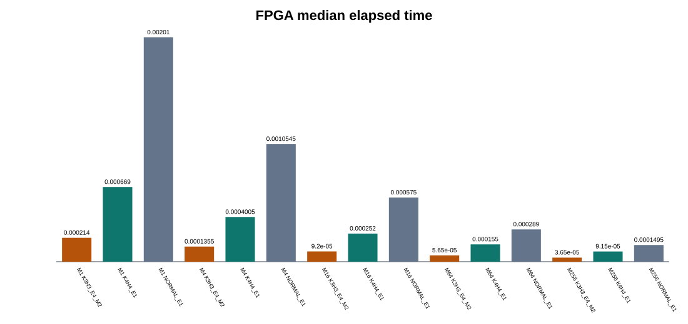
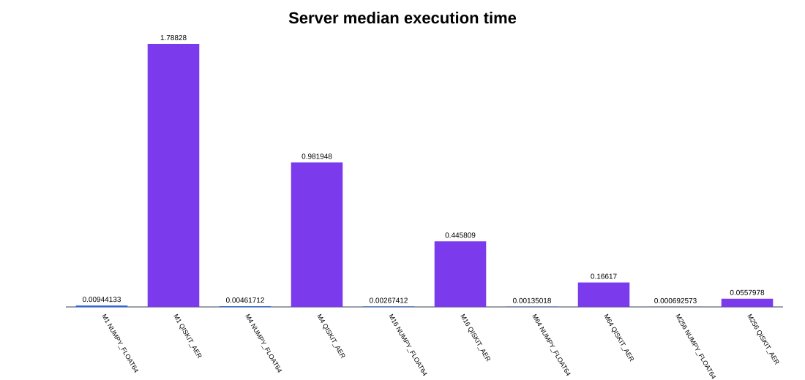

# Q14 BBHT 공통 500-workload 비교 결과

## 1. 실험 계약

| 항목 | 값 |
| --- | --- |
| 검색공간 | Q14, N=16,384 |
| 데이터 | signed 16-bit, 공식 보드 dataset |
| Oracle | EQ, target value 0xA55A |
| M | 1, 4, 16, 64, 256 |
| seed | 공식 roster 100쌍 |
| 공통 workload | 500개 |
| BBHT | m0=1, lambda=6/5, m_max=128, logical budget=576 |
| 진폭 기준모델 | signed Q1.22, AMP_W=23 |

## 2. 비교 대상

| 분류 | Backend | 역할 |
| --- | --- | --- |
| SW | `NUMPY_FLOAT64` | 직접 상태벡터 Float64 기준선 |
| SW | `QISKIT_AER_STATEVECTOR` | 범용 양자 시뮬레이터 기준선 |
| Golden | `RTL_FIXED_NORMAL` | Q1.22 bit-exact Normal 기준 |
| Golden | `SOFTWARE_K4H4` | 과거 K4/H4 checkpoint 정책 기준 |
| Golden | `SOFTWARE_K3H3` | 최종 K3/H3 checkpoint 정책 기준 |
| FPGA | `FPGA_NORMAL_E1` | 팀원 보드 실측 Normal |
| FPGA | `FPGA_K4H4_E1` | 팀원 보드 실측 K4/H4 |
| FPGA | `FPGA_K3H3_E4_M2` | 팀원 보드 실측 최종 구성 |

## 3. 정합성

| 검사 | PASS/실행 | 미실행 |
| --- | ---: | ---: |
| `numpy_qiskit_logical_match` | 500/500 | 0 |
| `fixed_fpga_normal_match` | 500/500 | 0 |
| `software_k4_fpga_k4_logical_match` | 500/500 | 0 |
| `software_k4_fpga_k4_physical_iter_match` | 500/500 | 0 |
| `software_k3_fpga_k3_logical_match` | 500/500 | 0 |
| `software_k3_fpga_k3_physical_iter_match` | 500/500 | 0 |
| `all_fpga_logical_match` | 500/500 | 0 |

`actual_grover_iterations`는 checkpoint 정책이 실제로 수행한 Grover 반복 수다.
동일 정책의 Golden과 FPGA 값은 정확히 일치해야 한다. 정책 solver 지연,
plan FIFO stall, E4/M2 datapath 최적화는 이 값이 아니라 FPGA `cycle_count`에
반영된다. workload별 물리 반복 수 차이는 `checkpoint_model_fpga_iteration_delta.csv`에 기록한다.

## 4. FPGA 실행시간

| M | Normal total (us) | K4/H4 total (us) | K3/H3-E4-M2 total (us) | Normal/K3 speedup | K4/K3 speedup |
| ---: | ---: | ---: | ---: | ---: | ---: |
| 1 | 209754 | 72598 | 22818 | 9.192x | 3.182x |
| 4 | 106615 | 40806 | 13748 | 7.755x | 2.968x |
| 16 | 61934 | 26272 | 9432 | 6.566x | 2.785x |
| 64 | 30990 | 15620 | 5942 | 5.215x | 2.629x |
| 256 | 16209 | 9601 | 3858 | 4.201x | 2.489x |

## 5. Backend별 결과

| M | Backend | Runs | Success | Median trial | Median L_BBHT | Median runtime (s) | Scope |
| ---: | --- | ---: | ---: | ---: | ---: | ---: | --- |
| 1 | `FPGA_K3H3_E4_M2` | 100 | 1.000 | 23.0 | 163.5 | 0.000214000 | `BOARD_COMMAND_TO_RESULT_ELAPSED` |
| 1 | `FPGA_K4H4_E1` | 100 | 1.000 | 23.0 | 163.5 | 0.000669000 | `BOARD_COMMAND_TO_RESULT_ELAPSED` |
| 1 | `FPGA_NORMAL_E1` | 100 | 1.000 | 23.0 | 163.5 | 0.002010000 | `BOARD_COMMAND_TO_RESULT_ELAPSED` |
| 1 | `NUMPY_FLOAT64` | 100 | 1.000 | 23.0 | 149.5 | 0.009441335 | `NUMPY_CORE_ONLY` |
| 1 | `QISKIT_AER_STATEVECTOR` | 100 | 1.000 | 23.0 | 149.5 | 1.788283234 | `AER_EXECUTION_ONLY` |
| 1 | `RTL_FIXED_NORMAL` | 100 | 1.000 | 23.0 | 163.5 | 0.024943554 | `PYTHON_FIXED_MODEL_WALL` |
| 1 | `SOFTWARE_K3H3` | 100 | 1.000 | 23.0 | 163.5 | 0.012918605 | `PYTHON_FIXED_MODEL_WALL` |
| 1 | `SOFTWARE_K4H4` | 100 | 1.000 | 23.0 | 163.5 | 0.020287969 | `PYTHON_FIXED_MODEL_WALL` |
| 4 | `FPGA_K3H3_E4_M2` | 100 | 1.000 | 19.0 | 77.0 | 0.000135500 | `BOARD_COMMAND_TO_RESULT_ELAPSED` |
| 4 | `FPGA_K4H4_E1` | 100 | 1.000 | 19.0 | 77.0 | 0.000400500 | `BOARD_COMMAND_TO_RESULT_ELAPSED` |
| 4 | `FPGA_NORMAL_E1` | 100 | 1.000 | 19.0 | 77.0 | 0.001054500 | `BOARD_COMMAND_TO_RESULT_ELAPSED` |
| 4 | `NUMPY_FLOAT64` | 100 | 1.000 | 19.0 | 74.5 | 0.004617119 | `NUMPY_CORE_ONLY` |
| 4 | `QISKIT_AER_STATEVECTOR` | 100 | 1.000 | 19.0 | 74.5 | 0.981947869 | `AER_EXECUTION_ONLY` |
| 4 | `RTL_FIXED_NORMAL` | 100 | 1.000 | 19.0 | 77.0 | 0.012047712 | `PYTHON_FIXED_MODEL_WALL` |
| 4 | `SOFTWARE_K3H3` | 100 | 1.000 | 19.0 | 77.0 | 0.006592981 | `PYTHON_FIXED_MODEL_WALL` |
| 4 | `SOFTWARE_K4H4` | 100 | 1.000 | 19.0 | 77.0 | 0.006687974 | `PYTHON_FIXED_MODEL_WALL` |
| 16 | `FPGA_K3H3_E4_M2` | 100 | 1.000 | 16.0 | 35.0 | 0.000092000 | `BOARD_COMMAND_TO_RESULT_ELAPSED` |
| 16 | `FPGA_K4H4_E1` | 100 | 1.000 | 16.0 | 35.0 | 0.000252000 | `BOARD_COMMAND_TO_RESULT_ELAPSED` |
| 16 | `FPGA_NORMAL_E1` | 100 | 1.000 | 16.0 | 35.0 | 0.000575000 | `BOARD_COMMAND_TO_RESULT_ELAPSED` |
| 16 | `NUMPY_FLOAT64` | 100 | 1.000 | 16.0 | 35.0 | 0.002674120 | `NUMPY_CORE_ONLY` |
| 16 | `QISKIT_AER_STATEVECTOR` | 100 | 1.000 | 16.0 | 35.0 | 0.445809176 | `AER_EXECUTION_ONLY` |
| 16 | `RTL_FIXED_NORMAL` | 100 | 1.000 | 16.0 | 35.0 | 0.007630012 | `PYTHON_FIXED_MODEL_WALL` |
| 16 | `SOFTWARE_K3H3` | 100 | 1.000 | 16.0 | 35.0 | 0.004557010 | `PYTHON_FIXED_MODEL_WALL` |
| 16 | `SOFTWARE_K4H4` | 100 | 1.000 | 16.0 | 35.0 | 0.004674265 | `PYTHON_FIXED_MODEL_WALL` |
| 64 | `FPGA_K3H3_E4_M2` | 100 | 1.000 | 11.0 | 13.0 | 0.000056500 | `BOARD_COMMAND_TO_RESULT_ELAPSED` |
| 64 | `FPGA_K4H4_E1` | 100 | 1.000 | 11.0 | 13.0 | 0.000155000 | `BOARD_COMMAND_TO_RESULT_ELAPSED` |
| 64 | `FPGA_NORMAL_E1` | 100 | 1.000 | 11.0 | 13.0 | 0.000289000 | `BOARD_COMMAND_TO_RESULT_ELAPSED` |
| 64 | `NUMPY_FLOAT64` | 100 | 1.000 | 11.0 | 13.5 | 0.001350182 | `NUMPY_CORE_ONLY` |
| 64 | `QISKIT_AER_STATEVECTOR` | 100 | 1.000 | 11.0 | 13.5 | 0.166170394 | `AER_EXECUTION_ONLY` |
| 64 | `RTL_FIXED_NORMAL` | 100 | 1.000 | 11.0 | 13.0 | 0.004064452 | `PYTHON_FIXED_MODEL_WALL` |
| 64 | `SOFTWARE_K3H3` | 100 | 1.000 | 11.0 | 13.0 | 0.002861535 | `PYTHON_FIXED_MODEL_WALL` |
| 64 | `SOFTWARE_K4H4` | 100 | 1.000 | 11.0 | 13.0 | 0.002968655 | `PYTHON_FIXED_MODEL_WALL` |
| 256 | `FPGA_K3H3_E4_M2` | 100 | 1.000 | 7.0 | 5.0 | 0.000036500 | `BOARD_COMMAND_TO_RESULT_ELAPSED` |
| 256 | `FPGA_K4H4_E1` | 100 | 1.000 | 7.0 | 5.0 | 0.000091500 | `BOARD_COMMAND_TO_RESULT_ELAPSED` |
| 256 | `FPGA_NORMAL_E1` | 100 | 1.000 | 7.0 | 5.0 | 0.000149500 | `BOARD_COMMAND_TO_RESULT_ELAPSED` |
| 256 | `NUMPY_FLOAT64` | 100 | 1.000 | 7.0 | 5.0 | 0.000692573 | `NUMPY_CORE_ONLY` |
| 256 | `QISKIT_AER_STATEVECTOR` | 100 | 1.000 | 7.0 | 5.0 | 0.055797827 | `AER_EXECUTION_ONLY` |
| 256 | `RTL_FIXED_NORMAL` | 100 | 1.000 | 7.0 | 5.0 | 0.002386687 | `PYTHON_FIXED_MODEL_WALL` |
| 256 | `SOFTWARE_K3H3` | 100 | 1.000 | 7.0 | 5.0 | 0.001770503 | `PYTHON_FIXED_MODEL_WALL` |
| 256 | `SOFTWARE_K4H4` | 100 | 1.000 | 7.0 | 5.0 | 0.001820332 | `PYTHON_FIXED_MODEL_WALL` |

## 6. 해석 규칙

- 동일 seed에서 `requested_j`, 측정 CDF, 결과 index를 비교한다.
- K4/H4와 K3/H3 checkpoint는 논리 결과를 바꾸면 안 되며 Golden과 FPGA의 `actual_grover_iterations`도 같아야 한다.
- E4/M2는 FPGA datapath와 measurement cycle 최적화이므로 소프트웨어 K3/H3의 벽시계 시간으로 대체하지 않는다.
- FPGA 시간은 보드 command-to-result, NumPy는 core 계산, Qiskit은 Aer execution이다. 서로 다른 플랫폼의 절대시간 비율은 참고값이며, FPGA 내부 구성 간 speedup만 직접 성능 주장에 사용한다.
- Qiskit build/transpile 시간은 원시 결과의 별도 열에 남긴다.

## 7. 결과 출처와 범위

| 항목 | 출처 | 범위 |
| --- | --- | --- |
| NumPy·Qiskit 시간과 결과 | 본 소프트웨어 패키지의 서버 실행 | Q14, EQ, Common500 |
| 고정소수점·checkpoint 결과 | 본 소프트웨어 RTL 기준모델 | Q1.22, Normal/K4-H4/K3-H3 |
| FPGA 시간·cycle | 팀원 보드 측정 CSV | 100 MHz, DMA dataset load 제외 |
| Requested-j 벡터 | 고정소수점 상태벡터 기준모델 | 256개 RTL 회귀 케이스 |
| Enumeration 벡터 | 소프트웨어 재적재 및 projected found-mask 모델 | Common500 성능 비교에는 미포함 |

이 보고서의 FPGA 수치는 소프트웨어에서 추정한 값이 아니라 팀원이 제공한 보드
측정값이다. DRAM all-j 방식은 기준모델에 선택 가능한 정책으로만 남아 있으며,
이 Common500 실행과 FPGA 성능표에는 포함되지 않았다.
